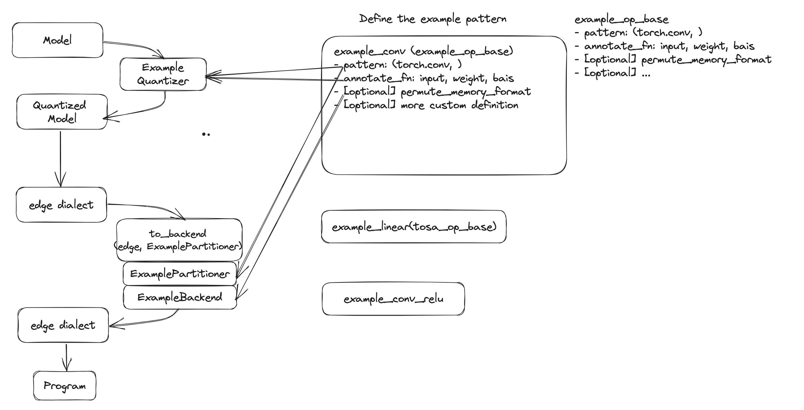
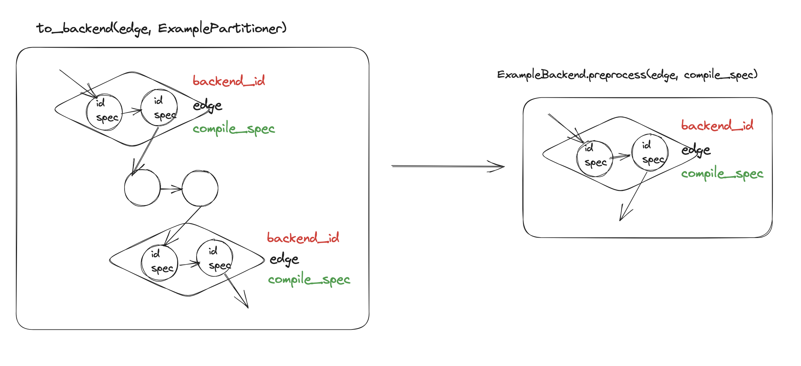
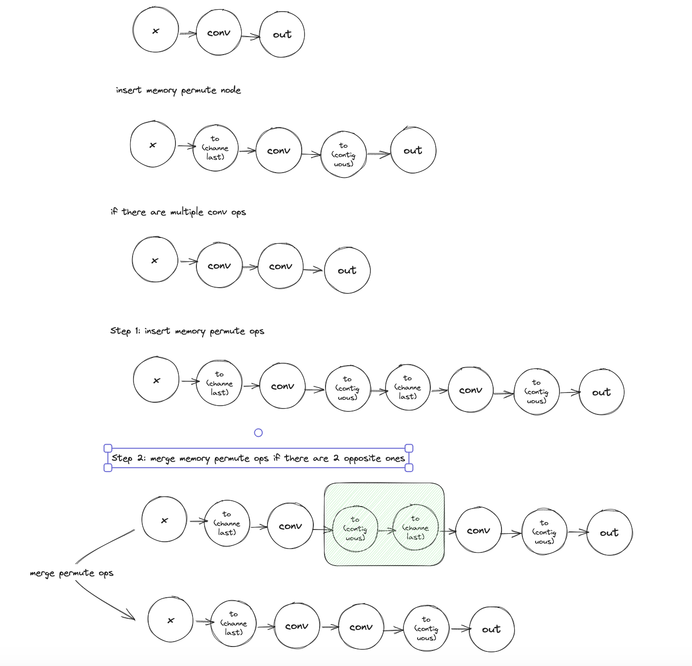

This folder is an exmample backend to lower MobileNetV2. It covers the AOT side and showcase how to quantize and lower a MobileNetV2 to the example backend. The serialization format is purely string for demo purpose as it'll be up to backend's decision to choose serialization format.

The folder structure incluces:
- example_quantizer
- example_partitioner
- example_backend
- examples_operators. Assuming all of them can run in the example backend.
    - The OpBase defined in op_base.py is just the draft idea, it can be defined more comprehensively depending example operator definitions
- example_backend_delegate_passes. It includes passes that might be helpful in the backend. Right now there are two passes: merge_to_dim_pass.py and permute_memory_formats_pass.py. They are examples to show how to represent memory format permutation and how to represent operators with different memory format (like channel last)
    - merge_to_dim_pass.py only handles one merging cases. More cases need to be covered but should be straitforward.

## High Level Flow

In the following diagram, we show how to quantize a mobile net v2 model and lower it to ExampleBackend.

### Quantize and Delegate

We can define patterns based on the operators supported by the backend, which will be used by the quantizer and delegate.

### Partitioner and Backend

The way partitioner and backend is, partitioner will tag the nodes to lower to the backend and backend will will receive all tagged nodes and preprocess them as a delegate.

### Memory format permute

Some operators may have better performance in the memory format other than contiguous. One way to do that is to insert `to_dim_op` to describe memory format permutation and merge if there two opposite one next to each other.

