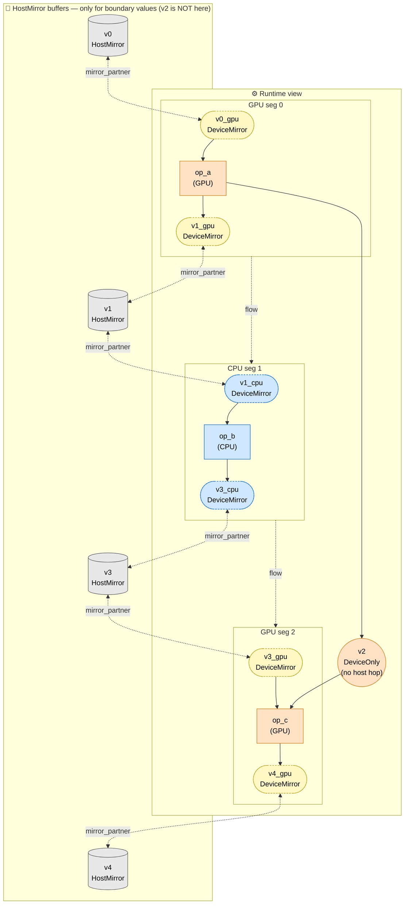

# Mirror Values at Segment Boundaries

For a model with **GPU → CPU → GPU** flow:

- `seg 0` on GPU: from input `v0`, produces two outputs:
  - `v1`: consumed by next CPU segment (cross-runtime).
  - `v2`: consumed by GPU `seg 2` later (stays on GPU; CPU never sees it).
- `seg 1` on CPU: produces `v3` from `v1`.
- `seg 2` on GPU: produces graph output `v4` from `v3` and `v2`.

**Boundary values** (host home) are the graph IO and any cross-runtime
intermediates: `v0`, `v1`, `v3`, `v4`. Each segment that touches a
boundary value sees it through a per-runtime **mirror handle** that
aliases the host buffer.

**Intra-GPU value `v2`** is a cross-segment intermediate that stays on
GPU because both producer (seg 0) and consumer (seg 2) are on GPU. No
host buffer; no mirrors; allocated once on GPU at init and lives until
seg 2 consumes it.

## Reading the diagram

**Top half — runtime view.**

- Each segment shows its op plus the per-runtime `DeviceMirror` handles
  for boundary values it touches.
- **`v2` (`DeviceOnly`)** is drawn outside any specific segment — it
  bridges seg 0 (producer) and seg 2 (consumer) directly on the GPU. It
  has NO mirror handle and NO host buffer because it never crosses
  runtime boundaries.

**Bottom half — host buffers.**

- One physical allocation per boundary value: `v0`, `v1`, `v3`, `v4`.
  Each is allocated as `HostMirror` on the HostPool (slot 0).
- `v2` is conspicuously absent: it's GPU-resident only.

**Mirror pairs (dashed):** every per-runtime `DeviceMirror` handle is
paired (via `Engine::AllocRequest::mirror_partner`) with its
`HostMirror` partner on the host pool. On UMA platforms (Apple Silicon
Metal) the device side may collapse the pair into a single
`MTLStorageModeShared` allocation that the partner aliases (zero-copy).
On discrete GPUs the partner is a distinct allocation and per-execute
`upload_from_host` / `download_to_host` move bytes.

| Value | Producer | Consumer(s) | Boundary? | Storage |
|---|---|---|---|---|
| `v0` | (graph input) | GPU | ✓ (graph IO) | HostMirror + DeviceMirror (GPU) |
| `v1` | GPU seg 0 | CPU seg 1 | ✓ (cross-runtime) | HostMirror + DeviceMirror (GPU) + DeviceMirror (CPU) |
| `v2` | GPU seg 0 | GPU seg 2 | ✗ (intra-GPU) | **DeviceOnly (GPU) — no host buffer** |
| `v3` | CPU seg 1 | GPU seg 2 | ✓ (cross-runtime) | HostMirror + DeviceMirror (CPU) + DeviceMirror (GPU) |
| `v4` | GPU seg 2 | (graph output) | ✓ (graph IO) | HostMirror + DeviceMirror (GPU) |

## Key observation

`v2` demonstrates the optimization that happens automatically: when a
value's producer AND all its consumers are on the same non-host runtime,
the router keeps it resident there as `DeviceOnly`. No host roundtrip
per execute, no mirror pair, no `mirror_partner` overhead. This is the
fast path that makes Vulkan KV caches viable.

## How transfers are emitted: per-segment boundary pass

`GreedyRouter` emits cross-runtime mirrors and transfers via a single
**per-segment, per-boundary** pass (replacing the older twin loops that
walked all consumer-side mirrors then all producer-side mirrors). For
each segment `S` on runtime `cur`, in PC order:

- **INPUT boundary** — for each value `v` that `S` reads:
  - If `v` has a native binding on `cur` (homed there or graph IO on
    host with `cur == host`, or a constant uploaded to `cur` at init):
    bind direct, no mirror, no transfer.
  - Else look at `v`'s **immediately previous writer** segment (or
    "host" if none — graph input or first read of a cross-runtime
    intermediate). If on the same runtime as `cur`, reuse the existing
    mirror via `mirror_table` (no transfer; bytes still resident).
    Otherwise emit a pre-segment **upload host → cur mirror** (cur is
    non-host).
- **OUTPUT boundary** — for each value `v` that `S` writes:
  - If `v` has a native binding on `cur`: kernel writes direct, no
    mirror, no transfer.
  - Else mint (or reuse) a mirror on `cur` and emit a pre-segment
    re-alias upload (host → cur mirror) so the mirror is bound to
    `v`'s current `host_ptr` per execute (handles `bind_outputs`
    rebinding for graph IO). Then look at `v`'s **immediately next
    reader** segment. Emit a post-segment **download cur mirror →
    host** if the next reader is on a different runtime, or if `v` is
    a graph output and has no later reader. Skip the download when
    the next reader is on the same runtime (mirror persists across
    same-runtime segments via `mirror_table`).

A global `mirror_table` keyed on `(value_id, runtime)` ensures that
two segments on the same runtime touching the same value share a
single mirror, so no transfers are emitted between them.

In-place mutation is captured directly by the AOT in-place pass: an
in-place op (e.g. `aten::relu_`) emits `KernelCall(input(0)=v,
formal_ret_val=v)` with the same value_id on both sides. The router's
existing per-segment `input_value_ids` / `output_value_ids` collection
therefore registers the segment as both a reader AND a writer of `v`
without any special-case code, and downstream segments reading `v`
correctly find this segment as the previous producer.

The host-canonical invariant is preserved by construction: every
emitted `TransferStep` has either `src_idx == kHostIdx` (upload) or
`dst_idx == kHostIdx` (download). Cross-runtime hops route producer →
host → consumer (two transfers, both through host). No peer-to-peer
transfers are ever emitted.

## What's NOT shown

- **Pure intra-segment intermediates** — only relevant inside one
  segment; no boundary, no host buffer, no mirror.
- **Constants** — uploaded once to whichever runtime needs them at init,
  typically as `DeviceOnly` (the provider may back them with pinned host
  memory or mmap'd regions internally).
- **Mutable buffer placeholders** — same as constants but their storage
  persists across executes (no rebind per call).
