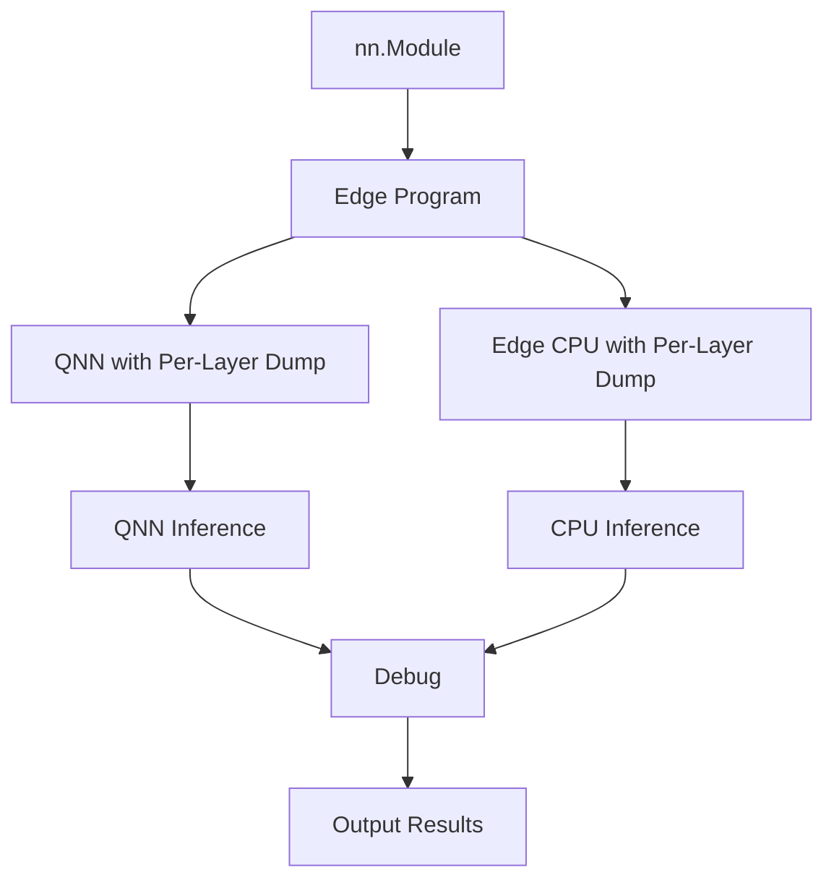

# QAIRT Visualizer

[QAIRT Visualizer](https://pypi.org/project/qairt-visualizer/) is a Python package designed to help you visualize and analyze data from Qualcomm AI Engine Direct (QNN) models. It provides tools to generate and interpret op traces (`optrace`) and QNN HTP Analysis Summary (`QHAS`), enabling detailed insights into your model's performance and behavior.

## Installation

You can install the QAIRT Visualizer package directly from [QAIRT Visualizer](https://pypi.org/project/qairt-visualizer/):

```bash
pip install qairt-visualizer
```

## Quick start
This command launches an interactive GUI interface to visualize the `optrace` and `QHAS` results.
```
python -m examples.qualcomm.util_scripts.qairt_visualizer_demo -H ${host} -s {device} -m ${SOC_MODEL} -b build-android -a ${path_to_output_folder} --online_prepare
```
- If online prepare mode is `enabled`, the following artifacts will be generated:
    - `model`.dlc
    - `optrace`.json
    - `QHAS`.json
- If online prepare mode is `disabled`, the following artifacts will be generated:
    - `model`.bin
    - `optrace`.json
    - `QHAS`.json

Note: Model visualization is supported only in online prepare mode.
The `.bin` format is not compatible with the QAIRT visualizer.
To enable model visualization, please add the `--online_prepare` flag.

## Details
### 1. Lower to QNN backend
Generate an ExecuTorch binary for Qualcomm platforms.
```python
build_executorch_binary(
    model,
    example_input,
    args.model,
    f"{args.artifact}/{pte_filename}",
    [example_input],
    quant_dtype=QuantDtype.use_8a8w,
    online_prepare=args.online_prepare,
    optrace=True,
)
```
### 2. Generate optrace and QHAS
Generate optrace and QHAS files using QNN tools under $QNN_SDK_ROOT. After finishing, you will get a `binaries_trace` dictionary.
``` python
adb = SimpleADB(
    qnn_sdk=os.getenv("QNN_SDK_ROOT"),
    build_path=f"{args.build_folder}",
    pte_path=f"{args.artifact}/{pte_filename}.pte",
    workspace=f"/data/local/tmp/executorch/{pte_filename}",
    device_id=args.device,
    host_id=args.host,
    soc_model=args.model,
    target=args.target,
)
binaries_trace = generate_optrace(
    args, adb, f"{args.artifact}/{pte_filename}.pte", example_input
)
```
- **`binaries_trace`**: A dictionary where keys are the dumped file paths and values are tuples containing the paths to the generated optrace and QHAS JSON files.

- Example 1: {"forward_0.dlc": (optrace.json, optrace_qnn_htp_analysis_summary.json)}
- Example 2: {"forward_0.bin": (optrace.json, optrace_qnn_htp_analysis_summary.json)}

### 3. Visualizing and Analyzing optrace and QHAS

Once you have the optrace and QHAS files, you can leverage the QAIRT Visualizer to visualize the model graph, optrace and QHAS data. Here's how you can do it:

```python
import qairt_visualizer
qairt_visualizer.view(f"{args.artifact}/forward_0.dlc", reports=[optrace, qhas])
```
or
```python
import qairt_visualizer
qairt_visualizer.view(reports=[optrace, qhas])
```

- `model`: Path to your QNN model file (e.g., `path_to_your_model.dlc`).
- **`reports`**: List of report file paths, including the optrace (`optrace.json`) and QHAS (`optrace_qnn_htp_analysis_summary.json`).

Note: Files ending with `.bin ` do not support graph visualization in qairt_visualizer.

## Demo

<figure>
     <figcaption>
    </figcaption>
</figure>

For more details, visit the [QAIRT Visualizer](https://pypi.org/project/qairt-visualizer/).


# ExecuTorch QNN Intermediate Output Debugger

ExecuTorch QNN Intermediate Output Debugger is a tool that helps users debug intermediate output accuracy by comparing CPU outputs with QNN outputs. This tool offers a variety of output formats and flexibility for users to define their own metrics when debugging.

Below, we will go through the details step by step on how to customize your own debugger. By the end of this tutorial, users should understand the mechanism behind the ExecuTorch QNN Debugger and how to apply the debugger to the desired model. In the rest of the tutorial, we will use the term `intermediate output` and `per-layer dump` interchangeably. 

To make the implementation process smooth, we have also provided an example script, [qnn_intermediate_debugger_demo.py](../../../examples/qualcomm/util_scripts/qnn_intermediate_debugger_demo.py), which is an end-to-end example that goes through the steps for implementation. Refer to [Example Script](#example-script) section for more information.

## Introduction

1. Why do we need ExecuTorch QNN Intermediate Output Debugger?
    During inference, there might be gaps between QNN and CPU final outputs. This leaves developers unsure about the root cause of accuracy drop. By using this debugger, users can gain better insight into which operation is causing the accuracy drop. Please note that the accuracy drop here refers to comparing QNN with CPU outputs, not the ground truth.
    
2. Who is this tool for?
   This tool is mainly for developers aiming to align QNN with CPU accuracy. Users will be able to identify which layer in the model is causing the accuracy drop, helping them either circumvent the issue by replacing the layer with other operations or contact authors in Qualcomm AI Engine Direct to resolve the accuracy issue. Please refer to the last section under [README.md](../README.md) for authors to contact when encountering any issues.


## Design Flow


## Instructions

### 1. Setup
1. Follow the [tutorial](https://pytorch.org/executorch/main/getting-started-setup) to set up ExecuTorch.
2. Follow the [tutorial](https://pytorch.org/executorch/stable/build-run-qualcomm-ai-engine-direct-backend.html) to build Qualcomm AI Engine Direct Backend.

### 2. Enable Flag

When executing the script, please add the flag `--dump_intermediate_outputs`. This tells QNN to dump all intermediate tensors during execution.

### 3. Add debugger to the example script
Initialize a `QNNIntermediateDebugger`. Please pass initialized `QNNIntermediateDebugger` and the `args.dump_intermediate_outputs` to `build_executorch_binary` method as well.
#### Example:
```python
from executorch.examples.qualcomm.utils import build_executorch_binary
from executorch.backends.qualcomm.debugger.qnn_intermediate_debugger import QNNIntermediateDebugger

qnn_intermediate_debugger = QNNIntermediateDebugger()
build_executorch_binary(
    model=MyModel(),
    inputs=(torch.randn(200, 768),),
    soc_model="SM8650",
    file_name="my_model",
    dataset=my_dataset,
    dump_intermediate_outputs=args.dump_intermediate_outputs, # Add this flag
    qnn_intermediate_debugger=qnn_intermediate_debugger, # Add this flag
)
```

### 4. Set data num to 1
It is perfectly fine for users to pass the desired amount of datasets to `build_executorch_binary`, which helps achieve better quantization results. However, after `build_executorch_binary` is called, we need to ensure that we only perform one inference during execution. Please ensure that CPU and QNN is using the same input during execution; otherwise, the debugging results might not be accurate.

### 5. Pass flag to SimpleADB
When creating `SimpleADB`, please also pass the flag `args.dump_intermediate_outputs`. This tells the runner to create files that store the intermediate output schema and binary data.
#### Example:
```python
adb = SimpleADB(
    qnn_sdk=os.getenv("QNN_SDK_ROOT"),
    build_path=f"{args.build_folder}",
    pte_path=f"{args.artifact}/{pte_filename}.pte",
    workspace=f"/data/local/tmp/executorch/{pte_filename}",
    device_id=args.device,
    host_id=args.host,
    soc_model=args.model,
    shared_buffer=args.shared_buffer,
    dump_intermediate_outputs=args.dump_intermediate_outputs, # Add this flag
)
```

### 6: Pull and process the results.
After QNN execution with the runner, if the previous steps are done correctly, we should be able to get two files: `etdump.etdp` and `debug_output.bin`.
The following example pulls the files back and calls a callback function to process the results. In this callback function, we create the `Inspector`. Then we perform CPU inference to get CPU intermediate results. Now, we have both QNN and CPU intermediate results, we can start generating results to compare the accuracy. Taking the following example, we should be able to get `debug_graph.svg` as an output in the current directory.
#### Example:
```python
from executorch.backends.qualcomm.debugger.qnn_intermediate_debugger import  OutputFormat
def validate_intermediate_tensor():
    inspector = Inspector(
        etdump_path=f"{args.artifact}/etdump.etdp",
        debug_buffer_path=f"{args.artifact}/debug_output.bin",
    )
    qnn_intermediate_debugger.intermediate_output_module(*(inputs[0]))
    qnn_intermediate_debugger.generate_results(
        title="debug_graph",
        path=".",
        output_format=OutputFormat.SVG_GRAPHS,
        inspector=inspector,
        evaluator=CosineSimilarityEvaluator(0.9),
    )

adb.pull_debug_output(
    args.artifact, args.artifact, callback=validate_intermediate_tensor
)
```

#### Additional Options
The above example sets output formats as SVG and evaluation metrics using Cosine Similarity. Based on different needs, users can choose other output formats as shown in the `OutputFormat` class under [qnn_intermediate_debugger](./qnn_intermediate_debugger.py)
```python
class OutputFormat(IntEnum):
    SVG_GRAPHS = 0
    CSV_FILES = 1
    DUMP_RAW = 2
```

For evaluation metrics, if users would like to implement their own metrics, we have provided the option to implement [MetricEvaluatorBase](./metrics_evaluator.py). The following shows how to define custom metrics.
```python
class RootMeanSquaredErrorEvaluator(MetricEvaluatorBase):
    def __init__(self, threshold=0.02):
        self.threshold = threshold

    def metric_name(self) -> str:
        return "Root Mean Squared Error"

    def evaluate(
        self, qnn_output: torch.Tensor, cpu_output: torch.Tensor
    ) -> Tuple[Any, bool]:
        mse = F.mse_loss(qnn_output, cpu_output)
        rmse = torch.sqrt(mse)
        valid = rmse < self.threshold
        return rmse, valid

qnn_intermediate_debugger.generate_results(
    title="my_metric",
    path=".",
    output_format=OutputFormat.SVG_GRAPHS,
    inspector=inspector,
    evaluator=RootMeanSquaredErrorEvaluator(),
)
```

### Example Script
We have provided an inception_v3 demo script to help users better understand how to apply the debugger to their scripts. Please refer to [qnn_intermediate_debugger_demo.py](../../../examples/qualcomm/util_scripts/qnn_intermediate_debugger_demo.py) for the example script.

Before running the example script, please ensure that dataset is downloaded. Example dataset can be retrieved [here](https://www.kaggle.com/datasets/ifigotin/imagenetmini-1000).

To execute the model:
```bash
python examples/qualcomm/util_scripts/qnn_intermediate_debugger_demo.py -b build-android -m ${SOC_MODEL} --device ${SERIAL_NUM} --dataset ${PATH_TO_DATASET} --dump_intermediate_outputs
```

### Limitation
1. The current debugger only supports performing one execution. Multiple executions may cause unknown behavior and are not recommended.
2. Please ignore this if you are using `qnn_executor_runner`. If you have decided to write your own runner, please follow the [tutorial](https://pytorch.org/executorch/stable/etdump.html) on how to implement etdump into your own runner.
3. The current debugger does not support graph with partitions. (WIP)
4. The current debugger does not support LLM models. (WIP)
