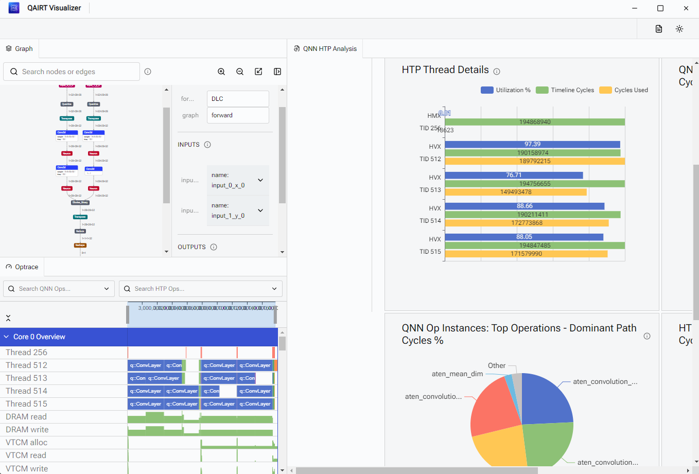

# QAIRT Visualizer

[QAIRT Visualizer](https://pypi.org/project/qairt-visualizer/) is a Python package designed to help you visualize and analyze data from Qualcomm AI Engine Direct (QNN) models. It provides tools to generate and interpret op traces (`optrace`) and QNN HTP Analysis Summary (`QHAS`), enabling detailed insights into your model's performance and behavior.

## Installation

You can install the QAIRT Visualizer package directly from [QAIRT Visualizer](https://pypi.org/project/qairt-visualizer/):

```bash
pip install qairt-visualizer
```

## Quick start
This command launches an interactive GUI interface to visualize the `optrace` and `QHAS` results.
```
python -m examples.qualcomm.util_scripts.qairt_visualizer_demo -H ${host} -s {device} -b build-android -a ${path_to_output_folder} --online_prepare
```
- If online prepare mode is `enabled`, the following artifacts will be generated:
    - `model`.dlc
    - `optrace`.json
    - `QHAS`
- If online prepare mode is `disabled`, the following artifacts will be generated:
    - `model`.bin
    - `optrace`.json
    - `QHAS`.json

Note: Model visualization is supported only in online prepare mode.
The `.bin` format is not compatible with the QAIRT visualizer.
To enable model visualization, please add the `--online_prepare` flag.

## Details
### 1. Lower to QNN backend
Generate an ExecuTorch binary for Qualcomm platforms.
```python
build_executorch_binary(
    model,
    example_input,
    args.model,
    f"{args.artifact}/{pte_filename}",
    [example_input],
    quant_dtype=QuantDtype.use_8a8w,
    online_prepare=args.online_prepare,
    optrace=True,
)
```
### 2. Generate optrace and QHAS
Generate optrace and QHAS files using QNN tools under $QNN_SDK_ROOT. After finishing, you will get a `binaries_trace` dictionary.
``` python
adb = SimpleADB(
    qnn_sdk=os.getenv("QNN_SDK_ROOT"),
    build_path=f"{args.build_folder}",
    pte_path=f"{args.artifact}/{pte_filename}.pte",
    workspace=f"/data/local/tmp/executorch/{pte_filename}",
    device_id=args.device,
    host_id=args.host,
    soc_model=args.model,
    target=args.target,
)
binaries_trace = generate_optrace(
    args, adb, f"{args.artifact}/{pte_filename}.pte", example_input
)
```
- **`binaries_trace`**: A dictionary where keys are the dumped file paths and values are tuples containing the paths to the generated optrace and QHAS JSON files.

- Example 1: {"forward_0.dlc": (optrace.json, optrace_qnn_htp_analysis_summary.json)}
- Example 2: {"forward_0.bin": (optrace.json, optrace_qnn_htp_analysis_summary.json)}

### 3. Visualizing and Analyzing optrace and QHAS

Once you have the optrace and QHAS files, you can leverage the QAIRT Visualizer to visualize the model graph, optrace and QHAS data. Here's how you can do it:

```python
import qairt_visualizer
qairt_visualizer.view(f"{args.artifact}/forward_0.dlc", reports=[optrace, qhas])
```
or
```python
import qairt_visualizer
qairt_visualizer.view(reports=[optrace, qhas])
```

- `model`: Path to your QNN model file (e.g., `path_to_your_model.dlc`).
- **`reports`**: List of report file paths, including the optrace (`optrace.json`) and QHAS (`optrace_qnn_htp_analysis_summary.json`).

Note: Files ending with `.bin ` do not support graph visualization in qairt_visualizer.

## Demo

<figure>
     <figcaption>
    </figcaption>
</figure>

For more details, visit the [QAIRT Visualizer](https://pypi.org/project/qairt-visualizer/).
