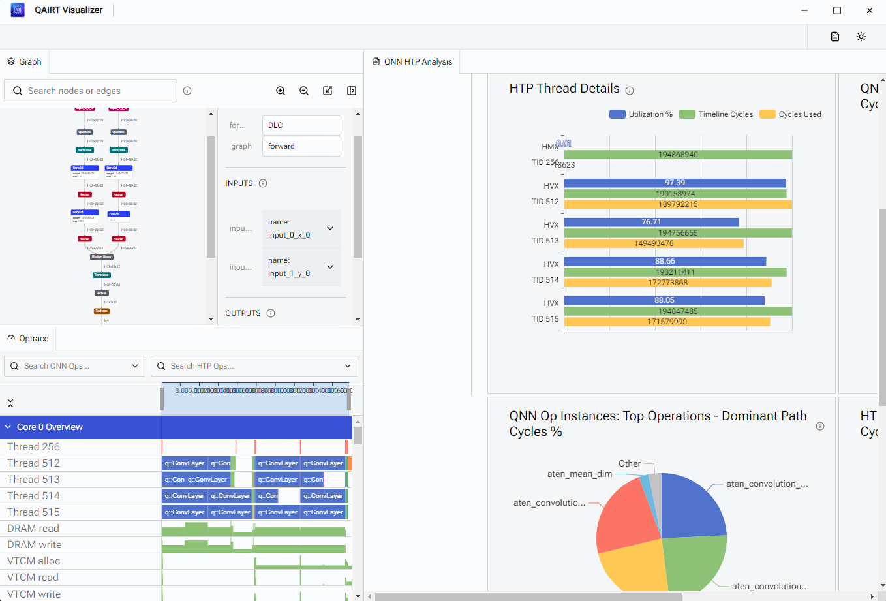
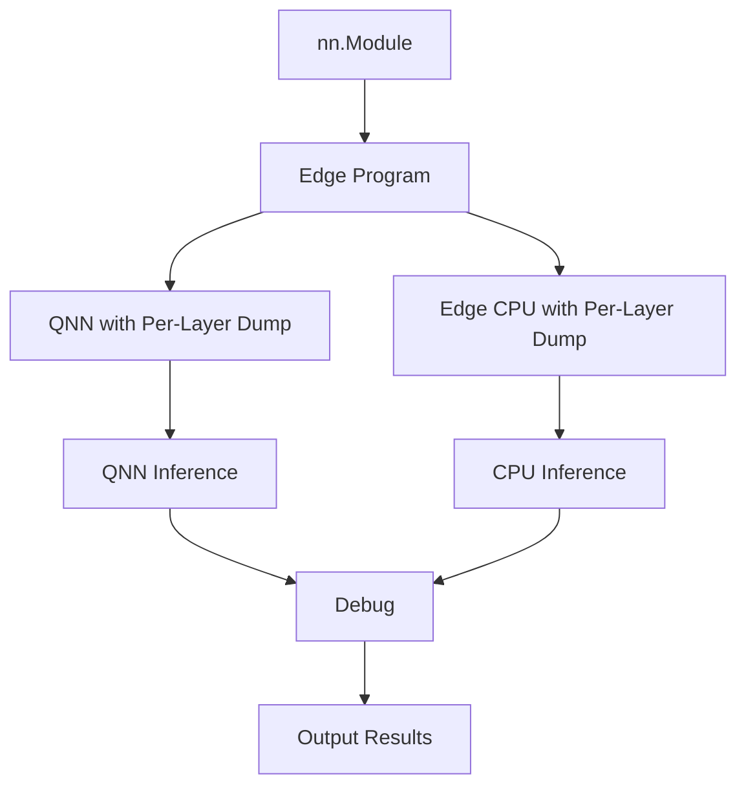

# QAIRT Visualizer

[QAIRT Visualizer](https://pypi.org/project/qairt-visualizer/) is a Python package designed to help you visualize and analyze data from Qualcomm AI Engine Direct (QNN) models. It provides tools to generate and interpret op traces (`optrace`) and QNN HTP Analysis Summary (`QHAS`), enabling detailed insights into your model's performance and behavior.

## Installation

You can install the QAIRT Visualizer package directly from [QAIRT Visualizer](https://pypi.org/project/qairt-visualizer/):

```bash
pip install qairt-visualizer
```

## Quick start
This command launches an interactive GUI interface to visualize the `optrace` and `QHAS` results.
```
python -m examples.qualcomm.util_scripts.qairt_visualizer_demo -H ${host} -s {device} -m ${SOC_MODEL} -b build-android -a ${path_to_output_folder} --online_prepare
```
- If online prepare mode is `enabled`, the following artifacts will be generated:
    - `model`.dlc
    - `optrace`.json
    - `QHAS`.json
- If online prepare mode is `disabled`, the following artifacts will be generated:
    - `model`.bin
    - `optrace`.json
    - `QHAS`.json

Note: Model visualization is supported only in online prepare mode.
The `.bin` format is not compatible with the QAIRT visualizer.
To enable model visualization, please add the `--online_prepare` flag.

## Details
### 1. Lower to QNN backend
Generate an ExecuTorch binary for Qualcomm platforms.
Ensure that qnn_config.profile_level is set to 3, which will generate op_trace.
```python
qnn_config.profile_level = 3
build_executorch_binary(
    model=model,
    qnn_config=qnn_config,
    file_name=f"{args.artifact}/{pte_filename}",
    dataset=[example_input],
    quant_dtype=QuantDtype.use_8a8w,
    online_prepare=args.online_prepare,
    optrace=True,
)
```
### 2. Generate optrace and QHAS
Generate optrace and QHAS files using QNN tools under $QNN_SDK_ROOT. After finishing, you will get a `binaries_trace` dictionary.
``` python
adb = SimpleADB(
    qnn_config=qnn_config,
    pte_path=f"{args.artifact}/{pte_filename}.pte",
    workspace=f"/data/local/tmp/executorch/{pte_filename}",
)
binaries_trace = generate_optrace(
    args, adb, f"{args.artifact}/{pte_filename}.pte", example_input
)
```
- **`binaries_trace`**: A dictionary where keys are the dumped file paths and values are tuples containing the paths to the generated optrace and QHAS JSON files.

- Example 1: {"forward_0.dlc": (optrace.json, optrace_qnn_htp_analysis_summary.json)}
- Example 2: {"forward_0.bin": (optrace.json, optrace_qnn_htp_analysis_summary.json)}

### 3. Visualizing and Analyzing optrace and QHAS

Once you have the optrace and QHAS files, you can leverage the QAIRT Visualizer to visualize the model graph, optrace and QHAS data. Here's how you can do it:

```python
import qairt_visualizer
qairt_visualizer.view(f"{args.artifact}/forward_0.dlc", reports=[optrace, qhas])
```
or
```python
import qairt_visualizer
qairt_visualizer.view(reports=[optrace, qhas])
```

- `model`: Path to your QNN model file (e.g., `path_to_your_model.dlc`).
- **`reports`**: List of report file paths, including the optrace (`optrace.json`) and QHAS (`optrace_qnn_htp_analysis_summary.json`).

Note: Files ending with `.bin ` do not support graph visualization in qairt_visualizer.

## Demo

<figure>
     <figcaption>
    </figcaption>
</figure>

For more details, visit the [QAIRT Visualizer](https://pypi.org/project/qairt-visualizer/).


# ExecuTorch QNN Intermediate Output Debugger

ExecuTorch QNN Intermediate Output Debugger is a tool that helps users debug intermediate output accuracy by comparing CPU outputs with QNN outputs. This tool offers a variety of output formats and flexibility for users to define their own metrics when debugging.

Below, we will go through the details step by step on how to customize your own debugger. By the end of this tutorial, users should understand the mechanism behind the ExecuTorch QNN Debugger and how to apply the debugger to the desired model. In the rest of the tutorial, we will use the term `intermediate output` and `per-layer dump` interchangeably. 

To make the implementation process smooth, we have also provided an example script, [qnn_intermediate_debugger_demo.py](../../../examples/qualcomm/util_scripts/qnn_intermediate_debugger_demo.py), which is an end-to-end example that goes through the steps for implementation. Refer to [Example Script](#example-script) section for more information.

## Introduction

1. Why do we need ExecuTorch QNN Intermediate Output Debugger?
    During inference, there might be gaps between QNN and CPU final outputs. This leaves developers unsure about the root cause of accuracy drop. By using this debugger, users can gain better insight into which operation is causing the accuracy drop. Please note that the accuracy drop here refers to comparing QNN with CPU outputs, not the ground truth.
    
2. Who is this tool for?
   This tool is mainly for developers aiming to align QNN with CPU accuracy. Users will be able to identify which layer in the model is causing the accuracy drop, helping them either circumvent the issue by replacing the layer with other operations or contact authors in Qualcomm AI Engine Direct to resolve the accuracy issue. Please refer to the last section under [README.md](../README.md) for authors to contact when encountering any issues.


## Design Flow

```mermaid
flowchart TB;
    nn.Module;
    nn.Module --> edge_program["Edge Program"];
    edge_program --> qnn_lower["QNN with Per-Layer Dump"];
    qnn_lower --> qnn_inference[QNN Inference];
    qnn_inference --> debug
    edge_program --> cpu_lower["Edge CPU with Per-Layer Dump"];
    cpu_lower --> cpu_inference["CPU Inference"];
    cpu_inference --> debug["Debug"];
    debug --> output["Output Results"]
```

## Prerequisites
1. Follow the [tutorial](https://pytorch.org/executorch/main/getting-started-setup) to set up ExecuTorch.
2. Follow the [tutorial](https://pytorch.org/executorch/stable/build-run-qualcomm-ai-engine-direct-backend.html) to build Qualcomm AI Engine Direct Backend.

## Instructions

### 1. Initialize debugger and build binary

Create a `QNNIntermediateDebugger` with a sample input and pass it to `build_executorch_binary`. The `--dump_intermediate_outputs` flag tells QNN to dump all intermediate tensors during execution.

```python
from executorch.backends.qualcomm.export_utils import build_executorch_binary
from executorch.backends.qualcomm.debugger.qnn_intermediate_debugger import (
    OutputFormat,
    QNNIntermediateDebugger,
)

qnn_intermediate_debugger = QNNIntermediateDebugger(sample_input=inputs[0])
build_executorch_binary(
    model=MyModel(),
    qnn_config=qnn_config,
    file_name="my_model",
    dataset=my_dataset,
    qnn_intermediate_debugger=qnn_intermediate_debugger, # Provide this param
)
```

After `build_executorch_binary()`, the debugger holds:
- `edge_ep` — edge `ExportedProgram` for CPU golden inference.
- `etrecord_file_path` — path to the generated ET record.

### 2. Execute on device

Ensure `dump_intermediate_outputs` is enabled in your `QnnConfig` (or pass `--dump_intermediate_outputs` via CLI). Only run **one inference** for debugging — multiple executions are not supported.

```python
from executorch.examples.qualcomm.utils import SimpleADB

adb = SimpleADB(
    qnn_config=qnn_config,
    pte_path=f"{args.artifact}/{pte_filename}.pte",
    workspace=f"/data/local/tmp/executorch/{pte_filename}",
)
adb.push(inputs=inputs)
adb.execute()
```

### 3. Pull results and compare

After execution, pull `etdump.etdp` and `debug_output.bin` from the device. Use `setup_inspector()` to create the `Inspector`, then create comparators and generate results.

Before comparing per-layer outputs, it is highly recommended to verify that the edge program's final output aligns with the original `nn.Module`. The debugger uses the edge program as the CPU golden reference, so if the edge graph itself has diverged (e.g., due to weights quantization or pass transformations), per-layer comparisons against it may be misleading.

```python
from executorch.backends.qualcomm.debugger.qcom_numerical_comparator_sample import (
    QcomCosineSimilarityComparator, QcomMSEComparator,
)

def validate_intermediate_tensor():
    qnn_intermediate_debugger.setup_inspector(
        etdump_path=f"{args.artifact}/etdump.etdp",
        debug_buffer_path=f"{args.artifact}/debug_output.bin",
    )

    # Verify edge program output aligns with the original nn.Module.
    # This ensures the edge graph is a reliable golden reference.
    edge_result = qnn_intermediate_debugger.edge_ep.module()(*(inputs[0]))
    with torch.no_grad():
        source_result = source_model(*(inputs[0]))
        score = torch.nn.functional.cosine_similarity(
            edge_result.flatten(), source_result.flatten(), dim=0
        ).item()
        print("Cosine similarity between nn.Module and edge CPU:", score)

    cos_comparator = qnn_intermediate_debugger.create_comparator(
        QcomCosineSimilarityComparator, threshold=0.9
    )
    qnn_intermediate_debugger.generate_results(
        title="debug_cos_similarity",
        path=args.artifact,
        output_format=OutputFormat.SVG_GRAPH,
        comparator=cos_comparator,
    )

adb.pull_debug_output(
    args.artifact, args.artifact, callback=validate_intermediate_tensor
)
```

## Comparators

Create comparators via the `create_comparator()` factory, which automatically injects the `edge_ep`. A couple sample comparators are provided under [qcom_numerical_comparator_sample.py](./qcom_numerical_comparator_sample.py):

```python
cos = qnn_intermediate_debugger.create_comparator(QcomCosineSimilarityComparator, threshold=0.9)
mse = qnn_intermediate_debugger.create_comparator(QcomMSEComparator, threshold=0.1)
```

### Custom comparators

Users can also define their own comparator by implementing a derived class from  [QcomNumericalComparatorBase](./qcom_numerical_comparator_base.py). Inside the derived class, users will need to implement `metric_name()`, `is_valid_score()`, and `element_compare()`. The base class handles QNN-specific preprocessing (dequantization, layout conversion) internally — `preprocessing` cannot be overridden.
```python
from executorch.backends.qualcomm.debugger.qcom_numerical_comparator_base import (
    QcomNumericalComparatorBase,
)

class MyComparator(QcomNumericalComparatorBase):
    def __init__(self, edge_ep, threshold=0.5):
        super().__init__(edge_ep)
        self.threshold = threshold

    def metric_name(self) -> str:
        return "my_metric"

    def is_valid_score(self, score: float) -> bool:
        return score >= self.threshold

    def element_compare(self, a, b) -> float:
        # your comparison logic here
        ...
```

## Output formats

| Format | Enum | Output |
|--------|------|--------|
| SVG graph | `OutputFormat.SVG_GRAPH` | Color-coded computation graph (green=pass, red=fail) |
| CSV file | `OutputFormat.CSV_FILE` | Per-node tabular results |

## Example Script

An Inception_V3 demo script is provided at [qnn_intermediate_debugger_demo.py](../../../examples/qualcomm/util_scripts/qnn_intermediate_debugger_demo.py).

Before running, ensure the dataset is downloaded. An example dataset can be retrieved [here](https://www.kaggle.com/datasets/ifigotin/imagenetmini-1000).

```bash
python -m examples.qualcomm.util_scripts.qnn_intermediate_debugger_demo -b build-android -s $DEVICE_SERIAL -m $SOC_MODEL -d path/to/imagenet/val --dump_intermediate_outputs
```

## Limitations
1. Only one execution per debug session — multiple executions may cause unknown behavior.
2. If you have decided to write your own runner (instead of `qnn_executor_runner`), follow the [tutorial](https://pytorch.org/executorch/stable/etdump.html) on how to implement etdump.
3. Does not support graphs with partitions (partial delegation).
4. Does not support LLM models.
5. Does not support graphs with multiple methods.
