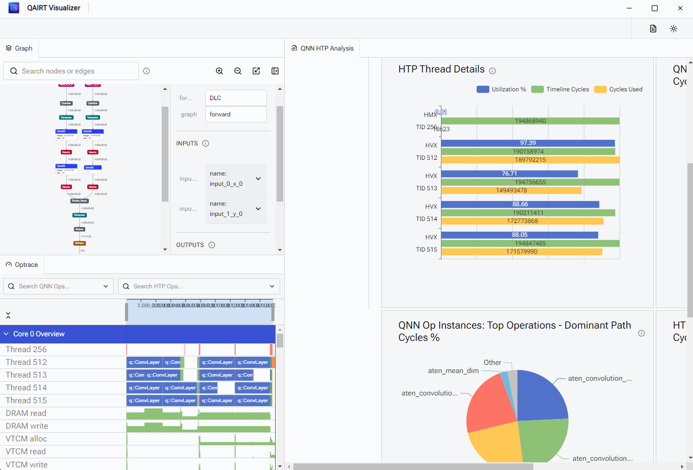
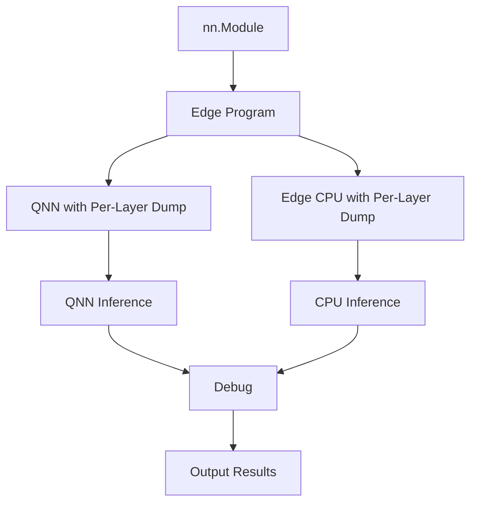

# ExecuTorch QNN Debugger & Profiler

This directory bundles three independent debugging and profiling flows for the ExecuTorch QNN backend. They are independent and address different failure modes — jump directly to the section you need.

**Table of contents**

- [Executorch QNN HTP Profiling](#executorch-qnn-htp-profiling)
- [ExecuTorch QNN Intermediate Output Debugger](#executorch-qnn-intermediate-output-debugger)
- [ExecuTorch QNN HTP Heap Profiling](#executorch-qnn-htp-heap-profiling)


---
# Executorch QNN HTP Profiling

This section shows how to produce HTP profiling results and inspect the output reports.

- The most accurate profiling mode is **on device profiling** with `generate_htp_profile_result()`, this requires a connected android device through ADB, see details in section 2.1.

- Another profiling mode is **on host estimiation** with `estimate_htp_profile_result()` this doesn't require a device and can be run on host machine. However the accuracy and soc support might be limited, see details in section 2.2. 


Different HTP profiling feature support different set of prepare mode, prepare mode is set in AOT config, and decides which format of QNN internal graph is packed in `.pte` file, 
  * On device profiling support both `online_prepare` and `offline_prepare` 
  * On host profiling reqruires `online_prepare`

**Host Estimation vs On-Device Generation**
| Mode          | Source of measurements                 | Requires device? | Requires `QnnConfig.online_prepare=True` for `.pte` generation ? |
|:--------------|:---------------------------------------|:-----------------|:-----------------|
| `generate_htp_profile_result` (`"optrace"`)   | On-device hardware counters (real run) | Yes              | No — support both mode (`.dlc` or `.bin`) |
| `estimate_htp_profile_result` (`"hextimate"`) | Compile-time performance-model estimate | No (host only) | Yes              |


**Profile level**

| `profile_level` | QNN configuration | Use |
|:----------------|:------------------|:----|
| `0` | Profiling disabled | Default inference. |
| `2` | `QNN_PROFILE_LEVEL_DETAILED` | Collect QNN graph and per-node timing through the ExecuTorch profiler. |
| `3` | Detailed + `QNN_PROFILE_CONFIG_OPTION_ENABLE_OPTRACE` | Enable HTP Optrace hardware-trace artifacts for `qnn-profile-viewer`; required at export for offline-prepare Optrace. |

The rest of the guide is arranged here:
1. **`.pte` generation prepare mode:** 
We introduce how to trigger each preparation mode in section 1.1 and 1.2:
    - 1.1 `online_prepare`: controlled by `QnnConfig.online_prepare=True`.
    - 1.2 `offline_prepare`: controlled by `QnnConfig.online_prepare=False`.

3. **Public Functions for Generating Profiling Results** 
    + 2.1 `generate_htp_profile_result()`: generates device-based profiling results (Optrace in QNN SDK).
    + 2.2 `estimate_htp_profile_result()`: estimates host-based profiling results (Hextimate in QNN SDK).

4. **HTP Profile Output Format:**  `QnnHtpProfileArtifacts` contains genrated HTML, JSON and chrometrace files.

5. **Qairt-Visualizer:** QAIRT Visualizer can open the QHAS result from `qhas_json` and `chrometrace_json`. Use `QnnHtpProfileArtifacts.visualizer_reports()` to pass related reports.
## 1. Select AOT Prepare modes for `.pte` Generation
Users choose one prepare mode before exporting the `.pte`:

| Prepare mode | QNN config | User-facing behavior |
|:-------------|:-----------|:---------------------|
| **online_prepare** | `QnnConfig.online_prepare=True` | Export stores a graph description; profiling tools finish preparation later. |
| **offline_prepare** | `QnnConfig.online_prepare=False` | Export stores the finalized executable form; on-device profiling requires `profile_level=3`. |

Internal detail: online prepare carries a `.dlc`, and offline prepare carries a finalized QNN context binary (`.bin`). Offline prepare must set `profile_level=3` because OpTrace instrumentation has to be baked into that context binary during export. The schematic file used by `qnn-profile-viewer` is generated or unpacked beside the dumped profiling artifacts.

The example demos keep the profiling route explicit:

- `examples/qualcomm/util_scripts/htp_profiling_on_device_op_trace_online.py`: on-device OpTrace with `online_prepare`.
- `examples/qualcomm/util_scripts/htp_profiling_on_device_op_trace_offline.py`: on-device OpTrace with `offline_prepare`.
- `examples/qualcomm/util_scripts/htp_profiling_on_host_hextimate.py`: host-only Hextimate with `online_prepare`.

### 1.1 Online Prepare Mode `.pte`

**Demo script**: 
```bash
python -m examples.qualcomm.util_scripts.htp_profiling_on_device_op_trace_online \
    --host ${host} --device ${device} --soc_model ${SOC_MODEL} --build_folder build-android \
    -a ${path_to_output_folder} --online_prepare
```

**Export call**:
The export step does not need to set `profile_level`:
```python
build_executorch_binary(
    model=model,
    qnn_config=qnn_config,        # online_prepare=True; profile_level not required
    file_name=f"{args.artifact}/{pte_filename}",
    dataset=[example_input],
    quant_dtype=QuantDtype.use_8a8w,
)
```

### 1.2 Offline Prepare Mode `.pte`
**Demo script**: 
```bash
python -m examples.qualcomm.util_scripts.htp_profiling_on_device_op_trace_offline \
    --host ${host} --device ${device} --soc_model ${SOC_MODEL} --build_folder build-android \
    -a ${path_to_output_folder} --profile_level 3
```

**Export call**:
The export step **must** set `profile_level=3`:
```python
qnn_config.profile_level = 3
build_executorch_binary(
    model=model,
    qnn_config=qnn_config,        # online_prepare=False (default)
    file_name=f"{args.artifact}/{pte_filename}",
    dataset=[example_input],
    quant_dtype=QuantDtype.use_8a8w,
)
```

## 2.1 Generate HTP Profile Result (OpTrace) `generate_htp_profile_result()`

Use `generate_htp_profile_result()` when you want real on-device hardware-counter profiling. This path requires sample inputs and `adb`.
```python
from executorch.backends.qualcomm.debugger.utils import generate_htp_profile_result

artifacts = generate_htp_profile_result(
    artifact_dir=args.artifact,
    soc_id=get_soc_to_chipset_map()[args.soc_model],
    pte_path=f"{args.artifact}/{pte_filename}.pte",
    inputs=example_inputs,
    adb=adb,
)
```

## 2.2 Estimation of HTP profiling on Host (Hextimate) `estimate_htp_profile_result()`

Use `estimate_htp_profile_result()` when you want host-only compile-time performance estimation. This path does not use sample inputs or `adb`.

**Demo script**:
```bash
python -m examples.qualcomm.util_scripts.htp_profiling_on_host_hextimate \
    --soc_model QCS9100 -a ${path_to_output_folder} --online_prepare
```

```python
from executorch.backends.qualcomm.debugger.utils import estimate_htp_profile_result

estimates = estimate_htp_profile_result(
    artifact_dir=args.artifact,
    soc_id=get_soc_to_chipset_map()[args.soc_model],
    pte_path=f"{args.artifact}/{pte_filename}.pte",
)
```

Limitations:
- Requires `QnnConfig.online_prepare=True`.
- Requires QNN SDK >= 2.41.
- Currently supports only the following soc_model:
  - SA8540
  - SA8255
  - QCS9100
  - SA8797

## 3. HTP Profiling Output `QnnHtpProfileArtifacts`
Both public functions `estimate_htp_profile_result()` and `generate_htp_profile_result()` return one `QnnHtpProfileArtifacts` per compiled binary in the `.pte` (partitioned graphs yield multiple entries).

Important fields:

- `qhas_html`: QHAS HTML report. This is the most convenient artifact for viewing the QNN HTP Analysis Summary. 
- `qhas_json`: QHAS JSON report.
- `chrometrace_json`: Chrome trace JSON. Open it with `chrome://tracing` or Perfetto.
- `htp_graph_json`: HTP graph JSON after optimization.
- `htp_graph_before_json`: HTP graph JSON before optimization.
- `runtrace_json`: runtrace JSON for device profiling, or `None` when not emitted.

Other context fields:

- `binary_path`: dumped internal `.dlc` or `.bin` used by `qnn-profile-viewer`.
- `mode`: `"optrace"` or `"hextimate"`.
- `prepare_mode`: `"online"` or `"offline"`.


## 4. Viewing HTP Analysis Summary (QHAS) with QAIRT Visualizer

**Install**

```bash
pip install qairt-visualizer
```

**Usage**

QAIRT Visualizer can open the QHAS result from `qhas_json` and `chrometrace_json`. Use `QnnHtpProfileArtifacts.visualizer_reports()` to pass related reports.

```python
import qairt_visualizer

for artifact in artifacts:
    qairt_visualizer.view(reports=artifact.visualizer_reports())
    print(f"QHAS HTML: {artifact.qhas_html}")
```
**Example**
The example scripts already call QAIRT Visualizer after producing artifacts when `qairt-visualizer` is installed. If it is not installed, they still print the generated `qhas_html` path:

- `examples/qualcomm/util_scripts/htp_profiling_on_device_op_trace_online.py`
- `examples/qualcomm/util_scripts/htp_profiling_on_device_op_trace_offline.py`
- `examples/qualcomm/util_scripts/htp_profiling_on_host_hextimate.py`


<figure>
     <figcaption>
    </figcaption>
</figure>

For the viewer package, see [QAIRT Visualizer](https://pypi.org/project/qairt-visualizer/).

## Technical Details

### SDK compatibility

| QAIRT SDK version | Optrace | Hextimate |
|:------------------|:--------|:----------|
| 2.37 – 2.40       | Supported | **Not supported**  |
| 2.41 – 2.50       | Supported | Supported |

`estimate_htp_profile_result()` hard-errors on SDKs below 2.41 and on unsupported SoCs.


# ExecuTorch QNN Intermediate Output Debugger

ExecuTorch QNN Intermediate Output Debugger is a tool that helps users debug intermediate output accuracy by comparing CPU outputs with QNN outputs. This tool offers a variety of output formats and flexibility for users to define their own metrics when debugging.

Below, we will go through the details step by step on how to customize your own debugger. By the end of this tutorial, users should understand the mechanism behind the ExecuTorch QNN Debugger and how to apply the debugger to the desired model. In the rest of the tutorial, we will use the term `intermediate output` and `per-layer dump` interchangeably. 

To make the implementation process smooth, we have also provided an example script, [qnn_intermediate_debugger_demo.py](../../../examples/qualcomm/util_scripts/qnn_intermediate_debugger_demo.py), which is an end-to-end example that goes through the steps for implementation. Refer to [Example Script](#example-script) section for more information.

## Introduction

1. Why do we need ExecuTorch QNN Intermediate Output Debugger?
    During inference, there might be gaps between QNN and CPU final outputs. This leaves developers unsure about the root cause of accuracy drop. By using this debugger, users can gain better insight into which operation is causing the accuracy drop. Please note that the accuracy drop here refers to comparing QNN with CPU outputs, not the ground truth.
    
2. Who is this tool for?
   This tool is mainly for developers aiming to align QNN with CPU accuracy. Users will be able to identify which layer in the model is causing the accuracy drop, helping them either circumvent the issue by replacing the layer with other operations or contact authors in Qualcomm AI Engine Direct to resolve the accuracy issue. Please refer to the last section under [README.md](../README.md) for authors to contact when encountering any issues.


## Design Flow

```mermaid
flowchart TB;
    nn.Module;
    nn.Module --> edge_program["Edge Program"];
    edge_program --> qnn_lower["QNN with Per-Layer Dump"];
    qnn_lower --> qnn_inference[QNN Inference];
    qnn_inference --> debug
    edge_program --> cpu_lower["Edge CPU with Per-Layer Dump"];
    cpu_lower --> cpu_inference["CPU Inference"];
    cpu_inference --> debug["Debug"];
    debug --> output["Output Results"]
```

## Prerequisites
1. Follow the [tutorial](https://pytorch.org/executorch/main/getting-started-setup) to set up ExecuTorch.
2. Follow the [tutorial](https://pytorch.org/executorch/stable/build-run-qualcomm-ai-engine-direct-backend.html) to build Qualcomm AI Engine Direct Backend.

## Instructions

### 1. Initialize debugger and build binary

Create a `QNNIntermediateDebugger` with a sample input and pass it to `build_executorch_binary`. The `--dump_intermediate_outputs` flag tells QNN to dump all intermediate tensors during execution.

```python
from executorch.backends.qualcomm.export_utils import build_executorch_binary
from executorch.backends.qualcomm.debugger.qnn_intermediate_debugger import (
    OutputFormat,
    QNNIntermediateDebugger,
)

qnn_intermediate_debugger = QNNIntermediateDebugger(sample_input=inputs[0])
build_executorch_binary(
    model=MyModel(),
    qnn_config=qnn_config,
    file_name="my_model",
    dataset=my_dataset,
    qnn_intermediate_debugger=qnn_intermediate_debugger, # Provide this param
)
```

After `build_executorch_binary()`, the debugger holds:
- `edge_ep` — edge `ExportedProgram` for CPU golden inference.
- `etrecord_file_path` — path to the generated ET record.

### 2. Execute on device

Ensure `dump_intermediate_outputs` is enabled in your `QnnConfig` (or pass `--dump_intermediate_outputs` via CLI). Only run **one inference** for debugging — multiple executions are not supported.

**Note:** Intermediate tensor dumping is not currently supported in direct mode on HTP/LPAI backends.

```python
from executorch.examples.qualcomm.utils import SimpleADB

adb = SimpleADB(
    qnn_config=qnn_config,
    pte_path=f"{args.artifact}/{pte_filename}.pte",
    workspace=f"/data/local/tmp/executorch/{pte_filename}",
)
adb.push(inputs=inputs)
adb.execute()
```

### 3. Pull results and compare

After execution, pull `etdump.etdp` and `debug_output.bin` from the device. Use `setup_inspector()` to create the `Inspector`, then create comparators and generate results.

Before comparing per-layer outputs, it is highly recommended to verify that the edge program's final output aligns with the original `nn.Module`. The debugger uses the edge program as the CPU golden reference, so if the edge graph itself has diverged (e.g., due to weights quantization or pass transformations), per-layer comparisons against it may be misleading.

```python
from executorch.backends.qualcomm.debugger.qcom_numerical_comparator_sample import (
    QcomCosineSimilarityComparator, QcomMSEComparator,
)

def validate_intermediate_tensor():
    qnn_intermediate_debugger.setup_inspector(
        etdump_path=f"{args.artifact}/etdump.etdp",
        debug_buffer_path=f"{args.artifact}/debug_output.bin",
    )

    # Verify edge program output aligns with the original nn.Module.
    # This ensures the edge graph is a reliable golden reference.
    edge_result = qnn_intermediate_debugger.edge_ep.module()(*(inputs[0]))
    with torch.no_grad():
        source_result = source_model(*(inputs[0]))
        score = torch.nn.functional.cosine_similarity(
            edge_result.flatten(), source_result.flatten(), dim=0
        ).item()
        print("Cosine similarity between nn.Module and edge CPU:", score)

    cos_comparator = qnn_intermediate_debugger.create_comparator(
        QcomCosineSimilarityComparator, threshold=0.9
    )
    qnn_intermediate_debugger.generate_results(
        title="debug_cos_similarity",
        path=args.artifact,
        output_format=OutputFormat.SVG_GRAPH,
        comparator=cos_comparator,
    )

adb.pull_debug_output(
    args.artifact, args.artifact, callback=validate_intermediate_tensor
)
```

## Comparators

Create comparators via the `create_comparator()` factory, which automatically injects the `edge_ep`. A couple sample comparators are provided under [qcom_numerical_comparator_sample.py](./qcom_numerical_comparator_sample.py):

```python
cos = qnn_intermediate_debugger.create_comparator(QcomCosineSimilarityComparator, threshold=0.9)
mse = qnn_intermediate_debugger.create_comparator(QcomMSEComparator, threshold=0.1)
```

### Custom comparators

Users can also define their own comparator by implementing a derived class from  [QcomNumericalComparatorBase](./qcom_numerical_comparator_base.py). Inside the derived class, users will need to implement `metric_name()`, `is_valid_score()`, and `element_compare()`. The base class handles QNN-specific preprocessing (dequantization, layout conversion) internally — `preprocessing` cannot be overridden.
```python
from executorch.backends.qualcomm.debugger.qcom_numerical_comparator_base import (
    QcomNumericalComparatorBase,
)

class MyComparator(QcomNumericalComparatorBase):
    def __init__(self, edge_ep, threshold=0.5):
        super().__init__(edge_ep)
        self.threshold = threshold

    def metric_name(self) -> str:
        return "my_metric"

    def is_valid_score(self, score: float) -> bool:
        return score >= self.threshold

    def element_compare(self, a, b) -> float:
        # your comparison logic here
        ...
```

## Output formats

| Format | Enum | Output |
|--------|------|--------|
| SVG graph | `OutputFormat.SVG_GRAPH` | Color-coded computation graph (green=pass, red=fail) |
| CSV file | `OutputFormat.CSV_FILE` | Per-node tabular results |

## Example Script

An Inception_V3 demo script is provided at [qnn_intermediate_debugger_demo.py](../../../examples/qualcomm/util_scripts/qnn_intermediate_debugger_demo.py).

Before running, ensure the dataset is downloaded. An example dataset can be retrieved [here](https://www.kaggle.com/datasets/ifigotin/imagenetmini-1000).

```bash
python -m examples.qualcomm.util_scripts.qnn_intermediate_debugger_demo --build_folder build-android --device $DEVICE_SERIAL --soc_model $SOC_MODEL -d path/to/imagenet/val --dump_intermediate_outputs
```

## Limitations
1. Only one execution per debug session — multiple executions may cause unknown behavior.
2. If you have decided to write your own runner (instead of `qnn_executor_runner`), follow the [tutorial](https://pytorch.org/executorch/stable/etdump.html) on how to implement etdump.
3. Does not support graphs with partitions (partial delegation).
4. Does not support LLM models.
5. Does not support graphs with multiple methods.
6. Intermediate tensor dumping is not currently supported in direct mode on HTP/LPAI backends.

## ExecuTorch QNN HTP Heap Profiling

Measures DSP memory usage when using context binary models on the HTP backend.

### Introduction

DSP heap profiling is available for `QnnContext_createFromBinary` use-cases. It captures total DSP heap usage at two checkpoints:

- **Before the first context is created** (`before_context_created`)
- **After the last context is freed** (`after_context_freed`)

The difference between the two values represents heap consumed during context execution. The value after freeing is typically equal to or greater than before creation.

### Instructions

#### Run the example test

```bash
python backends/qualcomm/tests/test_qnn_delegate.py \
    TestQNNQuantizedUtils.test_qnn_backend_runtime_option_heap_profile \
    --build_folder build-android --host ${HOST} --device ${SN} --soc_model ${SOC_MODEL}
```

See [test_qnn_delegate.py](../tests/test_qnn_delegate.py) for the full test implementation.

#### Setting

```python
from executorch.backends.qualcomm.utils.utils import generate_htp_compiler_spec
from executorch.backends.qualcomm.utils.utils import generate_qnn_executorch_compiler_spec

backend_options = generate_htp_compiler_spec(
    use_multi_contexts=True,
)

compiler_specs = generate_qnn_executorch_compiler_spec(
    soc_model=self.chipset_table[TestQNN.soc_model],
    backend_options=backend_options,
    profile_level=2,
)

# ...

self.verify_output(
    module,
    sample_input,
    exec_prog,
    save_heap_result=True,
)
```

#### Output file format

The result is written to a text file (default: `htp_heap_usage.txt`) with two lines:

```
DSP:before_context_created (bytes), <value>
DSP:after_context_freed (bytes), <value>
```

#### Reference result

Measured on SM8850. A difference of 0 means no additional heap is consumed during context binary execution.

```console
First value (before_context_created): 928212 bytes
Second value (after_context_freed): 928212 bytes
difference: 0.00 bytes
```

### Limitations

1. Only supported HTP backend on Android and QNX platforms.
2. By enabling this feature, initialization and cleanup time might be impacted.
