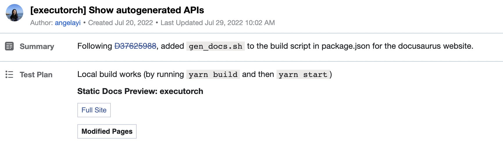
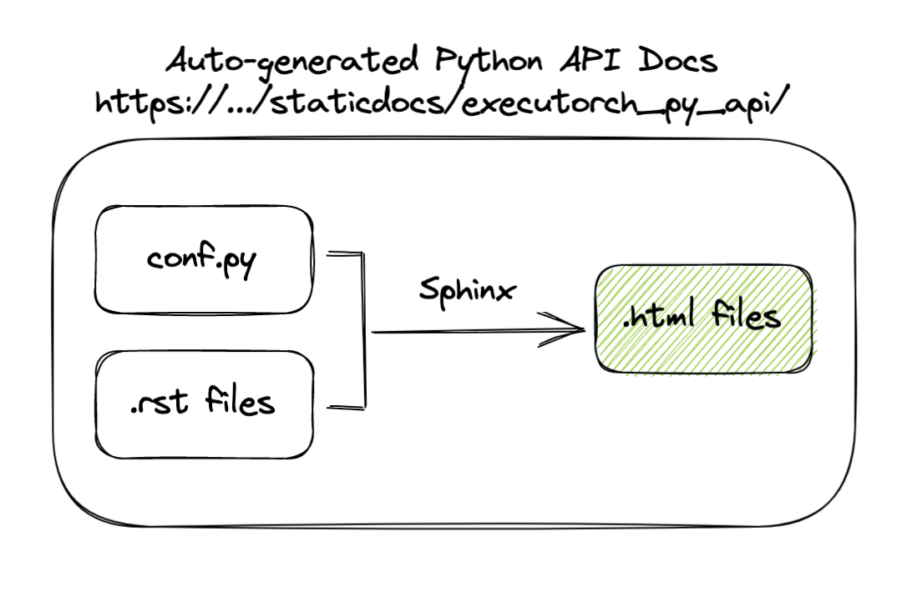
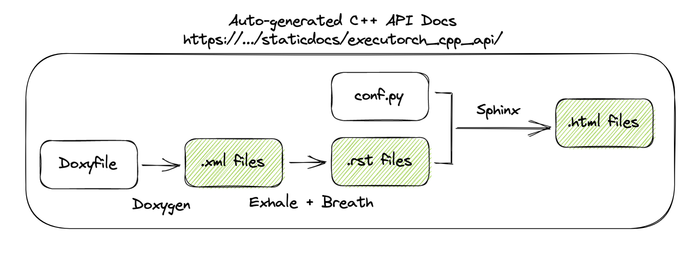

# Contributing to the Executorch Website

# Layout

Directory structure:

```
docs
│   README.md
│
└─── website
│   │   docusaurus.config.json
│   │   sidebar.js
|   └─── fb
│   |   └─── sidebar.js
│   │    ...
|   └─── docs
│       |    .md files
│       │   ...
|       └─── fb
|           └─── .md files
│
└─── source_py
│   │    conf.py
│   └─── .rst files
|
└─── source_cpp
    │    Doxyfile
    │    conf.py
    └─── index.rst files
```

The Executorch website is hosted on
https://www.internalfb.com/intern/staticdocs/executorch/.

# General Documentation

General documentation can be written in Markdown and live within the
`website/docs/` directory. Through Static Docs, the Markdown files will be
automatatically rendered into a pretty static website on
https://www.internalfb.com/intern/staticdocs/executorch/.

To add a page to the website, create a .md file under the `website/docs/`
directory. If the page is internal-only, create the file under
`website/docs/fb/`. Afterwards, go to `website/sidebars.js` or
`website/fb/sidebars.js` (depending on if your document is public or
internal-only) and add your document there so that it will show up on the
sidebar.

To view your changes:
1. `ssh -L 3000:localhost:3000 <devserver>` from your laptop to your devserver.
2. `cd fbcode/executorch/docs/website`
3. `yarn` to install any packages
4. `yarn build` to generate static HTML files
5. `yarn start-fb` to start a local development server and view the internal
variant of the website at `localhost:3000`. `yarn start` to view the public
variant of the website. Most changes are reflected live without having to
restart the server.

Additionally, once you make changes to the website and create a diff containing
your changes, a Static Docs Bot will automatically add an ephemeral version of
the Static Docs website containing your changes to the test plan of the diff
created. It may take around 10-20 minutes for the Static Docs Bot to populate
the ephemeral site with your changes and update the test plan of the diff on
Phabricator. It should look something like this:



# Auto-generated APIs

Auto-generated API documentation are currently generated into
https://www.internalfb.com/intern/staticdocs/executorch/py_api/ for Python APIs,
and https://www.internalfb.com/intern/staticdocs/executorch/cpp_api/ for C++
APIs.

On a high level (will go into detail later), we use Sphinx to generate both
Python and C++ documentation in the form of HTML pages. These pages are
generated into `website/static` and are linked on the navigation bar (which is
configured in `website/docusaurus.config.js`).

## Setup (in fbcode)

Since we are using Sphinx, which is an external library, we need to set up a
`TARGETS` file within your working repository in order to run sphinx commands
that you might typically be able to run just on the command line. Specifically
the ones we used were:

* [`sphinx-build`](https://www.sphinx-doc.org/en/master/man/sphinx-build.html) in order to build the Sphinx project and generate the HTML files
* [`sphinx-apidoc`](https://www.sphinx-doc.org/en/master/man/sphinx-apidoc.html) in order to generate an initial set of Sphinx sources

A sample `TARGETS` file looks like:
```
python_binary(
    # @autodeps-skip
    name = "sphinx-build",
    main_module = "sphinx.cmd.build",
    deps = [
        "fbsource//third-party/pypi/breathe:breathe",
        "fbsource//third-party/pypi/exhale:exhale",
        "fbsource//third-party/pypi/pytorch-sphinx-theme:pytorch-sphinx-theme",
        "fbsource//third-party/pypi/sphinx:sphinx",
    ],
)

python_binary(
    # @autodeps-skip
    name = "sphinx-apidoc",
    main_module = "sphinx.ext.apidoc",
    deps = [
        "fbsource//third-party/pypi/pytorch-sphinx-theme:pytorch-sphinx-theme",
        "fbsource//third-party/pypi/sphinx:sphinx",
    ],
)
```

Any libraries that are used within your doc generation should be placed within
the dependency list of the `sphinx-build` binary in the `TARGETS` file created.
If the library you are using does not exist within `fbsource/third-party`,
follow this
[link](https://www.internalfb.com/intern/wiki/Third-Party_for_Megarepo/Python_(PyPI)/)
to fork that library into `fbsource/third-party` so that you can import it here.

## Generating the documentation

### Python APIs

We generate Python API documentation through Sphinx, bootstrapping [Pytorch's
Sphinx theme](https://github.com/pytorch/pytorch_sphinx_theme) for
a cohesive look with the existing Pytorch API documentation.

The setup for Python documentation lies within `source_py/`. To set up Sphinx, a
`conf.py` configuration file is required. We can specify ways to generate
documentation here. Specifically, the most important/relevant parts are:

* Make sure to add a path to the directory above the directory you're trying to generate documentation for. For example, since we want to generate documenation for the `executorch/` directory, the `sys.path` is `.../fbsource/fbcode/`. This tells Sphinx where to find the code to generate docs for.
* `extensions` contains extension modules. For auto-generating APIs make sure to include `sphinx.ext.autodoc`.
* `autodoc_mock_imports` is where you put imports that Sphinx is unable to access. Sphinx runs your code in order to autogenerate the docs, so for any libraries that it unable to access due to it being outside of the directory, or containing c++ bindings, we need to specify it in the `autodoc_mock_imports` list. You can see what modules Sphinx is confused by when you run into importing errors when generating docs.

Additionally, RST files are needed in order to specify the structure of the
auto-generated pages and to tell Sphinx what modules to generate documentation
for. To auto-generate APIs for a specific module, the `automodule` tag is needed
to tell Sphinx what specific module to document. For example, if we wanted a
page to display auto-generated documentation for everything in
`executorch/exir/__init__.py`, the RST file would look something like the
following:

```
executorch.exir
=======================

.. automodule:: executorch.exir
   :members:
   :undoc-members:
   :show-inheritance:
```

These separate RST files should all be linked together, with the initial
landing page under `index.rst`. A sample of this structure can be found in
`source_py/`.

A diagram of how the files work together:


To view your changes on the executorch website, you can follow the same steps
listed in the "General Documentation" section.

To view just the auto-generated pages:
1. `ssh -L 8000:localhost:8000 <devserver>` from your laptop to your devserver.
2. `cd fbcode/executorch/docs/`
3. `buck2 run //executorch/docs:sphinx-build -- -M html source_py sphinxbuild_py`
to build Sphinx and generate APIs any packages.
4. `python3 -m http.server 8000 --directory sphinxbuild_py/html` to view your HTML
files at `localhost:8000`.

### C++ APIs

Following Pytorch's way of generating C++ documentation, we generate C++ API
documentation through Doxygen, which is then converted into
[Sphinx](http://www.sphinx-doc.org/) using
[Breathe](https://github.com/michaeljones/breathe) and
[Exhale](https://github.com/svenevs/exhale).

Specifically, we use Doxygen to generate C++ documentation in the form of XML
files, and through configs set in Sphinx's `conf.py` file, we use Breathe and
Exhale to use the XML files and generate RST files which are then used to
generate HTML files.

To configure Doxygen, we can run `doxygen -g` in the root of our repository (ex.
`source_cpp`) which will generate a `Doxyfile` containing configurations for
generating c++ documentation. Specifically, the most important/relevant parts
are:

* `OUTPUT_DIRECTORY` specifies where to output the auto-generated XML files
* `INPUT` specifies which files to generate documenation for
* `GENERATE_XML = YES`

Following PyTorch's `conf.py`
[file](https://github.com/pytorch/pytorch/blob/master/docs/cpp/source/conf.py),
we can set up our own `conf.py` file to take in the directory in which we
generated the XML files, and output HTML to another directory. A sample of this
structure can be found in `source_cpp/`.

A diagram of how the files work together:


To view your changes on the executorch website, you can follow the same steps
listed in the "General Documentation" section.

To view just the auto-generated pages:
1. `ssh -L 8000:localhost:8000 <devserver>` from your laptop to your devserver.
2. `cd fbcode/executorch/docs/`
3. `buck2 run //executorch/docs:sphinx-build -- -M html source_cpp sphinxbuild_cpp`
to build Sphinx and generate APIs any packages.
4. `python3 -m http.server 8000 --directory sphinxbuild_cpp/html` to view your HTML
files at `localhost:8000`.

## Integration with Static Docs

To integrate the generated files with Static Docs, we created a `gen_docs.sh`
script under `website/`. The script contains commands to generate HTML files
into the `website/static/` folder, which are linked on the navigation bar (which
is configured in `website/docusaurus.config.js`).

To have Static Docs run this script each time the website is built, we inserted
a command to run this script into `website/package.json` under `scripts/build`:
```
{
  ...
  "scripts": {
    "docusaurus": "docusaurus",
    "start": "docusaurus start",
    "build": "./gen_docs.sh && docusaurus build",
    ...
  }
  ...
}
```
