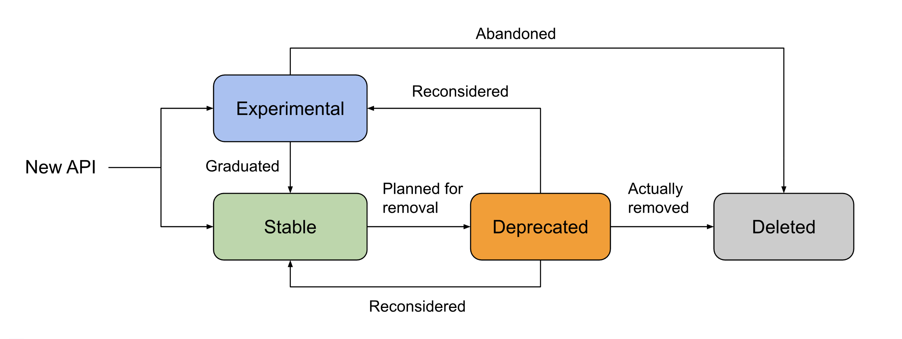

# ExecuTorch API Life Cycle and Deprecation Policy

## API Life Cycle

Each API of ExecuTorch falls into one of the following life cycle states:

_Experimental_

- APIs in this stage are under active development and may change or be removed
  at any time. That said, the expectation is that we will eventually promote it
  to _Stable_, unless sufficient negative signals have been collected from the
  community or better alternatives have been found.
- _Experimental_ APIs will be clearly marked (see the “How to Mark API State”
  section below).
- _Experimental_ APIs may be changed or removed without notice, and developers
  should expect no stability guarantees.

_Stable_

- APIs are considered to be _Stable_ if they are not marked as _Experimental_ or
  _Deprecated._
- APIs in this stage have been thoroughly tested and are considered ready for
  production use.
- The recommended best practice is to not deprecate stable APIs. When writing an
  API, write it in such a way that it doesn’t need to be deprecated in the
  future.
- _Stable_ APIs can be changed, but not in a breaking way. If breaking changes
  have to be made, _Stable_ APIs will always transition to _Deprecated_ before
  being broken/removed from the library.

_Deprecated_

- APIs in this stage are no longer recommended for use and will be removed in a
  future version of ExecuTorch.
- _Deprecated_ APIs will be clearly marked (see the “How to Mark API State”
  section below).
- _Deprecated_ APIs will remain functional for at least the _deprecation period_
  (see the “Deprecation Period” section below) to allow developers time to
  migrate to alternative APIs.

_Deleted_

- APIs whose removal are made permanent. Cleaned up from both code and
  documentation.

## Deprecation Policy

Follow these steps to deprecate and remove an API:

1. Discuss the change and collect initial feedback.
2. Clearly mark the API deprecated in code and documentation (See “How to Mark
   API State” below).
3. Listen to user feedback after the first release that deprecates the API.
   Users who weren't involved in the original discussion may have good arguments
   for not deprecating or removing the API.
4. Once the deprecation period has passed, the API may be removed (See
   “Deprecation Period” below). Be sure to also remove references from the
   documentation.

We also use deprecation as a way to make breaking changes to an existing
interface: for example, if adding a non-optional parameter to a method. To do
this without breaking existing users:

1. In a single commit:
   - Create a new API that meets the new requirements.
   - Deprecate the old API and recommend that users move to the new API.
2. Migrate use cases from the old API to the new API.
3. Delete the old API after the deprecation period.

## How to Mark API State

When possible, the ExecuTorch code uses language-standard ways to annotate API
lifecycle state in the code. This makes it easier for IDEs and other tools to
communicate state to developers.

<table>
  <tr>
   <td><strong>Language</strong>
   </td>
   <td><strong>Code</strong>
   </td>
   <td><strong>Documentation</strong>
   </td>
  </tr>
  <tr>
   <td>Python
   </td>
   <td>

Use the
<a href="https://github.com/pytorch/executorch/blob/main/exir/_warnings.py">executorch.exir._warnings.deprecated</a>
decorator.

Use the
<a href="https://github.com/pytorch/executorch/blob/main/exir/_warnings.py">executorch.exir._warnings.experimental</a>
decorator.

   </td>
   <td>

Use <code>.. warning::</code> in the docstrings of deprecated and experimental
APIs. See
<a href="https://github.com/pytorch/pytorch/blob/cd8bbdc71a0258292381a7d54c8b353988d02ff4/torch/nn/utils/stateless.py#L170">example
usage</a>.

</ul>
   </td>
  </tr>
  <tr>
   <td>C++
   </td>
   <td>

Use the <code>ET_DEPRECATED</code> annotation macro. See <a href="https://github.com/pytorch/executorch/blob/8e0f856ee269b319ac4195509cf31e3f548aa0e8/runtime/executor/program.h#L81">example usage</a>.

Use the <code>ET_EXPERIMENTAL</code> annotation macro.
</ul>
   </td>
   <td>

Start Doxygen comments with <code>DEPRECATED:</code> See
<a href="https://github.com/pytorch/executorch/blob/9d859653ae916d0a72f6b2b5c5925bed38832140/runtime/executor/program.h#L139">example
usage</a>.

Start Doxygen comments with <code>EXPERIMENTAL:</code>.
   </td>
  </tr>
  <tr>
   <td>Java
   </td>
   <td>

Use <a href="https://docs.oracle.com/javase/9/docs/api/java/lang/Deprecated.html">java.lang.Deprecated</a>.

Use <a href="https://cs.android.com/androidx/platform/frameworks/support/+/androidx-main:docs/api_guidelines/annotations.md">androidx.annotation.RequiresOptIn</a>.

   </td>
   <td>

<pre><code>/**
* @deprecated Use {@link #newMethod()} instead.
*/
</code></pre>

<pre><code>/**
* Warning: This API is experimental.
*/</code></pre>
   </td>
  </tr>
  <tr>
   <td>Objective-C
   </td>
   <td>

<code>__attribute__((deprecated("Use newMethod instead")));</code>

<code>__attribute__((deprecated("This API is experimental and may change without notice.")));</code>
   </td>
   <td>

<pre><code>
/**
* @deprecated Use `newMethod` instead.
*/
</code></pre>

<pre><code>
/**
* @experimental This API is experimental.
*/</code></pre>

   </td>
  </tr>
  <tr>
   <td>Swift
   </td>
   <td>

<code>@available(*, deprecated, message: "Use newMethod instead")</code>

<code>@available(*, message: "This API is experimental")</code>
   </td>
   <td>

<code>/// - Warning: Deprecated. Use `newMethod()` instead.</code>

<code>/// - Warning: This API is experimental.</code>
   </td>
  </tr>
</table>

The annotations would trigger static and/or runtime warning that contains at
least these information:

1. Clearly point to the non-deprecated alternative to migrate to, or be clear if
   there is no alternative;
2. Specify the earliest version in which the API may actually be removed (See
   “Deprecation Period” below).

## Deprecation Period

Here we recommend waiting for at least 2 minor releases before the removal. For
example, if a function is marked as _deprecated_ in release 1.3.x, then it can
be _deleted_ in 1.5.x or later.
