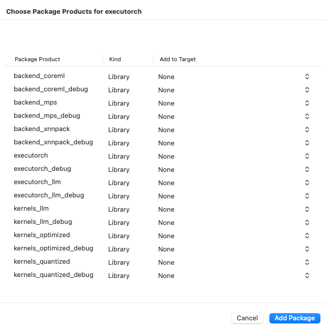

# Integrating and Running ExecuTorch on Apple Platforms

**Author:** [Anthony Shoumikhin](https://github.com/shoumikhin)

The ExecuTorch Runtime for iOS and macOS is distributed as a collection of prebuilt [.xcframework](https://developer.apple.com/documentation/xcode/creating-a-multi-platform-binary-framework-bundle) binary targets. These targets are compatible with both iOS and macOS devices and simulators and are available in both release and debug modes:

* `executorch` - Main Runtime components
* `backend_coreml` - Core ML backend
* `backend_mps` - MPS backend
* `backend_xnnpack` - XNNPACK backend
* `kernels_custom` - Custom kernels
* `kernels_optimized` - Optimized kernels
* `kernels_portable` - Portable kernels (naive implementation used as a reference)
* `kernels_quantized` - Quantized kernels

Link your binary with the ExecuTorch runtime and any backends or kernels used by the exported ML model. It is recommended to link the core runtime to the components that use ExecuTorch directly, and link kernels and backends against the main app target.

**Note:** To access logs, link against the Debug build of the ExecuTorch runtime, i.e., the `executorch_debug` framework. For optimal performance, always link against the Release version of the deliverables (those without the `_debug` suffix), which have all logging overhead removed.

## Integration

### Setup

#### CMake

Building the Xcode project requires CMake. Installing via homebrew does not
typically work; instead, install the packaged application and commandline tools
globally:

1. Download the macOS `.dmg` installer from https://cmake.org/download
2. Open the `.dmg`
3. Drag the CMake app to the `/Applications` folder
4. In a terminal, install the command line tools: `sudo /Applications/CMake.app/Contents/bin/cmake-gui --install`

### Swift Package Manager

The prebuilt ExecuTorch runtime, backend, and kernels are available as a [Swift PM](https://www.swift.org/documentation/package-manager/) package.

#### Xcode

In Xcode, go to `File > Add Package Dependencies`. Paste the URL of the [ExecuTorch repo](https://github.com/pytorch/executorch) into the search bar and select it. Make sure to change the branch name to the desired ExecuTorch version, e.g., "0.4.0", or just use the "latest" branch name for the latest stable build.


Then select which ExecuTorch framework should link against which target.



Click the screenshot below to watch the *demo video* on how to add the package and run a simple ExecuTorch model on iOS.

<a href="https://pytorch.org/executorch/main/_static/img/swiftpm_xcode.mp4">
  
</a>

#### CLI

Add a package and target dependencies on ExecuTorch to your package file like this:

```swift
// swift-tools-version:5.0
import PackageDescription

let package = Package(
  name: "YourPackageName",
  products: [
    .library(name: "YourPackageName", targets: ["YourTargetName"]),
  ],
  dependencies: [
    // Use "latest" branch name for the latest stable build.
    .package(url: "https://github.com/pytorch/executorch.git", .branch("0.4.0"))
  ],
  targets: [
    .target(
      name: "YourTargetName",
      dependencies: [
        .product(name: "executorch", package: "executorch"),
        .product(name: "xnnpack_backend", package: "executorch")
      ]),
  ]
)
```

Then check if everything works correctly:

```bash
cd path/to/your/package

swift package resolve

# or just build it
swift build
```

### Local Build

Another way to integrate the ExecuTorch runtime is to build the necessary components from sources locally and link against them. This route is more involved but certainly doable.

1. Install [Xcode](https://developer.apple.com/xcode/resources/) 15+ and Command Line Tools:

```bash
xcode-select --install
```

2. Clone ExecuTorch:

```bash
git clone https://github.com/pytorch/executorch.git --recursive --depth 1
cd executorch
```

3. Set up [Python](https://www.python.org/downloads/macos/) 3.10+ and activate a virtual environment:

```bash
python3 -m venv .venv
source .venv/bin/activate
```

4. Install [Cmake](https://cmake.org) and other helpful [PyPI](https://pypi.org) packages:

```bash
pip install --upgrade cmake pip zstd
```

5. Install the required dependencies, including those needed for the backends like [Core ML](build-run-coreml.md) or [MPS](build-run-mps.md), if you plan to build them as well:

```bash
./install_requirements.sh

# Optional dependencies for Core ML backend.
./backends/apple/coreml/scripts/install_requirements.sh

# And MPS backend.
./backends/apple/mps/install_requirements.sh
```

6. Use the provided script to build .xcframeworks:

```bash
./build/build_apple_frameworks.sh --help
```

For example, the following invocation will build the ExecuTorch Runtime and all currently available kernels and backends for the Apple platform:

```bash
./build/build_apple_frameworks.sh --coreml --custom --mps --optimized --portable --quantized --xnnpack
```

After the build finishes successfully, the resulting frameworks can be found in the `cmake-out` directory.
Copy them to your project and link them against your targets.

## Runtime API

Check out the [C++ Runtime API Tutorial](extension-module.md) to learn more about how to load and run an exported model. It is recommended to use the C++ API for macOS or iOS, wrapped with Objective-C++ and Swift code if needed to expose it for other components. Please refer to the [Demo App](demo-apps-ios.md) as an example of such a setup.

Once linked against the `executorch` runtime framework, the target can now import all ExecuTorch public headers. For example, in Objective-C++:

```objectivecpp
#import <ExecuTorch/ExecuTorch.h>
#import <executorch/extension/module/module.h>
```

Or in Swift:

```swift
import ExecuTorch
```

**Note:** Importing the ExecuTorch umbrella header (or ExecuTorch module in Swift) provides access to the logging API only. You still need to import the other runtime headers explicitly as needed, e.g., `module.h`. There is no support for other runtime APIs in Objective-C or Swift beyond logging described below.

### Logging

We provide extra APIs for logging in Objective-C and Swift as a lightweight wrapper of the internal ExecuTorch machinery. To use it, just import the main framework header in Objective-C. Then use the `ExecuTorchLog` interface (or the `Log` class in Swift) to subscribe your own implementation of the `ExecuTorchLogSink` protocol (or `LogSink` in Swift) to listen to log events.

```objectivec
#import <ExecuTorch/ExecuTorch.h>
#import <os/log.h>

@interface MyClass : NSObject<ExecuTorchLogSink>
@end

@implementation MyClass

- (instancetype)init {
  self = [super init];
  if (self) {
#if DEBUG
    [ExecuTorchLog.sharedLog addSink:self];
#endif
  }
  return self;
}

- (void)dealloc {
#if DEBUG
  [ExecuTorchLog.sharedLog removeSink:self];
#endif
}

#if DEBUG
- (void)logWithLevel:(ExecuTorchLogLevel)level
           timestamp:(NSTimeInterval)timestamp
            filename:(NSString *)filename
                line:(NSUInteger)line
             message:(NSString *)message {
  NSString *logMessage = [NSString stringWithFormat:@"%@:%lu %@", filename, (unsigned long)line, message];
  switch (level) {
    case ExecuTorchLogLevelDebug:
      os_log_with_type(OS_LOG_DEFAULT, OS_LOG_TYPE_DEBUG, "%{public}@", logMessage);
      break;
    case ExecuTorchLogLevelInfo:
      os_log_with_type(OS_LOG_DEFAULT, OS_LOG_TYPE_INFO, "%{public}@", logMessage);
      break;
    case ExecuTorchLogLevelError:
      os_log_with_type(OS_LOG_DEFAULT, OS_LOG_TYPE_ERROR, "%{public}@", logMessage);
      break;
    case ExecuTorchLogLevelFatal:
      os_log_with_type(OS_LOG_DEFAULT, OS_LOG_TYPE_FAULT, "%{public}@", logMessage);
      break;
    default:
      os_log(OS_LOG_DEFAULT, "%{public}@", logMessage);
      break;
  }
}
#endif

@end
```

Swift version:

```swift
import ExecuTorch
import os.log

public class MyClass {
  public init() {
    #if DEBUG
    Log.shared.add(sink: self)
    #endif
  }
  deinit {
    #if DEBUG
    Log.shared.remove(sink: self)
    #endif
  }
}

#if DEBUG
extension MyClass: LogSink {
  public func log(level: LogLevel, timestamp: TimeInterval, filename: String, line: UInt, message: String) {
    let logMessage = "\(filename):\(line) \(message)"
    switch level {
    case .debug:
      os_log(.debug, "%{public}@", logMessage)
    case .info:
      os_log(.info, "%{public}@", logMessage)
    case .error:
      os_log(.error, "%{public}@", logMessage)
    case .fatal:
      os_log(.fault, "%{public}@", logMessage)
    default:
      os_log("%{public}@", logMessage)
    }
  }
}
#endif
```

**Note:** In the example, the logs are intentionally stripped out when the code is not built for Debug mode, i.e., the `DEBUG` macro is not defined or equals zero.

## Troubleshooting

### Missing operator or backend

If after linking against a certain ExecuTorch library you still get an unregistered kernel or backend error at runtime, you may need to use the `-all_load` or `-force_load $(BUILT_PRODUCTS_DIR)/<library_name>` linker flags to forcefully register the corresponding components at app start, e.g., `-force_load $(BUILT_PRODUCTS_DIR)/libkernels_portable-ios-release.a`.

### Swift PM

If Swift PM complains about a checksum mismatch for the package contents, try cleaning the cache:

```bash
rm -rf ~/Library/Caches/org.swift.swiftpm
```
