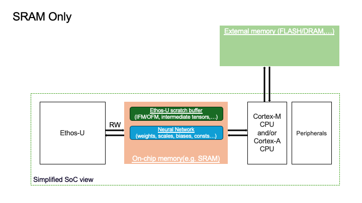
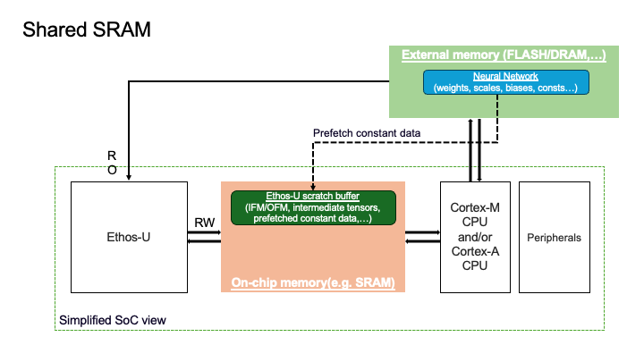
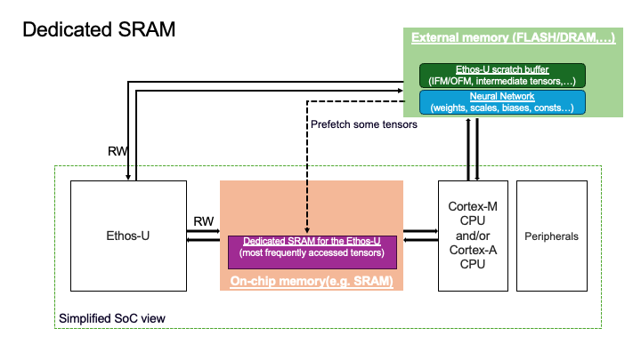

# Arm(R) Ethos(TM)-U NPU Backend

The Arm Ethos-U backend is the ExecuTorch solution for executing quantized models on [Ethos-U55](https://www.arm.com/products/silicon-ip-cpu/ethos/ethos-u55), [Ethos-U65](https://www.arm.com/products/silicon-ip-cpu/ethos/ethos-u65), and [Ethos-U85](https://www.arm.com/products/silicon-ip-cpu/ethos/ethos-u85) NPUs. It leverages the TOSA operator set which can be compiled by the ethos-u-vela graph compiler.

## Features

- Wide operator support for delegating large parts of models to highly optimized and low power Ethos-U NPUs.
- A quantizer that optimizes quantization for the NPU target.

## Target Requirements

The target system must include an Ethos-U NPU.

## Development Requirements

To compile for the NPUs, the Ethos-U Vela compiler is needed. A target-specific toolchain is also needed for building the runtime. Finally, to test models, Arm provides freely available Fixed Virtual Platforms (FVP), allowing running code on the Ethos-U without a a physical development board by emulating reference designs. For Ethos-U55, there is [Corstone-300](https://developer.arm.com/Processors/Corstone-300), and for Ethos-U85, there is [Corstone-320](https://developer.arm.com/Processors/Corstone-320).

These dependencies can easily be downloaded using the script `examples/arm/setup.sh`.

## Using the Arm Ethos-U backend
The example below demonstrates the lowering processs of a MobileNet V2 model from torchvision for a Ethos-U55 target. Since the model is a floating point model, first quantize it using the `EthosUQuantizer`. Then, pass an instance of the `EthosUPartitioner` to `to_edge_transform_and_lower`. Both the quantizer and the partitioner need a compilation specification created using `ArmCompileSpecBuilder`.

```python
import torch
from executorch.backends.arm.arm_backend import ArmCompileSpecBuilder
from executorch.backends.arm.ethosu import EthosUPartitioner
from executorch.backends.arm.quantizer.arm_quantizer import (
    EthosUQuantizer,
    get_symmetric_quantization_config,
)
from executorch.exir import (
    EdgeCompileConfig,
    ExecutorchBackendConfig,
    to_edge_transform_and_lower,
)
from torchao.quantization.pt2e.quantize_pt2e import convert_pt2e, prepare_pt2e
from torchvision.models import mobilenetv2
import executorch.kernels.quantized

mobilenet_v2 = mobilenetv2.mobilenet_v2(
    weights=mobilenetv2.MobileNet_V2_Weights.DEFAULT
).eval()
example_inputs = (torch.randn(1, 3, 224, 224),)

compile_spec = ArmCompileSpecBuilder().ethosu_compile_spec(
        "ethos-u55-128",
        system_config="Ethos_U55_High_End_Embedded",
        memory_mode="Shared_Sram",
        extra_flags="--output-format=raw --debug-force-regor",
    ).build()

# Post training quantization
graph_module = torch.export.export(mobilenet_v2, example_inputs).module()
quantizer = EthosUQuantizer(compile_spec)
operator_config = get_symmetric_quantization_config(is_per_channel=False)
quantizer.set_global(operator_config)
graph_module = prepare_pt2e(graph_module, quantizer)
graph_module(*example_inputs)
graph_module = convert_pt2e(graph_module)
exported_program = torch.export.export(graph_module, example_inputs)

# Lower the exported program to the Ethos-U backend and save pte file.
edge_program_manager = to_edge_transform_and_lower(
    exported_program,
    partitioner=[EthosUPartitioner(compile_spec)],
    compile_config=EdgeCompileConfig(
        _check_ir_validity=False,
    ),
).to_executorch(config=ExecutorchBackendConfig(extract_delegate_segments=False))

with open("mv2_arm_ethos_u55.pte", "wb") as file:
    edge_program_manager.write_to_file(file)
```

### Ethos-U memory modes
The Ethos-U NPU provides two distinct memory interfaces:
- One interface for **low-latency, high-bandwidth memory**
Typically on-chip memory such as **SRAM**.
- One interface for **higher-latency, lower-bandwidth memory**
Typically external (off-chip) memory such as **Flash** or **DRAM**.

On all Ethos-U NPUs(Ethos-U55, Ethos-U65, Ethos-U85), the low-latency interface is usually the SRAM of the SoC.
The external memory type depends on the SoC:
- On a low-power microcontorller, the external memory is usually Flash.
- On systems with Cortex-A and rich operating system, the external memory is typically DRAM.

When running an inference, the Ethos-U compiler and Ethos-U driver make use of three logical memory regions:
- Ethos-U scratch buffer - a contiguous block of memory used by the NPU to store the intermediate tensors produced and consumed during inference.
- Neural Network - a contiguous block of memory holding constant data such as weights, biases, quantization parameters required to run an inference.
- Ethos-U fast scratch buffer - a contiguous block of memory, assumed to reside in on-chip memory in order to hide the higher latency/lower bandwidth of external memory. Only applicable for Ethos-U65 and Ethos-U85 on systems
with Cortex-A and the external memory is assumed to be DRAM.

The placement of the scratch buffer and the Neural Network determine the memory mode to be used in the Ethos-U
compile specificiation. We support three different placements of the scratch buffer and the ML model.

#### 1. Sram-Only Memory Mode
- Ethos-U scratch buffer resides in the SRAM.
- Neural Network resides in the SRAM.
- Ethos-U fast scratch buffer is not used.
- Characteristics:
    - Provides the best performance since all the memory traffic passes via the low-latency/high-bandwidth memory.
    - The performance uplift is especially noticeable on memory-bound workloads on the external interface.
    - Available on Ethos-U55, Ethos-U65 and Ethos-U85.
- Limitations:
    - Embedded SoCs often have limited SRAM and NNs are becoming larger. This memory mode may be unsuitable for a system running a big model relative to the amount of SRAM available on the SoC.
Below, you can see a visual representation of the placement of the two logical memory regions for the Sram Only configuration.



#### 2. Shared-Sram Memory Mode
- Ethos-U scratch buffer resides in the SRAM.
- Neural Network resides in the External memory.
- Ethos-U fast scratch buffer is not used.
- Characteristics:
    - Intermediate tensors are stored in the SRAM, leveraging its low-latency and high-bandwidth.
    - The Ethos-U compiler can prefetch weights from the external memory to the SRAM ahead of time so that when the NPU needs the data, it will already be avaialbe in the on-chip memory.
    - In this mode, the external interface is Read-Only, the on-chip memory interface is Read/Write
    - Shared-Sram offers great balance between performance and low SRAM usage.
    - Available on Ethos-U55, Ethos-U65 and Ethos-U85.
- Limitations:
    - You need to have enough space in the SRAM to hold the peak intermediate tensor.
Below, you can see a visual representation of the placement of the two logical memory regions for the Shared_Sram configuration.



#### 3. Dedicated-Sram Memory Mode
- Ethos-U scratch buffer resides in the External memory.
- Neural Network resides in the External memory.
- Ethos-U fast scratch buffer resides in the on-chip memory.
- Characteristics:
    - Used when the peak intermediate tensor is too big to fit into the on-chip memory.
    - Enables silicon acceleration of large models.
    - The NPU stores the results from the intermediate computations in the external memory.
    - The dedicated SRAM acts as a software managed cache, improving performance by pre-fetching frequently accessed tensors to the on-chip memory.
    - Available on Ethos-U65 and Ethos-U85.
- Limitations:
    - The SRAM space must be dedicated exculisely to the Ethos-U(the host processor should not access it).
    - Not available on Ethos-U55.
Below, you can see a visual representation of the placement of the two logical memory regions for the Shared_Sram configuration.



Here is a table comparing the three memory modes:

| Memory Mode        | Ethos-U Scratch Buffer Placement | Neural Network Placement   | When to Use  | Trade-off |
|--------------------|----------------------------------|----------------------------|------------  |---------------------------------------------------------------------------|
| **SRAM-Only**      | On-chip SRAM                     | On-chip SRAM               | When the ML model, the Ethos-U scratch buffer and the wider software stack fit within the SRAM of the SoC | Limited by SRAM size; often not feasible for larger NNs |
| **Shared-SRAM**    | On-chip SRAM                     | External memory (Flash/DRAM) | Most common mode on Cortex-M and Ethos-U systems; balances good performance and SRAM usage | Requires enough SRAM to hold the largest intermediate tensor |
| **Dedicated-SRAM** | External memory  | External memory (Flash/DRAM) | Most common mode for Cortex-A and Ethos-U systems. For very large models where the peak intermediates cannot fit in SRAM  | Need high-bandwidth external memory to deliver good performance |


The memory modes are defined within the [vela.ini file](https://gitlab.arm.com/artificial-intelligence/ethos-u/ethos-u-vela/-/blob/main/ethosu/config_files/Arm/vela.ini?ref_type=heads). When you install
ExecuTorch for the Ethos-U backend, you automatically install the compiler containing the vela.ini file so you can directly create a compile specification with these memory modes.

#### Interpreting the output from the Ethos-U compiler regarding the memory footprint
As part of the `to_edge_transform_and_lower` step, you will see a memory footprint information presented as:

```
Total SRAM used                               2467.27 KiB
Total Off-chip Flash used                       12.20 KiB
````
The `Total SRAM used` indicates the peak SRAM utilization needed by the NPU in order to perform an inference. In the snippet above, the Ethos-U compiler requires 2467.27 KiB of SRAM in order to schedule the inference.
Therefore, from an application standpoint, you need to ensure you have at least 2467.27 KiB of SRAM on the SoC to run this model. The Ethos-U compiler provides a scheduling algorithm allowing to
lower the peak SRAM usage within reasonable limits, you need to add the `--optimise Size` or `--arena-cache-size` CLI options for to the compile spec. You can read more about the options of the
Ethos-U compiler in the documentation [here](https://gitlab.arm.com/artificial-intelligence/ethos-u/ethos-u-vela/-/blob/main/OPTIONS.md#optimise). If the peak SRAM usage remains too high in
Shared Sram memory mode, you would need to us the Dedicated Sram mode in order to store the Neural Network and the Ethos-U scratch buffer in the external memory.
The main advantage of the Dedicated_Sram memory mode is that you can run large models and still benefit from the low-latency/high-bandwidth of the SRAM, used as a cache.

It is important to highlight that when you specify a memory mode in the compile spec, in the runtime, the user is expected to place the scratch buffer and NN in the correct memory location.
In other words, when you specify for ex. Shared Sram memory mode, the runtime application logic should place the ethos-U scratch buffer in the on-chip memory and the NN in the external memory for optimal performance.

You can see how we are doing this coupling between the memory mode and runtime application the [Ethos-U porting guide](../../examples/arm/ethos-u-porting-guide.md).

### Partitioner API

`EthosUPartitioner` tries to partition as much of the model as possible. It will never delegate unsupported operators, but a user can pass additional checks to the constructor to avoid partitioning additional operators. To do this, subclass `OperatorSupportBase` and implement the function `is_node_supported`. A few such checks exist in `executorch.exir.backend.operator_support`:

- `DontPartition`: Don't partition operators based on operator type.
- `DontPartitionModule`: Don't partition operators based on which python module the operator comes from.
- `DontPartitionName`: Don't partition operators based on the operator name.

### Quantization

A fully integer model is required for using the Arm Ethos-U backend. As discussed above, you can quantize floating point models with the `EthosUQuantizer`. Quantizers are backend specific, which means the `EthosUQuantizer` is configured to quantize models correctly for the target.

## Runtime Integration

To run the model on-device, build the executorch library and EthosUDelegate using the script
`executorch/backends/arm/scripts/build_executorch.sh`.
Then build the arm executorch runtime using the script
`executorch/backends/arm/scripts/build_executor_runner.sh --pte=mv2_arm_ethos_u55.pte --target=ethos-u55-128`.

Finally, run the elf file on FVP using the script
`executorch/backends/arm/scripts/run_fvp.sh --elf=executorch/mv2_arm_ethos_u55/cmake-out/arm_executor_runner --target=ethos-u55-128`.

## Memory formats

Tensors of rank 4 and higher have two differing [memory format](https://pytorch.org/blog/tensor-memory-format-matters/) standards used.
Pytorch defaults to contiguous/ channels first/ NCHW memory formats, compared to TOSA which only supports channels last/NHWC memory format.
To support this, the backend inserts a transpose in the beginning if the incoming memory format is contiguous, and correspondingly a
transpose in the end if the outgoing memory format is contiguous. Note that this means that you may avoid transposing the data unneccessarily if the runtime integration and
full network is converted to use channels last. A word of caution must be given here however - changing memory format has been noted to have side effects such as
unsupported ops being inserted into the graph, and it is currently not widely tested, so the feature must so far be viewed as experimental.

## See Also
- [Arm Ethos-U Backend Tutorial](tutorial-arm.md)
