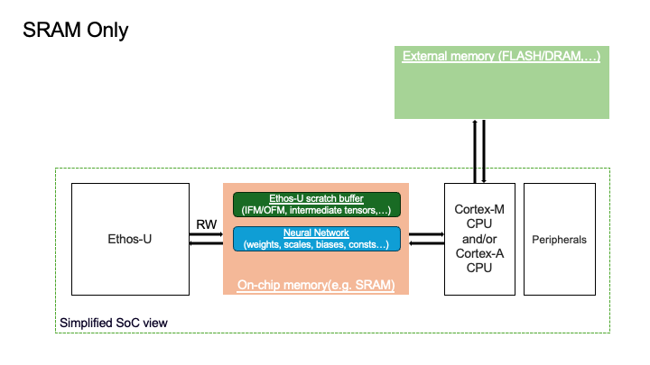
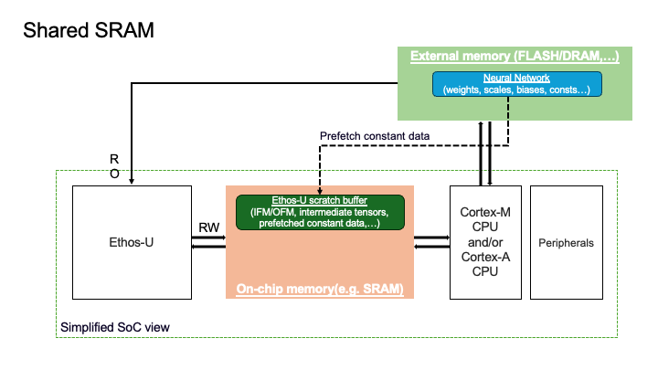
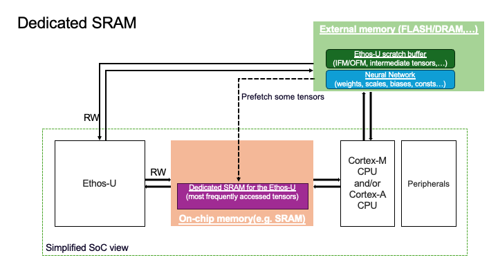

# Arm Ethos-U Backend

The Arm&reg; Ethos&trade;-U backend targets Edge/IoT-type AI use-cases by enabling optimal execution of quantized models on
[Arm&reg; Ethos&trade;-U55 NPU](https://www.arm.com/products/silicon-ip-cpu/ethos/ethos-u55), [Arm&reg; Ethos&trade;-U65 NPU](https://www.arm.com/products/silicon-ip-cpu/ethos/ethos-u65), and
[Arm&reg; Ethos&trade;-U85 NPU](https://www.arm.com/products/silicon-ip-cpu/ethos/ethos-u85), leveraging [TOSA](https://www.mlplatform.org/tosa/) and the
[ethos-u-vela](https://pypi.org/project/ethos-u-vela/) graph compiler. This document is a technical reference for using the Ethos-U backend, for a top level view with code examples
please refer to the [Arm Ethos-U Backend Tutorial](https://docs.pytorch.org/executorch/stable/tutorial-arm-ethos-u.html).

## Features

- Wide operator support for delegating large parts of models to highly optimized and low power Ethos-U NPUs.
- A quantizer that optimizes quantization for the NPU target.
- Example runtime integration for easy hardware bringup.

## Target Requirements

The target system must include an Ethos-U NPU.

## Development Requirements

```{tip}
All requirements can be downloaded using `examples/arm/setup.sh --i-agree-to-the-contained-eula` and added to the path using
set(CMAKE_INSTALL_PREFIX "${CMAKE_BINARY_DIR}")
`source examples/arm/ethos-u-scratch/setup_path.sh`. Note that this means accepting the End-User License Agreements (EULA:s) required for using the downloaded software.
```

For the AOT flow, compilation of a model to `.pte` format using the Ethos-U backend, the requirements are:
- [TOSA Serialization Library](https://www.mlplatform.org/tosa/software.html) for serializing the Exir IR graph into TOSA IR.
- [Ethos-U Vela graph compiler](https://pypi.org/project/ethos-u-vela/) for compiling TOSA flatbuffers into an Ethos-U command stream.

And for building and running the example application available in `examples/arm/executor_runner/`:
- [Arm GNU Toolchain](https://developer.arm.com/Tools%20and%20Software/GNU%20Toolchain) for cross compilation.
- [Arm&reg; Corstone&trade; SSE-300 FVP](https://developer.arm.com/documentation/100966/1128/Arm--Corstone-SSE-300-FVP) for testing on a Arm&reg; Cortex&reg;-M55+Ethos-U55 reference design.
- [Arm&reg; Corstone&trade; SSE-320 FVP](https://developer.arm.com/documentation/109760/0000/SSE-320-FVP) for testing on a Arm&reg; Cortex&reg;-M85+Ethos-U85 reference design.

Fixed Virtual Platforms (FVPs) are freely available emulators provided by Arm for easy embedded development without the need for a physical development board.

## Using the Arm Ethos-U Backend

The main configuration point for the lowering is the `EthosUCompileSpec` consumed by the partitioner and quantizer.
The full user-facing API is documented below.

```python
class EthosUCompileSpec(target: str, system_config: str | None = None, memory_mode: str | None = None, extra_flags: list[str] | None = None, config_ini: str | None = 'Arm/vela.ini')
```
Compile spec for Ethos-U NPU.

Args:
- **target**: Ethos-U accelerator configuration, e.g. ethos-u55-128.
- **system_config**: System configuration to select from the Vela configuration file.
- **memory_mode**: Memory mode to select from the Vela configuration file.
- **extra_flags**: Extra flags for the Vela compiler.
- **config_ini**: Vela configuration file(s) in Python ConfigParser .ini file format.

```python
def EthosUCompileSpec.dump_debug_info(self, debug_mode: executorch.backends.arm.common.arm_compile_spec.ArmCompileSpec.DebugMode | None):
```
Dump debugging information into the intermediates path.

Args:
- **debug_mode**: The debug mode to use for dumping debug information.

```python
def EthosUCompileSpec.dump_intermediate_artifacts_to(self, output_path: str | None):
```
Sets a path for dumping intermediate results during such as tosa and pte.

Args:
- **output_path**: Path to dump intermediate results to.

```python
def EthosUCompileSpec.get_intermediate_path(self) -> str | None:
```
Gets the path used for dumping intermediate results such as tosa and pte.

Returns:
    Path where intermediate results are saved.

```python
def EthosUCompileSpec.get_output_format() -> str:
```
Returns a constant string that is the output format of the class.


### Partitioner API

See [Partitioner API](arm-ethos-u-partitioner.md) for more information of the Partitioner API.

## Quantization

Since the Ethos-U backend is integer-only, all operators intended be executed on the NPU needs to be quantized. The Ethos-U quantizer supports
[Post Training Quantization (PT2E)](https://docs.pytorch.org/ao/main/tutorials_source/pt2e_quant_ptq.html)  and
[Quantization-Aware Training (QAT)](https://docs.pytorch.org/ao/main/tutorials_source/pt2e_quant_qat.html) quantization.

For more information on quantization, see [Quantization](arm-ethos-u-quantization.md)

## Runtime Integration

An example runtime application is available in [examples/arm/executor_runner](https://github.com/pytorch/executorch/blob/main/examples/arm/executor_runner/), and the steps requried for building and deploying it on a FVP it is explained in the previously mentioned [Arm Ethos-U Backend Tutorial](https://docs.pytorch.org/executorch/stable/tutorial-arm-ethos-u.html).
The example application is recommended to use for testing basic functionality of your lowered models, as well as a starting point for developing runtime integrations for your own targets.
For an in-depth explanation of the architecture of the executor_runner and the steps required for doing such an integration, please refer to [Ethos-U porting guide](https://github.com/pytorch/executorch/blob/main/examples/arm/ethos-u-porting-guide.md).

### Ethos-U memory modes

The Ethos-U NPU provides two distinct memory interfaces:
- One interface for **low-latency, high-bandwidth memory**.
    - On all Ethos-U NPUs(Ethos-U55, Ethos-U65, Ethos-U85), the low-latency memory is usually the SRAM of the SoC.
- One interface for **higher-latency, lower-bandwidth memory**, typically external (off-chip) memory.
    - On a low-power microcontroller, the external memory is usually Flash.
    - On systems with Arm&reg; Cortex&trade;-A and a rich operating system, the external memory is typically DRAM.

When running an inference, the Ethos-U compiler and Ethos-U driver make use of three logical memory regions:
- Ethos-U scratch buffer - a contiguous block of memory used by the NPU to store the intermediate tensors produced and consumed during inference.
- Neural Network - a contiguous block of memory holding constant data such as weights, biases, quantization parameters required to run an inference.
- Ethos-U fast scratch buffer - a contiguous block of memory, assumed to reside in on-chip memory in order to hide the higher latency/lower bandwidth of external memory. Only applicable for Ethos-U65 and Ethos-U85 on systems
with Cortex-A and the external memory is assumed to be DRAM.

The placement of the scratch buffer and the Neural Network determine the memory mode to be used in the `EthosUCompileSpec` and when building the executor_runner. Three different memory modes are supported:

| Memory Mode        | Ethos-U Scratch Buffer Placement | Neural Network Placement   | When to Use  | Trade-off |
|--------------------|----------------------------------|----------------------------|------------  |---------------------------------------------------------------------------|
| **SRAM-Only**      | On-chip SRAM                     | On-chip SRAM               | When the ML model, the Ethos-U scratch buffer and the wider software stack fit within the SRAM of the SoC | Limited by SRAM size; often not feasible for larger NNs |
| **Shared-SRAM**    | On-chip SRAM                     | External memory (Flash/DRAM) | Most common mode on Cortex-M and Ethos-U systems; balances good performance and SRAM usage | Requires enough SRAM to hold the largest intermediate tensor |
| **Dedicated-SRAM** | External memory  | External memory (Flash/DRAM) | Most common mode for Cortex-A and Ethos-U systems. For very large models where the peak intermediates cannot fit in SRAM  | Need high-bandwidth external memory to deliver good performance |

Here is an in-depth explanation of the different modes:

#### 1. Sram-Only Memory Mode

- Ethos-U scratch buffer resides in the SRAM.
- Neural Network resides in the SRAM.
- Ethos-U fast scratch buffer is not used.
- Characteristics:
    - Provides the best performance since all the memory traffic passes via the low-latency/high-bandwidth memory.
    - The performance uplift is especially noticeable on memory-bound workloads on the external interface.
    - Available on Ethos-U55, Ethos-U65 and Ethos-U85.
- Limitations:
    - Embedded SoCs often have limited SRAM and NNs are becoming larger. This memory mode may be unsuitable for a system running a big model relative to the amount of SRAM available on the SoC.
Below, you can see a visual representation of the placement of the two logical memory regions for the Sram Only configuration.



#### 2. Shared-Sram Memory Mode

- Ethos-U scratch buffer resides in the SRAM.
- Neural Network resides in the External memory.
- Ethos-U fast scratch buffer is not used.
- Characteristics:
    - Intermediate tensors are stored in the SRAM, leveraging its low-latency and high-bandwidth.
    - The Ethos-U compiler can prefetch weights from the external memory to the SRAM ahead of time so that when the NPU needs the data, it will already be avaialbe in the on-chip memory.
    - In this mode, the external interface is Read-Only, the on-chip memory interface is Read/Write
    - Shared-Sram offers great balance between performance and low SRAM usage.
    - Available on Ethos-U55, Ethos-U65 and Ethos-U85.
- Limitations:
    - You need to have enough space in the SRAM to hold the peak intermediate tensor.
Below, you can see a visual representation of the placement of the two logical memory regions for the Shared_Sram configuration.



#### 3. Dedicated-Sram Memory Mode

- Ethos-U scratch buffer resides in the External memory.
- Neural Network resides in the External memory.
- Ethos-U fast scratch buffer resides in the on-chip memory.
- Characteristics:
    - Used when the peak intermediate tensor is too big to fit into the on-chip memory.
    - Enables silicon acceleration of large models.
    - The NPU stores the results from the intermediate computations in the external memory.
    - The dedicated SRAM acts as a software managed cache, improving performance by pre-fetching frequently accessed tensors to the on-chip memory.
    - Available on Ethos-U65 and Ethos-U85.
- Limitations:
    - The SRAM space must be dedicated exculisely to the Ethos-U(the host processor should not access it).
    - Not available on Ethos-U55.
Below, you can see a visual representation of the placement of the two logical memory regions for the Shared_Sram configuration.



The memory modes are defined within the [vela.ini file](https://gitlab.arm.com/artificial-intelligence/ethos-u/ethos-u-vela/-/blob/main/ethosu/config_files/Arm/vela.ini?ref_type=heads). When you install
ExecuTorch for the Ethos-U backend, you automatically install the compiler containing the vela.ini file so you can directly create a compile specification with these memory modes.

## Reference

**→{doc}`/backends/arm-ethos-u/arm-ethos-u-partitioner` — Partitioner options.**

**→{doc}`/backends/arm-ethos-u/arm-ethos-u-quantization` — Supported quantization schemes.**

**→{doc}`/backends/arm-ethos-u/arm-ethos-u-troubleshooting` — Troubleshooting and common issues.**

**→{doc}`/backends/arm-ethos-u/tutorials/arm-ethos-u-tutorials` — Tutorials.**


```{toctree}
:maxdepth: 2
:hidden:
:caption: Arm Ethos-U Backend

arm-ethos-u-partitioner
arm-ethos-u-quantization
arm-ethos-u-troubleshooting
tutorials/arm-ethos-u-tutorials
```
