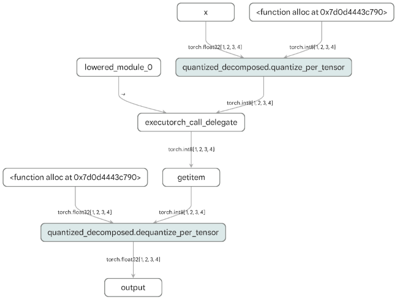

# NXP eIQ Dim Order Support

The NXP ExecuTorch backend supports two different dimension orders (memory formats):

* **Contiguous** (default, also known as channels first)
* **Channels last**

> **Note:** Any other dimension order will cause a runtime exception.

---

## Why Use Channels Last?

The Neutron NPU computes on channels last data (NHWC), while ExecuTorch uses channels the first format (NCHW) by
default. This mismatch requires extra transpositions during runtime, which can significantly impact performance.

**Benefits of using channels last:**

- Eliminates or reduces runtime data transpositions
- Improves inference performance on the Neutron NPU
- May align with sensor data formats (e.g., camera sensors often output NHWC)

---

## Implementation Options

There are **two approaches** to using the channels last dimension order:

### Option 1: Channels Last Inputs (Recommended)

This approach provides the **best performance** and often completely eliminates runtime transpositions.

**Trade-off:** Model inputs must be provided in channels last format instead of the native channels first format.

#### Example

```python
# Convert model weights to channels last dimension order
model = YourModel().to(memory_format=torch.channels_last)

# Convert example inputs to channels last dimension order
# This defines the dim order for the model inputs and internal data at runtime
example_inputs = tuple(
    i.to(memory_format=torch.channels_last) for i in your_example_inputs
)

# Export the model using channels last example inputs
exported_program = torch.export.export(model, example_inputs)

# Lower the model using the NXP backend
...
```

#### Complete Example

A full implementation is available
in [aot_neutron_compile.py](https://github.com/pytorch/executorch/blob/main/examples/nxp/aot_neutron_compile.py).

The following command creates a `cifar10_nxp_delegate.pte` model with channels last inputs and no transpositions,
compatible with the `i.MX RT700` board using **MCUXpresso SDK 25.06**:

```bash
python -m examples.nxp.aot_neutron_compile --quantize \
    --delegate --neutron_converter_flavor SDK_25_12 -m cifar10 \
    --use_channels_last_dim_order
```

For installation details, see {doc}`nxp-overview`.

---

### Option 2: Preserve Channels First Inputs

This approach maintains **contiguous/channels first model inputs** while potentially improving performance through
internal channels last processing.

**How it works:**

- Model inputs remain unchanged (channels first)
- An extra operator is inserted at the model's start to convert inputs to channels last
- The model behaves identically from an external perspective
- Internal processing may save on runtime transpositions

#### Example

```python
class MyModel(nn.Module):
    def forward(self, x):
        # Transform inputs to channels last dimension order
        x = x.to(memory_format=torch.channels_last)

        # Rest of your model definition
        ...


# Convert model weights to channels last dimension order
model = MyModel().to(memory_format=torch.channels_last)

# Export and lower the model using the NXP backend
...
```

#### Performance Considerations

- Performance improvement depends on the specific model
- In many cases, there may be no significant improvement
- Rarely, performance could slightly decrease
- **Always benchmark** both contiguous and channels last variants

---

## Limitations

### 4D Input Support Only

Due to internal limitations of PyTorch, only models with 4D and 5D inputs can take advantage of the channels last
dimension order, and only the 4D case is currently supported by the NXP backend. Models processing serial data (with 3D
inputs (NCW)) would have to be manually extended to 4D with a spatial dimension of size 1 (NC1W).

### Partial Delegation Issues

Models that are **not fully delegated to Neutron** may experience runtime issues when using channels last dimension
order, including:

- Runtime crashes
- Incorrect output data

This affects models with partitions running in ExecuTorch edge dialect on the CPU.

**Recommendation:** Manually verify model correctness by testing the final `.pte` file and validating outputs.

### Fully Delegated Models

Models that are **fully delegated to Neutron** should **not experience runtime issues** with channels last dimension
order.

---

## Verifying Full Delegation

Use one of the following methods to confirm your model is fully delegated:

### Method 1: List Graph Nodes

After lowering your model, inspect the graph nodes:

```python
exec_prog = edge_program_manager.to_executorch()
print(list(exec_prog.exported_program().graph.nodes))
```

**Example output for a fully delegated model** (containing no compute `aten` operators except (de)quantize):

```python
[x, alloc, quantized_decomposed_quantize_per_tensor_default, lowered_module_0, executorch_call_delegate, getitem,
 alloc_1, quantized_decomposed_dequantize_per_tensor_default_1, output_1]
```

### Method 2: Visualize with Model Explorer

Launch a browser-based visualization of your model:

```python
exec_prog = edge_program_manager.to_executorch()

from executorch.devtools.visualization.visualization_utils import visualize_with_clusters

visualize_with_clusters(exec_prog.exported_program())
```

**Example visualization** of a fully delegated model is shown in **Figure 1** below (containing no compute `aten`
operators except (de)quantize):

<figure id="fig1">
    
    <figcaption>
        <b>Figure 1:</b> Example of a fully delegated model. Contains no compute <code>aten</code> operators other than 
        <code>quantize</code> and <code>dequantize</code>. The entire model is delegated to Neutron via the 
        `executorch_call_delegate` node.
    </figcaption>
</figure>

---

## Summary

| Approach     | Input Format  | Internal Format | Performance | Use Case                                                                                  |
|--------------|---------------|-----------------|-------------|-------------------------------------------------------------------------------------------|
| **Option 1** | Channels last | Channels last   | **Best**    | When you can provide channels last inputs                                                 |
| **Option 2** | Contiguous    | Channels last   | Variable    | When input format must be preserved                                                       |
| **Default**  | Contiguous    | Contiguous      | Baseline    | For non-4D models, or when **Option 2** is slower, crashes, or produces incorrect outputs |

Choose the approach that best fits your deployment requirements and always benchmark to verify performance improvements.
