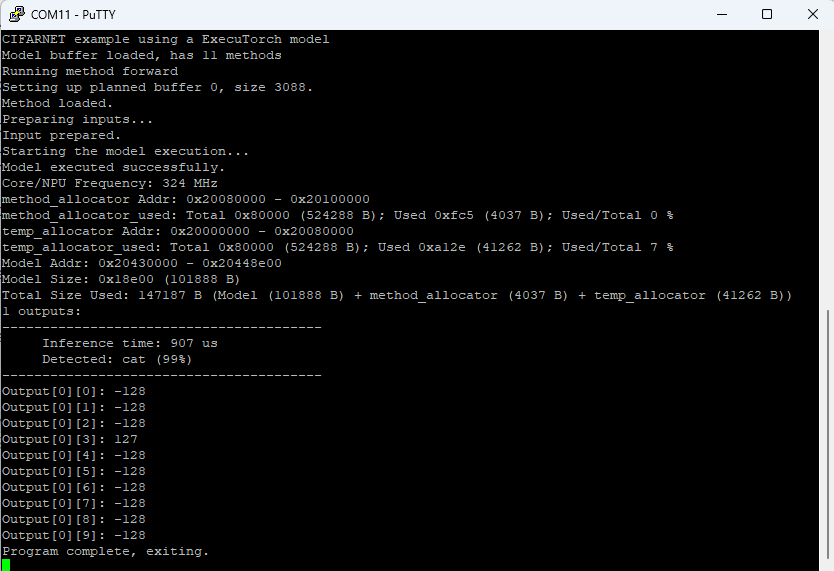

# Using the MCUXpresso Example

This example demonstrates how to build and run the ExecuTorch CIFARNet application for the NXP RT700 platform using the MCUXpresso SDK and the GNU Arm Embedded Toolchain. Before building the project, make sure that all required dependencies are installed and that the necessary environment variables are configured correctly.

## 1. Install the Arm GNU Toolchain

First, download the Arm GCC cross-compilation toolchain that is supported by the RT700 platform:

```text
https://developer.arm.com/-/media/Files/downloads/gnu/15.2.rel1/binrel/arm-gnu-toolchain-15.2.rel1-x86_64-arm-none-eabi.tar.xz
```

After extracting the archive, create an environment variable called `ARMGCC_DIR` that points to the root directory of the toolchain installation. The build scripts use this variable to locate the compiler, linker, and other required tools.

Example on Linux:

```bash
export ARMGCC_DIR=/path/to/arm-gnu-toolchain-15.2.rel1-x86_64-arm-none-eabi
```

To verify the installation, you can run:

```bash
$ARMGCC_DIR/bin/arm-none-eabi-gcc --version
```

The command should print the installed compiler version.

## 2. Download the MCUXpresso SDK

Next, download MCUXpresso SDK version **26.06** for the RT700 device family:

```text
https://mcuxpresso.nxp.com/builder?hw=MIMXRT700-EVK
```

When generating the SDK package, make sure that you select:

- **Toolchain:** ARMGCC
- **SDK Layout:** Classic Layout
- **Target Board:** MIMXRT700-EVK

After extracting the SDK package, configure the `SdkRootDirPath` environment variable to point to the SDK root directory.

Example on Linux:

```bash
export SdkRootDirPath=/path/to/SDK_26_06
```

The build system relies on this variable to locate board support packages, middleware components, startup code, linker scripts, and device-specific libraries.

## 3. Build the Application

Once both environment variables have been configured, build the project by executing the provided build script:

```bash
cd examples/nxp/mcuxpresso/imxrt700/executorch_cifarnet
./run.sh
```

The script configures the build environment, compiles the source code, links the application, and generates the executable image:

```text
executorch_cifarnet.elf
```

If the build completes successfully, the ELF file will be available in the build output directory and ready for programming onto the target board.

## 4. Flash the Application

The generated application can be programmed onto the RT700 device using SEGGER J-Link tools.

### Linux

```bash
echo "loadfile executorch_cifarnet.elf" | \
/opt/SEGGER/JLink_V796k/JLinkExe \
    -IF SWD \
    -speed auto \
    -Device MIMXRT798S_M33_0
```

Before flashing, ensure that:

- The board is powered on.
- The J-Link debugger is connected to the target.
- The SWD interface is available and correctly wired.
- No other debugging application is currently using the J-Link connection.

The programming process typically takes only a few seconds. Once the image has been loaded successfully, the application can be started directly from flash memory.

## 5. Running the Example

After the firmware is programmed, reset the board and open a serial terminal connected to the device's debug UART interface. The application will initialize the hardware, load the embedded CIFARNet model, and begin performing image inference.

During execution, inference results and diagnostic messages are printed to the terminal. The included demonstration image contains a cat, and the model is expected to classify the image accordingly.

A successful run produces output similar to the following:



This example serves as a basic validation that the ExecuTorch runtime, model integration, SDK configuration, and hardware platform are all functioning correctly. It can also be used as a starting point for evaluating custom neural network models and experimenting with on-device machine learning workloads on the RT700 platform.
