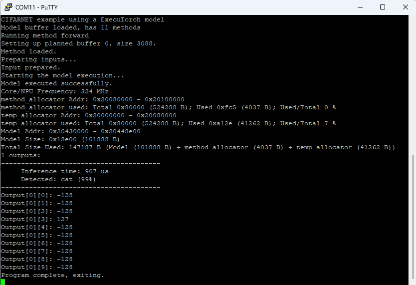

# Using the MCUXpresso Example

This example demonstrates how to build and run the ExecuTorch CifarNet application for the NXP RT700 platform using the MCUXpresso SDK and the GNU Arm Embedded Toolchain. Before building the project, make sure that all required dependencies are installed and that the necessary environment variables are configured correctly.

> **Tip:** The `test_build_from_scratch.sh` script automates all the steps described in this guide, including downloading the ARM GNU toolchain, preparing the model, and downloading the MCUXpresso SDK using the `west` tool. If you prefer a fully automated setup, you can run it directly instead of following the manual steps below.

All scripts described in this guide are located in the following directory of the ExecuTorch repository:

```text
examples/nxp/mcuxpresso/imxrt700/executorch_cifarnet/
```

## 1. Install the Arm GNU Toolchain

First, download the Arm GCC cross-compilation toolchain that is supported by the RT700 platform:

```text
https://developer.arm.com/-/media/Files/downloads/gnu/15.2.rel1/binrel/arm-gnu-toolchain-15.2.rel1-x86_64-arm-none-eabi.tar.xz
```

After extracting the archive, create an environment variable called `ARMGCC_DIR` that points to the root directory of the toolchain installation. The build scripts use this variable to locate the compiler, linker, and other required tools.

Example on Linux:

```bash
export ARMGCC_DIR=/path/to/arm-gnu-toolchain-15.2.rel1-x86_64-arm-none-eabi
```

To verify the installation, you can run:

```bash
$ARMGCC_DIR/bin/arm-none-eabi-gcc --version
```

The command should print the installed compiler version.

## 2. Download the MCUXpresso SDK

Next, download MCUXpresso SDK for the RT700 device family using the west tool:

```bash
pip install west
west init -m https://github.com/nxp-mcuxpresso/mcuxsdk-manifests.git mcuxpresso-sdk
pushd mcuxpresso-sdk
west update_board --set board mimxrt700evk
popd
```

Afterwards, configure the `SdkRootDirPath` environment variable to point to the mcuxsdk directory in the downloaded dir.

Example on Linux:

```bash
export SdkRootDirPath=/path/to/mcuxpresso-sdk/mcuxsdk
```

The build system relies on this variable to locate board support packages, middleware components, startup code, linker scripts, and device-specific libraries.

## 3. Prepare the Model Header File

Before building the application, a compiled model must be provided as a C header file named `model_pte.h` and placed in the current directory. Run the provided helper script to generate it:

```bash
./prepare_model.sh
```

The script performs the following steps:

1. Installs ExecuTorch and its Python dependencies.
2. Installs the `eiq-neutron-sdk` Python package in the version that has been tested with the current ExecuTorch release.
3. Compiles the CifarNet model using the NXP ExecuTorch ahead-of-time (AoT) pipeline and produces a `.pte` model file.
4. Converts the `.pte` file into the `model_pte.h` C header, with the correct memory-section attributes for the RT700 target.

> **Important:** The MCUXpresso SDK package includes a pre-built CifarNet model and a set of Neutron libraries, but this build flow deliberately does **not** use either of them. Instead, `prepare_model.sh` installs the `eiq-neutron-sdk` version that was tested with the current ExecuTorch release, compiles the model from scratch, and the linker later picks up the matching Neutron libraries from that same installation. This keeps the ExecuTorch AoT compiler, the model bytecode, the Neutron driver, the Neutron firmware, and the ExecuTorch runtime all in sync.

Once the script finishes, verify that `model_pte.h` was created in the project directory before proceeding to the build step.

## 4. Build the Application

Once the environment variables have been configured and `model_pte.h` is present in the project directory, set the `NEUTRON_LIB_DIR` variable to the directory that contains the Neutron static libraries shipped with the eiq-neutron-sdk:

```bash
export NEUTRON_LIB_DIR=/path/to/eiq_neutron_sdk/libs
```

The build script expects the following libraries to exist in that directory:

- `libNeutronDriver.a`
- `libNeutronFirmware.a`

Then build the project by executing the provided script:

```bash
./build_example.sh
```

The script validates all required inputs, configures CMake, compiles the source code, links the application, and generates the executable image:

```text
flash_release/executorch_cifarnet.elf
```

If the build completes successfully, the ELF file will be available and ready for programming onto the target board.

## 5. Flash the Application

The generated application can be programmed onto the RT700 device using SEGGER J-Link tools.

### Linux

```bash
echo "loadfile flash_release/executorch_cifarnet.elf" | \
/opt/SEGGER/JLink_V796k/JLinkExe \
    -IF SWD \
    -speed auto \
    -Device MIMXRT798S_M33_0
```

Before flashing, ensure that:

- The board is powered on.
- The JLink debugger probe is flashed on device, if not see [documentation](https://mcuxpresso.nxp.com/mcuxsdk/latest/html/boards/RT/mimxrt700evk/gettingStartedXplorer/topics/program_lpc-link2_with_segger_j-link.html) how to flash it.
- The J-Link debugger is connected to the target.
- The SWD interface is available and correctly wired.
- No other debugging application is currently using the J-Link connection.

The programming process typically takes only a few seconds. Once the image has been loaded successfully, the application can be started directly from flash memory.

## 6. Running the Example

After the firmware is programmed, reset the board and open a serial terminal connected to the device's debug UART interface. The application will initialize the hardware, load the embedded CifarNet model, and begin performing image inference.

During execution, inference results and diagnostic messages are printed to the terminal. The included demonstration image contains a cat, and the model is expected to classify the image accordingly.

A successful run produces output similar to the following:



This example serves as a basic validation that the ExecuTorch runtime, model integration, SDK configuration, and hardware platform are all functioning correctly. It can also be used as a starting point for evaluating custom neural network models and experimenting with on-device machine learning workloads on the RT700 platform.
