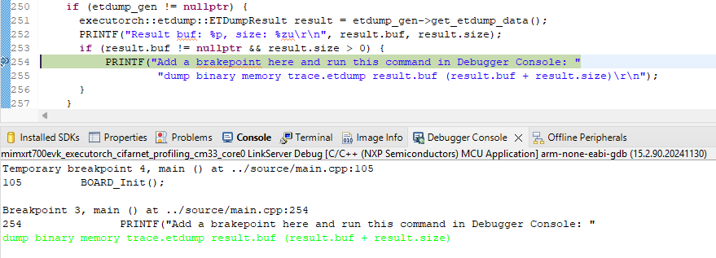

# NXP eIQ Profiling Support


The NXP ExecuTorch delegate is integrated with the
[Developer Tools](https://docs.pytorch.org/executorch/stable/delegate-debugging.html)
to provide visibility into delegated operator execution time.

There are three steps required to obtain profiling results for an NXP‑delegated model:

* Convert the model with profiling support enabled.
* Generate the artifacts consumed by the Developer Tools (`ETRecord`, `ETDump`).
* Create and run the Inspector class to consume these artifacts and print the results.

---

## Convert a model with the profiling support

Profiling data is generated only for a **profilable** model. 
To convert a model with profiling support enabled, the `--use-profiling` flag must be set.

See the `aot_neutron_compile.py` example and its
[README](https://github.com/pytorch/executorch/blob/main/examples/nxp/README.md)
for additional details.

The following command creates a profilable `cifar10_nxp_delegate.pte` model and the corresponding `ETRecord` file, 
compatible with the **i.MX RT700** board using **MCUXpresso SDK 25.06**:

```bash
python -m examples.nxp.aot_neutron_compile --quantize \
    --delegate -m cifar10 \
    --use_profiling
```

For installation details, see {doc}`nxp-overview`.

---

## Generate ETRecord (Optional)

`ETRecord` is an optional artifact that contains model graphs and metadata used to link runtime profiling results 
back to the eager model.

The recommended approach is to enable `ETRecord` generation by passing `generate_etrecord=True` to export API calls.
After export completes, retrieve the `ETRecord` using the `get_etrecord()` method, and save it using the `save()` method:

### Example

```python
from executorch.devtools.etrecord import generate_etrecord

# 1. Open a model and export the model to ATEN
model = model.eval()
exported_program = torch.export.export(model, example_inputs, strict=True)
module = exported_program.module()

# 2. Transform and lower
compile_spec = generate_neutron_compile_spec("imxrt700")
partitioners = (
    [
        NeutronPartitioner(
            compile_spec,
            NeutronTargetSpec(target="imxrt700"),
            post_quantization_state_dict=module.state_dict(),
        )
    ]
)
edge_program_manager = to_edge_transform_and_lower(
    export(module, example_inputs, strict=True),
    transform_passes=NeutronEdgePassManager(),
    generate_etrecord=True,
    partitioner=partitioners,
    compile_config=EdgeCompileConfig(
        _core_aten_ops_exception_list=core_aten_ops_exception_list,
    ),
)

# 3. Export to ExecuTorch program
exec_prog = edge_program_manager.to_executorch(
    config=ExecutorchBackendConfig(extract_delegate_segments=False)
)
# Save ETRecord
exec_prog.get_etrecord().save("etrecord.bin")

```

### Complete Example

A full implementation is available
in [aot_neutron_compile.py](https://github.com/pytorch/executorch/blob/main/examples/nxp/aot_neutron_compile.py).

The `--use_profiling` flag is used to create a **profilable** model and the corresponding `ETRecord` file  
(see [Convert a model with profiling support](#convert-a-model-with-profiling-support) for the full command).


---

## Generate ETDump


The next step is to generate an `ETDump`. An `ETDump` contains runtime data collected during model inference execution.

To generate an `ETDump`, ensure that the ExecuTorch runtime library is integrated with the Developer Tools and built 
with the `ET_EVENT_TRACER_ENABLED` flag enabled.

Only models converted with profiling support will produce an `ETDump` containing execution times for all Neutron 
operators. Otherwise, the dump will include only the final delegate execution time.

Neutron software provides a profiling mechanism that logs individual operator execution times to a dedicated runtime 
output. This data is then used to generate post‑time events after the inference has completed.


### Example

```c
#include <executorch/devtools/etdump/etdump_flatcc.h>
```
```c
// 1. Create ETDumpGen BEFORE inference.
auto etdump_gen_ptr = std::make_unique<executorch::etdump::ETDumpGen>();
executorch::etdump::ETDumpGen* etdump_gen = etdump_gen_ptr.get();

// 2. Load a method from the program by name with ETDump generator for profiling.
Result<Method> method = program->load_method(method_name, &memory_manager, etdump_gen);

// 3. Input tensor setup.
Tensor::SizesType sizes[] = {1, 1, 32, 32};
Tensor::DimOrderType dim_order[] = {0, 2, 3, 1};
TensorImpl impl(ScalarType::Float, 4, sizes, image_data, dim_order);
Tensor tensor(&impl);[nxp-dim-order.md](nxp-dim-order.md)
Error status = method->set_input(tensor, 0);

// 4. Execute.
status = method->execute();
[nxp-dim-order.md](nxp-dim-order.md)
// Get ETDump.
if (etdump_gen != nullptr) {[nxp-dim-order.md](nxp-dim-order.md)
    executorch::etdump::ETDumpResult result = etdump_gen->get_etdump_data();
    if (result.buf != nullptr && result.size > 0) {
        PRINTF("Add a brakepoint here and run this command in Debugger Console: "
    	       "dump binary memory trace.etdump result.buf (result.buf + result.size)\r\n");
    }
}
```


To save an `ETDump` file from the board to a PC, use the **Debug Console** in the MCUXpresso IDE:

- Set a breakpoint at the `PRINTF(...)` line in the example above.
- Enter the following command in the Debug Console and press **Enter**:

  ```
  dump binary memory trace.etdump result.buf (result.buf + result.size)
  ```


<figure style="border:1px solid #ccc; padding:8px; display:inline-block;">
  
  <figcaption>
        <b>Figure 1:</b> Save ETDump in MCUXPresso Project.
  </figcaption>
</figure>


The resulting `ETDump` file is generated in the project folder within the MCUXpresso workspace.

> **Note:**  
> Profilable models print profiling data to the terminal. Generating this dump may take longer than executing the 
> Neutron kernels themselves, but this overhead can be ignored as it affects only models with profiling support 
> enabled. The dump generation time is included in the `ETDump` as the final kernel entry.

---

## Creating an Inspector

The [Inspector](https://docs.pytorch.org/executorch/1.0/model-inspector.html) APIs provide a way to analyze the 
contents of `ETRecord` and `ETDump`, enabling developers to gain insights into model architecture 
and performance statistics.

`ETRecord` is an optional argument used to obtain a mapping between the original model and the converted Neutron model.

An `ETDump` generated on the board contains metadata for each Neutron operator, including its unique identifier.  
To visualize this metadata in the Inspector results table, set the `include_delegate_debug_data = True` argument.

### Example

```python
from executorch.devtools import Inspector

inspector = Inspector(etdump_path="/path/to/etdump.etdp", etrecord="/path/to/etrecord.bin")
inspector.print_data_tabular(include_delegate_debug_data = True)
```

### Complete Example

A full implementation is available
in [analyzing_with_inspector.py](https://github.com/pytorch/executorch/blob/main/examples/nxp/analyzing_with_inspector.py).

---

## Summary

* Build the model with the `--use_profiling` flag enabled.
* Build the ExecuTorch runtime library with the `ET_EVENT_TRACER_ENABLED` flag and the ETDump Developer Tool.
* Use the Debug Console in MCUXpresso to save the `ETDump` file from the board to a PC.
* Visualize the profiling results using the Inspector.
