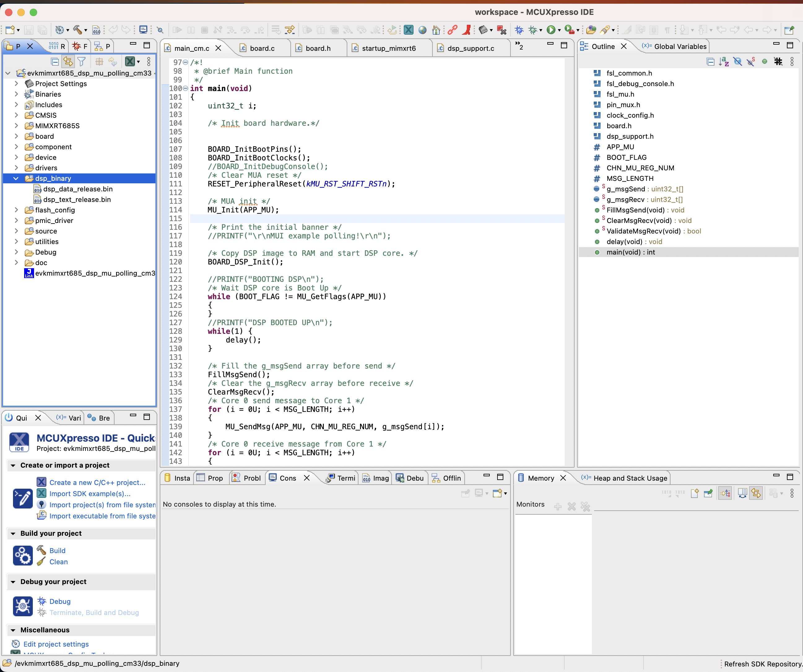

<!---- DO NOT MODIFY Progress Bar Start --->

<div class="progress-bar-wrapper">
   <div class="progress-bar-item">
     <div class="step-number" id="step-1">1</div>
     <span class="step-caption" id="caption-1"></span>
   </div>
   <div class="progress-bar-item">
     <div class="step-number" id="step-2">2</div>
     <span class="step-caption" id="caption-2"></span>
   </div>
   <div class="progress-bar-item">
     <div class="step-number" id="step-3">3</div>
     <span class="step-caption" id="caption-3"></span>
   </div>
   <div class="progress-bar-item">
     <div class="step-number" id="step-4">4</div>
     <span class="step-caption" id="caption-4"></span>
   </div>
   <div class="progress-bar-item">
     <div class="step-number" id="step-5">5</div>
     <span class="step-caption" id="caption-5"></span>
   </div>
   <div class="progress-bar-item">
     <div class="step-number" id="step-6">6</div>
     <span class="step-caption" id="caption-6"></span>
   </div>
</div>

<!---- DO NOT MODIFY Progress Bar End--->

# Building and Running ExecuTorch on Xtensa HiFi4 DSP


In this tutorial we will walk you through the process of getting setup to
build ExecuTorch for an Xtensa Hifi4 DSP and running a simple model on it.

The [Xtensa HiFi4 DSP](https://www.cadence.com/en_US/home/tools/ip/tensilica-ip/hifi-dsps/hifi-4.html) is a DSP built by Cadence that is optimized for running audio based Neural networks such as wake word detection, Automatic speech recognition (ASR) etc. The HiFi NN library offers an optimized set of library functions commonly used in NN processing that we utilize in this example to demonstrate how these operations can be accelerated.

On top of being able to run on the Xtensa HiFi4 DSP another goal of this tutorial is to demonstrate how portable ExecuTorch is and its ability to run on a low-power embedded device such as the Xtensa HiFi4 DSP. This workflow does not require any delegates, it uses custom operators and compiler passes to enhance the model and make it more suitable to running on Xtensa HiFi4 DSPs. Finally, custom kernels optimized with Xtensa intrinsics provide runtime acceleration.

::::{grid} 2
:::{grid-item-card}  What you will learn in this tutorial:
:class-card: card-prerequisites
* In this tutorial you will learn how to export a quantized model with linear and batch norm ops targeted for the Xtensa HiFi4 DSP.
* You will also learn how to compile and deploy the ExecuTorch runtime with the kernels required for running the quantized model generated in the previous step on the Xtensa HiFi4 DSP.
:::
:::{grid-item-card}  Tutorials we recommend you complete before this:
:class-card: card-prerequisites
* [Introduction to ExecuTorch](intro-how-it-works.md)
* [Setting up ExecuTorch](getting-started-setup.md)
* [Building ExecuTorch with CMake](runtime-build-and-cross-compilation.md)
:::
::::

## Prerequisites (Hardware and Software)

In order to be able to succesfully build and run ExecuTorch on a Xtensa HiFi4 DSP you'll need the following hardware and software components.

### Hardware
 - [i.MX RT600 Evaluation Kit](https://www.nxp.com/design/development-boards/i-mx-evaluation-and-development-boards/i-mx-rt600-evaluation-kit:MIMXRT685-EVK)

### Software
 - x86-64 Linux system (For compiling the DSP binaries)
 - [MCUXpresso IDE](https://www.nxp.com/design/software/development-software/mcuxpresso-software-and-tools-/mcuxpresso-integrated-development-environment-ide:MCUXpresso-IDE)
    - This IDE is supported on multiple platforms including MacOS. You can use it on any of the supported platforms as you'll only be using this to flash the board with the DSP images that you'll be building later on in this tutorial.
- [J-Link](https://www.segger.com/downloads/jlink/)
    - Needed to flash the board with the firmaware images. You can install this on the same platform that you installed the MCUXpresso IDE on.
 - [MCUXpresso SDK](https://mcuxpresso.nxp.com/en/select?device=EVK-MIMXRT685)
    - Download this SDK to your Linux machine, extract it and take a note of the path where you store it. You'll need this later.
- [Xtensa compiler](https://tensilicatools.com/platform/i-mx-rt600/)
    - Download this to your Linux machine. This is needed to build ExecuTorch for the HiFi4 DSP.

## Setting up Developer Environment

Step 1. In order to be able to successfully install all the software components specified above users will need to go through the NXP tutorial linked below. Although the tutorial itself walks through a Windows setup, most of the steps translate over to a Linux installation too.

[NXP tutorial on setting up the board and dev environment](https://www.nxp.com/document/guide/getting-started-with-i-mx-rt600-evaluation-kit:GS-MIMXRT685-EVK?section=plug-it-in)

```{note}
Before proceeding forward to the next section users should be able to succesfullly flash the **dsp_mu_polling_cm33** sample application from the tutorial above and notice output on the UART console indicating that the Cortex-M33 and HiFi4 DSP are talking to each other.
```

Step 2. Make sure you have completed the ExecuTorch setup tutorials linked to at the top of this page.

## Working Tree Description

The working tree is:

```bash
examples
|_ xtensa
   |_ aot
   |_ ops
   |_ kernels
```

***AoT (Ahead-of-Time) Components***:

The AoT folder contains all of the python scripts and functions needed to export the model to an executorch `.pte` file. In our case, [export_example.py](https://github.com/pytorch/executorch/blob/main/examples/xtensa/aot/export_example.py) defines a model and some example inputs (set to a vector of ones), and runs it through the quantizer (from [quantizer.py](https://github.com/pytorch/executorch/blob/main/examples/xtensa/aot/quantizer.py)). Then a few compiler passes, also defined in [quantizer.py](https://github.com/pytorch/executorch/blob/main/examples/xtensa/aot/quantizer.py), will replace operators with custom ones that are supported and optimized on the chip. Any operator needed to compute things should be defined in [meta_registrations.py](https://github.com/pytorch/executorch/blob/main/examples/xtensa/aot/meta_registrations.py) and have corresponding implemetations in the other folders.

***Operators***:

The operators folder contains two kinds of operators: existing operators from the [executorch portable library](https://github.com/pytorch/executorch/tree/main/kernels/portable/cpu) and new operators that define custom computations. The former is simply dispatching the operator to the relevant executorch implementation, while the latter acts as an interface, setting up everything needed for the custom kernels to compute the outputs.

***Kernels***:

The kernels folder contains the optimized kernels that will run on the HiFi4 chip. They use Xtensa intrinsics to deliver high performance at low-power.

## Build

In this step, you will generate the ExecuTorch program from different models. You'll then use this Program (the `.pte` file) during the runtime build step to bake this Program into the DSP image.

***Simple Model***:

The first, simple model is meant to test that all components of this tutorial are working properly, and simply does an add operation. The generated file is called `add.pte`.

```bash
cd executorch
python3 -m examples.portable.scripts.export --model_name="add"
```

***Quantized Linear***:

The second, more complex model is a quantized [linear](https://pytorch.org/docs/stable/generated/torch.nn.Linear.html) operation. The model is defined [here](https://github.com/pytorch/executorch/blob/main/examples/xtensa/aot/export_example.py#L88). Linear is the backbone of most Automatic Speech Recognition (ASR) models.

The generated file is called `XtensaDemoModel.pte`.

```bash
cd executorch
python3 -m examples.xtensa.aot.export_example
```

### Runtime

**Building the DSP firmware image**
In this step, you'll be building the DSP firmware image that consists of the sample ExecuTorch runner along with the Program generated from the previous step. This image when loaded onto the DSP will run through the model that this Program consists of.

***Step 1***. Configure the environment variables needed to point to the Xtensa toolchain that you have installed in the previous step. The three environment variables that need to be set include:
```bash
# Directory in which the Xtensa toolchain was installed
export XTENSA_TOOLCHAIN=/home/user_name/xtensa/XtDevTools/install/tools
# The version of the toolchain that was installed. This is essentially the name of the directory
# that is present in the XTENSA_TOOLCHAIN directory from above.
export TOOLCHAIN_VER=RI-2021.8-linux
# The Xtensa core that you're targeting.
export XTENSA_CORE=nxp_rt600_RI2021_8_newlib
```

***Step 2***. Clone the [nnlib repo](https://github.com/foss-xtensa/nnlib-hifi4)

***Step 3***. Run the CMake build.
In order to run the CMake build, you need the path to the following:
- The Program generated in the previous step
- Path to the NXP SDK root. This should have been installed already in the [Setting up Developer Environment](#setting-up-developer-environment) section. This is the directory that contains the folders such as boards, components, devices, and other.

```bash
cd executorch
mkdir cmake-xt
cd cmake-xt
cmake -DCMAKE_BUILD_TYPE=Debug -DCMAKE_TOOLCHAIN_FILE=../examples/xtensa/xtensa.cmake -DMODEL_PATH=<path_to_program_file_generated_in_previous_step> -DNXP_SDK_ROOT_DIR=<path_to_nxp_sdk_root> -DEXECUTORCH_BUILD_FLATC=0 -DFLATC_EXECUTABLE="$(which flatc)" -DEXECUTORCH_BUILD_XTENSA_EXAMPLE=1 -DNN_LIB_BASE_DIR=<path_to_nnlib_cloned_in_step_2>  ..
cd ..
cmake --build cmake-xt -j8 -t xtensa_executorch_example
```

After having succesfully run the above step you should see two binary files in their CMake output directory.
```bash
> ls cmake-xt/*.bin
cmake-xt/dsp_data_release.bin  cmake-xt/dsp_text_release.bin
```

## Deploying and Running on Device

***Step 1***. You now take the DSP binary images generated from the previous step and copy them over into your NXP workspace created in the [Setting up  Developer Environment](#setting-up-developer-environment) section. Copy the DSP images into the `dsp_binary` section highlighted in the image below.

<br>

***Step 2***. Clean your work space

***Step 3***. Click **Debug your Project** which will flash the board with your binaries.

On the UART console connected to your board (at a default baud rate of 115200), you should see an output similar to this:

```bash
> screen /dev/tty.usbmodem0007288234991 115200
Booted up in DSP.
ET: Model buffer loaded, has 1 methods
ET: Running method forward
Method loaded.
Starting the model execution...
Model executed successfully.
```

## Conclusion and Future Work

In this tutorial, you have learned how to export a quantized operation, build the ExecuTorch runtime and run this model on the Xtensa HiFi4 DSP chip.

The model in this tutorial is a typical operation appearing in ASR models, and can be extended to a complete ASR model by creating the model in [export_example.py](https://github.com/pytorch/executorch/blob/main/examples/xtensa/aot/export_example.py) and adding the needed operators/kernels to [operators](https://github.com/pytorch/executorch/blob/main/examples/xtensa/ops) and [kernels](https://github.com/pytorch/executorch/blob/main/examples/xtensa/kernels).

Other models can be created following the same structure, always assuming that operators and kernels are available.
