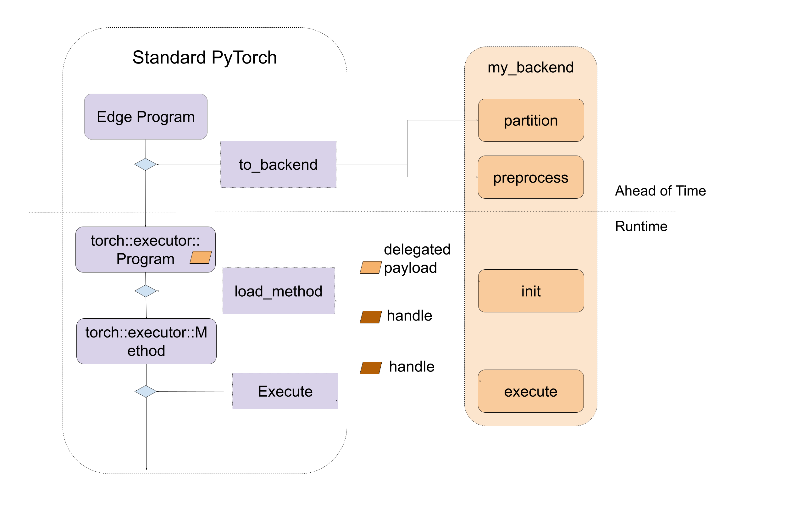
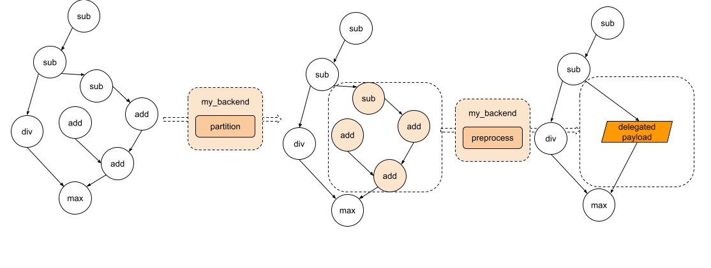
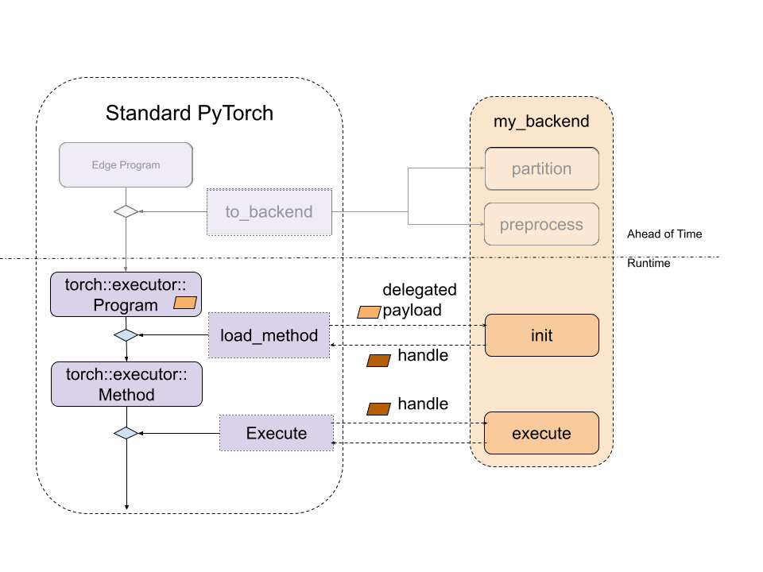

# Backend and Delegate

Audience: Vendors, Backend Delegate developers, who are interested in integrating their own compilers and hardware as part of ExecuTorch

Backend delegation is an entry point for backends to process and execute PyTorch
programs to leverage performance and efficiency benefits of specialized
backends and hardware, while still providing PyTorch users with an experience
close to that of the PyTorch runtime.

## Backend Interfaces: Overview

At a high level, the entry point for backends is defined by 2 components:

- An IR to represent the program: **Edge Dialect** (which is produced through
    the `to_edge` API)
- A couple of interfaces for backends to implement:
    - Ahead-of-Time (AOT)
        - Program preprocessing (e.g. ahead of time compilation, transformation, optimization...).
    - Runtime
        - Program initialization (e.g. runtime compilation).
        - Program execution.
        - (optional) Program destroy (e.g. release backend owned resource).

A delegate backend implementation is composed of:

1) An ahead-of-time preprocessing interface
2) A runtime initialization and execution interface

The diagram looks like following



**Figure 1.** A high level of entry points for backend interfaces, including both ahead-of-time and runtime.

## Backend Interfaces: Ahead-of-Time Preprocessing

There are mainly two Ahead-of-Time entry point for backend to implement: `partition` and `preprocess`.

`partitioner` is an algorithm implemented by the backend to tag the nodes to be lowered to the backend. `to_backend` API will apply the partition algorithm and lower each subgraph, which consists of connected tagged nodes, to the targeted backend. Every subgraph
will be sent to the `preprocess` part provided by the backend to compiled as a binary blob.

During partition, the `exported_program` is not allowed to mutate the program, and it's supposed to apply tag to each node. The
`PartitionResult` includes both tagged exported program and the partition tags dictionary for `to_backend` to look up the tag and
link to the `backend_id` and `compile_spec`

```python
def partition(
    exported_program: ExportedProgram,
) -> PartitionResult:
```

During preprocessing, backends are given an edge dialect program,
a list of compile specs specifying the values needed for compilation, and are
expected to return a compiled blob, or binary containing the desired program to be
run in the backend. During serialization, the
compiled blob will be serialized as part of the `.pte` file, and directly loaded to the device. The
API for this process is:

```python
def preprocess(
    edge_program: ExportedProgram,
    compile_specs: List[CompileSpec],
) -> PreprocessResult:
```

A demo of the preprocess function is implemented
[here](https://github.com/pytorch/executorch/blob/main/exir/backend/test/backend_with_compiler_demo.py).
The demo loops through the nodes in the graph module of the `edge_program` and
serializes the `add`, `mul`, and `sin` instructions into a string, which is later
parsed and executed at runtime.

The diagram looks like following



**Figure 2.** The graph goes through partition and each subgraph will be sent to the preprocess part.

## Backend Interfaces: Runtime Initialization and Execution

During the runtime, the compiled blob from the `preprocess` function will be
loaded and passed directly to the backend's custom `init` function. This
function is responsible for further processing the compiled unit, as well as
perform any backend initialization. The backend's custom `execute` function will
then be called to execute the handle produced by `init`. And finally, if
destroying is required for some backend, backends can implement a `destroy`
function which will be called when the program is out of its lifespan.

```cpp
// Runtime check
ET_NODISCARD bool is_available();

// Runtime initialization
ET_NODISCARD virtual Result<DelegateHandle*> init(
    BackendInitContext& context,
    FreeableBuffer* processed,
    ArrayRef<CompileSpec> compile_specs);

// Runtime execution
ET_NODISCARD virtual Error execute(
    BackendExecutionContext& context,
    DelegateHandle* handle,
    EValue** args);

// [optional] Runtime destroy. Destroy the resource held by the backend
virtual void destroy(ET_UNUSED DelegateHandle* handle);
```

The diagram looks like following



**Figure 3.** The relationship between standard ExecuTorch Runtime and backend entry point.


In order to make backend available to ExecuTorch runtime, it must be registered via the `register_backend` API:
```cpp
ET_NODISCARD Error register_backend(const Backend& backend);
```

Static registeration, i.e., at libraray init or load time, of a backend can be achieved as follows:
```cpp
namespace {
auto cls = BackendWithCompiler();
Backend backend{"BackendWithCompilerDemo", &cls};
static auto success_with_compiler = register_backend(backend);
} // namespace
```


## Developer Tools Integration: Debuggability

Providing consistent debugging experience, be it for runtime failures or performance profiling, is important. ExecuTorch employs native Developer Tools for this purpose, which enables correlating program instructions to original PyTorch code, via debug handles. You can read more about it [here](./etrecord).

Delegated program or subgraphs are opaque to ExecuTorch runtime and appear as a special `call_delegate` instruction, which asks corresponding backend to handle the execution of the subgraph or program. Due to the opaque nature of backend delgates, native Developer Tools does not have visibility into delegated program. Thus the debugging, functional or performance, experiences of delegated execution suffers significantly as compared to it's non-delegated counterpart.

In order to provide consistent debugging experience to users, regardless of the use of delegation for a model, Developer Tools provide an interface to correlate delegated (sub)graph to original (sub)graph. The Developer Tools do so via debug handles map which allows delegates to generate internal handles that can be associated with the original (sub)graph consumed by the delegate. Then at runtime, backend developer can report error or profiling information using the internal handle, which will be mapped to original (sub)graph using the debug handle map. For more information, please refer to [Delegate Debugging](./delegate-debugging).

By leveraging the debug identifier, backend developer can embed the debug as part of the delegated blob


In this way, during execute stage, with the debug identifier, backend developer can associate the failed instruction inside the delegate
back to the exact line of PyThon code.


## Common Questions

**1. How can we get data in backend.preprocess?**

The graph module being preprocessed is a lifted graph, this means that static
data like weights and biases are supplied as inputs to the graph. However, we
can access the weights and biases ahead-of-time through the exported program. To
access these parameters from a given node, we can use the function `get_params`
provided in  `torch/_export/utils.py`

**2. How can we embed the data (like weight/bias) to the backend?**

It's common that backends have some ways to optimize the const data. In this case,
we'd need to tag the placeholder nodes which are also the state in the
partitioner, and during backend.preprocess, we can follow the description in the
first question to get the weight.

**3. How can we run the lowered module in Python with the specific backend?**

We haven't added the support yet but that's the plan!

**4. Should we expect to see `get_attr` nodes in the edge dialect program?**

`get_attr` nodes will only show up for submodules used for control flow or
delegation. It won't hold any data.

**5. Can we delegate to multiple backends?**

Yes! There are two ways to do this:

*Option 1: Run to_backend multiple times for different backends*

If we have two backends, backend_1 and backend_2, and they have their own
parititioners: backend_1_parititioner and backend_2_partitioner, we can run it
like:

```python
# Will first lower nodes to backend_1 depending on the backend_1_parititioner depending on partitioner algorithm
exported_program_backend_1 = to_backend(exported_program, backend_1_parititioner())
# For the rest of nodes, they will be lowered to backend_2 depending on backend_2_parititioner
exported_program_backend_1_and_2 = to_backend(exported_program_backend_1, backend_2_parititioner())
```

A more concrete example be found
[here](https://github.com/pytorch/executorch/blob/main/exir/backend/test/demos/test_xnnpack_qnnpack.py).
In this example,
qnnpack is one backend and xnnpack is another backend. We haven't open-sourced
these two backends delegates yet, and this example won't run out of box. It can
be used as a reference to see how it can be done.

This option is easy to try becuase usually all backends will implement their own
parititioner. However this option may get different results if we change the
order of to_backend call. If we want to have a better control on the nodes, like
which backend they should go, option 2 is better.

*Option 2: Have a partitioner which partitions for different backends*

Another option is to create a customized partitioner, say partitioner
`backend_1_2_partitioner`, and inside the partitioner logic,

```python
class Backend_1_2_Partitioner(Partitioner):
    """
    Partitions all add/mul nodes regardless of order for Backend2
    """

    def __init__(self) -> None:
        self.delegation_spec_1 = DelegationSpec("Backend1", [])
        self.delegation_spec_2 = DelegationSpec("Backend2", [])
        self.partition_tags = {}

    def partition(
        self, exported_program: ExportedProgram
    ) -> ExportedProgram:

        # Tag all nodes in the first partiton to backend 1
        node_to_backend_1 = ... # some logic to select the nodes from the graph
        delegation_tag = f"backend2_tag{partitioner_1.id}"
        node.meta["delegation_tag"] = delegation_tag
        self.partition_tags[delegation_tag] = self.delegation_spec_1

        # Tag all nodes in the first partiton to backend 2
        node_to_backend_2 = ... # some logic to select the nodes from the graph
        delegation_tag = f"backend2_tag{partitioner_2.id}"
        node.meta["delegation_tag"] = delegation_tag
        self.partition_tags[delegation_tag] = self.delegation_spec_2
        return exported_program
```

**6. Is there an easy way to write a partitioner?**

We provide some helper partitioners
[here](./compiler-custom-compiler-passes.md) to make it easy to find
nodes from decomposed operators.

**7. How do we link the node back to the source code?**
We provide an helper function
```python
from executorch.exir.print_program import inspect_node

print(inspect_node(graph, node))
```
And it will highlight the node in the graph as well as point to the source code, example output will be like following:
```
_param_constant1 error_msg:  Here is the node in the graph module:
graph():
    %arg0_1 : [num_users=1] = placeholder[target=arg0_1]
    %_param_constant0 : [num_users=1] = get_attr[target=_param_constant0]
--> %_param_constant1 : [num_users=1] = get_attr[target=_param_constant1]
    %aten_convolution_default : [num_users=2] = call_function[target=executorch.exir.dialects.edge._ops.aten.convolution.default](args = (%arg0_1, %_param_constant0, %_param_constant1, [1, 1], [0, 0], [1, 1], False, [0, 0], 1), kwargs = {})
    %_param_constant2 : [num_users=1] = get_attr[target=_param_constant2]
    %_param_constant3 : [num_users=1] = get_attr[target=_param_constant3]
    %aten_convolution_default_1 : [num_users=1] = call_function[target=executorch.exir.dialects.edge._ops.aten.convolution.default](args = (%aten_convolution_default, %_param_constant2, %_param_constant3, [1, 1], [0, 0], [1, 1], False, [0, 0], 1), kwargs = {})
    %aten_add_tensor : [num_users=1] = call_function[target=executorch.exir.dialects.edge._ops.aten.add.Tensor](args = (%aten_convolution_default, %aten_convolution_default_1), kwargs = {})
    %_param_constant4 : [num_users=1] = get_attr[target=_param_constant4]
    %_param_constant5 : [num_users=1] = get_attr[target=_param_constant5]
    %aten_convolution_default_2 : [num_users=1] = call_function[target=executorch.exir.dialects.edge._ops.aten.convolution.default](args = (%aten_add_tensor, %_param_constant4, %_param_constant5, [1, 1], [0, 0], [1, 1], False, [0, 0], 1), kwargs = {})
    %aten_gelu_default : [num_users=1] = call_function[target=executorch.exir.dialects.edge._ops.aten.gelu.default](args = (%aten_convolution_default_2,), kwargs = {})
    return [aten_gelu_default]
This node _param_constant1 has metadata of:
The node stacktrace:
Traceback (most recent call last):
    File "/tmp/ipykernel_1204253/3382880687.py", line 7, in forward
return self.test_model(x)
    File "/mnt/xarfuse/uid-25337/7b86ad0c-seed-nspid4026532987_cgpid2707357-ns-4026532984/torch/nn/modules/module.py", line 1528, in _call_impl
return forward_call(*args, **kwargs)
    File "/tmp/ipykernel_1204253/712280972.py", line 10, in forward
a = self.conv1(x)
```
