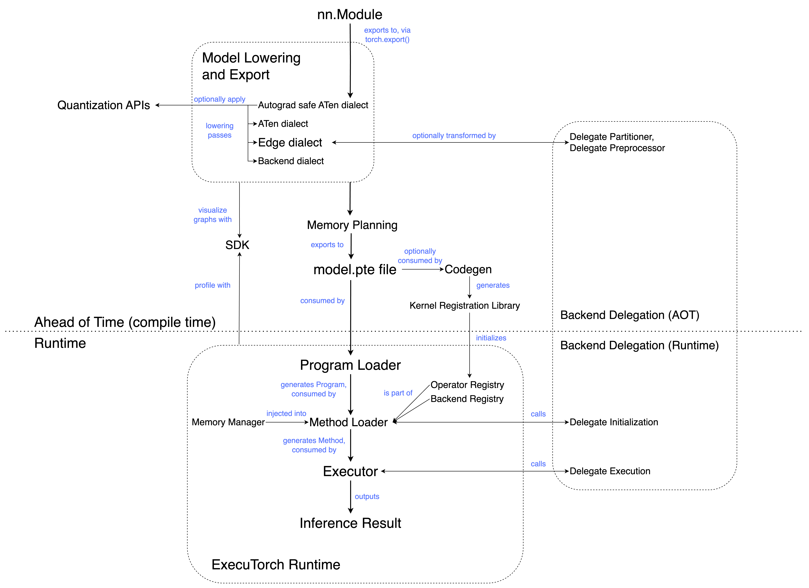

# ExecuTorch Concepts
This page provides an overview of key concepts and terms used throughout the ExecuTorch documentation. It is intended to help readers understand the terminology and concepts used in PyTorch Edge and ExecuTorch.

## Concepts Map

<a href="./_static/img/concepts-map-overview.png" target="_blank">View in full size</a>

<a href="./_static/img/concepts-map-detailed.png" target="_blank">View detailed concept map</a>

## [AOT (Ahead of Time)](./getting-started-architecture.md#program-preparation)

AOT generally refers to the program preparation that occurs before execution. On a high level, ExecuTorch workflow is split into an AOT compilation and a runtime. The AOT steps involve compilation into an Intermediate Representation (IR), along with optional transformations and optimizations.

## [ATen](https://pytorch.org/cppdocs/#aten)

Fundamentally, it is a tensor library on top of which almost all other Python and C++ interfaces in PyTorch are built. It provides a core Tensor class, on which many hundreds of operations are defined.

## [ATen Dialect](./ir-exir.md#aten-dialect)

ATen dialect is the immediate result of exporting an eager module to a graph representation. It is the entry point of the ExecuTorch compilation pipeline; after exporting to ATen dialect, subsequent passes can lower to [Core ATen dialect](./concepts.md#concepts#core-aten-dialect) and [Edge dialect](./concepts.md#edge-dialect).

ATen dialect is a valid [EXIR](./concepts.md#exir) with additional properties. It consists of functional ATen operators, higher order operators (like control flow operators) and registered custom operators.

The goal of ATen dialect is to capture users’ programs as faithfully as possible.

## ATen mode

ATen mode uses the ATen implementation of Tensor (`at::Tensor`) and related types, such as `ScalarType`, from the PyTorch core. This is in contrast to ETensor mode, which uses ExecuTorch’s smaller implementation of tensor (`executorch::runtime::etensor::Tensor`) and related types, such as `executorch::runtime::etensor::ScalarType`.
- ATen kernels that rely on the full `at::Tensor` API are usable in this configuration.
- ATen kernels tend to do dynamic memory allocation and often have extra flexibility (and thus overhead) to handle cases not needed by mobile/embedded clients. e.g.,  CUDA support, sparse tensor support, and dtype promotion.
- Note: ATen mode is currently a WIP.

## Autograd safe ATen Dialect

Autograd safe ATen dialect includes only differentiable ATen operators, along with higher order operators (control flow ops) and registered custom operators.

## Backend

A specific hardware (like GPU, NPU) or a software stack (like XNNPACK) that consumes a graph or part of it, with performance and efficiency benefits.

## [Backend Dialect](./ir-exir.md#backend-dialect)

Backend dialect is the immediate result of exporting Edge dialect to specific backend. It’s target-aware, and may contain operators or submodules that are only meaningful to the target backend. This dialect allows the introduction of target-specific operators that do not conform to the schema defined in the Core ATen Operator Set and are not shown in ATen or Edge Dialect.

## Backend registry

A table mapping backend names to backend interfaces. This allows backends to be called via name during runtime.

## Backend Specific Operator

These are operators that are not part of ATen dialect or Edge dialect. Backend specific operators are only introduced by passes that happen after Edge dialect (see Backend dialect). These operators are specific to the target backend and will generally execute faster.

## [Buck2](https://buck2.build/)

An open-source, large scale build system. Used to build ExecuTorch.

## [CMake](https://cmake.org/)

An open-source, cross-platform family of tools designed to build, test and package software. Used to build ExecuTorch.

## Codegen

At a high level, codegen performs two tasks; generating the [kernel registration](./kernel-library-custom-aten-kernel.md) library, and optionally running [selective build](#selective-build).

The kernel registration library connects operator names (referenced in the model) with the corresponding kernel implementation (from the kernel library).

The selective build API collects operator information from models and/or other sources and only includes the operators required by them. This can reduce the binary size.

The output of codegen is a set of C++ bindings (various `.h`, `.cpp` files) that glue together the kernel library and the ExecuTorch runtime.

## [Core ATen Dialect](https://pytorch.org/docs/stable/torch.compiler_ir.html#irs)

Core ATen dialect contains the core ATen operators along with higher order operators (control flow) and registered custom operators.

## [Core ATen operators / Canonical ATen operator set](./ir-ops-set-definition.md)

A select subset of the PyTorch ATen operator library. Core ATen operators will not be decomposed when exported with the core ATen decomposition table. They serve as a reference for the baseline ATen ops that a backend or compiler should expect from upstream.

## Core ATen Decomposition Table

Decomposing an operator means expressing it as a combination of other operators. During the AOT process, a default list of decompositions is employed, breaking down ATen operators into core ATen operators. This is referred to as the Core ATen Decomposition Table.

## [Custom operator](https://docs.google.com/document/d/1_W62p8WJOQQUzPsJYa7s701JXt0qf2OfLub2sbkHOaU/edit?fbclid=IwAR1qLTrChO4wRokhh_wHgdbX1SZwsU-DUv1XE2xFq0tIKsZSdDLAe6prTxg#heading=h.ahugy69p2jmz)

These are operators that aren't part of the ATen library, but which appear in [eager mode](./concepts.md#eager-mode). Registered custom operators are registered into the current PyTorch eager mode runtime, usually with a `TORCH_LIBRARY` call. They are most likely associated with a specific target model or hardware platform. For example, [torchvision::roi_align](https://pytorch.org/vision/main/generated/torchvision.ops.roi_align.html) is a custom operator widely used by torchvision (doesn't target a specific hardware).

## DataLoader

An interface that enables the ExecuTorch runtime to read from a file or other data source without directly depending on operating system concepts like files or memory allocation.

## [Delegation](./compiler-delegate-and-partitioner.md)

To run parts (or all) of a program on a specific backend (eg. XNNPACK) while the rest of the program (if any) runs on the basic ExecuTorch runtime. Delegation enables us to leverage the performance and efficiency benefits of specialized backends and hardware.

## Dim Order

ExecuTorch introduces `Dim Order` to describe tensor's memory format by returning a permutation of the dimensions, from the outermost to the innermost one.

For example, for a tensor with memory format [N, C, H, W], or [contiguous](https://pytorch.org/blog/tensor-memory-format-matters/) memory format, [0, 1, 2, 3] will be its dim order.

Also, for a tensor with memory format [N, H, W, C], or [channels_last memory format](https://pytorch.org/tutorials/intermediate/memory_format_tutorial.html), we return [0, 2, 3, 1] for its dim order.

Currently ExecuTorch only supports dim order representation for [contiguous](https://pytorch.org/blog/tensor-memory-format-matters/) and [channels_last](https://pytorch.org/tutorials/intermediate/memory_format_tutorial.html) memory format.

## DSP (Digital Signal Processor)

Specialized microprocessor chip with architecture optimized for digital signal processing.

## dtype

Data type, the type of data (eg. float, integer, etc.) in a tensor.

## [Dynamic Quantization](https://pytorch.org/docs/main/quantization.html#general-quantization-flow)

A method of quantizing wherein tensors are quantized on the fly during inference. This is in contrast to [static quantization](./concepts.md#static-quantization), where tensors are quantized before inference.

## Dynamic shapes

Refers to the ability of a model to accept inputs with varying shapes during inference. For example, the ATen op [unique_consecutive](https://pytorch.org/docs/stable/generated/torch.unique_consecutive.html) and the custom op [MaskRCNN](https://pytorch.org/vision/main/models/mask_rcnn.html) have data dependent output shapes. Such operators are difficult to do memory planning on, as each invocation may produce a different output shape even for the same input shape. To support dynamic shapes in ExecuTorch, kernels can allocate tensor data using the `MemoryAllocator` provided by the client.

## Eager mode

Python execution environment where operators in a model are immediately executed as they are encountered. e.g. Jupyter / Colab notebooks are run in eager mode. This is in contrast to graph mode, where operators are first synthesized into a graph which is then compiled and executed.

## [Edge Dialect](./ir-exir.md#edge-dialect)

A dialect of EXIR with the following properties:
- All operators are from a predefined operator set, called 'Edge Operators' or are registered custom operators.
- Input and output of the graph, and of each node, must be Tensor. All Scalar types are converted to Tensor.

Edge dialect introduces specializations that are useful for Edge devices, but not necessarily for general (server) export. However, Edge dialect does not contain specializations for specific hardware besides those already present in the original Python program.

## Edge operator

An ATen operator with a dtype specialization.

## [ExecuTorch](https://github.com/pytorch/executorch)

A unified ML software stack within the PyTorch Edge platform designed for efficient on-device inference. ExecuTorch defines a workflow to prepare (export and transform) and execute a PyTorch program on Edge devices such as mobile, wearables, and embedded devices.

## ExecuTorch Method

The executable equivalent of an `nn.Module` Python method. For example, the `forward()` Python method would compile into an ExecuTorch `Method`.

## ExecuTorch Program

An ExecuTorch `Program` maps string names like `forward` to specific ExecuTorch `Method` entries.

## executor_runner

A sample wrapper around the ExecuTorch runtime which includes all the operators and backends.

## [EXIR](./ir-exir.md)

The **EX**port **I**ntermediate **R**epresentation (IR) from `torch.export`. Contains the computational graph of the model. All EXIR graphs are valid [FX graphs](https://pytorch.org/docs/stable/fx.html#torch.fx.Graph).

## `ExportedProgram`

The output of `torch.export` that bundles the computational graph of a PyTorch model (usually an `nn.Module`) with the parameters or weights that the model consumes.

## [flatbuffer](https://github.com/google/flatbuffers)

Memory efficient, cross platform serialization library. In the context of ExecuTorch, eager mode Pytorch models are exported to flatbuffer, which is the format consumed by the ExecuTorch runtime.

## Framework tax

The cost of various loading and initialization tasks (not inference). For example; loading a program, initializing executor, kernel and backend-delegate dispatch, and runtime memory utilization.

## Functional ATen operators

ATen operators that do not have any side effects.

## [Graph](./ir-exir.md)

An EXIR Graph is a PyTorch program represented in the form of a DAG (directed acyclic graph). Each node in the graph represents a particular computation or operation, and edges of this graph consist of references between nodes. Note: all EXIR graphs are valid [FX graphs](https://pytorch.org/docs/stable/fx.html#torch.fx.Graph).

## Graph mode

In graph mode, operators are first synthesized into a graph, which will then be compiled and executed as a whole. This is in contrast to eager mode, where operators are executed as they are encountered. Graph mode typically delivers higher performance as it allows optimizations such as operator fusion.

## Higher Order Operators

A higher order operator (HOP) is an operator that:
- either accepts a Python function as input, returns a Python function as output, or both.
- like all PyTorch operators, higher-order operators also have an optional implementation for backends and functionalities. This lets us e.g. register an autograd formula for the higher-order operator or define how the higher-order operator behaves under ProxyTensor tracing.

## Hybrid Quantization

A quantization technique where different parts of the model are quantized with different techniques based on computational complexity and sensitivity to accuracy loss. Some parts of the model may not be quantized to retain accuracy.

## Intermediate Representation (IR)

A representation of a program between the source and target languages. Generally, it is a data structure used internally by a compiler or virtual machine to represent source code.

## Kernel

An implementation of an operator. There can be multiple implementations of an operator for different backends/inputs/etc.

## Kernel registry / Operator registry

A table with mappings between kernel names and their implementations. This allows the ExecuTorch runtime to resolve references to kernels during execution.

## Lowering

The process of transforming a model to run on various backends. It is called 'lowering' as it is moving code closer to the hardware. In ExecuTorch, lowering is performed as part of backend delegation.

## [Memory planning](./compiler-memory-planning.md)

The process of allocating and managing memory for a model. In ExecuTorch, a memory planning pass is run before the graph is saved to flatbuffer. This assigns a memory ID to each tensor and an offset in the buffer, marking where storage for the tensor starts.

## [Node](./ir-exir.md)

A node in an EXIR graph represents a particular computation or operation, and is represented in Python using [torch.fx.Node](https://pytorch.org/docs/stable/fx.html#torch.fx.Node) class.

## Operator

Function on tensors. This is the abstraction; kernels are the implementation. There can be varying implementations for different backends/inputs/etc.

## Operator fusion

Operator fusion is the process of combining multiple operators into a single compound operator, resulting in faster computation due to fewer kernel launches and fewer memory read/writes. This is a performance advantage of graph mode vs eager mode.

## Out variant

Instead of allocating returned tensors in kernel implementations, an operator's out variant will take in a pre-allocated tensor to its out kwarg, and store the result there.

This makes it easier for memory planners to perform tensor lifetime analysis. In ExecuTorch, an out variant pass is performed before memory planning.

## [PAL (Platform Abstraction Layer)](./runtime-platform-abstraction-layer.md)

Provides a way for execution environments to override operations such as;
- Getting the current time.
- Printing a log statement.
- Panicking the process/system.
The default PAL implementation can be overridden if it doesn’t work for a particular client system.

## Partial kernels

Kernels that support a subset of tensor dtypes and/or dim orders.

## [Partitioner](./compiler-custom-compiler-passes#Partitioner)

Parts of a model may be delegated to run on an optimized backend. The partitioner splits the graph into the appropriate sub-networks and tags them for delegation.

## ETensor mode

ETensor mode uses ExecuTorch’s smaller implementation of tensor (`executorch::runtime::etensor::Tensor`) along with related types (`executorch::runtime::etensor::ScalarType`, etc.). This is in contrast to ATen mode, which uses the ATen implementation of Tensor (`at::Tensor`) and related types (`ScalarType`, etc.)
- `executorch::runtime::etensor::Tensor`, also known as ETensor, is a source-compatible subset of `at::Tensor`. Code written against ETensor can build against `at::Tensor`.
- ETensor does not own or allocate memory on its own. To support dynamic shapes, kernels can allocate Tensor data using the MemoryAllocator provided by the client.

## Portable kernels

Portable kernels are operator implementations that are written to be compatible with ETensor. As ETensor is compatible with `at::Tensor`, portable kernels can be built against `at::Tensor` and used in the same model as ATen kernels. Portable kernels are:
- Compatible with ATen operator signatures
- Written in portable C++ so they can build for any target
- Written as reference implementations, prioritizing clarity and simplicity over optimization
- Generally smaller in size than ATen kernels
- Written to avoid dynamically allocating memory using new/malloc.

## Program

The set of codes and data to describe an ML model.

## Program source code

The Python source code to describe the program. It can be a Python function, or a method in PyTorch’s eager mode `nn.Module`.

## [PTQ (Post Training Quantization)](https://pytorch.org/tutorials/prototype/pt2e_quant_ptq.html)

A quantization technique where the model is quantized after it has been trained (usually for performance benefits). PTQ applies the quantization flow after training, in contrast to QAT which applies it during training.

## [QAT (Quantization Aware Training)](https://pytorch.org/tutorials/prototype/pt2e_quant_qat.html)

Models may lose accuracy after quantization. QAT enables higher accuracy compared to eg. PTQ, by modeling the effects of quantization while training. During training, all weights and activations are ‘fake quantized’; float values are rounded to mimic int8 values, but all computations are still done with floating point numbers. Thus, all weight adjustments during training are made ‘aware’ that the model will ultimately be quantized. QAT applies the quantization flow during training, in contrast to PTQ which applies it afterwards.

## [Quantization](./quantization-overview.md)

Techniques for performing computations and memory accesses on tensors with lower precision data, usually `int8`. Quantization improves model performance by lowering the memory usage and (usually) decreasing computational latency; depending on the hardware, computation done in lower precision will typically be faster, e.g. `int8` matmul vs `fp32` matmul. Often, quantization comes at the cost of model accuracy.

## [Runtime](./runtime-overview.md)

The ExecuTorch runtime executes models on edge devices. It is responsible for program initialization, program execution and, optionally, destruction (releasing backend owned resources).

## [Developer Tools](./devtools-overview.md)

A collection of tools users need to profile, debug and visualize programs that are running with ExecuTorch.

## [Selective build](./kernel-library-selective-build.md)

An API used to build a leaner runtime by linking only to kernels used by the program. This provides significant binary size savings.

## [Static Quantization](https://pytorch.org/docs/main/quantization.html#general-quantization-flow)

A method of quantizing wherein tensors are statically quantized. That is, floats are converted to a reduced-precision data type before inference.

## [XNNPACK](https://github.com/google/XNNPACK)

An optimized library of neural network interface operators for ARM, x86, WebAssembly, and RISC-V platforms. It is an open-source project and used by PyTorch and ExecuTorch. It is a successor to the QNNPack library. The operators support both floating point and quantized values.
