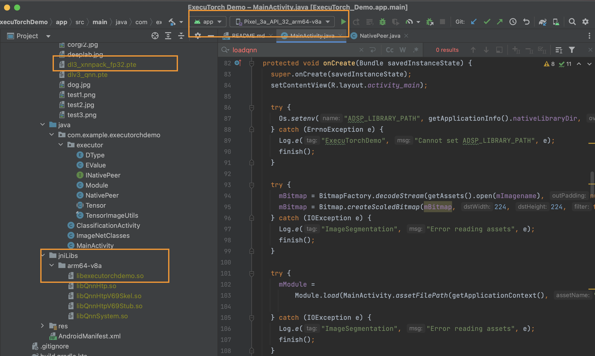

# Building an ExecuTorch Android Demo App

This is forked from [PyTorch android demo app](https://github.com/pytorch/android-demo-app).

This guide explains how to setup ExecuTorch for Android using a demo app. The app employs a DeepLab v3 model for image segmentation tasks. Models are exported to ExecuTorch using XNNPACK FP32 backend.

::::{grid} 2
:::{grid-item-card}  What you will learn
:class-card: card-prerequisites
* How to set up a build target for Android arm64-v8a
* How to build the required ExecuTorch runtime with JNI wrapper for Android
* How to build the app with required JNI library and model file
:::
:::{grid-item-card} Prerequisites
:class-card: card-prerequisites
* Refer to [Setting up ExecuTorch](getting-started-setup.md) to set up the repo and dev environment.
* Download and install [Android Studio and SDK](https://developer.android.com/studio).
* *Optional:* To use Qualcomm HTP Backend, download and install [Qualcomm Neural Processing SDK](https://developer.qualcomm.com/software/qualcomm-neural-processing-sdk)
* Supported Host OS: CentOS, macOS Ventura (M1/x86_64). To use Qualcomm QNN SDK, Linux is required.
:::
::::

## ExecuTorch Configuration

Configure the libraries for Android:

1. Configure a library with XNNPACK backend only

```{note}
This demo app and tutorial has only been validated with arm64-v8a [ABI](https://developer.android.com/ndk/guides/abis).
```

```bash
export ANDROID_NDK=<path-to-android-ndk>

rm -rf cmake-out && mkdir cmake-out && cd cmake-out
cmake .. \
    -DCMAKE_TOOLCHAIN_FILE=$ANDROID_NDK/build/cmake/android.toolchain.cmake \
    -DANDROID_ABI=arm64-v8a \
    -DBUCK2=/tmp/buck2 \
    -DEXECUTORCH_BUILD_ANDROID_DEMO_APP_JNI=ON \
    -DEXECUTORCH_BUILD_XNNPACK=ON \
    -DEXECUTORCH_BUILD_FLATC=OFF \
    -DEXECUTORCH_BUILD_EXTENSION_DATA_LOADER=ON
```

When we set `EXECUTORCH_BUILD_XNNPACK=ON`, we will build the target [`xnn_executor_runner_lib`](https://github.com/pytorch/executorch/blob/main/backends/xnnpack/CMakeLists.txt) which in turn is linked into libexecutorchdemo via [CMake](https://github.com/pytorch/executorch/blob/main/examples/demo-apps/android/jni/CMakeLists.txt).

`libexecutorchdemo.so` wraps up the required XNNPACK Backend runtime library from `xnn_executor_runner_lib`, and adds an additional JNI layer using fbjni. This is later exposed to Java app.

2. *Optional:* Configure a library with XNNPACK and [Qualcomm HTP backend](https://github.com/pytorch/executorch/blob/main/backends/qualcomm/README.md)

```{note}
Qualcomm SDK is required for this step.
```

```bash
export ANDROID_NDK=<path-to-android-ndk>
export QNN_SDK=<path-to-qnn-sdk>

rm -rf cmake-out && mkdir cmake-out && cd cmake-out
cmake .. \
    -DCMAKE_TOOLCHAIN_FILE=$ANDROID_NDK/build/cmake/android.toolchain.cmake \
    -DANDROID_ABI=arm64-v8a \
    -DBUCK2=/tmp/buck2 \
    -DEXECUTORCH_BUILD_ANDROID_DEMO_APP_JNI=ON \
    -DEXECUTORCH_BUILD_XNNPACK=ON \
    -DEXECUTORCH_BUILD_FLATC=OFF \
    -DEXECUTORCH_BUILD_QNN=ON \
    -DQNN_SDK_ROOT=$QNN_SDK \
    -DEXECUTORCH_BUILD_EXTENSION_DATA_LOADER=ON
```

Similar to the previous XNNPACK library, with this setup, we compile `libexecutorchdemo.so` but it adds an additional static library `qnn_executorch_backend` which wraps up Qualcomm HTP runtime library and registers the Qualcomm HTP backend. This is later exposed to Java app.

`qnn_executorch_backend` is built when we turn on CMake option `EXECUTORCH_BUILD_QNN`. It will include the [CMakeLists.txt](https://github.com/pytorch/executorch/blob/main/backends/qualcomm/CMakeLists.txt) from backends/qualcomm where we `add_library(qnn_executorch_backend STATIC)`.

## Building and Copying Libraries

1. Build the libraries:

```bash
cmake --build . -j16
```

2. Copy the libraries to the appropriate location to link against them:

Navigate to the build artifacts directory:

```bash
mkdir -p ../examples/demo-apps/android/ExecuTorchDemo/app/src/main/jniLibs/arm64-v8a
```

Copy the core libraries:

```bash
cp ./examples/demo-apps/android/jni/libexecutorchdemo.so \
   ../examples/demo-apps/android/ExecuTorchDemo/app/src/main/jniLibs/arm64-v8a
```

Later, this shared library will be loaded by `NativePeer.java` in Java code.

3. *Qualcomm HTP Only:* Copy Qualcomm HTP runtime library:

```bash
cp libQnnHtp.so libQnnHtpV69Skel.so libQnnHtpStub.so libQnnSystem.so \
   ../examples/demo-apps/android/ExecuTorchDemo/app/src/main/jniLibs/arm64-v8a
```

4. Return to the `executorch` directory:

```bash
cd ..
```

## Model Download and Bundling

```{note}
Please refer to [XNNPACK backend](https://github.com/pytorch/executorch/blob/main/backends/xnnpack/README.md) and [Qualcomm backend](https://github.com/pytorch/executorch/blob/main/backends/qualcomm/README.md) for the full export tutorial on backends.
```

1. Export a DeepLab v3 model backed with XNNPACK delegate and bundle it with the app:

```bash
export FLATC_EXECUTABLE=$(realpath third-party/flatbuffers/cmake-out/flatc)
python3 -m examples.xnnpack.aot_compiler --model_name="dl3" --delegate
mkdir -p examples/demo-apps/android/ExecuTorchDemo/app/src/main/assets/
cp dl3_xnnpack_fp32.pte examples/demo-apps/android/ExecuTorchDemo/app/src/main/assets/
```

2. *Qualcomm HTP Only:* Copy HTP delegation models to the app:

```bash
cp dlv3_qnn.pte examples/demo-apps/android/ExecuTorchDemo/app/src/main/assets/
```

## Build the Project

1. Open the project `examples/demo-apps/android/ExecuTorchDemo` with Android Studio.

2. [Run](https://developer.android.com/studio/run) the app (^R).

<br>
