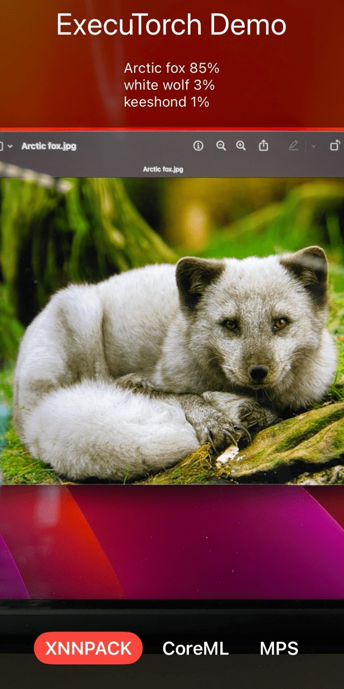

# Building an ExecuTorch iOS Demo App

Welcome to the tutorial on setting up the ExecuTorch iOS Demo App!

This app uses the
[MobileNet v3](https://pytorch.org/vision/main/models/mobilenetv3.html) model to
process live camera images leveraging three different backends:
[XNNPACK](https://github.com/google/XNNPACK),
[Core ML](https://developer.apple.com/documentation/coreml) and
[Metal Performance Shaders (MPS)](https://developer.apple.com/documentation/metalperformanceshaders)
(Xcode 15+ and iOS 17+ only).

<p align="center">
  
</p>

## Prerequisites

Before we start, make sure you have the following tools installed:

### 1. Xcode 15 and Command Line Tools

Install Xcode 15 from the
[Mac App Store](https://apps.apple.com/app/xcode/id497799835) and then install
the Command Line Tools using the terminal:

```bash
xcode-select --install
```

### 2. Python 3.10+

Python 3.10 or above, along with `pip`, should be pre-installed on MacOS 13.5+.
If needed, [download Python](https://www.python.org/downloads/macos/) and
install it. Verify the Python and pip versions using these commands:

```bash
which python3 pip
python3 --version
pip --version
```

### 3. Set Up ExecuTorch

Clone ExecuTorch and set up the environment as explained in the [Building from Source](using-executorch-building-from-source.md) tutorial:

```bash
git clone -b viable/strict https://github.com/pytorch/executorch.git && cd executorch

python3 -m venv .venv && source .venv/bin/activate && pip install --upgrade pip

./install_executorch.sh
```

### 4. Backend Dependencies

Install additional dependencies for [Core ML](backends-coreml.md) and [MPS](backends-mps.md) backends:

```bash
./backends/apple/coreml/scripts/install_requirements.sh
./backends/apple/mps/install_requirements.sh
```

### 5. Clone the Demo App

```bash
git clone --depth 1 https://github.com/pytorch-labs/executorch-examples.git
```

## Models and Labels

Now, let's move on to exporting and bundling the MobileNet v3 model.

### 1. Export Model

Export the MobileNet v3 model with Core ML, MPS and XNNPACK backends, and move
the exported model to a specific location where the Demo App will pick them up:

```bash
MODEL_NAME="mv3"

python3 -m examples.portable.scripts.export --model_name="$MODEL_NAME"
python3 -m examples.apple.coreml.scripts.export --model_name="$MODEL_NAME"
python3 -m examples.apple.mps.scripts.mps_example --model_name="$MODEL_NAME"
python3 -m examples.xnnpack.aot_compiler --model_name="$MODEL_NAME" --delegate

APP_PATH="executorch-examples/apple/ExecuTorchDemo/ExecuTorchDemo"

mkdir -p "$APP_PATH/Resources/Models/MobileNet/"
mv $MODEL_NAME*.pte "$APP_PATH/Resources/Models/MobileNet/"
```

### 2. Download Labels

Download the MobileNet model labels required for image classification:

```bash
curl https://raw.githubusercontent.com/pytorch/hub/master/imagenet_classes.txt \
  -o "$APP_PATH/Resources/Models/MobileNet/imagenet_classes.txt"
```

## Build and Run the App

We're almost done! Now, we just need to open the project in Xcode, run the tests, and finally run the app.

### 1. Open Project in Xcode

Double-click on the project file under `executorch-examples/apple/ExecuTorchDemo` or run the command:

```bash
open $APP_PATH.xcodeproj
```

### 2. Run Tests

You can run tests on Simulaltor directly in Xcode with `Cmd + U` or use the command line:

```bash
xcrun simctl create executorch "iPhone 15"
xcodebuild clean test \
     -project $APP_PATH.xcodeproj \
     -scheme App \
     -destination name=executorch
xcrun simctl delete executorch
```

### 3. Run App

Finally, connect the device, set up Code Signing in Xcode, and then run the app
using `Cmd + R`. Try installing a Release build for better performance.

Congratulations! You've successfully set up the ExecuTorch iOS Demo App. Now,
you can explore and enjoy the power of ExecuTorch on your iOS device!

Learn more about [Using ExecuTorch on iOS](using-executorch-ios.md).
