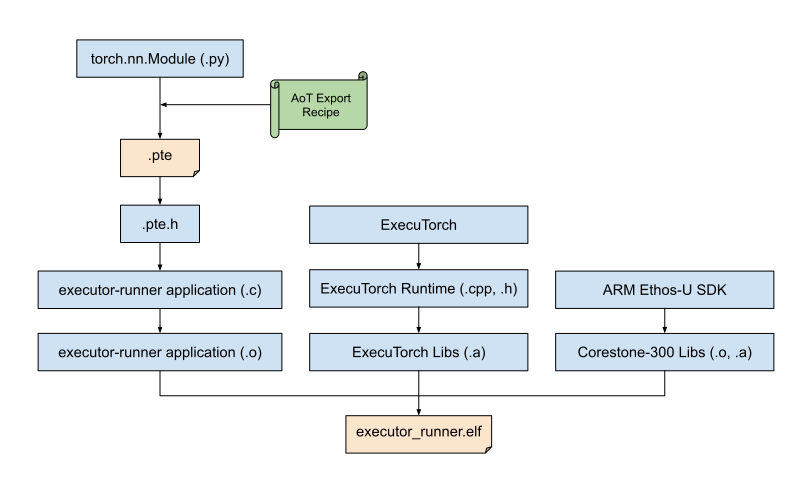

<!---- Name is a WIP - this reflects better what it can do today ----->
# Building and Running ExecuTorch with ARM Ethos-U Backend

<!----This will show a grid card on the page----->
::::{grid} 2

:::{grid-item-card}  Tutorials we recommend you complete before this:
:class-card: card-prerequisites
* [Introduction to ExecuTorch](./intro-how-it-works.md)
* [Setting up ExecuTorch](./getting-started-setup.md)
* [Building ExecuTorch with CMake](./runtime-build-and-cross-compilation.md)
:::

:::{grid-item-card}  What you will learn in this tutorial:
:class-card: card-prerequisites
In this tutorial you will learn how to export a simple PyTorch model for ExecuTorch Arm Ethos-u backend delegate and run it on a Corstone-300 FVP Simulator.
:::

::::

```{warning}
This ExecuTorch backend delegate is under active development. You may encounter some rough edges and features which may be documented or planned but not implemented.
```

```{tip}
If you are already familiar with this delegate, you may want to jump directly to the examples source dir - [https://github.com/pytorch/executorch/tree/main/examples/arm](https://github.com/pytorch/executorch/tree/main/examples/arm)
```

## Prerequisites

Let's make sure you have everything you need before we get started.

### Hardware

To successfully complete this tutorial, you will need a Linux-based host machine with Arm aarch64 or x86_64 processor architecture.

The target device will be an embedded platform with an Arm Cortex-M55 CPU and Ethos-U55 NPU (ML processor). This tutorial will show you how to run PyTorch models on both.

We will be using a [Fixed Virtual Platform (FVP)](https://www.arm.com/products/development-tools/simulation/fixed-virtual-platforms), simulating a [Corstone-300](https://developer.arm.com/Processors/Corstone-300)(cs300) system. Since we will be using the FVP (think of it as virtual hardware), we won't be requiring any real embedded hardware for this tutorial.

### Software

First, you will need to install ExecuTorch. Please follow the recommended tutorials if you haven't already, to set up a working ExecuTorch development environment.

To generate software which can be run on an embedded platform (real or virtual), we will need a tool chain for cross-compilation and an Arm Ethos-U software development kit, including the Vela compiler for Ethos-U NPUs.

In the following sections we will walk through the steps to download each of the dependencies listed above.

## Set Up the Developer Environment

In this section, we will do a one-time setup, like downloading and installing necessary software, for the platform support files needed to run ExecuTorch programs in this tutorial.

For that we will use the `examples/arm/setup.sh` script to pull each item in an automated fashion. It is recommended to run the script in a conda environment. Upon successful execution, you can directly go to [the next step](#convert-the-pytorch-model-to-the-pte-file).

As mentioned before, we currently support only Linux based platforms with x86_64 or aarch64 processor architecture. Let’s make sure we are indeed on a supported platform.

```bash
uname -s
# Linux

uname -m
# x86_64 or aarch64
```

Next we will walk through the steps performed by the `setup.sh` script to better understand the development setup.

### Download and Set Up the Corstone-300 FVP

Fixed Virtual Platforms (FVPs) are pre-configured, functionally accurate simulations of popular system configurations. Here in this tutorial, we are interested in the Corstone-300 system. We can download this from the Arm website.

```{note}
 By downloading and running the FVP software, you will be agreeing to the FVP [End-user license agreement (EULA)](https://developer.arm.com/downloads/-/arm-ecosystem-fvps/eula).
```

To download, we can either download `Corstone-300 Ecosystem FVP` from [here](https://developer.arm.com/downloads/-/arm-ecosystem-fvps). or `setup.sh` script will does that for you under `setup_fvp` function.

### Download and Install the Arm GNU AArch32 Bare-Metal Toolchain

Similar to the FVP, we would also need a tool-chain to cross-compile ExecuTorch runtime, executor-runner bare-metal application, as well as the rest of the bare-metal stack for Cortex-M55 CPU available on the Corstone-300 platform.

These toolchains are available [here](https://developer.arm.com/downloads/-/arm-gnu-toolchain-downloads). We will be using GCC 12.3 targeting `arm-none-eabi` here for our tutorial. Just like FVP, `setup.sh` script will down the toolchain for you. See `setup_toolchain` function.

### Setup the Arm Ethos-U Software Development

This git repository is the root directory for all Arm Ethos-U software. It is to help us download required repositories and place them in a tree structure. See `setup_ethos_u` function of the setup script for more details.

Once this is done, you should have a working FVP simulator, a functioning toolchain for cross compilation, and the Ethos-U software development setup ready for the bare-metal developement.

### Install the Vela Compiler
Once this is done, the script will finish the setup by installing the Vela compiler for you, details are in `setup_vela` function.

### Install the TOSA reference model
This is the last step of the setup process, using `setup_tosa_reference_model` function `setup.sh` script will install TOSA reference model for you.

At the end of the setup, if everything goes well, your top level devlopement dir might look something like this,

```bash
.
├── arm-gnu-toolchain-12.3.rel1-x86_64-arm-none-eabi # for x86-64 hosts
├── ethos-u
│   ├── core_platform
│   ├── core_software
│   ├── fetch_externals.py
│   └── [...]
├── ethos-u-vela
├── FVP
│   ├── FVP_Corstone_SSE-300.sh
│   └── [...]
├── FVP_cs300.tgz
├── gcc.tar.xz
└── reference_model
```

## Convert the PyTorch Model to the `.pte` File

`.pte` is a binary file produced by ExecuTorch Ahead-of-Time (AoT) pipeline by taking in a PyTorch Model (a torch.nn.Module), exporting it, running a variety of passes, and finally serializing it to a `.pte` file format. This binary file is typically consumed by the ExecuTorch Runtime. This [document](https://github.com/pytorch/executorch/blob/main/docs/source/getting-started-architecture.md) goes in much more depth about the ExecuTorch software stack for both AoT as well as Runtime.

In this section, we will primarily focus on the AoT flow with the end goal of producing a `.pte` file. There are a set of export configurations to target different backends at runtime. For each, the AoT flow will produce a unique `.pte` file. We will explore a couple of different configurations producing different `.pte` files, particularly interesting for our Corstone-300 system and available processing elements.

Before we get started, let's first talk about the PyTorch modules we will be using.

### PyTorch Example Modules
We will use a couple of simple PyTorch Modules to explore the end-to-end flow. These modules will be used in various different ways throughout the tutorial, referring to them by their `<class_name>`.

#### SoftmaxModule
This is a very simple PyTorch module with just one [Softmax](https://pytorch.org/docs/stable/generated/torch.nn.Softmax.html#torch.nn.Softmax) operator.

```python
import torch

class SoftmaxModule(torch.nn.Module):
    def __init__(self):
        super().__init__()
        self.softmax = torch.nn.Softmax()

    def forward(self, x):
        z = self.softmax(x)
        return z
```

Running it using the Python environment (on the same development Linux machine), we get the expected output.

```python
>>> m = SoftmaxModule()
>>> m(torch.ones(2,2))
tensor([[0.5000, 0.5000],
        [0.5000, 0.5000]])
```

#### AddModule
Let's write another simple PyTorch module with just one [Add](https://pytorch.org/docs/stable/generated/torch.add.html#torch.add) operator.

```python
class AddModule(torch.nn.Module):
    def __init__(self):
        super().__init__()

    def forward(self, x):
        return x + x
```

Running it using the Python environment (on the same development Linux machine), and as expected 1 + 1 indeed produces 2.

```python
>>> m = AddModule()
>>> m(torch.ones(5, dtype=torch.int32)) # integer types for non-quantized Ethos-U delegation
tensor([2, 2, 2, 2, 2], dtype=torch.int32)
```
Keep the inputs and outputs to these modules in mind. When we will lower and run this through alternate means as opposed to running on this Linux machine, we will use the same inputs, and expect the outputs to match with the one shown here.

```{tip}
We need to be aware of data types for running networks on the Ethos-U55 as it is an integer only processor. For this example we use integer types explicitly, for typical use of such a flow networks are built and trained in floating point, and then are quantized from floating point to integer for efficient inference.
```

#### MobileNetV2 Module
[MobileNetV2](https://arxiv.org/abs/1801.04381) is a commonly in-production used network for edge and mobile devices.
It's also available as a default model in [torchvision](https://github.com/pytorch/vision), so we can load it with the sample code below.
```
from torchvision.models import mobilenet_v2  # @manual
from torchvision.models.mobilenetv2 import MobileNet_V2_Weights

mv2 = mobilenet_v2(weights=MobileNet_V2_Weights.DEFAULT)
```
For more details, you can refer to the code snippet [here](https://github.com/pytorch/executorch/blob/2354945d47f67f60d9a118ea1a08eef8ba2364b5/examples/models/mobilenet_v2/model.py#L18).

### Non-delegated Workflow

In the ExecuTorch AoT pipeline, one of the options is to select a backend. ExecuTorch offers a variety of different backends. Selecting backend is optional, it is typically done to target a particular mode of acceleration or hardware for a given model compute requirements. Without any backends, ExecuTorch runtime will fallback to using, available by default, a highly portable set of operators.

It's expected that on platforms with dedicated acceleration like the Ethos-U55, that the non-delegated flow is used for two primary cases:
1. When the network is designed to be very small and best suited to run on the Cortex-M alone.
2. When the network has a mix of operations that can target the NPU and those that can't, e.g. the Ethos-U55 supports integer operations and so floating point softmax will fall back to execute on the CPU.

In this flow, without any backend delegates, to illustrate the portability of the ExecuTorch runtime, as well as of the operator library we will skip specifying the backend during the `.pte` generation.

Following script will serve as a helper utility to help us generate the `.pte` file. This is available in the `examples/arm` directory.

```bash
python3 -m examples.arm.aot_arm_compiler --model_name="softmax"
# This should produce ./softmax.pte
```

### Delegated Workflow

Working with Arm, we introduced a new Arm backend delegate for ExecuTorch. This backend is under active development and has a limited set of features available as of writing this.

By including a following step during the ExecuTorch AoT export pipeline to generate the `.pte` file, we can enable this backend delegate.

```python
from executorch.backends.arm.arm_backend import generate_ethosu_compile_spec

graph_module_edge.exported_program = to_backend(
    model.exported_program,
    ArmPartitioner(generate_ethosu_compile_spec("ethos-u55-128")))
```

Similar to the non-delegate flow, the same script will server as a helper utility to help us generate the `.pte` file. Notice the `--delegate` option to enable the `to_backend` call.

```bash
python3 -m examples.arm.aot_arm_compiler --model_name="add" --delegate
# should produce ./add_arm_delegate.pte
```

### Delegated Quantized Workflow
Before generating the `.pte` file for delegated quantized networks like MobileNetV2, we need to build the `quantized_ops_aot_lib`

```bash
SITE_PACKAGES="$(python3 -c 'from distutils.sysconfig import get_python_lib; print(get_python_lib())')"
CMAKE_PREFIX_PATH="${SITE_PACKAGES}/torch"

cd <executorch_root_dir>
mkdir -p cmake-out-aot-lib
cmake -DCMAKE_BUILD_TYPE=Release \
    -DEXECUTORCH_BUILD_XNNPACK=OFF \
    -DEXECUTORCH_BUILD_KERNELS_QUANTIZED=ON \
    -DEXECUTORCH_BUILD_KERNELS_QUANTIZED_AOT=ON \
    -DCMAKE_PREFIX_PATH="$CMAKE_PREFIX_PATH" \
    -DPYTHON_EXECUTABLE=python3 \
-Bcmake-out-aot-lib \
    "${et_root_dir}"

n=$(nproc)
cmake --build cmake-out-aot-lib -j"$((n - 5))" -- quantized_ops_aot_lib
```

After the `quantized_ops_aot_lib` build, we can run the following script to generate the `.pte` file
```bash
python3 -m examples.arm.aot_arm_compiler --model_name="mv2" --delegate --quantize --so_library="$(find cmake-out-aot-lib -name libquantized_ops_aot_lib.so)"
# should produce ./mv2_arm_delegate.pte.pte
```

<br />

At the end of this, we should have three different `.pte` files.

- The first one contains the [SoftmaxModule](#softmaxmodule), without any backend delegates.
- The second one contains the [AddModule](#addmodule), with Arm Ethos-U backend delegate enabled.
- The third one contains the [quantized MV2Model](#mv2module), with the Arm Ethos-U backend delegate enabled as well.

Now let's try to run these `.pte` files on a Corstone-300 platform in a bare-metal environment.

## Getting a Bare-Metal Executable

In this section, we will go over steps that you need to go through to build the runtime application. This then run on the target device. In the executorch repository we have a functioning script which does the exact same steps. It is located at `executorch/examples/arm/run.sh`. We will use that to build necessary pieces and finally run the previously generated PTE file on an FVP.

Also before we get started, make sure that you have completed ExecuTorch cmake build setup, and the instructions to setup the development environment described [earlier](#set-up-the-developer-environment).

The block diagram below demonstrates, at the high level, how the various build artifacts are generated and are linked together to generate the final bare-metal executable.



### Generating ExecuTorch Libraries

ExecuTorch's CMake build system produces a set of build pieces which are critical for us to include and run the ExecuTorch runtime with-in the bare-metal environment we have for Corstone-300 from Ethos-U SDK.

[This](./runtime-build-and-cross-compilation.md) document provides a detailed overview of each individual build piece. For running either variant of the `.pte` file, we will need a core set of libraries. Here is a list,

- `libexecutorch.a`
- `libportable_kernels.a`
- `libportable_ops_lib.a`

To run a `.pte` file with the Arm backend delegate call instructions, we will need the Arm backend delegate runtime library, that is,

- `libexecutorch_delegate_ethos_u.a`


These libraries are generated in `build_executorch` function of the `run.sh` script.

In this function, `EXECUTORCH_SELECT_OPS_LIST` will decide the number of portable operators included in the build and are available at runtime. It must match with `.pte` file's requirements, otherwise you will get `Missing Operator` error at runtime.

For example, there  in the command line above, to run SoftmaxModule, we only included the softmax CPU operator. Similarly, to run AddModule in a non-delegated manner you will need add op and so on. As you might have already realized, for the delegated operators, which will be executed by the Arm backend delegate, we do not need to include those operators in this list. This is only for *non-delegated* operators.

### Building the executor_runner Bare-Metal Application

The SDK dir is the same one prepared [earlier](#setup-the-arm-ethos-u-software-development). And, we will be passing the `.pte` file (any one of them) generated above.

Note, you have to generate a new `executor-runner` binary if you want to change the model or the `.pte` file. This constraint is from the constrained bare-metal runtime environment we have for Corstone-300 platform.

This is performed by the `build_executorch_runner` function in `run.sh`.

## Running on Corstone-300 FVP Platform

Once the elf is prepared, regardless of the `.pte` file variant is used to generate the bare metal elf, you can run in with following command,

```bash
ethos_u_build_dir=examples/arm/executor_runner/

elf=$(find ${ethos_u_build_dir} -name "arm_executor_runner")

FVP_Corstone_SSE-300_Ethos-U55                          \
    -C ethosu.num_macs=128                              \
    -C mps3_board.visualisation.disable-visualisation=1 \
    -C mps3_board.telnetterminal0.start_telnet=0        \
    -C mps3_board.uart0.out_file='-'                    \
    -a "${elf}"                                         \
    --timelimit 10 # seconds - after which sim will kill itself
```

If successful, the simulator should produce something like the following on the shell,

```console
    Ethos-U rev 136b7d75 --- Apr 12 2023 13:44:01
    (C) COPYRIGHT 2019-2023 Arm Limited
    ALL RIGHTS RESERVED

I executorch:runner.cpp:64] Model PTE file loaded. Size: 960 bytes.
I executorch:runner.cpp:70] Model buffer loaded, has 1 methods
I executorch:runner.cpp:78] Running method forward
I executorch:runner.cpp:95] Setting up planned buffer 0, size 32.
I executorch:runner.cpp:110] Method loaded.
I executorch:runner.cpp:112] Preparing inputs...
I executorch:runner.cpp:114] Input prepared.
I executorch:runner.cpp:116] Starting the model execution...
I executorch:runner.cpp:121] Model executed successfully.
I executorch:runner.cpp:125] 1 outputs:
Output[0][0]: 0.500000
Output[0][1]: 0.500000
Output[0][2]: 0.500000
Output[0][3]: 0.500000
Application exit code: 0.

EXITTHESIM

Info: Simulation is stopping. Reason: CPU time has been exceeded.
```

Here in this example, we ran the `executor_runner` binary with the `softmax.pte` file generated for the [SoftmaxModule](#softmaxmodule), we do see the expected results generated from the baremetal binary running on the Corstone-300 virtual hardware on FVP simulator.

If you rerun the same FVP command with the delegated `.pte` file for the [AddModule](#addmodule), i.e. `add_arm_delegate.pte` - you may get something like following, again the expected results. Pay attention to the messages printed with prefix `ArmBackend::`, they indicate that the backend was sucecssfully initialized and the `add` operator from our AddModule in the `.pte` was exexuted on the Ethos-U55 NPU.

```console
    Ethos-U rev 136b7d75 --- Apr 12 2023 13:44:01
    (C) COPYRIGHT 2019-2023 Arm Limited
    ALL RIGHTS RESERVED

I executorch:runner.cpp:64] Model PTE file loaded. Size: 2208 bytes.
I executorch:runner.cpp:70] Model buffer loaded, has 1 methods
I executorch:runner.cpp:78] Running method forward
I executorch:runner.cpp:95] Setting up planned buffer 0, size 64.
I executorch:ArmBackendEthosU.cpp:51] ArmBackend::init 0x11000050
I executorch:runner.cpp:110] Method loaded.
I executorch:runner.cpp:112] Preparing inputs...
I executorch:runner.cpp:114] Input prepared.
I executorch:runner.cpp:116] Starting the model execution...
I executorch:ArmBackendEthosU.cpp:103] ArmBackend::execute 0x11000050
I executorch:runner.cpp:121] Model executed successfully.
I executorch:runner.cpp:125] 1 outputs:
Output[0][0]: 2
Output[0][1]: 2
Output[0][2]: 2
Output[0][3]: 2
Output[0][4]: 2
Application exit code: 0.

EXITTHESIM

Info: Simulation is stopping. Reason: CPU time has been exceeded.
```

Similarily we can get the following output for running the [MV2Model](#mv2module)

```
    Ethos-U rev 136b7d75 --- Apr 12 2023 13:44:01
    (C) COPYRIGHT 2019-2023 Arm Limited
    ALL RIGHTS RESERVED

I executorch:arm_executor_runner.cpp:60] Model in 0x70000000 $
I executorch:arm_executor_runner.cpp:66] Model PTE file loaded. Size: 4556832 bytes.
I executorch:arm_executor_runner.cpp:77] Model buffer loaded, has 1 methods
I executorch:arm_executor_runner.cpp:85] Running method forward
I executorch:arm_executor_runner.cpp:109] Setting up planned buffer 0, size 752640.
I executorch:ArmBackendEthosU.cpp:49] ArmBackend::init 0x70000060
I executorch:arm_executor_runner.cpp:130] Method loaded.
I executorch:arm_executor_runner.cpp:132] Preparing inputs...
I executorch:arm_executor_runner.cpp:141] Input prepared.
I executorch:arm_executor_runner.cpp:143] Starting the model execution...
I executorch:ArmBackendEthosU.cpp:87] ArmBackend::execute 0x70000060
I executorch:ArmBackendEthosU.cpp:234] Tensor input 0 will be permuted
I executorch:arm_executor_runner.cpp:152] Model executed successfully.
I executorch:arm_executor_runner.cpp:156] 1 outputs:
Output[0][0]: -0.639322
Output[0][1]: 0.169232
Output[0][2]: -0.451286
...(Skipped)
Output[0][996]: 0.150429
Output[0][997]: -0.488894
Output[0][998]: 0.037607
Output[0][999]: 1.203430
I executorch:arm_executor_runner.cpp:177] Program complete, exiting.
I executorch:arm_executor_runner.cpp:179]
```

## Takeaways
Through this tutorial we've learnt how to use the ExecuTorch software to both export a standard model from PyTorch and to run it on the compact and fully functioned ExecuTorch runtime, enabling a smooth path for offloading models from PyTorch to Arm based platforms.

To recap, there are two major flows:
 * A direct flow which offloads work onto the Cortex-M using libraries built into ExecuTorch.
 * A delegated flow which partitions the graph into sections for Cortex-M and sections which can be offloaded and accelerated on the Ethos-U hardware.

Both of these flows continue to evolve, enabling more use-cases and better performance.

## FAQs
<!----
Describe what common errors users may see and how to resolve them.

* TODO - Binary size and operator Selection
* TODO - Cross-compilation targeting baremetal
* TODO - Debugging on FVP
----->

If you encountered any bugs or issues following this tutorial please file a bug/issue here on [Github](https://github.com/pytorch/executorch/issues/new).
