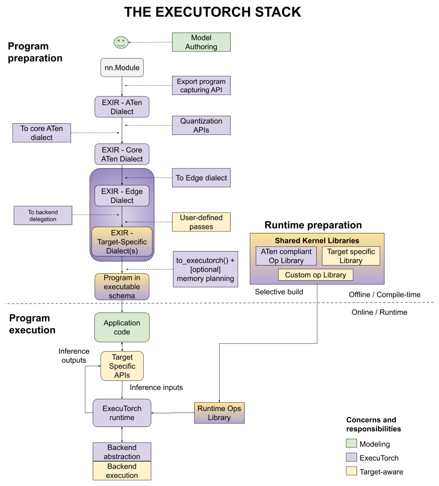

# High-level Architecture and Components of ExecuTorch

This page describes the technical architecture of ExecuTorch and its individual components. This document is targeted towards engineers who are deploying PyTorch model onto edge devices.

**Context**

In order to target on-device AI with diverse hardware, critical power requirements, and realtime processing needs, a single monolithic solution is not practical. Instead, a modular, layered, and extendable architecture is desired. ExecuTorch defines a streamlined workflow to prepare (export, transformation, and compilation) and execute a PyTorch program, with opinionated out-of-the-box default components and well-defined entry points for customizations. This architecture greatly improves portability, allowing engineers to use a performant lightweight, cross-platform runtime that easily integrates into different devices and platforms.

## Overview

There are three phases to deploy a PyTorch model to on-device: program preparation, runtime preparation, and program execution, as shown in the diagram below, with a number of user entry points. We’ll discuss each step separately in this documentation.

**Figure 1.** The figure illustrates the three phases - program preparation, runtime preparation and program execution.

## Program Preparation

ExecuTorch extends the flexibility and usability of PyTorch to edge devices. It
leverages PyTorch 2 compiler and export functionality
([TorchDynamo](https://pytorch.org/docs/stable/dynamo/index.html),
[AOTAutograd](https://pytorch.org/functorch/stable/notebooks/aot_autograd_optimizations.html),
[Quantization](https://pytorch.org/docs/main/quantization.html),
[dynamic shapes](https://pytorch.org/get-started/pytorch-2.0/#pytorch-2x-faster-more-pythonic-and-as-dynamic-as-ever),
[control flow](https://pytorch.org/docs/main/export.html#data-shape-dependent-control-flow),
etc.) to prepare a PyTorch program for execution on devices.

Program preparation is often simply called AOT (ahead-of-time) because export, transformations and compilations to the program are performed before it is eventually run with the ExecuTorch runtime, written in C++. To have a lightweight runtime and small overhead in execution, we push work as much as possible to AOT.

Starting from the program source code, below are the steps you would go through to accomplish the program preparation.

### Program Source Code

* Like all PyTorch use cases, ExecuTorch starts from model authoring, where standard `nn.Module` eager mode PyTorch programs are created.
* Export-specific helpers are used to represent advanced features like [control
  flow](https://pytorch.org/docs/main/export.html#data-shape-dependent-control-flow)
  (for example, helper functions to trace both branches of if-else) and [dynamic
  shapes](https://pytorch.org/get-started/pytorch-2.0/#pytorch-2x-faster-more-pythonic-and-as-dynamic-as-ever)
  (for example, data dependent dynamic shape constraint).

### Export

To deploy the program to the device, engineers need to have a graph representation for compiling a model to run on various backends. With [`torch.export()`](https://pytorch.org/docs/main/export.html), an [EXIR](./ir-exir.md) (export intermediate representation) is generated with ATen dialect. All AOT compilations are based on this EXIR, but can have multiple dialects along the lowering path as detailed below.

* _[ATen Dialect](./ir-exir.md#aten-dialect)_. PyTorch Edge is based on PyTorch’s Tensor library ATen, which has clear contracts for efficient execution. ATen Dialect is a graph represented by ATen nodes which are fully ATen compliant. Custom operators are allowed, but must be registered with the dispatcher. It’s flatten with no module hierarchy (submodules in a bigger module), but the source code and module hierarchy are preserved in the metadata. This representation is also autograd safe.
* Optionally, _quantization_, either QAT (quantization-aware training) or PTQ (post training quantization) can be applied to the whole ATen graph before converting to Core ATen. Quantization helps with reducing the model size, which is important for edge devices.
* _[Core ATen Dialect](./ir-ops-set-definition.md)_. ATen has thousands of operators. It’s not ideal for some fundamental transforms and kernel library implementation. The operators from the ATen Dialect graph are decomposed into fundamental operators so that the operator set (op set) is smaller and more fundamental transforms can be applied. The Core ATen dialect is also serializable and convertible to Edge Dialect as detailed below.

### Edge Compilation

The Export process discussed above operates on a graph that is agnostic to the edge device where the code is ultimately executed. During the edge compilation step, we work on representations that are Edge specific.

* _[Edge Dialect](./ir-exir.md#edge-dialect)_. All operators are either compliant with ATen operators with dtype plus memory layout information (represented as `dim_order`) or registered custom operators. Scalars are converted to Tensors. Those specifications allow following steps focusing on a smaller Edge domain. In addition, it enables the selective build which is based on specific dtypes and memory layouts.

With the Edge dialect, there are two target-aware ways to further lower the graph to the _[Backend Dialect](./compiler-backend-dialect.md)_. At this point, delegates for specific hardware can perform many operations. For example, Core ML on iOS, QNN on Qualcomm, or TOSA on Arm can rewrite the graph. The options at this level are:

* _[Backend Delegate](./compiler-delegate-and-partitioner.md)_. The entry point to compile the graph (either full or partial) to a specific backend. The compiled graph is swapped with the semantically equivalent graph during this transformation. The compiled graph will be offloaded to the backend (aka `delegated`) later during the runtime for improved performance.
* _User-defined passes_. Target-specific transforms can also be performed by the user. Good examples of this are kernel fusion, async behavior, memory layout conversion, and others.

### Compile to ExecuTorch Program

The Edge program above is good for compilation, but not suitable for the runtime environment. On-device deployment engineers can lower the graph that can be efficiently loaded and executed by the runtime.

On most Edge environments, dynamic memory allocation/freeing has significant performance and power overhead. It can be avoided using AOT memory planning, and a static execution graph.

* The ExecuTorch runtime is static (in the sense of graph representation, but control flow and dynamic shapes are still supported). To avoid output creation and return, all functional operator representations are converted to out variants (outputs passed as arguments).
* Optionally, users can apply their own memory planning algorithms. For example, there can be specific layers of memory hierarchy for an embedded system. Users can have their customized memory planning to that memory hierarchy.
* The program is emitted to the format that our ExecuTorch runtime can recognize.

Finally, the emitted program can be serialized to [flatbuffer](https://github.com/pytorch/executorch/blob/main/schema/program.fbs) format.

## Runtime Preparation

With the serialized program, and provided kernel libraries (for operator calls) or backend libraries (for delegate calls), model deployment engineers can now prepare the program for the runtime.

ExecuTorch has the _[selective build](./kernel-library-selective-build.md)_ APIs, to build the runtime that links to only kernels used by the program, which can provide significant binary size savings in the resulting application.

## Program Execution

The ExecuTorch runtime is written in C++ with minimal dependencies for portability and execution efficiency. Because the program is well prepared AOT, the core runtime components are minimal and include:

* Platform abstraction layer
* Logging and optionally profiling
* Execution data types
* Kernel and backend registry
* Memory management

_Executor_ is the entry point to load the program and execute it. The execution triggers corresponding operator kernels or backend execution from this very minimal runtime.

## Developer Tools

It should be efficient for users to go from research to production using the flow above. Productivity is essentially important, for users to author, optimize and deploy their models. We provide [ExecuTorch Developer Tools](./devtools-overview.md) to improve productivity. The Developer Tools are not in the diagram. Instead it's a tool set that covers the developer workflow in all three phases.

During the program preparation and execution, users can use the ExecuTorch Developer Tools to profile, debug, or visualize the program. Since the end-to-end flow is within the PyTorch ecosystem, users can correlate and display performance data along with graph visualization as well as direct references to the program source code and model hierarchy. We consider this to be a critical component for quickly iterating and lowering PyTorch programs to edge devices and environments.
