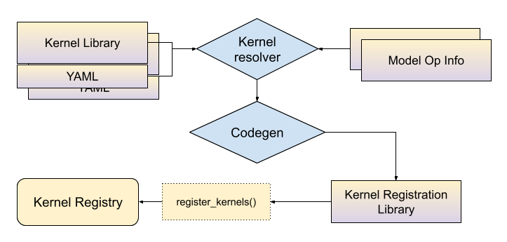

# Kernel Registration
## Overview

At the last stage of [ExecuTorch model exporting](./export-overview.md), we lower the operators in the dialect to the _out variants_ of the [core ATen operators](./ir-ops-set-definition.md). Then we serialize these operator names into the model artifact. During runtime execution, for each operator name we will need to find the actual _kernels_, i.e., the C++ functions that do the heavy-lifting calculations and return results.

## Kernel Libraries
### First-party kernel libraries:

**[Portable kernel library](https://github.com/pytorch/executorch/tree/main/kernels/portable)** is the in-house default kernel library that covers most of the core ATen operators. It’s easy to use/read and is written in portable C++17. However it’s not optimized for performance, because it’s not specialized for any certain target. Therefore we provide kernel registration APIs for ExecuTorch users to easily register their own optimized kernels.

**[Optimized kernel library](https://github.com/pytorch/executorch/tree/main/kernels/optimized)** specializes on performance for some of the operators, leveraging existing third party libraries such as [EigenBLAS](https://gitlab.com/libeigen/eigen). This works best along with the portable kernel library, with a good balance on portability and performance. One example of combining these two libraries can be found [here](https://github.com/pytorch/executorch/blob/main/configurations/CMakeLists.txt).

**[Quantized kernel library](https://github.com/pytorch/executorch/tree/main/kernels/quantized)** implements operators for quantization and dequantization. These are out of core ATen operators but are vital to most of the production use cases.

### Custom kernel libraries:

**Custom kernels implementing core ATen ops**. Even though we don't have an internal example for custom kernels for core ATen ops, the optimized kernel library can be viewed as a good example. We have optimized [`add.out`](https://github.com/pytorch/executorch/blob/main/kernels/optimized/cpu/op_add.cpp) and a portable [`add.out`](https://github.com/pytorch/executorch/blob/main/kernels/portable/cpu/op_add.cpp). When user is combining these two libraries, we provide APIs to choose which kernel to use for `add.out`. In order to author and use custom kernels implementing core ATen ops, using the [YAML based approach](#yaml-entry-for-core-aten-op-out-variant) is recommended, because it provides full fledged support on
  1. combining kernel libraries and define fallback kernels;
  2. using selective build to minimize the kernel size.

A **[Custom operator](https://github.com/pytorch/executorch/tree/main/extension/llm/custom_ops)** is any operator that an ExecuTorch user defines outside of PyTorch's [`native_functions.yaml`](https://github.com/pytorch/pytorch/blob/main/aten/src/ATen/native/native_functions.yaml).

## Operator & Kernel Contract

All the kernels mentioned above, whether they are in-house or customized, should comply with the following requirements:

* Match the calling convention derived from operator schema. The kernel registration API will generate headers for the custom kernels as references.
* Satisfy the dtype constraints defined in edge dialect. For tensors with certain dtypes as arguments, the result of a custom kernel needs to match the expected dtypes. The constraints are available in edge dialect ops.
* Give correct result. We will provide a testing framework to automatically test the custom kernels.


## APIs

These are the APIs available to register kernels/custom kernels/custom ops into ExecuTorch:

* [YAML Entry API](#yaml-entry-api-high-level-architecture)
  - [for core ATen op with custom kernels](#yaml-entry-api-for-core-aten-op-out-variant)
  - [for custom ops](#yaml-entry-api-for-custom-ops)
  - [CMake Macros](#cmake-macros)
* C++ API
  - [for custom ops](#c-api-for-custom-ops)
  - [CMake Example](#compile-and-link-the-custom-kernel)

If it's not clear which API to use, please see [Best Practices](#custom-ops-api-best-practices).


### YAML Entry API High Level Architecture



ExecuTorch users are asked to provide:

1. the custom kernel library with C++ implementations

2. a YAML file associated with the library that describes what operators are being implemented by this library. For partial kernels, the yaml file also contains information on the dtypes and dim orders supported by the  kernel. More details in the API section.


### YAML Entry API Workflow

At build time, the yaml files associated with kernel libraries will be passed to the _kernel resolver_ along with the model op info (see selective build doc) and the outcome is a mapping between a combination of operator names and tensor metadata, to kernel symbols. Then codegen tools will use this mapping to generate C++ bindings that connect the kernels to ExecuTorch runtime. ExecuTorch users need to link this generated library into their application to use these kernels.

At static object initialization time, kernels will be registered into the ExecuTorch kernel registry.

At runtime initialization stage, ExecuTorch will use the operator name and argument metadata as a key to lookup for the kernels. For example, with “aten::add.out” and inputs being float tensors with dim order (0, 1, 2, 3), ExecuTorch will go into the kernel registry and lookup for a kernel that matches the name and the input metadata.

### YAML Entry API for Core ATen Op Out Variant

Top level attributes:

* `op` (if the operator appears in `native_functions.yaml`) or `func` for custom operator. The value for this key needs to be the full operator name (including overload name) for `op` key, or a full operator schema (namespace, operator name, operator overload name and schema string), if we are describing a custom operator. For schema syntax please refer to this [instruction](https://github.com/pytorch/pytorch/blob/main/aten/src/ATen/native/README.md).
* `kernels`: defines kernel information. It consists of `arg_meta` and `kernel_name`, which are bound together to describe "for input tensors with these metadata, use this kernel".
* `type_alias`(optional): we are giving aliases to possible dtype options. `T0: [Double, Float]` means `T0` can be one of `Double` or `Float`.
* `dim_order_alias`(optional): similar to `type_alias`, we are giving names to possible dim order options.

Attributes under `kernels`:


* `arg_meta`: a list of "tensor arg name" entries. The values for these keys are dtypes and dim orders aliases, that are implemented by the corresponding `kernel_name`. This being `null` means the kernel will be used for all types of input.
* `kernel_name`: the expected name of the C++ function that will implement this operator. You can put whatever you want to here, but you should follow the convention of replacing the `.` in the overload name with an underscore, and lowercasing all characters. In this example, `add.out` uses the C++ function named `add_out`. `add.Scalar_out` would become `add_scalar_out`, with a lowercase `S`. We support namespace for kernels, but note that we will be inserting a `native::` to the last level of namespace. So `custom::add_out` in the `kernel_name` will point to `custom::native::add_out`.

Some examples of operator entry:
```yaml
- op: add.out
  kernels:
    - arg_meta: null
      kernel_name: torch::executor::add_out
```
An out variant of a core ATen operator with a default kernel

ATen operator with a dtype/dim order specialized kernel (works for `Double` dtype and dim order needs to be (0, 1, 2, 3))
```yaml
- op: add.out
  type_alias:
    T0: [Double]
  dim_order_alias:
    D0: [[0, 1, 2, 3]]
  kernels:
    - arg_meta:
        self: [T0, D0]
        other: [T0 , D0]
        out: [T0, D0]
      kernel_name: torch::executor::add_out

```


### YAML Entry API for Custom Ops

As mentioned above, this option provides more support in terms of selective build and features such as merging operator libraries.

First we need to specify the operator schema as well as a `kernel` section. So instead of `op` we use `func` with the operator schema. As an example, here’s a yaml entry for a custom op:
```yaml
- func: allclose.out(Tensor self, Tensor other, float rtol=1e-05, float atol=1e-08, bool equal_nan=False, bool dummy_param=False, *, Tensor(a!) out) -> Tensor(a!)
  kernels:
    - arg_meta: null
      kernel_name: torch::executor::allclose_out
```
The `kernel` section is the same as the one defined in core ATen ops. For operator schema, we are reusing the DSL defined in this [README.md](https://github.com/pytorch/pytorch/blob/main/aten/src/ATen/native/README.md), with a few differences:


#### Out variants only

ExecuTorch only supports out-style operators, where:


* The caller provides the output Tensor or Tensor list in the final position with the name `out`.
* The C++ function modifies and returns the same `out` argument.
    * If the return type in the YAML file is `()` (which maps to void), the C++ function should still modify `out` but does not need to return anything.
* The `out` argument must be keyword-only, which means it needs to follow an argument named `*` like in the `add.out` example below.
* Conventionally, these out operators are named using the pattern `<name>.out` or `<name>.<overload>_out`.

Since all output values are returned via an `out` parameter, ExecuTorch ignores the actual C++ function return value. But, to be consistent, functions should always return `out` when the return type is non-`void`.


#### Can only return `Tensor` or `()`

ExecuTorch only supports operators that return a single `Tensor`, or the unit type `()` (which maps to `void`). It does not support returning any other types, including lists, optionals, tuples, or scalars like `bool`.


#### Supported argument types

ExecuTorch does not support all of the argument types that core PyTorch supports. Here's a list of the argument types we currently support:
* Tensor
* int
* bool
* float
* str
* Scalar
* ScalarType
* MemoryFormat
* Device
* Optional<Type>
* List<Type>
* List<Optional<Type>>
* Optional<List<Type>>

#### CMake Macros

We provide build time macros to help users to build their kernel registration library. The macro takes the yaml file describing the kernel library as well as model operator metadata, and packages the generated C++ bindings into a C++ library. The macro is available on CMake.


`generate_bindings_for_kernels(FUNCTIONS_YAML functions_yaml CUSTOM_OPS_YAML custom_ops_yaml)` takes a yaml file for core ATen op out variants and also a yaml file for custom ops, generate C++ bindings for kernel registration. It also depends on the selective build artifact generated by `gen_selected_ops()`, see selective build doc for more information. Then `gen_operators_lib` will package those bindings to be a C++ library. As an example:
```cmake
# SELECT_OPS_LIST: aten::add.out,aten::mm.out
gen_selected_ops("" "${SELECT_OPS_LIST}" "")

# Look for functions.yaml associated with portable libs and generate C++ bindings
generate_bindings_for_kernels(FUNCTIONS_YAML ${EXECUTORCH_ROOT}/kernels/portable/functions.yaml)

# Prepare a C++ library called "generated_lib" with _kernel_lib being the portable library, executorch is a dependency of it.
gen_operators_lib("generated_lib" KERNEL_LIBS ${_kernel_lib} DEPS executorch)

# Link "generated_lib" into the application:
target_link_libraries(executorch_binary generated_lib)

```

We also provide the ability to merge two yaml files, given a precedence. `merge_yaml(FUNCTIONS_YAML functions_yaml FALLBACK_YAML fallback_yaml OUTPUT_DIR out_dir)` merges functions_yaml and fallback_yaml into a single yaml, if there's duplicate entries in functions_yaml and fallback_yaml, this macro will always take the one in functions_yaml.

Example:

```yaml
# functions.yaml
- op: add.out
  kernels:
    - arg_meta: null
      kernel_name: torch::executor::opt_add_out
```

And out fallback:

```yaml
# fallback.yaml
- op: add.out
  kernels:
    - arg_meta: null
      kernel_name: torch::executor::add_out
```

The merged yaml will have the entry in functions.yaml.

### C++ API for Custom Ops

Unlike the YAML entry API, the C++ API only uses C++ macros `EXECUTORCH_LIBRARY` and `WRAP_TO_ATEN` for kernel registration, also without selective build support. It makes this API faster in terms of development speed, since users don't have to do YAML authoring and build system tweaking.

Please refer to [Custom Ops Best Practices](#custom-ops-api-best-practices) on which API to use.

Similar to [`TORCH_LIBRARY`](https://pytorch.org/cppdocs/library.html#library_8h_1a0bd5fb09d25dfb58e750d712fc5afb84) in PyTorch, `EXECUTORCH_LIBRARY` takes the operator name and the C++ function name and register them into ExecuTorch runtime.

#### Prepare custom kernel implementation

Define your custom operator schema for both functional variant (used in AOT compilation) and out variant (used in ExecuTorch runtime). The schema needs to follow PyTorch ATen convention (see `native_functions.yaml`). For example:

```yaml
custom_linear(Tensor weight, Tensor input, Tensor(?) bias) -> Tensor
custom_linear.out(Tensor weight, Tensor input, Tensor(?) bias, *, Tensor(a!) out) -> Tensor(a!)
```

Then write your custom kernel according to the schema using ExecuTorch types, along with APIs to register to ExecuTorch runtime:


```c++
// custom_linear.h/custom_linear.cpp
#include <executorch/runtime/kernel/kernel_includes.h>
Tensor& custom_linear_out(const Tensor& weight, const Tensor& input, optional<Tensor> bias, Tensor& out) {
   // calculation
   return out;
}
```
#### Use a C++ macro to register it into ExecuTorch

Append the following line in the example above:
```c++
// custom_linear.h/custom_linear.cpp
// opset namespace myop
EXECUTORCH_LIBRARY(myop, "custom_linear.out", custom_linear_out);
```

Now we need to write some wrapper for this op to show up in PyTorch, but don’t worry we don’t need to rewrite the kernel. Create a separate .cpp for this purpose:

```c++
// custom_linear_pytorch.cpp
#include "custom_linear.h"
#include <torch/library.h>

at::Tensor custom_linear(const at::Tensor& weight, const at::Tensor& input, std::optional<at::Tensor> bias) {
    // initialize out
    at::Tensor out = at::empty({weight.size(1), input.size(1)});
    // wrap kernel in custom_linear.cpp into ATen kernel
    WRAP_TO_ATEN(custom_linear_out, 3)(weight, input, bias, out);
    return out;
}
// standard API to register ops into PyTorch
TORCH_LIBRARY(myop, m) {
    m.def("custom_linear(Tensor weight, Tensor input, Tensor(?) bias) -> Tensor", custom_linear);
    m.def("custom_linear.out(Tensor weight, Tensor input, Tensor(?) bias, *, Tensor(a!) out) -> Tensor(a!)", WRAP_TO_ATEN(custom_linear_out, 3));
}
```

#### Compile and link the custom kernel

Link it into ExecuTorch runtime: In our `CMakeLists.txt` that builds the binary/application, we need to add custom_linear.h/cpp into the binary target. We can build a dynamically loaded library (.so or .dylib) and link it as well.

Here's an example to do it:

```cmake
# For target_link_options_shared_lib
include(${EXECUTORCH_ROOT}/build/Utils.cmake)

# Add a custom op library
add_library(custom_op_lib SHARED ${CMAKE_CURRENT_SOURCE_DIR}/custom_op.cpp)

# Include the header
target_include_directory(custom_op_lib PUBLIC ${CMAKE_CURRENT_SOURCE_DIR}/include)

# Link ExecuTorch library
target_link_libraries(custom_op_lib PUBLIC executorch)

# Define a binary target
add_executable(custom_op_runner PUBLIC main.cpp)

# Link this library with --whole-archive !! IMPORTANT !! this is to avoid the operators being stripped by linker
target_link_options_shared_lib(custom_op_lib)

# Link custom op lib
target_link_libraries(custom_op_runner PUBLIC custom_op_lib)

```

Link it into the PyTorch runtime: We need to package custom_linear.h, custom_linear.cpp and custom_linear_pytorch.cpp into a dynamically loaded library (.so or .dylib) and load it into our python environment. One way of doing this is:

```python
import torch
torch.ops.load_library("libcustom_linear.so/dylib")

# Now we have access to the custom op, backed by kernel implemented in custom_linear.cpp.
op = torch.ops.myop.custom_linear.default
```

### Custom Ops API Best Practices

Given that we have 2 kernel registration APIs for custom ops, which API should we use? Here are some pros and cons for each API:

* C++ API:
  - Pros:
    * Only C++ code changes are needed
    * Resembles PyTorch custom ops C++ API
    * Low maintenance cost
  - Cons:
    * No selective build support
    * No centralized bookkeepping

* Yaml entry API:
  - Pros:
    * Has selective build support
    * Provides a centralized place for custom ops
      - It shows what ops are being registered and what kernels are bound to these ops, for an application
  - Cons:
    * User needs to create and maintain yaml files
    * Relatively inflexible to change the op definition

Overall if we are building an application and it uses custom ops, during the development phase it's recommended to use the C++ API since it's low-cost to use and flexible to change. Once the application moves to production phase where the custom ops definitions and the build systems are quite stable and binary size is to be considered, it is recommended to use the Yaml entry API.
