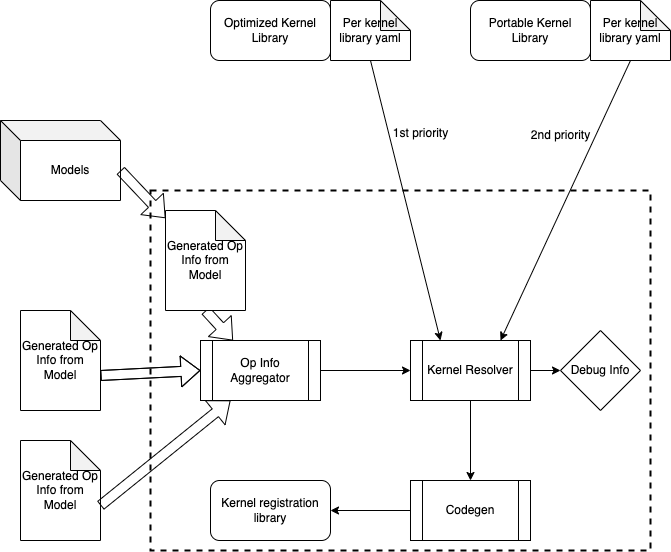

# Kernel Library Selective Build

_Selective build_ is a build mode on ExecuTorch that uses model metadata to guide ExecuTorch build. This build mode contains build tool APIs available on CMake. ExecuTorch users can use selective build APIs to build an ExecuTorch runtime binary with minimal binary size by only including operators required by models.

This document aims to help ExecuTorch users better use selective build, by listing out available APIs, providing an overview of high level architecture and showcasing examples.

Preread: [Overview of the ExecuTorch runtime](./runtime-overview.md), [High-level architecture and components of ExecuTorch](./getting-started-architecture.md)


## Design Principles

**Why selective build?** Many ExecuTorch use cases are constrained by binary size. Selective build can reduce the binary size of the ExecuTorch runtime without compromising support for a target model.

**What are we selecting?** Our core ExecuTorch library is around 50kB with no operators/kernels or delegates. If we link in kernel libraries such as the ExecuTorch in-house portable kernel library, the binary size of the whole application surges, due to unused kernels being registered into the ExecuTorch runtime. Selective build is able to apply a filter on the kernel libraries, so that only the kernels actually being used are linked, thus reducing the binary size of the application.

**How do we select?** Selective build provides APIs to allow users to pass in _op info_, operator metadata derived from target models. Selective build tools will gather these op info and build a filter for all kernel libraries being linked in.


## High Level Architecture





Note that all of the selective build tools are running at build-time (to be distinguished from compile-time or runtime). Therefore selective build tools only have access to static data from user input or models.

The basic flow looks like this:


1. For each of the models we plan to run, we extract op info from it, either manually or via a Python tool. Op info will be written into yaml files and generated at build time.
2. An _op info aggregator _will collect these model op info and merge them into a single op info yaml file.
3. A _kernel resolver _takes in the linked kernel libraries as well as the merged op info yaml file, then makes a decision on which kernels to be registered into ExecuTorch runtime.


## APIs

We expose a CMake macro `[gen_selected_ops](https://github.com/pytorch/executorch/blob/main/build/Codegen.cmake#L12)`, to allow users specifying op info:

```
gen_selected_ops(
  LIB_NAME         # the name of the selective build operator library to be generated
  OPS_SCHEMA_YAML  # path to a yaml file containing operators to be selected
  ROOT_OPS         # comma separated operator names to be selected
  INCLUDE_ALL_OPS  # boolean flag to include all operators
)
```


### Select all ops

If this input is set to true, it means we are registering all the kernels from all the kernel libraries linked into the application. If set to true it is effectively turning off selective build mode.


### Select ops from schema yaml

Context: each kernel library is designed to have a yaml file associated with it. For more information on this yaml file, see [Kernel Library Overview](./kernel-library-overview.md). This API allows users to pass in the schema yaml for a kernel library directly, effectively allowlisting all kernels in the library to be registered.


### Select root ops from operator list

This API lets users pass in a list of operator names. Note that this API can be combined with the API above and we will create a allowlist from the union of both API inputs.


## Example Walkthrough

In CMakeLists.txt we have the following logic:
```cmake
set(_kernel_lib)
if(SELECT_ALL_OPS)
  gen_selected_ops("" "" "${SELECT_ALL_OPS}")
elseif(SELECT_OPS_LIST)
  gen_selected_ops("" "${SELECT_OPS_LIST}" "")
elseif(SELECT_OPS_YAML)
 set(_custom_ops_yaml ${EXECUTORCH_ROOT}/examples/portable/custom_ops/custom_ops.yaml)
  gen_selected_ops("${_custom_ops_yaml}" "" "")
endif()
```
Then when calling CMake, we can do:

```
cmake -D… -DSELECT_OPS_LIST="aten::add.out,aten::mm.out”
```

Or

```
cmake -D… -DSELECT_OPS_YAML=ON
```

To select from either an operator name list or a schema yaml from kernel library.
