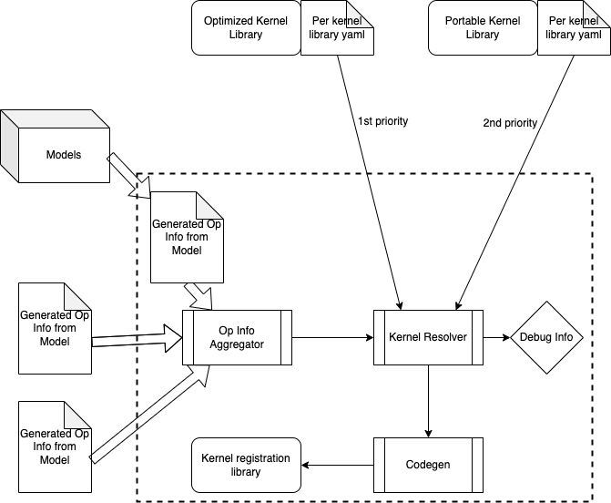

# Kernel Library Selective Build

_Selective build_ is a build mode on ExecuTorch that uses model metadata to guide ExecuTorch build. This build mode contains build tool APIs available on CMake. ExecuTorch users can use selective build APIs to build an ExecuTorch runtime binary with minimal binary size by only including operators required by models.

This document aims to help ExecuTorch users better use selective build, by listing out available APIs, providing an overview of high level architecture and showcasing examples.

Preread: [Overview of the ExecuTorch runtime](runtime-overview.md), [High-level architecture and components of ExecuTorch](getting-started-architecture.md)


## Design Principles

**Why selective build?** Many ExecuTorch use cases are constrained by binary size. Selective build can reduce the binary size of the ExecuTorch runtime without compromising support for a target model.

**What are we selecting?** Our core ExecuTorch library is around 50kB with no operators/kernels or delegates. If we link in kernel libraries such as the ExecuTorch in-house portable kernel library, the binary size of the whole application surges, due to unused kernels being registered into the ExecuTorch runtime. Selective build is able to apply a filter on the kernel libraries, so that only the kernels actually being used are linked, thus reducing the binary size of the application.

**How do we select?** Selective build provides APIs to allow users to pass in _op info_, operator metadata derived from target models. Selective build tools will gather these op info and build a filter for all kernel libraries being linked in.


## High Level Architecture





Note that all of the selective build tools are running at build-time (to be distinguished from compile-time or runtime). Therefore selective build tools only have access to static data from user input or models.

The basic flow looks like this:


1. For each of the models we plan to run, we extract op info from it, either manually or via a Python tool. Op info will be written into yaml files and generated at build time.
2. An _op info aggregator _will collect these model op info and merge them into a single op info yaml file.
3. A _kernel resolver _takes in the linked kernel libraries as well as the merged op info yaml file, then makes a decision on which kernels to be registered into ExecuTorch runtime.


## Selective Build CMake Options

To enable selective build when building the executorch kernel libraries as part of a CMake build, the following CMake options are exposed. These options affect the `executorch_kernels` CMake target. Make sure to link this target when using selective build.

 * `EXECUTORCH_SELECT_OPS_YAML`: A path to a YAML file specifying the operators to include.
 * `EXECUTORCH_SELECT_OPS_LIST`: A string containing the operators to include.
 * `EXECUTORCH_SELECT_OPS_MODEL`: A path to a PTE file. Only operators used in this model will be included.
 * `EXECUTORCH_ENABLE_DTYPE_SELECTIVE_BUILD`: If enabled, operators will be further specialized to only operator on the data types specified in the operator selection.

`EXECUTORCH_SELECT_OPS_YAML`, `EXECUTORCH_SELECT_OPS_LIST`, and
`EXECUTORCH_SELECT_OPS_MODEL` can be used individually or together. When more
than one is provided, ExecuTorch merges their operator sets. Dtype-selective
build still requires model metadata, so enable it with
`EXECUTORCH_SELECT_OPS_MODEL`.

As an example, to build with only operators used in mv2_xnnpack_fp32.pte, the CMake build can be configured as follows.
```
cmake -B cmake-out -DEXECUTORCH_SELECT_OPS_MODEL=mv2_xnnpack_fp32.pte
```

## APIs

For fine-grained control, we expose a CMake macro [gen_selected_ops](https://github.com/pytorch/executorch/blob/main/tools/cmake/Codegen.cmake#L12) to allow users to specify op info:

```
gen_selected_ops(
  LIB_NAME              # the name of the selective build operator library to be generated
  OPS_SCHEMA_YAML       # path to a yaml file containing operators to be selected
  ROOT_OPS              # comma separated operator names to be selected
  INCLUDE_ALL_OPS       # boolean flag to include all operators
  OPS_FROM_MODEL        # path to a pte file of model to select operators from
  DTYPE_SELECTIVE_BUILD # boolean flag to enable dtype selection
)
```

The macro calls `gen_oplist.py`. `OPS_SCHEMA_YAML`, `ROOT_OPS`, and
`OPS_FROM_MODEL` contribute to the merged operator set and can be combined.
`INCLUDE_ALL_OPS` requests all operators. `DTYPE_SELECTIVE_BUILD` requires
`OPS_FROM_MODEL` because the model supplies the dtype metadata.

### Select all ops

If this input is set to true, it means we are registering all the kernels from all the kernel libraries linked into the application. If set to true it is effectively turning off selective build mode.


### Select ops from schema yaml

Context: each kernel library is designed to have a yaml file associated with it. For more information on this yaml file, see [Kernel Library Overview](kernel-library-overview.md). This API allows users to pass in the schema yaml for a kernel library directly, effectively allowlisting all kernels in the library to be registered.


### Select root ops from operator list

This API lets users pass in a list of operator names. It can be combined with
the YAML and model APIs; the selected operator set is the union of their
inputs.

### Select ops from model

This API lets users pass in a pte file of an exported model. When used, the pte file will be parsed to generate a yaml file that enumerates the operators and dtypes used in the model.

### Right-sizing the kernel registry

The runtime's operator registry is a fixed-size static array whose capacity
is set at compile time via `MAX_KERNEL_NUM` (default 2000). Each slot is a
three-pointer `Kernel` struct (12 bytes on 32-bit, 24 bytes on 64-bit), so
the array permanently occupies roughly 24&nbsp;KiB on 32-bit targets and
48&nbsp;KiB on 64-bit — regardless of how many kernels actually register.
This overhead is most visible on small embedded targets where KiBs of
static RAM matter. When selective build is active the exact kernel set is
known at build time, so the registry can be sized to fit.

Any selective-build invocation (`EXECUTORCH_SELECT_OPS_MODEL`,
`EXECUTORCH_SELECT_OPS_LIST`, or `EXECUTORCH_SELECT_OPS_YAML`) now
automatically computes a right-sized `MAX_KERNEL_NUM` and propagates it into
`operator_registry.cpp` via a generated header. No additional flag is
required.

Resolution order in `operator_registry.cpp`:

1. A user-supplied `-DMAX_KERNEL_NUM=N` always wins.
2. Otherwise, the auto-computed value from the generated
   `selected_max_kernel_num.h` is used.
3. Otherwise (no selective build), the default 2000 is used.

The count is `sum(kernel variants in et_kernel_metadata)` plus the prim ops
registered by `kernels/prim_ops/register_prim_ops.cpp`. If a YAML opts into
`include_all_operators`, auto-sizing is skipped and the default capacity
applies.

If you register kernels outside the selective-build YAML (for example via
`EXECUTORCH_LIBRARY` macros in your own code), pin the registry explicitly
with `-DMAX_KERNEL_NUM=N`. A too-small registry aborts at static init with
`Error::RegistrationExceedingMaxKernels` and a log of every attempted
kernel.

### Dtype Selective Build

Beyond pruning the binary to remove unused operators, the binary size can be
reduced further by removing unused dtypes. For example, if your model only uses
floats for the `add` operator, then including variants of the `add` operators
for `doubles` and `ints` is unnecessary. Set
`EXECUTORCH_ENABLE_DTYPE_SELECTIVE_BUILD=ON` to enable this optimization. It
requires `EXECUTORCH_SELECT_OPS_MODEL`, which provides the operator and dtype
metadata. A header containing the model's selected operator variants is
generated and linked into a rebuild of `portable_kernels`. This feature is
only supported for the portable kernels library; it is not supported for
optimized, quantized, or custom kernel libraries.

## Example Walkthrough

The [advanced selective-build example](https://github.com/pytorch/executorch/blob/main/examples/selective_build/advanced/CMakeLists.txt)
passes its configured selectors to `gen_selected_ops`. For example, the
top-level CMake build can combine a model with an additional operator list:

```bash
cmake -S . -B cmake-out \
  -DEXECUTORCH_SELECT_OPS_MODEL=model.pte \
  -DEXECUTORCH_SELECT_OPS_LIST=aten::relu.out
```

To specialize portable kernels to the model's dtypes, add
`-DEXECUTORCH_ENABLE_DTYPE_SELECTIVE_BUILD=ON`.
