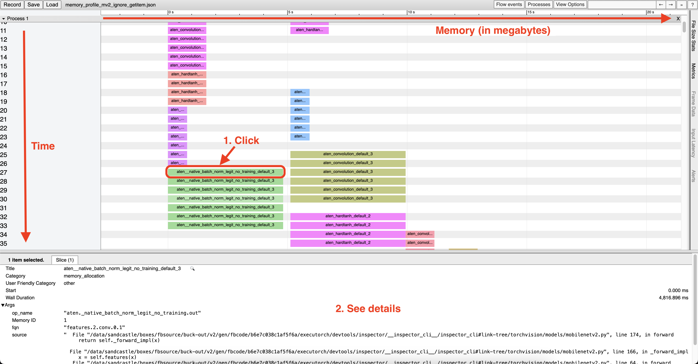

# Memory Planning Inspection in ExecuTorch

After the [Memory Planning](concepts.md#memory-planning) pass of ExecuTorch, memory allocation information is stored on the nodes of the [`ExportedProgram`](concepts.md#exportedprogram). Here, we present a tool designed to inspect memory allocation and visualize all active tensor objects.

## Usage
User should add this code after they call [to_executorch()](export-to-executorch-api-reference.rst#executorch.exir.EdgeProgramManager.to_executorch), and it will write memory allocation information stored on the nodes to the file path "memory_profile.json". The file is compatible with the Chrome trace viewer; see below for more information about interpreting the results.

```python
from executorch.util.activation_memory_profiler import generate_memory_trace
generate_memory_trace(
    executorch_program_manager=prog,
    chrome_trace_filename="memory_profile.json",
    enable_memory_offsets=True,
)
```
* `prog` is an instance of [`ExecuTorchProgramManager`](export-to-executorch-api-reference.rst#executorch.exir.ExecutorchProgramManager), returned by [to_executorch()](export-to-executorch-api-reference.rst#executorch.exir.EdgeProgramManager.to_executorch).
* Set `enable_memory_offsets` to `True` to show the location of each tensor on the memory space.

## Chrome Trace
Open a Chrome browser tab and navigate to <chrome://tracing/>. Upload the generated `.json` to view.
Example of a [MobileNet V2](https://pytorch.org/vision/main/models/mobilenetv2.html) model:



Note that, since we are repurposing the Chrome trace tool, the axes in this context may have different meanings compared to other Chrome trace graphs you may have encountered previously:
* The horizontal axis, despite being labeled in seconds (s), actually represents megabytes (MBs).
* The vertical axis has a 2-level hierarchy. The first level, "pid", represents memory space. For CPU, everything is allocated on one "space"; other backends may have multiple. In the second level, each row represents one time step. Since nodes will be executed sequentially, each node represents one time step, thus you will have as many nodes as there are rows.

## Further Reading
* [Memory Planning](compiler-memory-planning.md)
