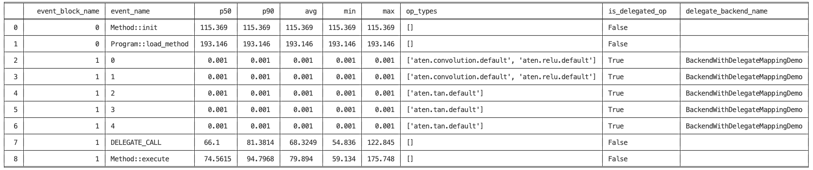

Inspector APIs
==============

Overview
--------

The Inspector APIs provide a convenient interface for analyzing the
contents of `ETRecord <etrecord.html>`__ and
`ETDump <etdump.html>`__, helping developers get insights about model
architecture and performance statistics. It’s built on top of the `EventBlock Class <#eventblock-class>`__ data structure,
which organizes a group of `Event <#event-class>`__\ s for easy access to details of profiling events.

There are multiple ways in which users can interact with the Inspector
APIs:

* By using `public methods <#inspector-methods>`__ provided by the ``Inspector`` class.
* By accessing the `public attributes <#inspector-attributes>`__ of the ``Inspector``, ``EventBlock``, and ``Event`` classes.
* By using a `CLI <#cli>`__ tool for basic functionalities.

Please refer to the `e2e use case doc <tutorials/devtools-integration-tutorial.html>`__ get an understanding of how to use these in a real world example.

Inspector Methods
-----------------

Constructor
~~~~~~~~~~~

.. autofunction:: executorch.devtools.Inspector.__init__

**Example Usage:**

.. code:: python

    from executorch.devtools import Inspector

    inspector = Inspector(etdump_path="/path/to/etdump.etdp", etrecord="/path/to/etrecord.bin")

to_dataframe
~~~~~~~~~~~~~~~~

.. autofunction:: executorch.devtools.Inspector.to_dataframe

print_data_tabular
~~~~~~~~~~~~~~~~~~

.. autofunction:: executorch.devtools.Inspector.print_data_tabular

.. _example-usage-1:

**Example Usage:**

.. code:: python

    inspector.print_data_tabular()

Note that the unit of delegate profiling events is "cycles". We're working on providing a way to set different units in the future.

find_total_for_module
~~~~~~~~~~~~~~~~~~~~~

.. autofunction:: executorch.devtools.Inspector.find_total_for_module

.. _example-usage-2:

**Example Usage:**

.. code:: python

    print(inspector.find_total_for_module("L__self___conv_layer"))

::

    0.002

get_exported_program
~~~~~~~~~~~~~~~~~~~~

.. autofunction:: executorch.devtools.Inspector.get_exported_program

.. _example-usage-3:

**Example Usage:**

.. code:: python

    print(inspector.get_exported_program())

::

    ExportedProgram:
        class GraphModule(torch.nn.Module):
            def forward(self, arg0_1: f32[4, 3, 64, 64]):
                # No stacktrace found for following nodes
                _param_constant0 = self._param_constant0
                _param_constant1 = self._param_constant1

                ### ... Omit part of the program for documentation readability ... ###

    Graph signature: ExportGraphSignature(parameters=[], buffers=[], user_inputs=['arg0_1'], user_outputs=['aten_tan_default'], inputs_to_parameters={}, inputs_to_buffers={}, buffers_to_mutate={}, backward_signature=None, assertion_dep_token=None)
    Range constraints: {}
    Equality constraints: []

Inspector Attributes
--------------------

``EventBlock`` Class
~~~~~~~~~~~~~~~~~~~~

Access ``EventBlock`` instances through the ``event_blocks`` attribute
of an ``Inspector`` instance, for example:

.. code:: python

    inspector.event_blocks

.. autoclass:: executorch.devtools.inspector.EventBlock

``Event`` Class
~~~~~~~~~~~~~~~

Access ``Event`` instances through the ``events`` attribute of an
``EventBlock`` instance.

.. autoclass:: executorch.devtools.inspector.Event

**Example Usage:**

.. code:: python

    for event_block in inspector.event_blocks:
        for event in event_block.events:
            if event.name == "Method::execute":
                print(event.perf_data.raw)

::

    [175.748, 78.678, 70.429, 122.006, 97.495, 67.603, 70.2, 90.139, 66.344, 64.575, 134.135, 93.85, 74.593, 83.929, 75.859, 73.909, 66.461, 72.102, 84.142, 77.774, 70.038, 80.246, 59.134, 68.496, 67.496, 100.491, 81.162, 74.53, 70.709, 77.112, 59.775, 79.674, 67.54, 79.52, 66.753, 70.425, 71.703, 81.373, 72.306, 72.404, 94.497, 77.588, 79.835, 68.597, 71.237, 88.528, 71.884, 74.047, 81.513, 76.116]

CLI
---

Execute the following command in your terminal to display the data
table. This command produces the identical table output as calling the
`print_data_tabular <#print-data-tabular>`__ mentioned earlier:

.. code:: bash

    python3 -m devtools.inspector.inspector_cli --etdump_path <path_to_etdump> --etrecord_path <path_to_etrecord>

Note that the `etrecord_path` argument is optional.

We plan to extend the capabilities of the CLI in the future.
