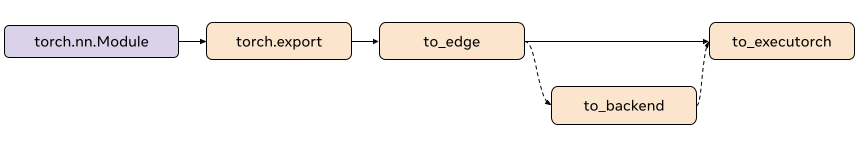

# ExecuTorch XNNPACK Delegate

This is a high-level overview of the ExecuTorch XNNPACK Backend Delegate. This high performance delegate is aimed to reduce CPU inference latency for ExecuTorch models. We will provide a brief introduction to the XNNPACK library and explore the delegate’s overall architecture and intended use cases.

::::{note}
XNNPACK Delegate is currently under active development, and may change in the future
::::

### What is XNNPACK?
XNNPACK is a library of highly-optimized neural network operators for ARM, x86, and WebAssembly architectures in Android, iOS, Windows, Linux, and macOS environments. It is an open source project, you can find more information about it on [github](https://github.com/google/XNNPACK).

### What are Delegates?
A delegate is an entry point for backends to process and execute ExecuTorch programs. The XNNPACK Delegate is one of many available in ExecuTorch. It leverages the third-party library to accelerate PyTorch programs efficiently across a variety of CPUs. More information on the delegates and developing your own delegates is available [here](compiler-delegate-and-partitioner.md).

It is recommended that you get familiar with the content from the “Backend and Delegate” page before continuing on to the Architecture section.

## Architecture


### Ahead-of-time

In the ExecuTorch export flow, lowering to the XNNPACK Delegate happens at the `to_backend()` stage. In this stage, the model is partitioned by the `XnnpackPartitioner` and the partitions are then serialized via flatbuffer. The serialized flatbuffer is then read to be deserialized and executed by the XNNPACK Backend at runtime.

#### Partitioner
The partitioner is implemented by backend delegates to mark nodes suitable for lowering. The XnnpackPartitioner lowers using node targets and module metadata. Some more references for partitioners can be found [here](compiler-delegate-and-partitioner.md)

##### Module-based partitioning

`source_fn` is embedded in the node’s metadata and gives information on where these nodes come from. For example, modules like `torch.nn.Linear` when captured and exported `to_edge` generate groups of nodes for their computation. The group of nodes associated with computing the linear module then has a `source_fn` of `torch.nn.Linear. Partitioning based on `source_fn` allows us to identify groups of nodes which are lowerable via XNNPACK.

For example after capturing `torch.nn.Linear` you would find the following key in the metadata for the addmm node associated with linear:
```
'source_fn': ('fn', <class 'torch.nn.modules.linear.Linear'>)
```


##### Op-based partitioning

The XnnpackPartitioner also partitions using op targets. It traverses the graph and identifies individual nodes which are lowerable to XNNPACK. A drawback to module-based partitioning is that operators which come from decompositions may be skipped. For example, an operator like `torch.nn.Hardsigmoid` is decomposed into add, muls, divs, and clamps. While hardsigmoid is not lowerable, we can lower the decomposed ops. Relying on `source_fn` metadata would skip these lowerables because they belong to a non-lowerable module, so in order to improve model performance, we greedily lower operators based on the op targets as well as the `source_fn`.

#### Serialiazation
After partitioning the lowerable subgraphs from the model, The XNNPACK Delegate pre-processes these subgraphs and serializes them via flatbuffer for the XNNPACK Backend.

##### Passes

Before any serialization, we apply passes on the subgraphs to prepare the graph. These passes perform a variety of functions but overall they help to improve the performance of the delegate. We give an overview of a few of the passes and their function below, for all passes and their function see [here](https://github.com/pytorch/executorch/tree/main/backends/xnnpack/passes):

* Channels Last Reshape
    * Minimizes the number of permutation operators inserted to correctly manage memory format
* Conv1d to Conv2d
    * Allows us to delegate Conv1d nodes by transforming them to Conv2d
* Conv and BN Fusion
    * Fuses batch norm operations with the previous convolution node


##### Serialization Schema

The XNNPACK Delegate uses flatbuffer for serialization. In order to improve runtime performance, the XNNPACK Delegate’s flatbuffer [schema](https://github.com/pytorch/executorch/blob/main/backends/xnnpack/serialization/schema.fbs) mirrors the XNNPACK Library’s graph level API calls. The serialized data are arguments to XNNPACK’S APIs, so that at runtime, the XNNPACK execution graph can efficiently be created with successive calls to XNNPACK’s APIs.

### Runtime
The XNNPACK Backend’s runtime interfaces with ExecuTorch runtime through the custom `init` and `execute` function. When the model is initialized, ExecuTorch calls `init` on all the serialized XNNPACK Blobs. After, when the model is executed, the subgraphs are executed via the backend through the custom `execute` function. To read more about how delegate runtimes interface with ExecuTorch, take a look at this [resource](compiler-delegate-and-partitioner.md)


#### XNNPACK Library
The XNNPACK Library currently used by the delegate is on the following [version](https://github.com/google/XNNPACK/tree/51a987591a6fc9f0fc0707077f53d763ac132cbf). XNNPACK Delegate supports multiple platforms and CPU; more information on the supported hardware architectures can be found on the XNNPACK Library’s [README](https://github.com/google/XNNPACK).

#### Init
When calling XNNPACK Delegate’s `init`, we deserialize the preprocessed blobs via flatbuffer. We define the nodes (operators) and edges (intermediate tensors) to build the XNNPACK’s execution graph using the information we serialized ahead-of-time. As we mentioned earlier, the majority of processing has been done ahead-of-time, so that at runtime we can just call the XNNPACK APIs with the serialized arguments in succession. Additionally, while we define the static data like weights and biases in the XNNPACK Graph, XNNPACK packs this data to prepare it for efficient execution. After creating the execution graph, we create the runtime object and pass it on to `execute`.

The preprocessed XNNPACK blob is a freeable buffer, which means after `init` it is finished, the blob is freed to decrease memory usage


#### Execute
When executing the XNNPACK subgraphs, we prepare the tensor inputs and outputs and feed them to the XNNPACK runtime graph. After executing the runtime graph, the output pointers are filled with the computed tensors.

#### Profiling
We have enabled basic profiling for XNNPACK delegate that can be enabled with the following compiler flag `-DENABLE_XNNPACK_PROFILING`. After running the model it will produce basic per-op and total timings. We provide an example of the profiling below. The timings listed are the average across runs, and the units are in microseconds.

```
Fully Connected (NC, F32) GEMM: 109.510002
Total Time: 109.510002
```

## Quantization
The XNNPACK Delegate is a backend for executing symmetrically quantized models.  We can lower models quantized using the `XNNPACKQuantizer`. `Quantizers` are backend specific, which means the `XNNPACKQuantizer` is configured to quantize models to leverage the quantized operators offered by the XNNPACK Library. We will not go over the details of how to implement your custom quantizer, you can follow the docs [here](https://pytorch.org/tutorials/prototype/pt2e_quantizer.html) to do so. However, we will provide a brief overview of how to quantize the model to leverage quantized execution of the XNNPACK Delegate.

### Configuring the XNNPACKQuantizer

```python
from torch.ao.quantization.quantizer.xnnpack_quantizer import (
  XNNPACKQuantizer,
  get_symmetric_quantization_config,
)
quantizer = XNNPACKQuantizer()
quantizer.set_global(get_symmetric_quantization_config())
```
Here we initialize the XNNPACKQuantizer and set the quantization config to be symmetrically quantized. Symmetric quantization is when weights are symmetrically quantized with `qmin = -127` and `qmax = 127`, which forces the quantization zeropoints to be zero. `get_symmetric_quantization_config()` can be configured with the following arguments:
* `is_per_channel`
    * Weights are quantize across channels
* `is_qat`
    * Quantize aware training
* `is_dynamic`
    * Dynamic quantization

We can then configure the `XNNPACKQuantizer` as we wish. We set the following configs below as an example:
```python
quantizer.set_global(qconfig_opt)  # qconfig_opt is an optional quantization config
    .set_object_type(torch.nn.Conv2d, qconfig_opt) # can be a module type
    .set_object_type(torch.nn.functional.linear, qconfig_opt) # or torch functional op
    .set_module_name("foo.bar", qconfig_opt)
```

### Quantizing your model with the XNNPACKQuantizer
After configuring our quantizer, we are now ready to quantize our model
```python
from torch._export import capture_pre_autograd_graph

exported_model = capture_pre_autograd_graph(model_to_quantize, example_inputs)
prepared_model = prepare_pt2e(exported_model, quantizer)
print(prepared_model.graph)
```
Prepare performs some Conv2d-BN fusion, and inserts quantization observers in the appropriate places. For Post-Training Quantization, we generally calibrate our model after this step. We run sample examples through the `prepared_model` to observe the statistics of the Tensors to calculate the quantization parameters.

Finally, we convert our model here:
```python
quantized_model = convert_pt2e(prepared_model)
print(quantized_model)
```
You will now see the Q/DQ representation of the model, which means `torch.ops.quantized_decomposed.dequantize_per_tensor` are inserted at quantized operator inputs and `torch.ops.quantized_decomposed.quantize_per_tensor` are inserted at operator outputs. [Example](https://github.com/pytorch/pytorch/blob/main/torch/ao/quantization/pt2e/representation/rewrite.py#L40)

## See Also
- Lowering to XNNPACK Tutorial (TBD)
- [Integrating XNNPACK Delegate Android App](https://github.com/pytorch/executorch/blob/main/examples/demo-apps/android/ExecuTorchDemo/README.md)
