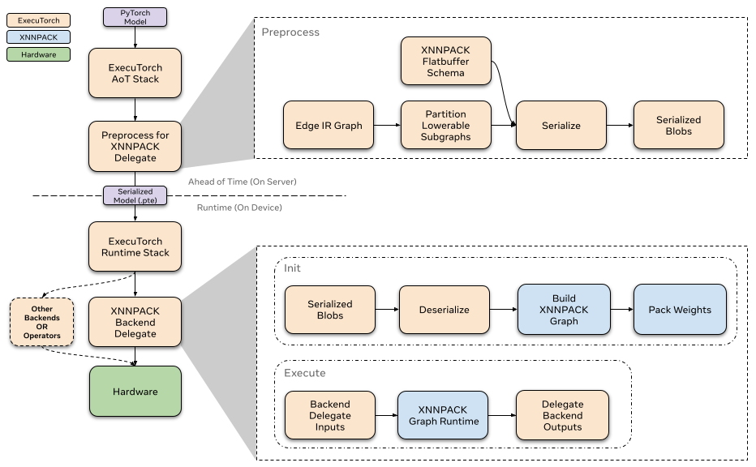

# ExecuTorch XNNPACK delegate

This is a high-level overview of the ExecuTorch XNNPACK backend delegate. This high performance delegate is aimed to reduce CPU inference latency for ExecuTorch models. We will provide a brief introduction to the XNNPACK library and explore the delegate’s overall architecture and intended use cases.

## What is XNNPACK?
XNNPACK is a library of highly-optimized neural network operators for ARM, x86, and WebAssembly architectures in Android, iOS, Windows, Linux, and macOS environments. It is an open source project, you can find more information about it on [github](https://github.com/google/XNNPACK).

## What are ExecuTorch delegates?
A delegate is an entry point for backends to process and execute parts of the ExecuTorch program. Delegated portions of ExecuTorch models hand off execution to backends. The XNNPACK backend delegate is one of many available in ExecuTorch. It leverages the XNNPACK third-party library to accelerate ExecuTorch programs efficiently across a variety of CPUs. More detailed information on the delegates and developing your own delegates is available [here](compiler-delegate-and-partitioner.md). It is recommended that you get familiar with that content before continuing on to the Architecture section.

## Architecture


### Ahead-of-time
In the ExecuTorch export flow, lowering to the XNNPACK delegate happens at the `to_backend()` stage. In this stage, the model is partitioned by the `XnnpackPartitioner`. Partitioned sections of the graph are converted to a XNNPACK specific graph represenationed and then serialized via flatbuffer. The serialized flatbuffer is then ready to be deserialized and executed by the XNNPACK backend at runtime.


#### Partitioner
The partitioner is implemented by backend delegates to mark nodes suitable for lowering. The `XnnpackPartitioner` lowers using node targets and module metadata. Some more references for partitioners can be found [here](compiler-delegate-and-partitioner.md)

##### Module-based partitioning

`source_fn_stack` is embedded in the node’s metadata and gives information on where these nodes come from. For example, modules like `torch.nn.Linear` when captured and exported `to_edge` generate groups of nodes for their computation. The group of nodes associated with computing the linear module then has a `source_fn_stack` of `torch.nn.Linear. Partitioning based on `source_fn_stack` allows us to identify groups of nodes which are lowerable via XNNPACK.

For example after capturing `torch.nn.Linear` you would find the following key in the metadata for the addmm node associated with linear:
```python
>>> print(linear_node.meta["source_fn_stack"])
'source_fn_stack': ('fn', <class 'torch.nn.modules.linear.Linear'>)
```


##### Op-based partitioning

The `XnnpackPartitioner` also partitions using op targets. It traverses the graph and identifies individual nodes which are lowerable to XNNPACK. A drawback to module-based partitioning is that operators which come from [decompositions](https://github.com/pytorch/pytorch/blob/main/torch/_decomp/decompositions.py) may be skipped. For example, an operator like `torch.nn.Hardsigmoid` is decomposed into add, muls, divs, and clamps. While hardsigmoid is not lowerable, we can lower the decomposed ops. Relying on `source_fn_stack` metadata would skip these lowerables because they belong to a non-lowerable module, so in order to improve model performance, we greedily lower operators based on the op targets as well as the `source_fn_stack`.

##### Passes

Before any serialization, we apply passes on the subgraphs to prepare the graph. These passes are essentially graph transformations that help improve the performance of the delegate. We give an overview of the most significant passes and their function below. For a description of all passes see [here](https://github.com/pytorch/executorch/tree/main/backends/xnnpack/_passes):

* Channels Last Reshape
    * ExecuTorch tensors tend to be contiguous before passing them into delegates, while XNNPACK only accepts channels-last memory layout. This pass minimizes the number of permutation operators inserted to pass in channels-last memory format.
* Conv1d to Conv2d
    * Allows us to delegate Conv1d nodes by transforming them to Conv2d
* Conv and BN Fusion
    * Fuses batch norm operations with the previous convolution node

#### Serialiazation
After partitioning the lowerable subgraphs from the model, The XNNPACK delegate pre-processes these subgraphs and serializes them via flatbuffer for the XNNPACK backend.


##### Serialization Schema

The XNNPACK delegate uses flatbuffer for serialization. In order to improve runtime performance, the XNNPACK delegate’s flatbuffer [schema](https://github.com/pytorch/executorch/blob/main/backends/xnnpack/serialization/schema.fbs) mirrors the XNNPACK Library’s graph level API calls. The serialized data are arguments to XNNPACK’s APIs, so that at runtime, the XNNPACK execution graph can efficiently be created with successive calls to XNNPACK’s APIs.

### Runtime
The XNNPACK backend’s runtime interfaces with the ExecuTorch runtime through the custom `init` and `execute` function. Each delegated subgraph is contained in an individually serialized XNNPACK blob. When the model is initialized, ExecuTorch calls `init` on all XNNPACK Blobs to load the subgraph from serialized flatbuffer. After, when the model is executed, each subgraph is executed via the backend through the custom `execute` function. To read more about how delegate runtimes interface with ExecuTorch, refer to this [resource](compiler-delegate-and-partitioner.md).


#### **XNNPACK Library**
XNNPACK delegate supports CPU's on multiple platforms; more information on the supported hardware architectures can be found on the XNNPACK Library’s [README](https://github.com/google/XNNPACK).

#### **Init**
When calling XNNPACK delegate’s `init`, we deserialize the preprocessed blobs via flatbuffer. We define the nodes (operators) and edges (intermediate tensors) to build the XNNPACK execution graph using the information we serialized ahead-of-time. As we mentioned earlier, the majority of processing has been done ahead-of-time, so that at runtime we can just call the XNNPACK APIs with the serialized arguments in succession. As we define static data into the execution graph, XNNPACK performs weight packing at runtime to prepare static data like weights and biases for efficient execution. After creating the execution graph, we create the runtime object and pass it on to `execute`.

Since weight packing creates an extra copy of the weights inside XNNPACK, We free the original copy of the weights inside the preprocessed XNNPACK Blob, this allows us to remove some of the memory overhead.


#### **Execute**
When executing the XNNPACK subgraphs, we prepare the tensor inputs and outputs and feed them to the XNNPACK runtime graph. After executing the runtime graph, the output pointers are filled with the computed tensors.

#### **Profiling**
We have enabled basic profiling for XNNPACK delegate that can be enabled with the following compiler flag `-DENABLE_XNNPACK_PROFILING`. With ExecuTorch's Developer Tools integration, you can also now use the Developer Tools to profile the model. You can follow the steps in [Using the ExecuTorch Developer Tools to Profile a Model](./tutorials/devtools-integration-tutorial) on how to profile ExecuTorch models and use Developer Tools' Inspector API to view XNNPACK's internal profiling information.


[comment]: <> (TODO: Refactor quantizer to a more official quantization doc)
## Quantization
The XNNPACK delegate can also be used as a backend to execute symmetrically quantized models. For quantized model delegation, we quantize models using the `XNNPACKQuantizer`. `Quantizers` are backend specific, which means the `XNNPACKQuantizer` is configured to quantize models to leverage the quantized operators offered by the XNNPACK Library. We will not go over the details of how to implement your custom quantizer, you can follow the docs [here](https://pytorch.org/tutorials/prototype/pt2e_quantizer.html) to do so. However, we will provide a brief overview of how to quantize the model to leverage quantized execution of the XNNPACK delegate.

### Configuring the XNNPACKQuantizer

```python
from torch.ao.quantization.quantizer.xnnpack_quantizer import (
  XNNPACKQuantizer,
  get_symmetric_quantization_config,
)
quantizer = XNNPACKQuantizer()
quantizer.set_global(get_symmetric_quantization_config())
```
Here we initialize the `XNNPACKQuantizer` and set the quantization config to be symmetrically quantized. Symmetric quantization is when weights are symmetrically quantized with `qmin = -127` and `qmax = 127`, which forces the quantization zeropoints to be zero. `get_symmetric_quantization_config()` can be configured with the following arguments:
* `is_per_channel`
    * Weights are quantized across channels
* `is_qat`
    * Quantize aware training
* `is_dynamic`
    * Dynamic quantization

We can then configure the `XNNPACKQuantizer` as we wish. We set the following configs below as an example:
```python
quantizer.set_global(quantization_config)
    .set_object_type(torch.nn.Conv2d, quantization_config) # can configure by module type
    .set_object_type(torch.nn.functional.linear, quantization_config) # or torch functional op typea
    .set_module_name("foo.bar", quantization_config)  # or by module fully qualified name
```

### Quantizing your model with the XNNPACKQuantizer
After configuring our quantizer, we are now ready to quantize our model
```python
from torch.export import export_for_training

exported_model = export_for_training(model_to_quantize, example_inputs).module()
prepared_model = prepare_pt2e(exported_model, quantizer)
print(prepared_model.graph)
```
Prepare performs some Conv2d-BN fusion, and inserts quantization observers in the appropriate places. For Post-Training Quantization, we generally calibrate our model after this step. We run sample examples through the `prepared_model` to observe the statistics of the Tensors to calculate the quantization parameters.

Finally, we convert our model here:
```python
quantized_model = convert_pt2e(prepared_model)
print(quantized_model)
```
You will now see the Q/DQ representation of the model, which means `torch.ops.quantized_decomposed.dequantize_per_tensor` are inserted at quantized operator inputs and `torch.ops.quantized_decomposed.quantize_per_tensor` are inserted at operator outputs. Example:

```python
def _qdq_quantized_linear(
    x_i8, x_scale, x_zero_point, x_quant_min, x_quant_max,
    weight_i8, weight_scale, weight_zero_point, weight_quant_min, weight_quant_max,
    bias_fp32,
    out_scale, out_zero_point, out_quant_min, out_quant_max
):
    x_fp32 = torch.ops.quantized_decomposed.dequantize_per_tensor(
        x_i8, x_scale, x_zero_point, x_quant_min, x_quant_max, torch.int8)
    weight_fp32 = torch.ops.quantized_decomposed.dequantize_per_tensor(
        weight_i8, weight_scale, weight_zero_point, weight_quant_min, weight_quant_max, torch.int8)
    out_fp32 = torch.ops.aten.linear.default(x_fp32, weight_fp32, bias_fp32)
    out_i8 = torch.ops.quantized_decomposed.quantize_per_tensor(
        out_fp32, out_scale, out_zero_point, out_quant_min, out_quant_max, torch.int8)
    return out_i8
```


You can read more indepth explanations on PyTorch 2 quantization [here](https://pytorch.org/tutorials/prototype/pt2e_quant_ptq.html).

## See Also
- [Integrating XNNPACK Delegate Android App](demo-apps-android.md)
- [Complete the Lowering to XNNPACK Tutorial](tutorial-xnnpack-delegate-lowering.md)
