# New Contributor Guide

Welcome to **ExecuTorch** — a runtime for efficient deployment of PyTorch AI models to edge devices, including mobile phones, wearables, and embedded systems. ExecuTorch is proudly open-source and welcomes contributions from developers of all backgrounds.

If you're new to ExecuTorch, open-source projects, or GitHub, this guide is for you. We're excited to have you on board!

If you have any questions, issues, comments, or just want to say hello to our community, please feel free to introduce yourselves on our **[Discord Server](https://discord.com/invite/Dh43CKSAdc)**. We'd love to speak with you.

---

## 🔑 Prerequisites

### Git

This guide assumes a basic knowledge of Git, and how to run Git commands in your terminal. If you've never used Git before, you can read [this quick guide](https://www.freecodecamp.org/news/learn-the-basics-of-git-in-under-10-minutes-da548267cc91/), [git guide](https://rogerdudler.github.io/git-guide/), [cheat sheet](https://towardsdatascience.com/git-commands-cheat-sheet-software-developer-54f6aedc1c46/), the [Setup Git](https://docs.github.com/en/get-started/git-basics/set-up-git) page from GitHub’s documentation, or watch one of the many tutorials on YouTube.

Git is a powerful version control system for coding projects — it enables you to collaborate, record code changes, and avoid losing hours of work when you make a mistake. It is essential for projects like ExecuTorch with large codebases and many collaborators. Without it, the complexity of tracking everyone's changes, reviewing their code, and identifying bugs, quickly becomes unmanageable.

Git is an industry standard in the coding world, and particularly in open-source. It can take a while to get used to at first, but we promise you it's well worth the effort! We believe that learning Git can make you a significantly stronger and more effective developer.

### A GitHub Account

We also assume that you have a GitHub account. If you don't, please [register here](https://github.com/signup), [verify your email address](https://docs.github.com/en/account-and-profile/setting-up-and-managing-your-personal-account-on-github/managing-email-preferences/verifying-your-email-address#verifying-your-email-address) (required for the steps below to work!), then [login](https://github.com/login) to your new account before proceeding further.

---

## 🧑‍💻 Your First Contribution

The first step towards making a contribution is finding something you want to work on. If you're new to ExecuTorch or the wider world of open-source, it might seem hard to know where to start.

To help you out with this, we've gathered together some beginner-friendly suggestions.  These are self-contained pieces of work — "issues" in GitHub parlance — specifically designed to help people new to ExecuTorch get started contributing code. We call these "good first issues", and you can view all of them here: [New Contributors Projects and Issues](https://github.com/orgs/pytorch/projects/102/views/1).

Here's what the list looks like at the time of writing — you can see that they all have a purple `good first issue` label in the right-hand column:

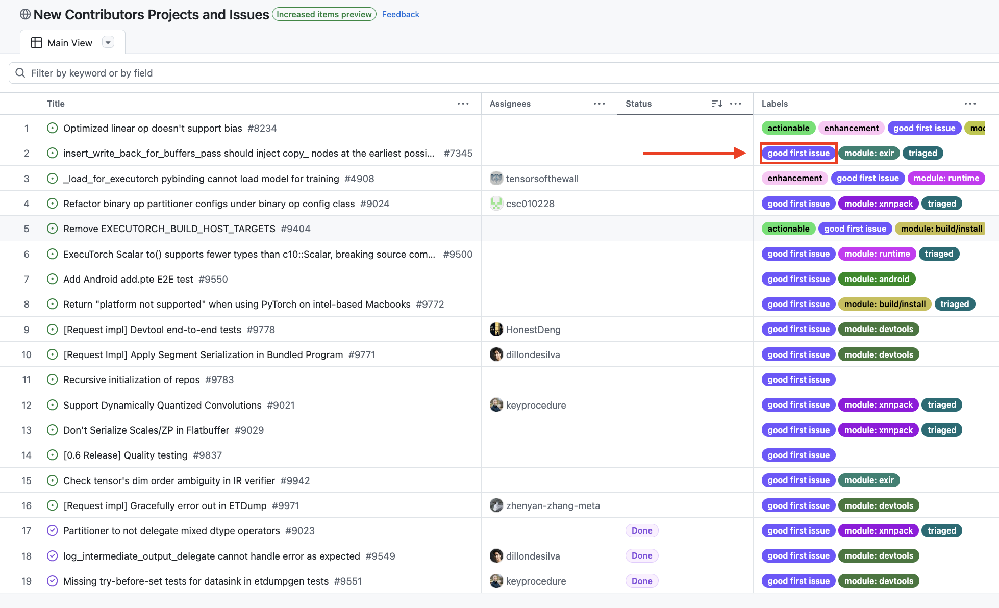

Please check it out and see if anything interests you! New issues are added to this list all the time.

Once you've found an issue you like the look of, read our [Contribution Guide](https://github.com/pytorch/executorch/blob/main/CONTRIBUTING.md). This comprehensive manual will help you:
* build ExecuTorch on your machine.
* understand the structure of the ExecuTorch codebase.
* format, test, and document your code according to ExecuTorch best practices.
* and finally, submit your code for review, so it can be polished, approved, and merged into the main codebase.

If that seems like a lot of information, please read on — we'll walk you through your first contribution right now.

---

## 📤 Contributing Code, Step-By-Step

### Prepare Your Workspace

Before you can start writing any code, you need to get a copy of ExecuTorch codebase onto your GitHub account, and download it onto your dev machine. You'll want to build it, too — otherwise, you won't be able to test your solution.

1. Fork the main ExecuTorch repository into your GitHub account. This creates a clone of the repository in your own space, so you can modify it freely. To do this, visit the [main repository page](https://github.com/pytorch/executorch) and click `Fork`:

    

    This will take you to another page. Click `Create fork`:

    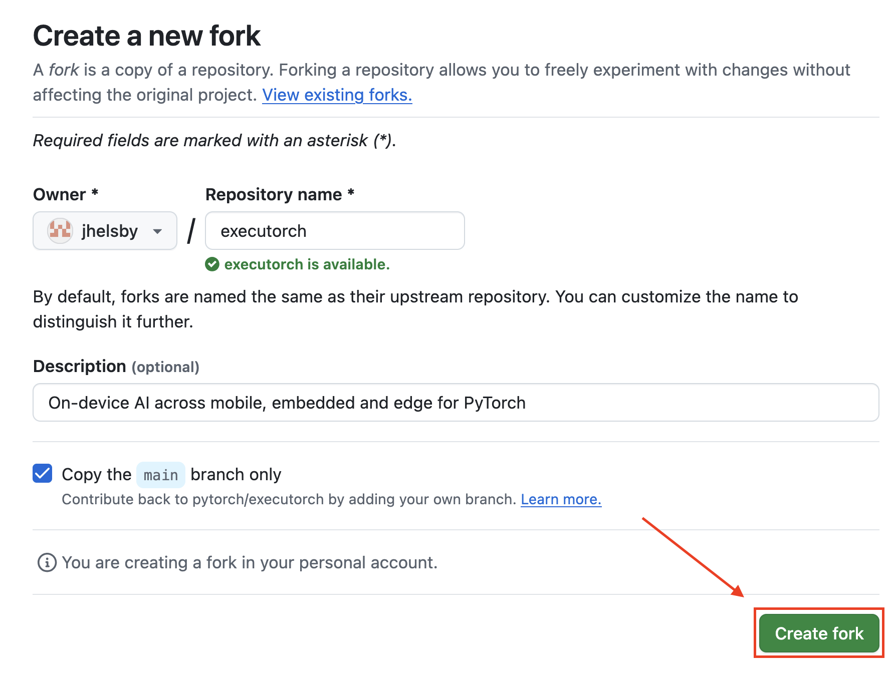

2. Clone your fork locally. This downloads a copy of your fork onto your dev machine, ready for you to make your changes.

    In the example below, we clone using HTTP, but any of the provided methods on the `Local` tab are fine. For HTTP, copy the URL given here:

    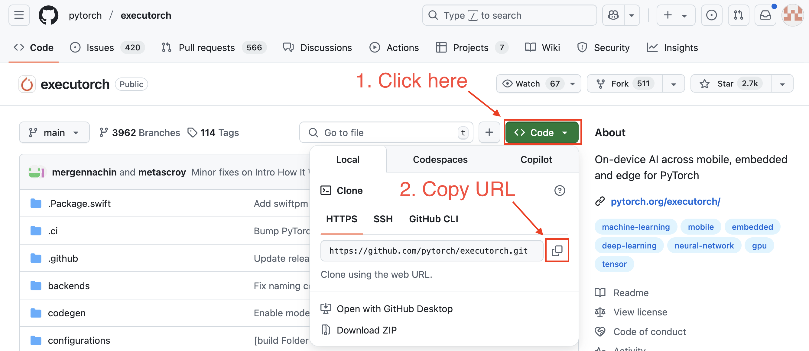

    Then go to your terminal, enter the directory you want to clone the fork to, and run:

    ```bash
    git clone https://github.com/pytorch/executorch.git
    ```

    This will create an `executorch` folder in your directory containing your forked codebase.

3.  Set the `upstream` pointing to the main ExecuTorch repository. This will allow you to easily synchronize with the latest development.

    Assuming you're in the same directory you cloned into, run:

    ```bash
    cd executorch # enter the cloned project
    git remote add upstream https://github.com/pytorch/executorch.git
    ```

    To see if it worked, run:

    ```bash
    git remote -v
    ```

    Depending on how you cloned your repo (HTTP, SSH, etc.), this should print something like:

    ```bash
    origin  https://github.com/{YOUR_GITHUB_USERNAME}/executorch.git (fetch)
    origin  https://github.com/{YOUR_GITHUB_USERNAME}/executorch.git (push)
    upstream        https://github.com/pytorch/executorch.git (fetch)
    upstream        https://github.com/pytorch/executorch.git (push)
    ```

    What does this mean? Well:

      * The `origin` entries show your forked GitHub repository. They tell you that when you run `git pull` or `git push`, your changes will go from/to your GitHub fork.

      * The `upstream` entries show the main ExecuTorch repository. If you want to sync the latest changes from there, you can run `git fetch upstream`.

    Let's sync from both your fork _and_ the main ExecuTorch branch, getting the latest changes from each of them. To do this, run:

    ```bash
    git fetch --all --prune
    ```

4. If you just cloned your fork, your GitHub repository will tell you your branch is up-to-date:

    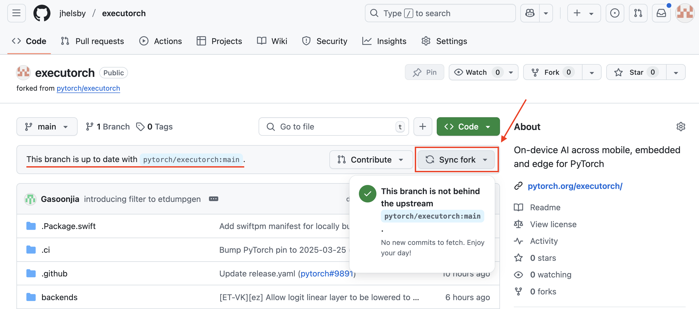

    However, ExecuTorch updates frequently — if it's been a while you visited your fork, you might not have the latest version anymore. It's important to keep your fork as up-to-date as possible. Otherwise, the code changes you're making might fix your issue for an old version of the codebase, but _not_ fix it for the current version.

    GitHub will tell you if your fork is out-of-date. To synchronise the necessary changes, click `Sync fork`, then `Update branch` as shown:

    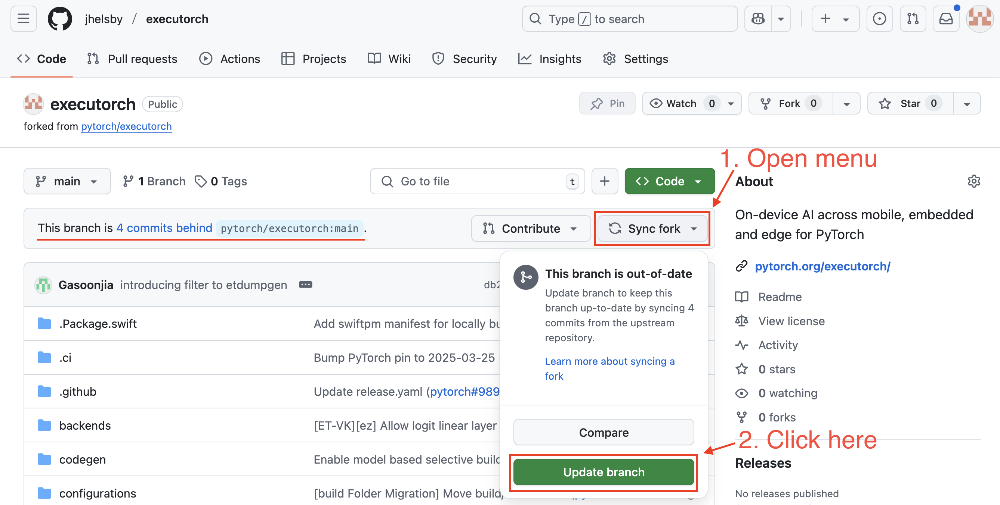

5. Now you have the latest fork on your GitHub account, it's time to download it onto your dev machine. For this, you can run the following commands in your terminal:

    ```bash
    git fetch --all --prune   # pull all branches from GitHub
    git checkout main         # enter your local main branch
    git merge upstream/main   # merge latest state from GitHub parent repo
    git push                  # push updated local main to your GitHub fork
    ```

6. [Build the project](using-executorch-building-from-source.md) and [run the tests](https://github.com/pytorch/executorch/blob/main/CONTRIBUTING.md#testing).

    Unfortunately, this step is too long to detail here. If you get stuck at any point, please feel free to ask for help on our [Discord server](https://discord.com/invite/Dh43CKSAdc) — we're always eager to help newcomers get onboarded.

One final note before we finish this section. It's very important to get your tests running at this stage, for two reasons:

* If they work, it's a great sign that you've got things set up correctly.

* As we'll discuss later, you'll want to run the tests _after_ making your changes to ensure you haven't broken existing functionality. Running them _before_ making your changes gives you a baseline you can compare with later test results.

### Implement your changes

Great job — you're all set up. Now you can actually start coding!

1. Before making any changes, we recommend creating a new branch. To do this, just run:
    ```bash
    git checkout -b YOUR_NEW_BRANCH_NAME
    ```

    You can follow this naming convention: `type/<short-name>`, where the types are: `bugfix`, `feature`, `docs`, `tests`, etc. — or use something similarly descriptive. By way of example, here are a few branch names that were actually merged to ExecuTorch:

    * [bugfix/op_eq](https://github.com/pytorch/executorch/pull/9794)

    * [error-handling-log-intermediate-output-delegate](https://github.com/pytorch/executorch/pull/9759)

    * [add-datasink-try-before-set-tests](https://github.com/pytorch/executorch/pull/9762)

    Creating a new branch means that any changes you make will be isolated to your branch, allowing you to work on multiple issues in parallel. It also means that, if your fork gets behind the main repository and you have to synchronise, you won't need to deal with any merge conflicts — accidentally blocking your `main` branch can be very time-consuming.

2. Make your changes. For bugfixes, we recommend a test-driven workflow:
    - Find a test case that demonstrates your bug.
    - Verify that your new test case fails on the `main` branch.
    - Add that example as an automated test, and assert the expected failing results. If you can, try to make this test as minimal as possible to reduce interference with some other issue.

    Once you have a failing test, you can keep working on the issue and running the test until it passes.

    **Note:** Even if you do not find the solution, sending a PR with a test covering the issue is a valid contribution. From this point, we can help you find the solution, or even finish it with you.

3. After every set of edits, checkpoint and commit your code changes with a "commit" message that describes the changes you made. For example, in terminal:

    ```bash
    git add my_changed_file1 my_new_test_case # Pick the files you changed
    git commit -m "Fixed bug X and added a passing test case" # Describe your change
    ```

    Try to make your commit messages as descriptive as possible. This helps to maintain a clear project history. Not only will this help your own development, but it will make your code vastly easier for other developers to review and maintain.

    Here are some example commit messages that were merged to ExecuTorch:

    * [Delete examples/demo-apps/apple_ios/ExecuTorchDemo directory](https://github.com/pytorch/executorch/pull/9991/commits/df2f451e5e8fc217231975d7a0065a8cc36709cb)
    * [[ET-VK][ez] Allow logit linear layer to be lowered to Vulkan](https://github.com/pytorch/executorch/pull/9951/commits/3fdd8cab8c58db0be666f3454c41f73ad5964743)
    * [Allow emitting mutable buffer names in schema](https://github.com/pytorch/executorch/pull/9935/commits/773a34725afea6c0bf1b99d02a9cefb91c4960e1)

4. When you are done making changes and the test case you added is passing, [run the same tests](https://github.com/pytorch/executorch/blob/main/CONTRIBUTING.md#testing) you ran earlier (at the end of the [Prepare Your Workspace](#prepare-your-workspace) section).

    If any tests fail now which were working before, it means your changes have broken some existing functionality. You'll need to dig back into your code to figure out what's gone wrong.

5. Once your new test _and_ the old tests are all working as intended, upload/push these changes to your fork:

    ```bash
    # Make sure you've committed all your changes first, then run:
    git push
    ```

### Submit a PR

Once you've successfully finished local development, it's time to send out your pull request. This is the final phase — here, we'll help you finetune your changes to get merged into the main repository.

1. After pushing your last edit to remote, your GitHub fork will show your new changed branch — click `Compare & pull request`:

    

    Alternatively, you can click the same `Compare & pull request` button on the main ExecuTorch repo:

    

    Another way still is via the `Pull request` tab on the main repo — we won't go into that here though, as it takes a few more steps.

2. This will take you to a page where you can format your PR and explain your changes. You'll see all the required details in our PR template. You should choose a title describing the proposed fix and fill in all the required details.

    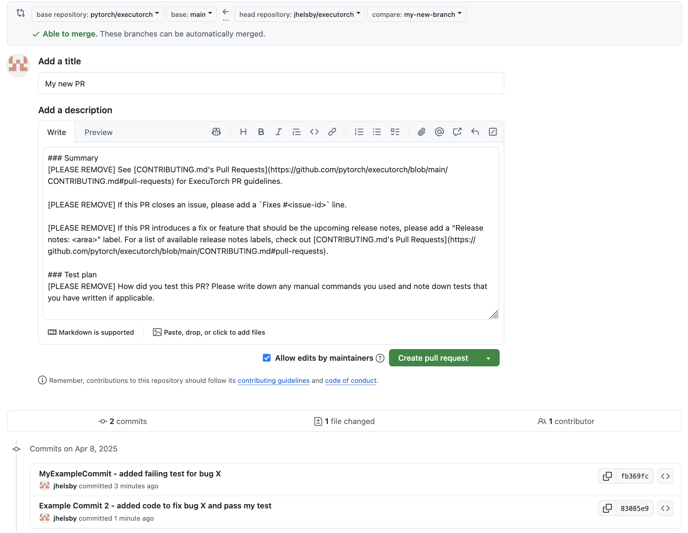

    In the description, you’ll describe all the changes you’ve made.

3. If you want to submit your PR right away, you can go ahead and click the Green `Create pull request` button. However, please note that this will immediately notify all reviewers. We strongly recommend creating a Draft PR first. This will allow you to perform some extra checks first:

    * You can get some early feedback on your PR without notifying everybody.

    * It prevents anyone from accidentally merging your unfinished PR.

    * Creating it will start CI (["Continuous Integration"](https://en.wikipedia.org/wiki/Continuous_integration)) checks to verify that all tests pass under various configurations. If some tests fail, you can fix them before creating the final PR.

    To do submit a draft, click the arrow next to the `Create Pull Request` button, then click `Create draft pull request` in the dropdown menu:

    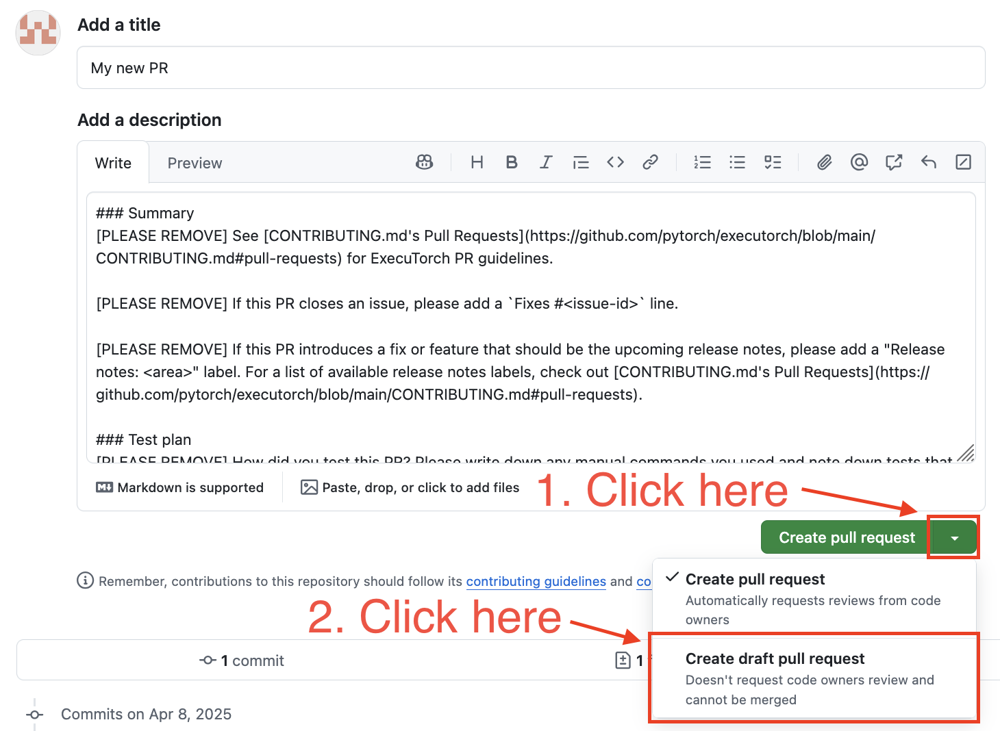

    This will change the green button's text to `Draft pull request`:

    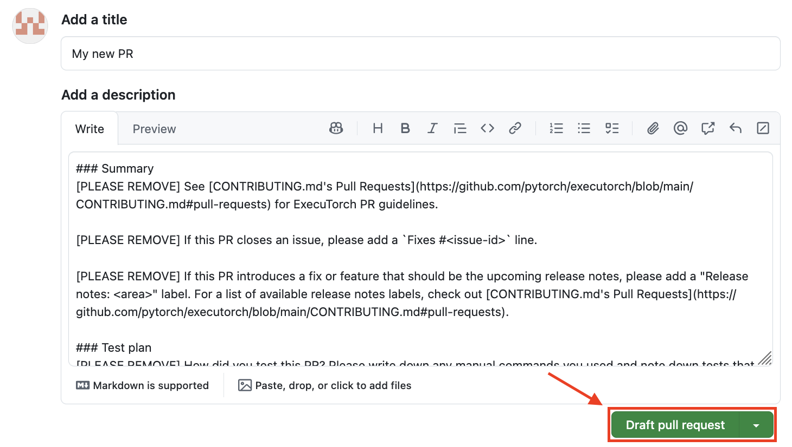

    Click it to create your draft PR.

4. This will take you to your Draft PR page. It might look something like this:

    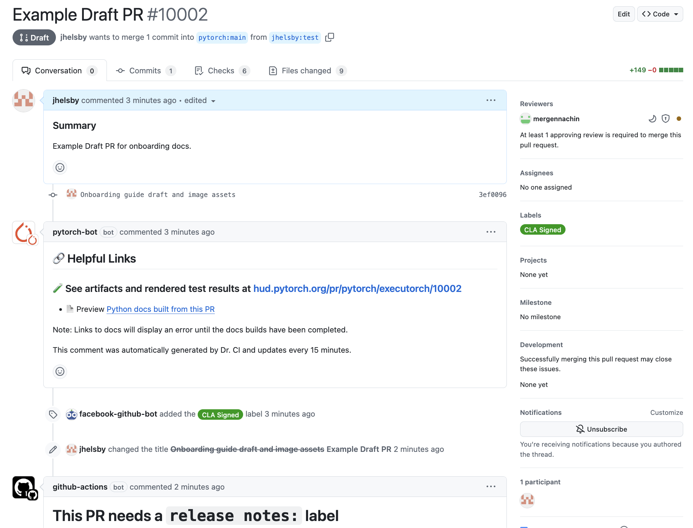

    As you scroll down, you might see a number of comments and automated checks, some of which may come with alarming red warning signs and the word "Failure"! There's no need to panic, though — they are here to help. Let's go through some common checks one-by-one.

    * The `pytorch-bot` will probably be the first comment. It runs regular CI checks. When your PR is passing, this comment will automatically update to let you know.

      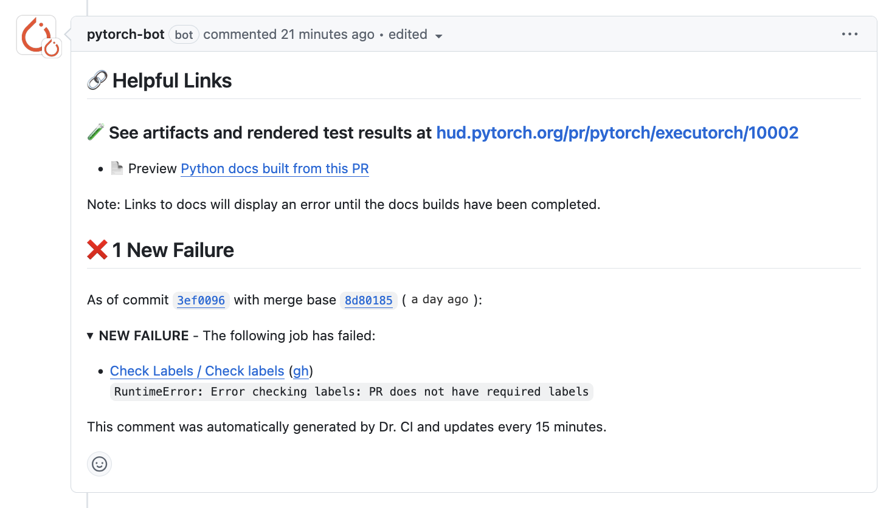

    * If this is your very first contribution to a Meta Open Source project, and you've not signed Meta's contributor license agreement (CLA), you may have a comment like this from `facebook-github-bot`:

        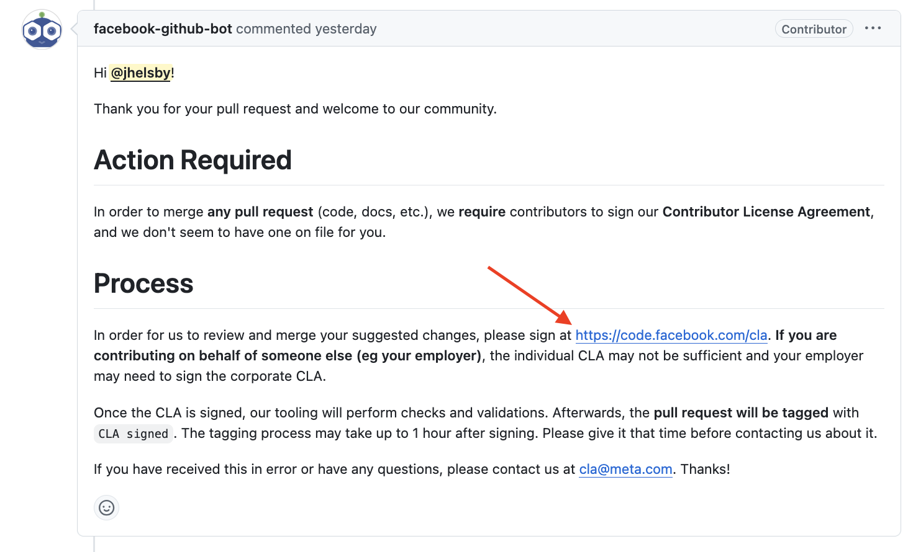

        You will need to sign the linked CLA to contribute your code. Once your signature has been processed, the bot will let you know in another comment:

        

    * You may see a comment from `github-actions` requesting a "release notes" label:

        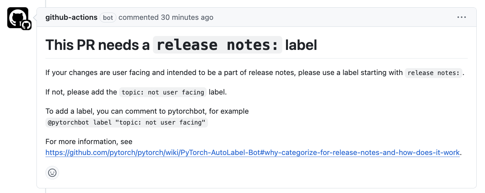

        As the comment says, you can add a label by commenting on the PR with an instruction to pytorchbot. You can see a list of all our labels [here](https://github.com/pytorch/executorch/labels/). Pick the one which fits your PR best, then add it as a comment using the syntax `@pytorchbot label "YOUR LABEL HERE"`. For example:

        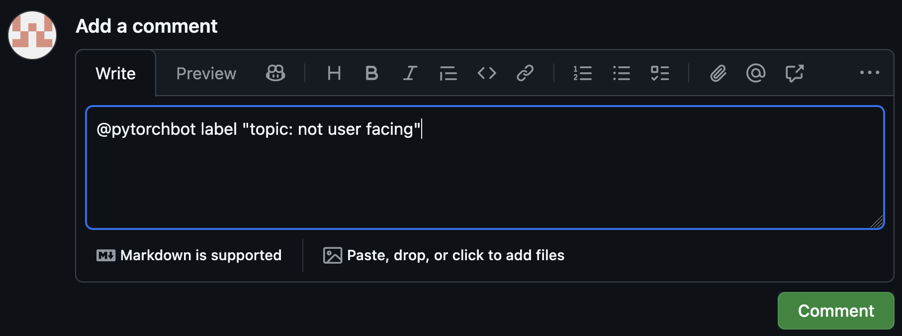

        After you've submitted your comment, `pytorchbot` will add your chosen label to the PR:

        

        and the `github-actions` comment requesting a label will disappear.

    * At the end of your Draft PR, you'll see something like this:

        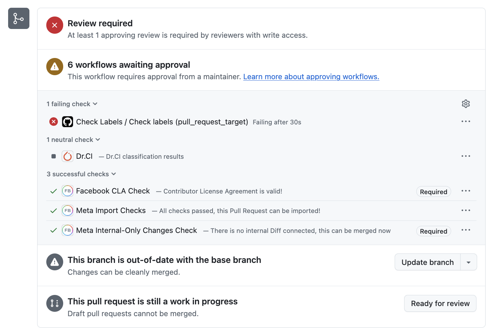

        This is a summary of all the CI checks and requirements which need to be satisfied before your PR can be merged. Ensure that all tests are passing. If not, click on a failing test to see what went wrong and make the required changes.

        Once you're happy with your draft, you can click the `Ready for review` button to create your PR:

        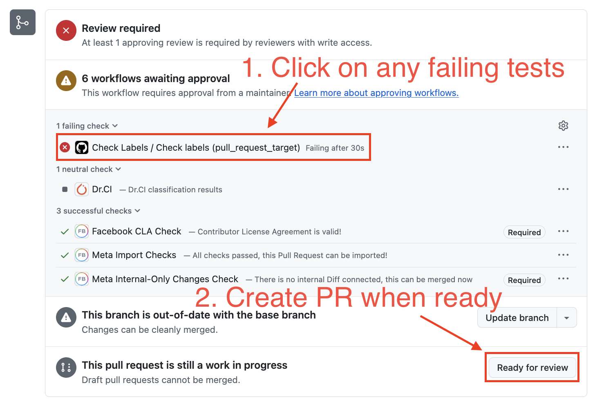

5. Now you've created your PR, it's time for your changes to be reviewed by the ExecuTorch community and maintainers.

    You'll need approval from one of our core contributors for your request to be merged. They may have questions or suggestions for you to address or respond to. Be aware that the review process may take a couple of iterations... Nevertheless, we hope that you'll find this feedback helpful. Code reviews can be a fantastic way to learn more about ExecuTorch and coding best practices from other contributors.

    Those reviewers/maintainers are here to finetune your contribution and eventually catch some issues before we merge the PR. We aim for this process to be pleasing on both sides: we try to give and get the best.

    Once the reviewers are happy, they'll approve your PR, indicating that they're happy for it to be merged. This will send you a notification and display as follows on your PR page:

    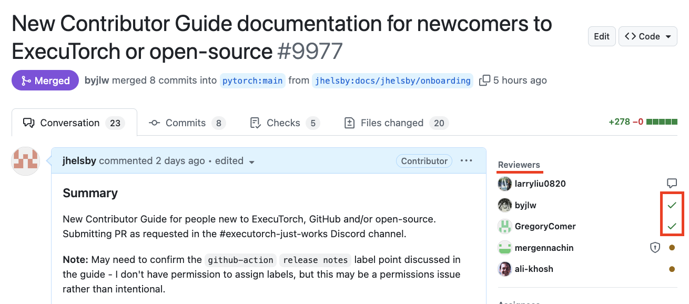

    And in the PR comments:

    

6. Once you've received the required approval from a core contributor, you're very nearly done. We just need to make sure all the CI checks have passed, some of which need approval from a maintainer to start:

    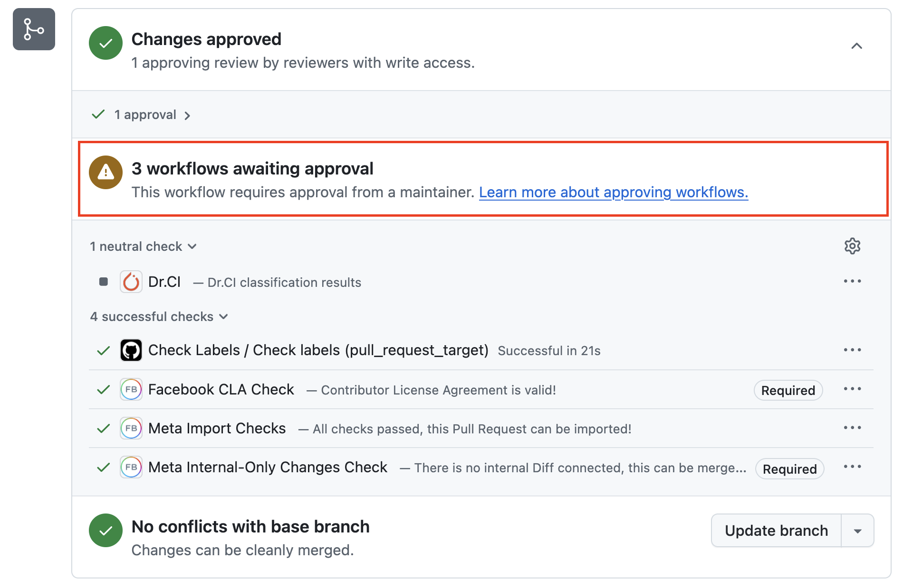

    Once all checks these have all been approved, ran, and passed, you can go ahead and merge your PR. If there's a grey `Update branch` button instead of a green `Merge pull request` button, click that first:

    

    After a moment, the branch should update with the latest changes, and you'll see the final green `Merge pull request` button:

    

    Click it to merge your changes into the main codebase. Congratulations — you're now an official ExecuTorch contributor!

Great job making it to the end of our guide — we hope you enjoy contributing. Once again, please check out our **[Discord Server](https://discord.com/invite/Dh43CKSAdc)** if you want to say hello, ask any questions, or talk about any and all things ExecuTorch. We look forward to receiving your contributions!
