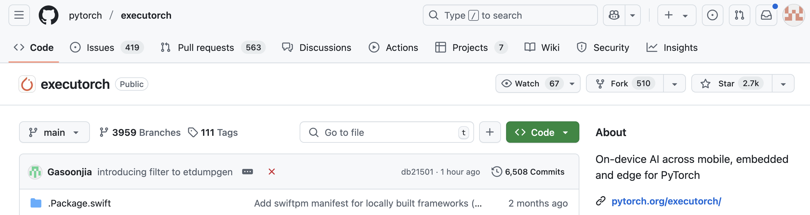
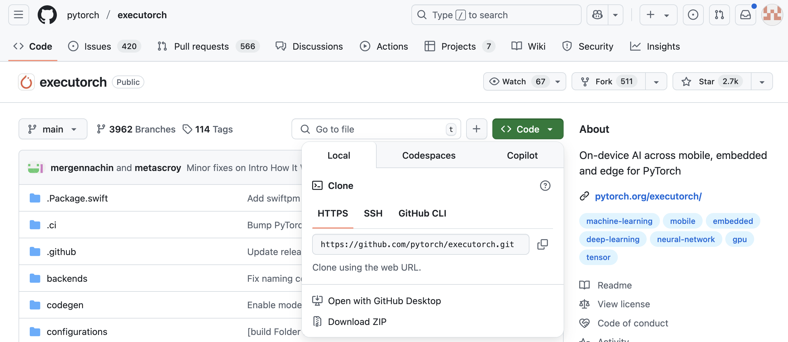
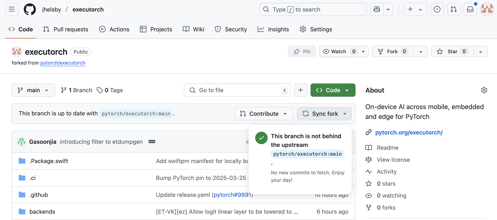
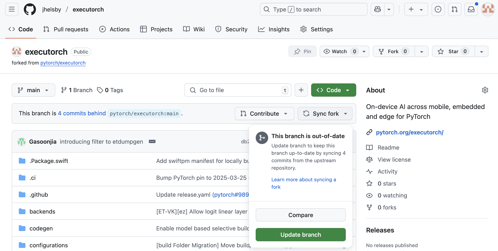
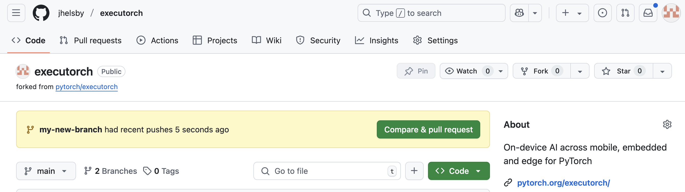
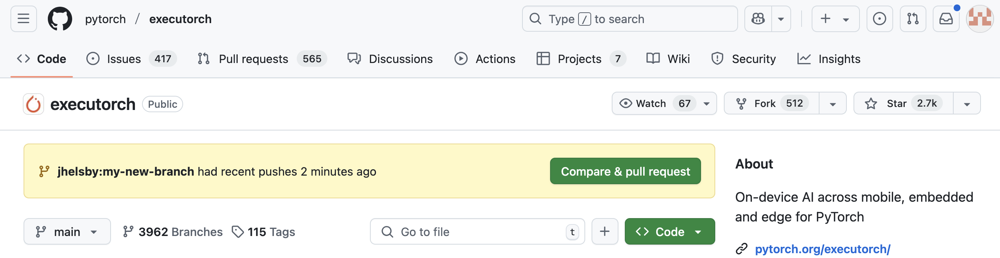
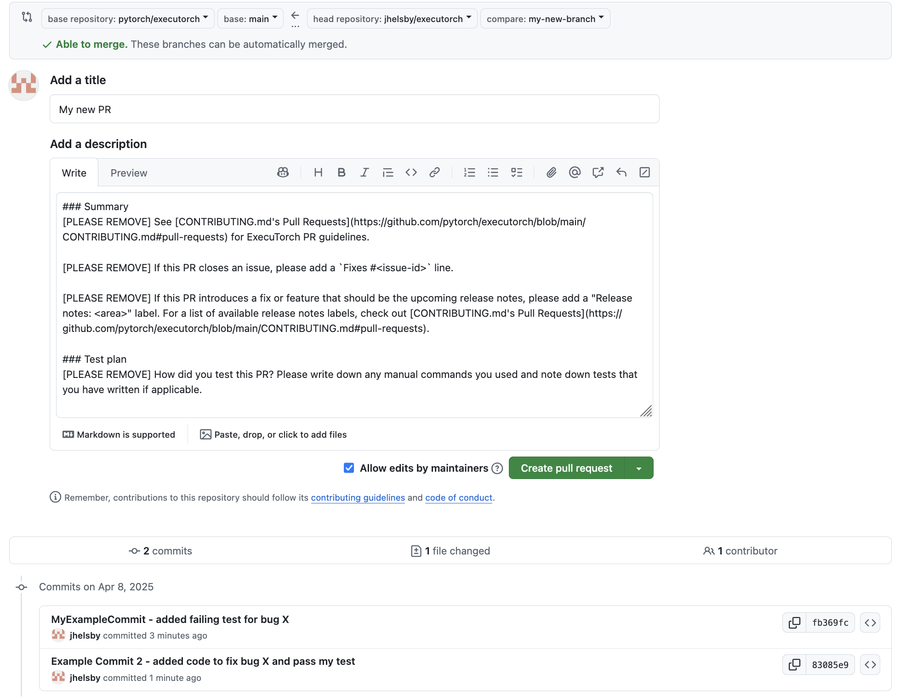

# ExecuTorch – Open-Source Onboarding Guide

Welcome to **ExecuTorch** — a runtime for efficient deployment of PyTorch AI models to edge devices, including mobile phones, wearables, and embedded systems. ExecuTorch is proudly open-source and welcomes contributions from developers of all backgrounds.

If you're new to ExecuTorch, open-source projects, or GitHub, this guide is for you. We're excited to have you on board!

---

## 🔑 Prerequisites

This guide assumes a basic knowledge of Git, and how to run Git commands in your terminal.

If you've never used Git before, you can read [this quick guide](https://www.freecodecamp.org/news/learn-the-basics-of-git-in-under-10-minutes-da548267cc91/), [git guide](https://rogerdudler.github.io/git-guide/), [cheat sheet](https://towardsdatascience.com/git-commands-cheat-sheet-software-developer-54f6aedc1c46/), the [Setup Git](https://docs.github.com/en/get-started/git-basics/set-up-git) page from GitHub’s documentation, or watch one of the many tutorials on YouTube. Git is a powerful version control system for large coding projects - it enables you to collaborate, record code changes, and avoid losing hours of work when you make a mistake.

We also assume that you have a GitHub account. If you don't, please [register here](https://github.com/signup) and log in before proceeding further.

---

## 🧑‍💻 Your First Contribution

The first step towards making a contribution is finding something you want to work on. If you're new to the world of open-source, it might seem hard to know where to start. To help you out with this, we've collated together many beginner-friendly "good first issues" here: [New Contributors Projects and Issues](https://github.com/orgs/pytorch/projects/102/views/1). Have a look and see if anything interests you — new issues are added to this list all the time.

Once you've found an issue you like the look of, read our [Contribution Guide](https://github.com/pytorch/executorch/blob/main/CONTRIBUTING.md). This comprehensive manual will help you:
* build ExecuTorch on your machine.
* understand the structure of the wider codebase.
* format, test, and document your code according to ExecuTorch best practices.
* and finally, submit your code for review, so it can be polished, approved, and merged into the main codebase.

If that seems like a lot of information, please read on — we'll walk you through your first contribution right now.

---

## 📤 Contributing Code, Step-By-Step

### Prepare Your Workspace

Before you can start writing any code, you need to get a copy of ExecuTorch codebase onto your GitHub account, and download it onto your dev machine. You'll want to build it, too — otherwise, you won't be able to test your solution.

1. Fork the main ExecuTorch repository into your GitHub account. This creates a clone of the repository in your own space, so you can modify it freely. To do this, visit the [main repository page](https://github.com/pytorch/executorch) and click `Fork`:

    

    This will take you to another page - click `Create fork`:

    

2. Clone your fork locally, and set the `upstream` pointing to the main ExecuTorch repository, so you can easily synchronize anytime with the latest development.

    In the example below, we use HTTP, but any of the provided methods on the `Local` tab are fine. For HTTP, copy the URL given here:

    

    Then go to your terminal, enter the directory you want to clone the fork to, and run:

    ```bash
    git clone https://github.com/pytorch/executorch.git
    cd executorch            # enter the cloned project
    git remote add upstream https://github.com/pytorch/executorch.git
    git remote -v            # to see what you are pointing at...
    git fetch --all --prune  # pull all branches and tags
    ```

4. If you just cloned your fork, your GitHub repository will tell you your branch is up-to-date:

    

    However, ExecuTorch updates frequently - if it's been a while you visited your fork, you might not have the latest version anymore. GitHub will tell you if your fork is out-of-date. To synchronise the necessary changes, click `Sync fork`, then `Update branch` as shown:

    

5. Now you have the latest fork on your GitHub account, it's time to download it onto your dev machine. For this, you can run the following commands in your terminal:

    ```bash
    git fetch --all --prune   # pull all branches from GitHub
    git checkout main         # enter your local main branch
    git merge upstream/main   # merge latest state from GitHub parent repo
    git push                  # push updated local main to your GitHub fork
    ```

6. [Build the project](https://pytorch.org/executorch/main/using-executorch-building-from-source.html) and [run the tests](https://github.com/pytorch/executorch/blob/main/CONTRIBUTING.md#testing).

    Unfortunately, this step is too long to detail here. If you get stuck at any point, please feel free to ask for help on our [Discord server](https://discord.com/invite/Dh43CKSAdc) — we're always eager to help newcomers get onboarded.

### Implement your changes

Great job — you're all set up. Now you can actually start coding!

1. Before making any changes, we recommend creating a new branch. To do this, just run:
    ```bash
    git checkout -b YOUR_NEW_BRANCH_NAME
    ```

    You can follow this naming convention: `<type>/<issue-id>_<short-name>`, where the types are: `bugfix`, `feature`, `docs`, `tests`, etc.

    Creating a new branch means that any changes you make will be isolated to your branch, allowing you to work on multiple issues in parallel. It also means that, if your fork gets behind the main repository and you have to synchronise, you won't need to deal with any merge conflicts — accidentally blocking your `main` branch can be very time-consuming.

2. Make your changes. For bugfixes, we recommend a test-driven workflow:
    - Find a test case that demonstrates your bug.
    - Verify that your new test case fails on the `main` branch.
    - Add that example as an automated test, and assert the expected, failing results. If you can, try to make this test as minimal as possible to reduce interference with some other issue.

    Once you have a failing test, you can keep working on the issue and running the test until it passes.

    **Note:** Even if you do not find the solution, sending a PR with a test covering the issue is a valid contribution. From this point, we can help you find the solution, or even finish it with you.

3. After every set of edits, checkpoint and commit your code changes with a "commit" message that describes the changes you made. For example, in terminal:

    ```bash
    git add my_changed_file1 my_new_test_case # Pick the files you changed
    git commit -m "Fixed bug X and added a passing test case" # Describe your change
    ```

4. When you are done making changes and the test case you added is passing, upload/push these changes to your fork:

    ```bash
    # Make sure you've committed all your changes first, then run:
    git push
    ```

### Submit a PR

Once you've successfully finished local development, it's time to send out your pull request. This is the final phase — here, we'll help you finetune your changes to get merged into the main repository.

1. After pushing your last edit to remote, your GitHub fork will show your new changed branch — click `Compare & pull request`:

    

    Alternatively, you can click the same `Compare & pull request` button on the main ExecuTorch repo:

    

    Another way still is via the `Pull request` tab on the main repo — we won't go into that here though, as it takes a few more steps.

2. This will take you to a page where you can format your PR and explain your changes. You'll see all the required details in our PR template. You should choose a title describing the proposed fix and fill in all the required details.

    

    In the description, you’ll describe all the changes you’ve made.

    Ensure that all tests are passing. If not, click on a failing test to see what went wrong and make the required changes.

3. If everything looks good and you are ready for review, click the `Create Pull Request` button. We recommend starting with a draft PR, which will start CI (["Continuous Integration"](https://en.wikipedia.org/wiki/Continuous_integration)) to verify that all tests pass under various configurations before you notify all reviewers and get the first rounds of comments.

    You'll need approval from 3 of our core contributors for your request to be merged. They may have questions or suggestions for you to address or respond to. Be aware that the review process may take a couple of iterations... Nevertheless, this feedback can be helpful for you as you learn more about ExecuTorch or coding best practices from other contributors.

    Those reviewers/maintainers are here to finetune your contribution and eventually catch some issues before we merge the PR. This process shall be pleasing on both sides — we try to give and get the best.


That's it! Congratulations on reaching the end of our guide. If you have any questions, ideas, or feedback, please feel free to join the conversation on our **[Discord Server](https://discord.com/invite/Dh43CKSAdc)**.
