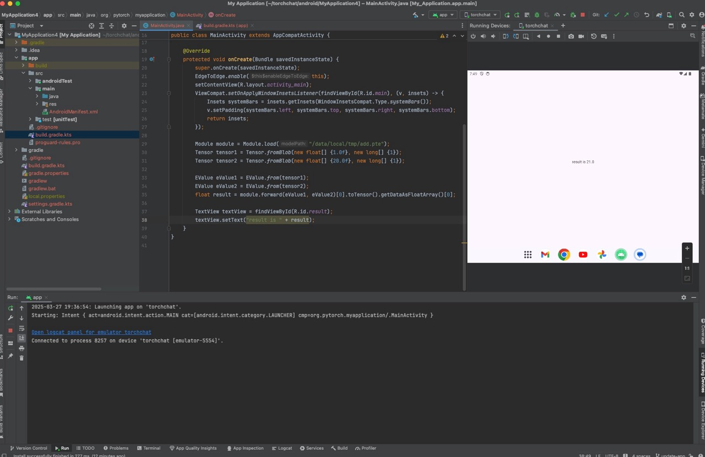

# Using ExecuTorch on Android

🚀 Quick Start: __New to ExecuTorch__ ? Jump to [Using AAR from Maven Central](#using-aar-from-maven-central) for the fastest setup, then see the [Runtime Integration](#runtime-integration) example.

For Android applications, ExecuTorch provides Java/Kotlin bindings and platform
integration in an AAR. You can instead use the C++ APIs from Android native
code; see [Cross-Compiling for Android](using-executorch-building-from-source.md#cross-compiling-for-android).

```{warning}
The Java/Kotlin `Module` and task-level APIs are experimental and may change or
be removed without notice. Android applications can use the stable C++ runtime
through native code when API stability is required.
```

## Installation

__Choose your installation method:__

- __[Maven Central](#using-aar-from-maven-central)__ (recommended): Easiest for most developers
- __[Direct AAR file](#using-aar-file-directly)__: For specific versions or offline development
- __[Build from source](#building-from-source)__: For custom backends or contributions

ExecuTorch Android libraries are packaged into an Android library (AAR),
`executorch.aar`, for generic and task-level use cases. Prebuilt artifacts are
published to Maven Central and S3. Users can also build the AAR from source.

### Contents of library

The AAR artifact contains the Java library for users to integrate with their Java/Kotlin application code, as well as the corresponding JNI library (.so file), which is loaded by the Java code during initialization.

- [Java library](https://github.com/pytorch/executorch/tree/main/extension/android/executorch_android/src/main/java/org/pytorch/executorch)
- [Java API Reference (Javadoc)](https://pytorch.org/executorch/main/javadoc/index.html)
- JNI contains the JNI binding for the corresponding Java code, and ExecuTorch native library, including
  - Core ExecuTorch runtime libraries
  - XNNPACK backend
  - Portable kernels
  - Optimized kernels
  - Quantized kernels
  - LLaMa-specific Custom ops library.
- The default XNNPACK AAR comes with `arm64-v8a` and `x86_64` variants.

The AAR library can be used across form factors, including phones, tablets,
and TV boxes, because it does not contain UI components. Backend-specific
packages may support fewer ABIs; for example, the QNN release AAR is
`arm64-v8a` only.

## Using AAR from Maven Central

✅ Recommended for most developers
ExecuTorch is available on Maven Central.
Add `org.pytorch:executorch-android` to your app's Gradle dependencies. Replace
`X.Y.Z` with a version from Maven Central that matches the ExecuTorch release
used to export the model:

```kotlin
// app/build.gradle.kts
val executorchVersion = "X.Y.Z"

dependencies {
    implementation("org.pytorch:executorch-android:$executorchVersion")
}
```

[Choose a version on Maven Central](https://central.sonatype.com/artifact/org.pytorch/executorch-android).
Click the screenshot below to watch the demo video on how to add the package and run a simple ExecuTorch model with Android Studio.
<a href="_static/img/android_studio.mp4">

</a>

## Using AAR file directly

You can also add an AAR file directly. Stable release AARs are
backend-specific. Set `executorch_version` to the release used for export and
`executorch_backend` to `xnnpack`, `qnn`, or `vulkan`, then download both the
artifact and its checksum:

```sh
# For release tag v1.4.1, omit the leading "v" from the artifact path.
executorch_version=1.4.1
executorch_backend=xnnpack
curl -fLO "https://ossci-android.s3.amazonaws.com/executorch/release/${executorch_version}-${executorch_backend}/executorch.aar"
curl -fLO "https://ossci-android.s3.amazonaws.com/executorch/release/${executorch_version}-${executorch_backend}/executorch.aar.sha256sums"
shasum -a 256 -c executorch.aar.sha256sums
```

### Snapshots from main branch

Starting from 2025-04-12, you can download nightly `main` branch snapshots:

* `executorch.aar`: `https://ossci-android.s3.amazonaws.com/executorch/release/snapshot-{YYYYMMDD}/executorch.aar`
* `executorch.aar.sha256sums`: `https://ossci-android.s3.amazonaws.com/executorch/release/snapshot-{YYYYMMDD}/executorch.aar.sha256sums`
* Replace `YYYYMMDD` with the actual date you want to use.
* AAR file is generated by [this workflow](https://github.com/pytorch/executorch/blob/main/.github/workflows/android-release-artifacts.yml).

For example:

```sh
curl -fLO https://ossci-android.s3.amazonaws.com/executorch/release/snapshot-20250412/executorch.aar
curl -fLO https://ossci-android.s3.amazonaws.com/executorch/release/snapshot-20250412/executorch.aar.sha256sums
shasum -a 256 -c executorch.aar.sha256sums
```

We aim to make every daily snapshot available and usable. However, for best stability, please use releases, not snapshots.

## Using AAR file

To add the AAR file to your app:
Download the AAR.
Add it to your gradle build rule as a file path.
An AAR file does not carry the dependency metadata that Maven resolves. Declare
the dependencies used by the published package explicitly:

```kotlin
implementation("com.facebook.fbjni:fbjni:0.7.0")
implementation("com.facebook.soloader:nativeloader:0.10.5")
implementation("androidx.core:core-ktx:1.13.1")
implementation("org.jetbrains.kotlin:kotlin-stdlib:1.9.23")
```

### Example usage

In your app working directory, such as `executorch-examples/llm/android/LlamaDemo`,

```sh
mkdir -p app/libs
cp /path/to/executorch.aar app/libs/executorch.aar
```

And include it in gradle:

```kotlin
// app/build.gradle.kts
dependencies {
    implementation(files("libs/executorch.aar"))
    implementation("com.facebook.fbjni:fbjni:0.7.0")
    implementation("com.facebook.soloader:nativeloader:0.10.5")
    implementation("androidx.core:core-ktx:1.13.1")
    implementation("org.jetbrains.kotlin:kotlin-stdlib:1.9.23")
}
```

Now you can compile your app with the ExecuTorch Android library.

## Building from Source

```text
./scripts/build_android_library.sh
```

is a helper script to build the Java library, native library, and packaged AAR.
Install JDK 17, Android SDK Platform 34, and Android NDK r28c (the version used
in ExecuTorch CI). Set `ANDROID_HOME` or `ANDROID_SDK_ROOT` to the SDK and
`ANDROID_NDK` to the NDK root (the directory containing `NOTICE`).

```sh
export ANDROID_HOME=/path/to/android/sdk
export ANDROID_NDK=/path/to/android/sdk/ndk/28.2.13676358
./scripts/build_android_library.sh
```

The build script also accepts `ANDROID_SDK` for backward compatibility; it
takes precedence when more than one SDK variable is set.

NOTE: Currently, XNNPACK backend is always built with the script.

### Optional environment variables

Optionally, set these environment variables before running build_android_library.sh.

- __ANDROID_ABIS__

Set environment variable ANDROID_ABIS to either arm64-v8a or x86_64 if you only need to build the native library for one ABI only.

```sh
export ANDROID_ABIS=arm64-v8a
```

  (Or)

```sh
export ANDROID_ABIS=x86_64
```

Then run the script.

```sh
./scripts/build_android_library.sh
```

- __EXECUTORCH_CMAKE_BUILD_TYPE__

Set environment variable EXECUTORCH_CMAKE_BUILD_TYPE to Release or Debug based on your needs.

- __Using MediaTek backend__

To use MediaTek backend, after installing and setting up the SDK, set NEURON_BUFFER_ALLOCATOR_LIB and NEURON_USDK_ADAPTER_LIB to the corresponding path.

- __Using Qualcomm AI Engine Backend (Dependencies)__

To use Qualcomm AI Engine Backend, ensure your Android app configuration includes the [QNN Runtime Maven dependency](https://mvnrepository.com/artifact/com.qualcomm.qti/qnn-runtime), and after installing and setting up the SDK, set QNN_SDK_ROOT to the corresponding path.

- __Using Vulkan Backend__

To use Vulkan Backend, set EXECUTORCH_BUILD_VULKAN to ON.

## Android Backends

The following backends are available for Android:

| Backend | Type | Doc |
| ------- | -------- | --- |
| [XNNPACK](https://github.com/google/XNNPACK) | CPU | [Doc](backends/xnnpack/xnnpack-overview.md) |
| [MediaTek NeuroPilot](https://neuropilot.mediatek.com/) | NPU | [Doc](backends-mediatek.md) |
| [Qualcomm AI Engine](https://www.qualcomm.com/developer/software/qualcomm-ai-engine-direct-sdk) | NPU | [Doc](backends-qualcomm.md) |
| Arm VGF | GPU | [Doc](backends/arm-vgf/arm-vgf-overview.md) |
| Samsung Exynos | NPU / DSP | [Doc](backends/samsung/samsung-overview.md) |
| [Vulkan](https://www.vulkan.org/) | GPU | [Doc](backends/vulkan/vulkan-overview.md) |

Start with XNNPACK (CPU backend) for maximum compatibility, then add hardware-specific backends for optimization.

## Runtime Integration

First export the test model into your app's assets from an ExecuTorch source
checkout with its Python package installed:

```sh
mkdir -p /path/to/app/src/main/assets
python -m test.models.export_program --modules ModuleAdd \
  --outdir /path/to/app/src/main/assets
```

Android applications cannot normally read files pushed to `/data/local/tmp`.
Copy the asset to app-private storage before loading it:

```kotlin
import android.app.Activity
import android.os.Bundle
import java.io.File
import org.pytorch.executorch.EValue
import org.pytorch.executorch.Module
import org.pytorch.executorch.Tensor

class MainActivity : Activity() {
    override fun onCreate(savedInstanceState: Bundle?) {
        super.onCreate(savedInstanceState)

        val modelFile = File(filesDir, "ModuleAdd.pte")
        assets.open("ModuleAdd.pte").use { input ->
            modelFile.outputStream().use { output -> input.copyTo(output) }
        }

        val x = Tensor.fromBlob(floatArrayOf(1f, 2f, 3f, 4f), longArrayOf(2, 2))
        val y = Tensor.fromBlob(floatArrayOf(5f, 6f, 7f, 8f), longArrayOf(2, 2))

        Module.load(modelFile.absolutePath).use { module ->
            val outputs = module.forward(EValue.from(x), EValue.from(y), EValue.from(1.0))
            check(outputs[0].toTensor().dataAsFloatArray.contentEquals(
                floatArrayOf(6f, 8f, 10f, 12f)
            ))
        }
    }
}
```

Please use [DeepLabV3AndroidDemo](https://github.com/meta-pytorch/executorch-examples/tree/main/dl3/android/DeepLabV3Demo)
and [LlamaDemo](https://github.com/meta-pytorch/executorch-examples/tree/main/llm/android/LlamaDemo) for the code examples
using ExecuTorch AAR package.

## Java API reference

Please see [Java API reference](https://pytorch.org/executorch/main/javadoc/index.html).
