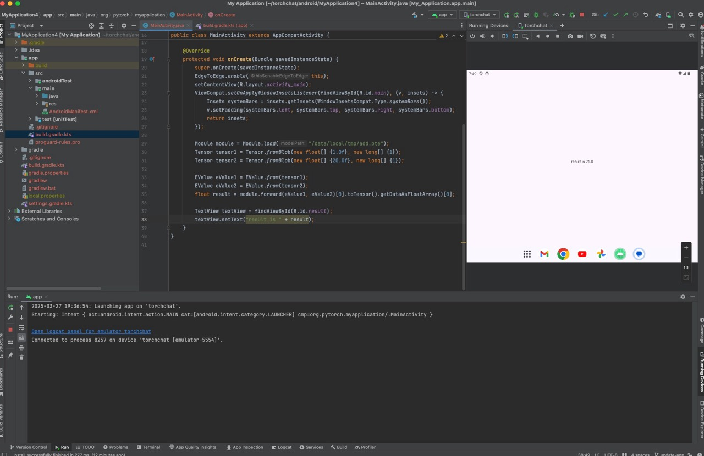

# Using ExecuTorch on Android

To use from Android, ExecuTorch provides Java/Kotlin API bindings and Android platform integration, available as an AAR file.

Note: This page covers Android app integration through the AAR library. The ExecuTorch C++ APIs can also be used from Android native, and the documentation can be found on [this page about cross compilation](using-executorch-building-from-source.md#cross-compilation).

## Installation

All ExecuTorch Android libraries are packaged into an [Android library (AAR)](https://developer.android.com/studio/projects/android-library), `executorch.aar` for both generic (image/audio processing) and LLM (LLaMA) use case. In each release, prebuilt AAR artifacts are uploaded to [Maven](https://repo.maven.apache.org/maven2/org/pytorch/executorch-android/) and S3. Users can also build the AAR from source.

### Contents of library

The AAR artifact contains the Java library for users to integrate with their Java/Kotlin application code, as well as the corresponding JNI library (.so file), which is loaded by the Java code during initialization.

- [Java library](https://github.com/pytorch/executorch/tree/main/extension/android/executorch_android/src/main/java/org/pytorch/executorch)
- JNI contains the JNI binding for the corresponding Java code, and ExecuTorch native library, including
  - core ExecuTorch runtime libraries
  - XNNPACK backend
  - Portable kernels
  - Optimized kernels
  - Quantized kernels
  - LLaMa-specific Custom ops library.
- Comes with two ABI variants, arm64-v8a and x86\_64.

The AAR library can be used for generic Android device with arm64-v8a or x86_64 architecture. It can be used across form factors, including phones, tablets, tv boxes, etc, as it does not contain any UI components.

## Using AAR from Maven Central

ExecuTorch is available on [Maven Central](https://mvnrepository.com/artifact/org.pytorch/executorch-android).

Simply add the target [`org.pytorch:executorch-android:${executorch_version}`](https://repo.maven.apache.org/maven2/org/pytorch/executorch-android/${executorch_version}/) to your Android app dependency (build.gradle), and build your app.

For example:
```
# app/build.gradle.kts
dependencies {
    implementation("org.pytorch:executorch-android:${executorch_version}")
}
```

Note: If you want to use release v0.5.0, please use dependency `org.pytorch:executorch-android:0.5.1`.

Click the screenshot below to watch the *demo video* on how to add the package and run a simple ExecuTorch model with Android Studio.
<a href="_static/img/android_studio.mp4">
  
</a>

## Using AAR file directly

You can also directly specify an AAR file in the app. We upload pre-built AAR to S3 during each release, or as a snapshot.

### Released versions (recommended)

| Version | AAR | SHASUMS |
| ------- | --- | ------- |
| [${executorch_version}](https://github.com/pytorch/executorch/releases/tag/${executorch_version}) | [executorch.aar](https://ossci-android.s3.amazonaws.com/executorch/release/${executorch_version}/executorch.aar) | [executorch.aar.sha256sums](https://ossci-android.s3.amazonaws.com/executorch/release/${executorch_version}/executorch.aar.sha256sums) |
| [v0.6.0](https://github.com/pytorch/executorch/releases/tag/v0.6.0) | [executorch.aar](https://ossci-android.s3.amazonaws.com/executorch/release/v0.6.0/executorch.aar) | [executorch.aar.sha256sums](https://ossci-android.s3.amazonaws.com/executorch/release/v0.6.0/executorch.aar.sha256sums) |
| [v0.5.0](https://github.com/pytorch/executorch/releases/tag/v0.5.0) | [executorch.aar](https://ossci-android.s3.amazonaws.com/executorch/release/v0.5.0-rc3/executorch.aar) | [executorch.aar.sha256sums](https://ossci-android.s3.amazonaws.com/executorch/release/v0.5.0-rc3/executorch.aar.sha256sums) |

### Snapshots from main branch

Starting from 2025-04-12, you can download nightly `main` branch snapshots:
* `executorch.aar`: `https://ossci-android.s3.amazonaws.com/executorch/release/snapshot-{YYYYMMDD}/executorch.aar`
* `executorch.aar.sha256sums`: `https://ossci-android.s3.amazonaws.com/executorch/release/snapshot-{YYYYMMDD}/executorch.aar.sha256sums`
* Replace `YYYYMMDD` with the actual date you want to use.
* AAR file is generated by [this workflow](https://github.com/pytorch/executorch/blob/c66b37d010c88a113560693b14dc6bd112593c11/.github/workflows/android-release-artifacts.yml#L14-L15).

For example:

```sh
curl -O https://ossci-android.s3.amazonaws.com/executorch/release/snapshot-20250412/executorch.aar
curl -O https://ossci-android.s3.amazonaws.com/executorch/release/snapshot-20250412/executorch.aar.sha256sums
```

We aim to make every daily snapshot available and useable. However, for best stability, please use releases, not snapshots.

## Using AAR file

To add the AAR file to your app:
1. Download the AAR.
2. Add it to your gradle build rule as a file path.

An AAR file itself does not contain dependency info, unlike the Maven one which bundled with pom.xml. The Java package requires `fbjni` and `soloader`, and currently requires users to explicitly declare the dependency. Therefore, two more `dependencies` in gradle rule is required:
```
implementation("com.facebook.soloader:soloader:0.10.5")
implementation("com.facebook.fbjni:fbjni:0.5.1")
```

### Example usage

In your app working directory, such as executorch/examples/demo-apps/android/LlamaDemo,
```
mkdir -p app/libs
curl https://ossci-android.s3.amazonaws.com/executorch/release/${executorch_version}/executorch.aar -o app/libs/executorch.aar
```

And include it in gradle:
```
# app/build.gradle.kts
dependencies {
    implementation(files("libs/executorch.aar"))
    implementation("com.facebook.soloader:soloader:0.10.5")
    implementation("com.facebook.fbjni:fbjni:0.5.1")
}
```

Now you can compile your app with the ExecuTorch Android library.

## Building from Source

`scripts/build_android_library.sh` is a helper script to build the Java library (into .jar), native library (into .so), and the packaged AAR file.

You need Android [SDK](https://developer.android.com/studio) and [NDK](https://developer.android.com/ndk/downloads) to use it.

Current NDK version used in ExecuTorch CI: r27b.

You need to set `ANDROID_HOME` to Android SDK home and `ANDROID_NDK` to the correct NDK root (containing NOTICE file).

```
export ANDROID_HOME=/path/to/sdk
export ANDROID_NDK=/path/to/ndk
sh scripts/build_android_library.sh
```

Currently, XNNPACK backend is always built with the script.

### Optional environment variables

Optionally, set these environment variables before running `build_android_library.sh`.

#### ANDROID_ABIS
Set environment variable `ANDROID_ABIS` to either `arm64-v8a` or `x86_64` if you only need to build the native library for one ABI only.
```
export ANDROID_ABIS=arm64-v8a
# or
# export ANDROID_ABIS=x86_64
sh scripts/build_android_library.sh
```

#### EXECUTORCH_CMAKE_BUILD_TYPE
Set environment variable `EXECUTORCH_CMAKE_BUILD_TYPE` to `Release` or `Debug` based on your needs.

#### Using MediaTek backend

To use [MediaTek backend](backends-mediatek.md),
after installing and setting up the SDK, set `NEURON_BUFFER_ALLOCATOR_LIB` and `NEURON_USDK_ADAPTER_LIB` to the corresponding path.

#### Using Qualcomm AI Engine Backend

To use [Qualcomm AI Engine Backend](backends-qualcomm.md#qualcomm-ai-engine-backend),
after installing and setting up the SDK, set `QNN_SDK_ROOT` to the corresponding path.

#### Using Vulkan Backend

To use [Vulkan Backend](backends-vulkan.md#vulkan-backend),
set `EXECUTORCH_BUILD_VULKAN` to `ON`.

## Android Backends

The following backends are available for Android:

| Backend | Type | Doc |
| ------- | -------- | --- |
| [XNNPACK](https://github.com/google/XNNPACK) | CPU | [Doc](backends-xnnpack.md) |
| [MediaTek NeuroPilot](https://neuropilot.mediatek.com/) | NPU | [Doc](backends-mediatek.md) |
| [Qualcomm AI Engine](https://www.qualcomm.com/developer/software/qualcomm-ai-engine-direct-sdk) | NPU | [Doc](backends-qualcomm.md) |
| [Vulkan](https://www.vulkan.org/) | GPU | [Doc](backends-vulkan.md) |


## Runtime Integration

Here is an example code sample in Java that demonstrates how to integrate ExecuTorch into an Android app:

```java
import org.pytorch.executorch.EValue;
import org.pytorch.executorch.Module;
import org.pytorch.executorch.Tensor;

public class MainActivity extends Activity {
    private Module module;

    @Override
    protected void onCreate(Bundle savedInstanceState) {
        super.onCreate(savedInstanceState);
        // Load the ExecuTorch module
        Module module = Module.load("/data/local/tmp/add.pte");
        Tensor tensor1 = Tensor.fromBlob(new float[] {1.0f}, new long[] {1});
        Tensor tensor2 = Tensor.fromBlob(new float[] {20.0f}, new long[] {1});

        EValue eValue1 = EValue.from(tensor1);
        EValue eValue2 = EValue.from(tensor2);
        float result = module.forward(eValue1, eValue2)[0].toTensor().getDataAsFloatArray()[0];
    }
}
```

Push the corresponding pte file to the phone:
```sh
adb push extension/module/test/resources/add.pte /data/local/tmp/
```

This example loads an ExecuTorch module, prepares input data, runs inference, and processes the output data.

Please use [DeepLabV3AndroidDemo](https://github.com/meta-pytorch/executorch-examples/tree/main/dl3/android/DeepLabV3Demo)
and [LlamaDemo](https://github.com/pytorch/executorch/tree/main/examples/demo-apps/android/LlamaDemo) for the code examples
using ExecuTorch AAR package.

## Java API reference

Please see [Java API reference](https://pytorch.org/executorch/main/javadoc/).
