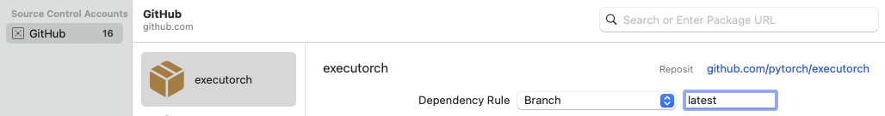

# Using ExecuTorch on iOS

ExecuTorch supports both iOS and macOS via Objective-C, Swift, and C++. ExecuTorch also provides backends to leverage Core ML and Metal Performance Shaders (MPS) for hardware-accelerated execution on Apple platforms.

## Integration

The ExecuTorch Runtime for iOS and macOS is distributed as a collection of prebuilt [.xcframework](https://developer.apple.com/documentation/xcode/creating-a-multi-platform-binary-framework-bundle) binary targets. These targets are compatible with both iOS and macOS devices and simulators and are available in both release and debug modes:

* `executorch` - Main Runtime components
* `backend_coreml` - Core ML backend
* `backend_mps` - MPS backend
* `backend_xnnpack` - XNNPACK backend
* `kernels_custom` - Custom kernels for LLMs
* `kernels_optimized` - Accelerated generic CPU kernels
* `kernels_quantized` - Quantized kernels

Link your binary with the ExecuTorch runtime and any backends or kernels used by the exported ML model. It is recommended to link the core runtime to the components that use ExecuTorch directly, and link kernels and backends against the main app target.

**Note:** To access logs, link against the Debug build of the ExecuTorch runtime, i.e., the `executorch_debug` framework. For optimal performance, always link against the Release version of the deliverables (those without the `_debug` suffix), which have all logging overhead removed.

### Swift Package Manager

The prebuilt ExecuTorch runtime, backend, and kernels are available as a [Swift PM](https://www.swift.org/documentation/package-manager/) package.

#### Xcode

In Xcode, go to `File > Add Package Dependencies`. Paste the URL of the [ExecuTorch repo](https://github.com/pytorch/executorch) into the search bar and select it. Make sure to change the branch name to the desired ExecuTorch version in format "swiftpm-<version>", (e.g. "swiftpm-0.6.0"), or a branch name in format "swiftpm-<version>.<year_month_date>" (e.g. "swiftpm-0.7.0-20250401") for a [nightly build](https://ossci-ios.s3.amazonaws.com/list.html) on a specific date.


Then select which ExecuTorch framework should link against which target.


Click the screenshot below to watch the *demo video* on how to add the package and run a simple ExecuTorch model on iOS.

<a href="_static/img/swiftpm_xcode.mp4">
  
</a>

#### CLI

Add a package and target dependencies on ExecuTorch to your package file like this:

```swift
// swift-tools-version:5.9
import PackageDescription

let package = Package(
  name: "YourPackageName",
  platforms: [
    .iOS(.v17),
    .macOS(.v12),
  ],
  products: [
    .library(name: "YourPackageName", targets: ["YourTargetName"]),
  ],
  dependencies: [
    // Use "swiftpm-<version>.<year_month_day>" branch name for a nightly build.
    .package(url: "https://github.com/pytorch/executorch.git", branch: "swiftpm-0.6.0")
  ],
  targets: [
    .target(
      name: "YourTargetName",
      dependencies: [
        .product(name: "executorch", package: "executorch"),
        .product(name: "backend_xnnpack", package: "executorch"),
        .product(name: "kernels_optimized", package: "executorch"),
        // Add other backends and kernels as needed.
      ]),
  ]
)
```

Then check if everything works correctly:

```bash
cd path/to/your/package

swift package resolve

# or just build it
swift build
```

### Building from Source

Another way to integrate the ExecuTorch runtime is to build the necessary components from sources locally and link against them. This is useful when customizing the runtime.

1. Install [Xcode](https://developer.apple.com/xcode/resources/) 15+ and Command Line Tools:

```bash
xcode-select --install
```

2. Clone ExecuTorch:

```bash
git clone -b viable/strict https://github.com/pytorch/executorch.git --depth 1 --recurse-submodules --shallow-submodules && cd executorch
```

3. Set up [Python](https://www.python.org/downloads/macos/) 3.10+ and activate a virtual environment:

```bash
python3 -m venv .venv && source .venv/bin/activate && pip install --upgrade pip
```

4. Install the required dependencies, including those needed for the backends like [Core ML](backends-coreml.md) or [MPS](backends-mps.md), if you plan to build them later:

```bash
./install_requirements.sh

# CoreML-only requirements:
./backends/apple/coreml/scripts/install_requirements.sh
```

5. Install [CMake](https://cmake.org):

Download the macOS binary distribution from the [CMake website](https://cmake.org/download), open the `.dmg` file, move `CMake.app` to the `/Applications` directory, and then run the following command to install the CMake command-line tools:

```bash
sudo /Applications/CMake.app/Contents/bin/cmake-gui --install
```

6. Use the provided script to build .xcframeworks:

```bash
./scripts/build_apple_frameworks.sh --help
```

For example, the following command will build the ExecuTorch Runtime along with all available kernels and backends for the Apple platform in both Release and Debug modes:

```bash
./scripts/build_apple_frameworks.sh
```

After the build finishes successfully, the resulting frameworks can be found in the `cmake-out` directory.
Copy them to your project and link them against your targets.

## Linkage

ExecuTorch initializes its backends and kernels (operators) during app startup by registering them in a static dictionary. If you encounter errors like "unregistered kernel" or "unregistered backend" at runtime, you may need to explicitly force-load certain components. Use the `-all_load` or `-force_load` linker flags in your Xcode build configuration to ensure components are registered early.

Here's an example of a Xcode configuration file (`.xcconfig`):

```
ET_PLATFORM[sdk=iphonesimulator*] = simulator
ET_PLATFORM[sdk=iphoneos*] = ios
ET_PLATFORM[sdk=macos*] = macos

OTHER_LDFLAGS = $(inherited) \
    -force_load $(BUILT_PRODUCTS_DIR)/libexecutorch_debug_$(ET_PLATFORM).a \
    -force_load $(BUILT_PRODUCTS_DIR)/libbackend_coreml_$(ET_PLATFORM).a \
    -force_load $(BUILT_PRODUCTS_DIR)/libbackend_mps_$(ET_PLATFORM).a \
    -force_load $(BUILT_PRODUCTS_DIR)/libbackend_xnnpack_$(ET_PLATFORM).a \
    -force_load $(BUILT_PRODUCTS_DIR)/libkernels_optimized_$(ET_PLATFORM).a \
    -force_load $(BUILT_PRODUCTS_DIR)/libkernels_quantized_$(ET_PLATFORM).a
```

**Note:** In the example above, we link against the Debug version of the ExecuTorch runtime (`libexecutorch_debug`) to preserve the logs. Normally, that does not impact the performance too much. Nevertheless, remember to link against the release version of the runtime (`libexecutorch`) for the best performance and no logs.

You can assign such a config file to your target in Xcode:

1.	Add the `.xcconfig` file to your project.
2.	Navigate to the project’s Info tab.
3.	Select the configuration file in the build configurations for Release (or Debug) mode.

## Runtime API

ExecuTorch provides native Objective-C APIs, automatically bridged to Swift, for interacting with the runtime. These APIs act as wrappers around the core C++ components found in [extension/tensor](extension-tensor.md) and [extension/module](extension-module.md), offering a more idiomatic experience for Apple platform developers.

**Note:** These Objective-C/Swift APIs are currently experimental and subject to change.

### Importing

Once linked against the `executorch` framework, you can import the necessary components.

Objective-C (Objective-C++):

```objectivec
// Import the main umbrella header for Module/Tensor/Value wrappers.
#import <ExecuTorch/ExecuTorch.h>

// If using C++ directly alongside Objective-C++, you might still need C++ headers.
#import <executorch/extension/module/module.h>
#import <executorch/extension/tensor/tensor.h>
```

Swift:

```swift
import ExecuTorch
```

#### Example

Here's a concise example demonstrating how to load a model, prepare input, run inference, and process output using the Objective-C and Swift API. Imagine you have a MobileNet v3 model (`mv3.pte`) that takes a `[1, 3, 224, 224]` float tensor as input and outputs logits.

Objective-C:

```objectivec
NSString *modelPath = [[NSBundle mainBundle] pathForResource:@"mv3" ofType:@"pte"];

// Create a module with the model file path. Nothing gets loaded into memory just yet.
ExecuTorchModule *module = [[ExecuTorchModule alloc] initWithFilePath:modelPath];

NSError *error;  // Optional error output argument to learn about failures.

// Force-load the program and 'forward' method. Otherwise, it's loaded at the first execution.
[module loadMethod:@"forward" error:&error];

float *imageBuffer = ...;  // Existing image buffer.

// Create an input tensor referencing the buffer and assuming the given shape and data type.
ExecuTorchTensor *inputTensor = [[ExecuTorchTensor alloc] initWithBytesNoCopy:imageBuffer
                                                                        shape:@[@1, @3, @224, @224]
                                                                     dataType:ExecuTorchDataTypeFloat];

// Execute the 'forward' method with the given input tensor and get output values back.
NSArray<ExecuTorchValue *> *outputs = [module forwardWithTensor:inputTensor error:&error];

// Get the first output value assuming it's a tensor.
ExecuTorchTensor *outputTensor = outputs.firstObject.tensor;

// Access the output tensor data.
[outputTensor bytesWithHandler:^(const void *pointer, NSInteger count, ExecuTorchDataType dataType) {
  float *logits = (float *)pointer;
  // Use logits...
}];
```

Swift:

```swift
let modelPath = Bundle.main.path(forResource: "mv3", ofType: "pte")!

// Create a module with the model file path. Nothing gets loaded into memory just yet.
let module = Module(filePath: modelPath)

// Force-load the program and 'forward' method. Otherwise, it's loaded at the first execution.
try module.load("forward")

let imageBuffer: UnsafeMutableRawPointer = ... // Existing image buffer

// Create an input tensor referencing the buffer and assuming the given shape and data type.
let inputTensor = Tensor(
  bytesNoCopy: imageBuffer,
  shape: [1, 3, 224, 224],
  dataType: .float
)

// Execute the 'forward' method with the given input tensor and get output values back.
let outputs = try module.forward(inputTensor)

// Get the first output value assuming it's a tensor.
if let outputTensor = outputs.first?.tensor {
  // Access the output tensor data.
  outputTensor.bytes { pointer, count, dataType in
    // Copy the tensor data into logits array for easier access.
    let logits = Array(UnsafeBufferPointer(
      start: pointer.assumingMemoryBound(to: Float.self),
      count: count
    ))
    // Use logits...
  }
}
```

### Tensor

The `Tensor` class (exposed as `ExecuTorchTensor` in Objective-C) represents a multi-dimensional array of elements (such as floats or ints) and includes metadata like shape (dimensions) and data type. Tensors are used to feed inputs to a model and retrieve outputs, or for any computation you need to do on raw data. You can create tensors from simple arrays of numbers, inspect their properties, read or modify their contents, and even reshape or copy them.

#### Key Properties:

- dataType: The element type (e.g., `.float`, `.int`, `.byte`).
- shape: An array of `NSNumber` describing the size of each dimension.
- count: The total number of elements.
- strides: The jump in memory needed to advance one element along each dimension.
- dimensionOrder: The order of dimensions in memory.
- shapeDynamism: Indicates if the tensor shape can change (`.static`, `.dynamicBound`, `.dynamicUnbound`).

#### Initialization:

You can create tensors in various ways:

From existing memory buffers:
- `init(bytesNoCopy:shape:dataType:...)`: Creates a tensor that references an existing memory buffer without copying. The buffer's lifetime must exceed the tensor's.
- `init(bytes:shape:dataType:...)`: Creates a tensor by copying data from a memory buffer.

From `NSData` / `Data`:
- `init(data:shape:dataType:...)`: Creates a tensor using an `NSData` object, referencing its bytes without copying.

From scalar arrays:
- `init(_:shape:dataType:...)`: Creates a tensor from an array of `NSNumber` scalars. Convenience initializers exist to infer shape or data type.

From single scalars:
- `init(_:)`, `init(_:dataType:)`, `init(float:)`, `init(int:)`, etc.: Create 0-dimensional tensors (scalars).

Objective-C:

```objectivec
#import <ExecuTorch/ExecuTorch.h>

// Create from copying bytes.
float data[] = {1.0f, 2.0f, 3.0f, 4.0f};
NSArray<NSNumber *> *shape = @[@2, @2];
ExecuTorchTensor *tensorFromBytes = [[ExecuTorchTensor alloc] initWithBytes:data
                                                                      shape:shape
                                                                   dataType:ExecuTorchDataTypeFloat];

// Create from scalars.
NSArray<NSNumber *> *scalars = @[@(1), @(2), @(3)];
ExecuTorchTensor *tensorFromScalars = [[ExecuTorchTensor alloc] initWithScalars:scalars
                                                                       dataType:ExecuTorchDataTypeInt];

// Create a float scalar tensor.
ExecuTorchTensor *scalarTensor = [[ExecuTorchTensor alloc] initWithFloat:3.14f];
```

Swift:
```swift
import ExecuTorch

// Create from existing buffer without copying.
var mutableData: [Float] = [1.0, 2.0, 3.0, 4.0]
let tensorNoCopy = mutableData.withUnsafeMutableBytes { bufferPointer in
  Tensor(
    bytesNoCopy: bufferPointer.baseAddress!,
    shape: [2, 2],
    dataType: .float
  )
}

// Create from Data (no copy).
let data = Data(bytes: mutableData, count: mutableData.count * MemoryLayout<Float>.size)
let tensorFromData = Tensor(data: data, shape: [2, 2], dataType: .float)

// Create from scalars (infers float type).
let tensorFromScalars = Tensor([1.0, 2.0, 3.0, 4.0], shape: [4])

// Create an Int scalar tensor.
let scalarTensor = Tensor(42) // Infers Int as .long data type (64-bit integer)
```

#### Accessing Data:

Use `bytes(_:)` for immutable access and `mutableBytes(_:)` for mutable access to the tensor's underlying data buffer.

Objective-C:

```objectivec
[tensor bytesWithHandler:^(const void *pointer, NSInteger count, ExecuTorchDataType dataType) {
  if (dataType == ExecuTorchDataTypeFloat) {
    const float *floatPtr = (const float *)pointer;
    NSLog(@"First float element: %f", floatPtr[0]);
  }
}];

[tensor mutableBytesWithHandler:^(void *pointer, NSInteger count, ExecuTorchDataType dataType) {
  if (dataType == ExecuTorchDataTypeFloat) {
    float *floatPtr = (float *)pointer;
    floatPtr[0] = 100.0f; // Modify the original mutableData buffer.
  }
}];
```

Swift:
```swift
tensor.bytes { pointer, count, dataType in
  if dataType == .float {
    let buffer = UnsafeBufferPointer(start: pointer.assumingMemoryBound(to: Float.self), count: count)
    print("First float element: \(buffer.first ?? 0.0)")
  }
}

tensor.mutableBytes { pointer, count, dataType in
  if dataType == .float {
    let buffer = UnsafeMutableBufferPointer(start: pointer.assumingMemoryBound(to: Float.self), count: count)
    buffer[1] = 200.0 // Modify the original mutableData buffer.
  }
}
```

#### Resizing:

Tensors can be resized if their underlying memory allocation allows it (typically requires ShapeDynamism other than Static or sufficient capacity).

Objective-C:

```objectivec
NSError *error;
BOOL success = [tensor resizeToShape:@[@4, @1] error:&error];
if (success) {
  NSLog(@"Resized shape: %@", tensor.shape);
} else {
  NSLog(@"Resize failed: %@", error);
}
```

Swift:
```swift
do {
  try tensor.resize(to: [4, 1])
  print("Resized shape: \(tensor.shape)")
} catch {
  print("Resize failed: \(error)")
}
```

### Value

The `Value` class (exposed as `ExecuTorchValue` in Objective-C) is a dynamic container that can hold different types of data, primarily used for model inputs and outputs. ExecuTorch methods accept and return arrays of `Value` objects.

#### Key Properties:

- `tag`: Indicates the type of data held (e.g., `.tensor`, `.integer`, `.string`, `.boolean`).
- `isTensor`, `isInteger`, `isString`, etc.: Boolean checks for the type.
- `tensor`, `integer`, `string`, `boolean`, `double`: Accessors for the underlying data (return `nil` or a default value if the tag doesn't match).

#### Initialization:

Create Value objects directly from the data they should hold.

Objective-C:

```objectivec
#import <ExecuTorch/ExecuTorch.h>

ExecuTorchTensor *tensor = [[ExecuTorchTensor alloc] initWithFloat:1.0f];

ExecuTorchValue *tensorValue = [[ExecuTorchValue alloc] valueWithTensor:tensor];
ExecuTorchValue *intValue = [[ExecuTorchValue alloc] valueWithInteger:100];
ExecuTorchValue *stringValue = [[ExecuTorchValue alloc] valueWithString:@"hello"];
ExecuTorchValue *boolValue = [[ExecuTorchValue alloc] valueWithBoolean:YES];
ExecuTorchValue *doubleValue = [[ExecuTorchValue alloc] valueWithDouble:3.14];
```

Swift:

```swift
import ExecuTorch

let tensor = Tensor(2.0)

let tensorValue = Value(tensor)
let intValue = Value(200)
let stringValue = Value("world")
let boolValue = Value(false)
let doubleValue = Value(2.718)
```

### Module

The `Module` class (exposed as `ExecuTorchModule` in Objective-C) represents a loaded ExecuTorch model (`.pte` file). It provides methods to load the model program and execute its internal methods (like `forward`).

#### Initialization:

Create a `Module` instance by providing the file path to the `.pte` model. Initialization itself is lightweight and doesn't load the program data immediately.

Objective-C:

```objectivec
#import <ExecuTorch/ExecuTorch.h>

NSString *modelPath = [[NSBundle mainBundle] pathForResource:@"model" ofType:@"pte"];
ExecuTorchModule *module = [[ExecuTorchModule alloc] initWithFilePath:modelPath];
// Optional: specify load mode, e.g., memory mapping.
// ExecuTorchModule *moduleMmap = [[ExecuTorchModule alloc] initWithFilePath:modelPath
//                                                                   loadMode:ExecuTorchModuleLoadModeMmap];
```

Swift:
```swift
import ExecuTorch

let modelPath = Bundle.main.path(forResource: "model", ofType: "pte")
let module = Module(filePath: modelPath!)
// Optional: specify load mode, e.g., memory mapping.
// let moduleMmap = Module(filePath: modelPath, loadMode: .mmap)
```

#### Loading:

Model loading is deferred until explicitly requested or needed for execution. While execution calls can trigger loading automatically, it's often more efficient to load methods explicitly beforehand.

- `load()`: Loads the basic program structure. Minimal verification is used by default.
- `load(_:)`: Loads the program structure and prepares a specific method (e.g., "forward") for execution. This performs necessary setup like backend delegation and is recommended if you know which method you'll run.
- `isLoaded()` / `isLoaded(_:)`: Check loading status.

Objective-C:

```objectivec
NSError *error;
// Loads program and prepares 'forward' for execution.
BOOL success = [module loadMethod:@"forward" error:&error];
if (success) {
  NSLog(@"Forward method loaded: %d", [module isMethodLoaded:@"forward"]);
} else {
  NSLog(@"Failed to load method: %@", error);
}
```

Swift:

```swift
do {
  // Loads program and prepares 'forward' for execution.
  try module.load("forward")
  print("Forward method loaded: \(module.isLoaded("forward"))")
} catch {
  print("Failed to load method: \(error)")
}
```

#### Execution:

The `Module` class offers flexible ways to execute methods within the loaded program.

- Named Execution: You can execute any available method by name using `execute(methodName:inputs:)`.
- Forward Shortcut: For the common case of running the primary inference method, use the `forward(inputs:)` shortcut, which is equivalent to calling execute with the method name "forward".
- Input Flexibility: Inputs can be provided in several ways:
  - As an array of `Value` objects. This is the most general form.
  - As an array of `Tensor` objects. This is a convenience where tensors are automatically wrapped into `Value` objects.
  - As a single `Value` or `Tensor` object if the method expects only one input.
  - With no inputs if the method takes none.

Outputs are always returned as an array of `Value`.

Objective-C:

```objectivec
ExecuTorchTensor *inputTensor1 = [[ExecuTorchTensor alloc] initWithScalars:@[@1.0f, @2.0f]];
ExecuTorchTensor *inputTensor2 = [[ExecuTorchTensor alloc] initWithScalars:@[@3.0f, @4.0f]];
ExecuTorchTensor *singleInputTensor = [[ExecuTorchTensor alloc] initWithFloat:5.0f];
NSError *error;

// Execute "forward" using the shortcut with an array of Tensors.
NSArray<ExecuTorchValue *> *outputs1 = [module forwardWithTensors:@[inputTensor1, inputTensor2] error:&error];
if (outputs1) {
  NSLog(@"Forward output count: %lu", (unsigned long)outputs1.count);
} else {
  NSLog(@"Execution failed: %@", error);
}

// Execute "forward" with a single Tensor input.
NSArray<ExecuTorchValue *> *outputs2 = [module forwardWithTensor:singleInputTensor error:&error];
if (outputs2) {
    NSLog(@"Forward single input output count: %lu", (unsigned long)outputs2.count);
} else {
    NSLog(@"Execution failed: %@", error);
}

// Execute a potentially different method by name.
NSArray<ExecuTorchValue *> *outputs3 = [module executeMethod:@"another_method"
                                                   withInput:[[ExecuTorchValue alloc] valueWithTensor:inputTensor1]
                                                       error:&error];

// Process outputs (assuming first output is a tensor).
if (outputs1) {
  ExecuTorchValue *firstOutput = outputs1.firstObject;
  if (firstOutput.isTensor) {
    ExecuTorchTensor *resultTensor = firstOutput.tensorValue;
    // Process resultTensor.
  }
}
```

Swift:

```swift
let inputTensor1 = Tensor([1.0, 2.0], dataType: .float)
let inputTensor2 = Tensor([3.0, 4.0], dataType: .float)
let singleInputTensor = Tensor([5.0], dataType: .float)

do {
  // Execute "forward" using the shortcut with an array of Tensors.
  let outputs1 = try module.forward([inputTensor1, inputTensor2])
  print("Forward output count: \(outputs1.count)")

  // Execute "forward" with a single Tensor input.
  let outputs2 = try module.forward(singleInputTensor)
  print("Forward single input output count: \(outputs2.count)")

  // Execute a potentially different method by name.
  let outputs3 = try module.execute("another_method", inputs: [Value(inputTensor1)])

  // Process outputs (assuming first output is a tensor).
  if let resultTensor = outputs1.first?.tensor {
    resultTensor.bytes { ptr, count, dtype in
      // Access result data.
    }
  }
} catch {
  print("Execution failed: \(error)")
}
```

#### Method Names:

You can query the available method names in the model after the program is loaded.

Objective-C:

```objectivec
NSError *error;

// Note: methodNames: will load the program if not already loaded.
NSSet<NSString *> *names = [module methodNames:&error];
if (names) {
  NSLog(@"Available methods: %@", names);
} else {
  NSLog(@"Could not get method names: %@", error);
}
```

Swift:

```swift
do {
  // Note: methodNames() will load the program if not already loaded.
  let names = try module.methodNames()
  print("Available methods: \(names)") // Output: e.g., {"forward"}
} catch {
  print("Could not get method names: \(error)")
}
```

### Logging

ExecuTorch provides APIs for logging in Objective-C and Swift via the `ExecuTorchLog` (`Log` in Swift) singleton. You can subscribe custom log sinks conforming to the `ExecuTorchLogSink` (`LogSink` in Swift) protocol to receive internal ExecuTorch log messages.

**Note:** Logs are stripped in the Release builds of ExecuTorch frameworks. To capture logs, link against the Debug builds (e.g., `executorch_debug`) during development.

Objective-C:

```objectivec
#import <ExecuTorch/ExecuTorch.h>
#import <os/log.h>

@interface MyClass : NSObject<ExecuTorchLogSink>
@end

@implementation MyClass

- (instancetype)init {
  self = [super init];
  if (self) {
#if DEBUG
    [ExecuTorchLog.sharedLog addSink:self];
#endif
  }
  return self;
}

- (void)dealloc {
#if DEBUG
  [ExecuTorchLog.sharedLog removeSink:self];
#endif
}

#if DEBUG
- (void)logWithLevel:(ExecuTorchLogLevel)level
           timestamp:(NSTimeInterval)timestamp
            filename:(NSString *)filename
                line:(NSUInteger)line
             message:(NSString *)message {
  NSString *logMessage = [NSString stringWithFormat:@"%@:%lu %@", filename, (unsigned long)line, message];
  switch (level) {
    case ExecuTorchLogLevelDebug:
      os_log_with_type(OS_LOG_DEFAULT, OS_LOG_TYPE_DEBUG, "%{public}@", logMessage);
      break;
    case ExecuTorchLogLevelInfo:
      os_log_with_type(OS_LOG_DEFAULT, OS_LOG_TYPE_INFO, "%{public}@", logMessage);
      break;
    case ExecuTorchLogLevelError:
      os_log_with_type(OS_LOG_DEFAULT, OS_LOG_TYPE_ERROR, "%{public}@", logMessage);
      break;
    case ExecuTorchLogLevelFatal:
      os_log_with_type(OS_LOG_DEFAULT, OS_LOG_TYPE_FAULT, "%{public}@", logMessage);
      break;
    default:
      os_log(OS_LOG_DEFAULT, "%{public}@", logMessage);
      break;
  }
}
#endif

@end
```

Swift:

```swift
import ExecuTorch
import os.log

public class MyClass {
  public init() {
    #if DEBUG
    Log.shared.add(sink: self)
    #endif
  }
  deinit {
    #if DEBUG
    Log.shared.remove(sink: self)
    #endif
  }
}

#if DEBUG
extension MyClass: LogSink {
  public func log(level: LogLevel, timestamp: TimeInterval, filename: String, line: UInt, message: String) {
    let logMessage = "\(filename):\(line) \(message)"
    switch level {
    case .debug:
      os_log(.debug, "%{public}@", logMessage)
    case .info:
      os_log(.info, "%{public}@", logMessage)
    case .error:
      os_log(.error, "%{public}@", logMessage)
    case .fatal:
      os_log(.fault, "%{public}@", logMessage)
    default:
      os_log("%{public}@", logMessage)
    }
  }
}
#endif
```

**Note:** In the example, the logs are intentionally stripped out when the code is not built for Debug mode, i.e., the `DEBUG` macro is not defined or equals zero.

## Debugging

If you are linking against a Debug build of the ExecuTorch frameworks, configure your debugger to map the source code correctly by using the following LLDB command in the debug session:

```
settings append target.source-map /executorch <path_to_executorch_source_code>
```

## Troubleshooting

### Slow execution

Ensure the exported model is using an appropriate backend, such as XNNPACK, Core ML, or MPS. If the correct backend is invoked but performance issues persist, confirm that you are linking against the Release build of the backend runtime.

For optimal performance, link the ExecuTorch runtime in Release mode too. If debugging is needed, you can keep the ExecuTorch runtime in Debug mode with minimal impact on performance, but preserve logging and debug symbols.

### Swift PM

If you encounter a checksum mismatch error with Swift PM, clear the package cache using the Xcode menu (`File > Packages > Reset Package Caches`) or the following command:

```bash
rm -rf <YouProjectName>.xcodeproj/project.xcworkspace/xcshareddata/swiftpm \
  ~/Library/org.swift.swiftpm \
  ~/Library/Caches/org.swift.swiftpm \
  ~/Library/Caches/com.apple.dt.Xcode \
  ~/Library/Developer/Xcode/DerivedData
```
**Note:** Ensure Xcode is fully quit before running the terminal command to avoid conflicts with active processes.
