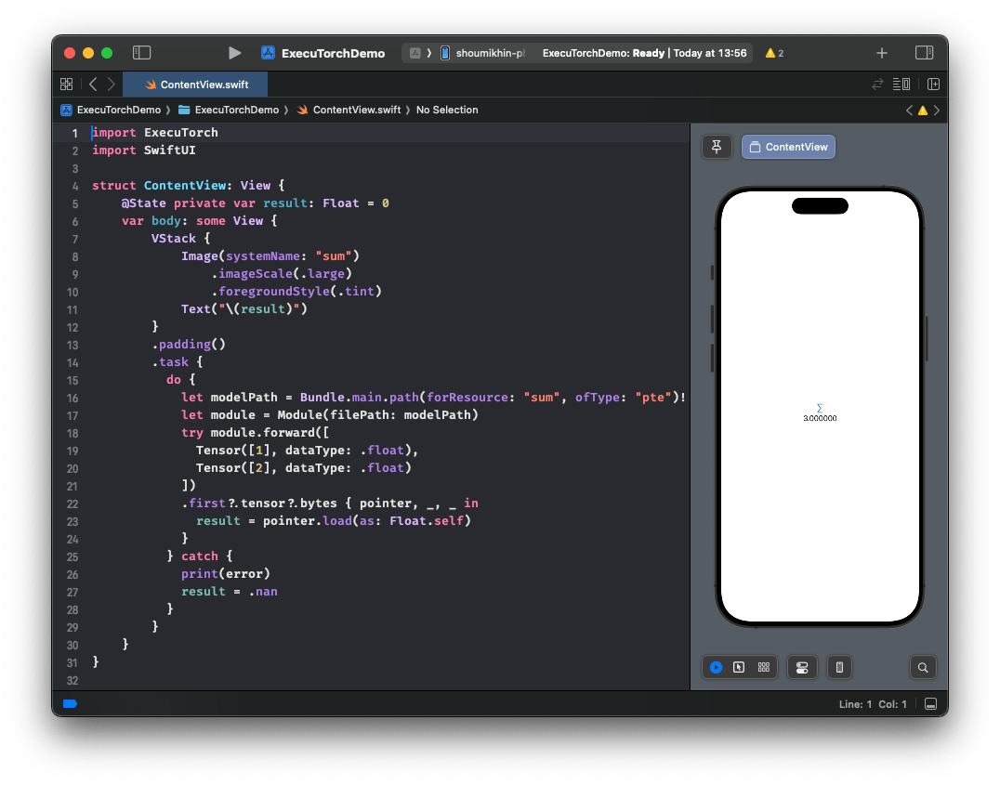

# Using ExecuTorch on iOS

ExecuTorch supports both iOS and macOS via Objective-C, Swift, and C++. ExecuTorch also provides backends to leverage Core ML and Metal Performance Shaders (MPS) for hardware-accelerated execution on Apple platforms.

## Integration

The ExecuTorch Runtime for iOS and macOS (ARM64) is distributed as a collection of prebuilt [.xcframework](https://developer.apple.com/documentation/xcode/creating-a-multi-platform-binary-framework-bundle) binary targets. These targets are compatible with both iOS and macOS devices and simulators and are available in both release and debug modes:

* `executorch` - Core runtime components
* `executorch_llm` - LLM-specific runtime components
* `backend_coreml` - Core ML backend
* `backend_mps` - MPS backend
* `backend_xnnpack` - XNNPACK backend
* `kernels_llm` - Custom kernels for LLMs
* `kernels_optimized` - Accelerated generic CPU kernels
* `kernels_quantized` - Quantized kernels
* `kernels_torchao` - Quantized CPU kernels from torchao

Link your binary with the ExecuTorch runtime and any backends or kernels used by the exported ML model. It is recommended to link the core runtime to the components that use ExecuTorch directly, and link kernels and backends against the main app target.

**Note:** To access logs, link against the Debug build of the ExecuTorch runtime, i.e., the `executorch_debug` framework. For optimal performance, always link against the Release version of the deliverables (those without the `_debug` suffix), which have all logging overhead removed.

### Swift Package Manager

The prebuilt ExecuTorch runtime, backend, and kernels are available as a [Swift PM](https://www.swift.org/documentation/package-manager/) package.

#### Xcode

In Xcode, go to `File > Add Package Dependencies`. Paste the URL of the [ExecuTorch repo](https://github.com/pytorch/executorch) into the search bar and select it. Make sure to change the branch name to the desired ExecuTorch version in format "swiftpm-<version>", (e.g. "swiftpm-0.7.0"), or a branch name in format "swiftpm-<version>.<year_month_date>" (e.g. "swiftpm-0.8.0-20250801") for a [nightly build](https://ossci-ios.s3.amazonaws.com/list.html) on a specific date.


Then select which ExecuTorch framework should link against which target.


Click the screenshot below to watch the *demo video* on how to add the package and run a simple ExecuTorch model on iOS.

<a href="_static/img/swiftpm_xcode.mp4">
  
</a>

#### CLI

Add a package and target dependencies on ExecuTorch to your package file like this:

```swift
// swift-tools-version:5.9
import PackageDescription

let package = Package(
  name: "YourPackageName",
  platforms: [
    .iOS(.v17),
    .macOS(.v12),
  ],
  products: [
    .library(name: "YourPackageName", targets: ["YourTargetName"]),
  ],
  dependencies: [
    // Use "swiftpm-<version>.<year_month_day>" branch name for a nightly build.
    .package(url: "https://github.com/pytorch/executorch.git", branch: "swiftpm-0.7.0")
  ],
  targets: [
    .target(
      name: "YourTargetName",
      dependencies: [
        .product(name: "executorch", package: "executorch"),
        .product(name: "backend_xnnpack", package: "executorch"),
        .product(name: "kernels_optimized", package: "executorch"),
        // Add other backends and kernels as needed.
      ]),
  ]
)
```

Then check if everything works correctly:

```bash
cd path/to/your/package

swift package resolve

# or just build it
swift build
```

### Building from Source

Another way to integrate the ExecuTorch runtime is to build the necessary components from sources locally and link against them. This is useful when customizing the runtime.

1. Install [Xcode](https://developer.apple.com/xcode/resources/) 15+ and Command Line Tools:

```bash
xcode-select --install
```

2. Clone ExecuTorch:

```bash
git clone -b release/1.0 https://github.com/pytorch/executorch.git --depth 1 --recurse-submodules --shallow-submodules && cd executorch
```

3. Set up [Python](https://www.python.org/downloads/macos/) 3.10+ and activate a virtual environment:

```bash
python3 -m venv .venv && source .venv/bin/activate && pip install --upgrade pip
```

4. Install the required dependencies, including those needed for the backends like [Core ML](backends-coreml.md) or [MPS](backends-mps.md), if you plan to build them later:

```bash
./install_requirements.sh

# CoreML-only requirements:
./backends/apple/coreml/scripts/install_requirements.sh
```

5. Install [CMake](https://cmake.org):

Download the macOS binary distribution from the [CMake website](https://cmake.org/download), open the `.dmg` file, move `CMake.app` to the `/Applications` directory, and then run the following command to install the CMake command-line tools:

```bash
sudo /Applications/CMake.app/Contents/bin/cmake-gui --install
```

6. Use the provided script to build .xcframeworks:

The following command will build the ExecuTorch runtime components along with all available kernels and backends for the Apple platform in both Release and Debug modes:

```bash
./scripts/build_apple_frameworks.sh
```

After the build finishes successfully, the resulting frameworks can be found in the `cmake-out` directory.
Copy them to your project and link them against your targets.

## Linkage

ExecuTorch initializes its backends and kernels (operators) during app startup by registering them in a static dictionary. If you encounter errors like "unregistered kernel" or "unregistered backend" at runtime, you may need to explicitly force-load certain components. Use the `-all_load` or `-force_load` linker flags in your Xcode build configuration to ensure components are registered early.

Here's an example of a Xcode configuration file (`.xcconfig`):

```
ET_PLATFORM[sdk=iphonesimulator*] = simulator
ET_PLATFORM[sdk=iphoneos*] = ios
ET_PLATFORM[sdk=macos*] = macos

OTHER_LDFLAGS = $(inherited) \
    -force_load $(BUILT_PRODUCTS_DIR)/libexecutorch_debug_$(ET_PLATFORM).a \
    -force_load $(BUILT_PRODUCTS_DIR)/libbackend_coreml_$(ET_PLATFORM).a \
    -force_load $(BUILT_PRODUCTS_DIR)/libbackend_mps_$(ET_PLATFORM).a \
    -force_load $(BUILT_PRODUCTS_DIR)/libbackend_xnnpack_$(ET_PLATFORM).a \
    -force_load $(BUILT_PRODUCTS_DIR)/libkernels_optimized_$(ET_PLATFORM).a \
    -force_load $(BUILT_PRODUCTS_DIR)/libkernels_quantized_$(ET_PLATFORM).a
```

**Note:** In the example above, we link against the Debug version of the ExecuTorch runtime (`libexecutorch_debug`) to preserve the logs. Normally, that does not impact the performance too much. Nevertheless, remember to link against the release version of the runtime (`libexecutorch`) for the best performance and no logs.

You can assign such a config file to your target in Xcode:

1.	Add the `.xcconfig` file to your project.
2.	Navigate to the project’s Info tab.
3.	Select the configuration file in the build configurations for Release (or Debug) mode.

## Runtime API

ExecuTorch provides native Objective-C APIs, automatically bridged to Swift, for interacting with the runtime. These APIs act as wrappers around the core C++ components found in [extension/tensor](extension-tensor.md) and [extension/module](extension-module.md), offering a more idiomatic experience for Apple platform developers.

**Note:** These Objective-C/Swift APIs are currently experimental and subject to change.

### Importing

Once linked against the `executorch` framework, you can import the necessary components.

Objective-C (Objective-C++):

```objectivec
// Import the main umbrella header for Module/Tensor/Value wrappers.
#import <ExecuTorch/ExecuTorch.h>

// If using C++ directly alongside Objective-C++, you might still need C++ headers.
#import <executorch/extension/module/module.h>
#import <executorch/extension/tensor/tensor.h>
```

Swift:

```swift
import ExecuTorch
```

#### Example

Here's a concise example demonstrating how to load a model, prepare input, run inference, and process output using the Objective-C and Swift API. Imagine you have a MobileNet v3 model (`mv3.pte`) that takes a `[1, 3, 224, 224]` float tensor as input and outputs logits.

Objective-C:

```objectivec
NSString *modelPath = [[NSBundle mainBundle] pathForResource:@"mv3" ofType:@"pte"];

// Create a module with the model file path. Nothing gets loaded into memory just yet.
ExecuTorchModule *module = [[ExecuTorchModule alloc] initWithFilePath:modelPath];

NSError *error;  // Optional error output argument to learn about failures.

// Force-load the program and 'forward' method. Otherwise, it's loaded at the first execution.
[module loadMethod:@"forward" error:&error];

float *imageBuffer = ...;  // Existing image buffer.

// Create an input tensor referencing the buffer and assuming the given shape and data type.
ExecuTorchTensor *inputTensor = [[ExecuTorchTensor alloc] initWithBytesNoCopy:imageBuffer
                                                                        shape:@[@1, @3, @224, @224]
                                                                     dataType:ExecuTorchDataTypeFloat];

// Execute the 'forward' method with the given input tensor and get output values back.
NSArray<ExecuTorchValue *> *outputs = [module forwardWithTensor:inputTensor error:&error];

// Get the first output value assuming it's a tensor.
ExecuTorchTensor *outputTensor = outputs.firstObject.tensorValue;

// Access the output tensor data.
[outputTensor bytesWithHandler:^(const void *pointer, NSInteger count, ExecuTorchDataType dataType) {
  float *logits = (float *)pointer;
  // Use logits...
}];
```

Swift:

```swift
let modelPath = Bundle.main.path(forResource: "mv3", ofType: "pte")!

// Create a module with the model file path. Nothing gets loaded into memory just yet.
let module = Module(filePath: modelPath)

// Force-load the program and 'forward' method. Otherwise, it's loaded at the first execution.
try module.load("forward")

let imageBuffer: UnsafeMutableRawPointer = ... // Existing image buffer

// Create an input tensor referencing the buffer and assuming the given shape and data type.
let inputTensor = Tensor<Float>(&imageBuffer, shape: [1, 3, 224, 224])

// Execute the 'forward' method with the given input tensor and get an output tensor back.
let outputTensor = try Tensor<Float>(module.forward(inputTensor))

// Copy the tensor data into logits array for easier access.
let logits = outputTensor.scalars()

// Use logits...
```

### Tensor

A tensor is a multi-dimensional array of elements (such as floats or integers) and includes metadata like shape (dimensions) and data type. Tensors are used to feed inputs to a model and retrieve outputs, or for any computation you need to do on raw data. You can create tensors from simple arrays of numbers, inspect their properties, read or modify their contents, and even reshape or copy them.

ExecuTorch offers `ExecuTorchTensor` class in Objective-C and two tensor types in Swift:

- `AnyTensor`: A type-erased tensor, bridged from `ExecuTorchTensor` in Objective-C. You might use it when the tensor's data type is only known at runtime, for example, when converting from an untyped `Value` object before casting it to a generic `Tensor<T>`.

- `Tensor<T: Scalar>`: A generic, type-safe wrapper around AnyTensor. This is the recommended type for most use cases in Swift. It ensures the element type (e.g., `Float`, `Int`) is known at compile time, providing type-safe access to tensor data and catching type mismatches early.

You can convert between them using `tensor.anyTensor` (to get the underlying `AnyTensor`) and `anyTensor.asTensor()` (to convert to a typed `Tensor<T>` if the data types match).

#### Key Properties:

- `dataType`: The element type (e.g., `.float`, `.int`, `.byte`). In `Tensor<T>`, this is determined by `T`.
- `shape`: An array of `Int` describing the size of each dimension.
- `count`: The total number of elements.
- `strides`: The jump in memory needed to advance one element along each dimension.
- `dimensionOrder`: The order of dimensions in memory.
- `shapeDynamism`: Indicates if the tensor shape can change (`.static`, `.dynamicBound`, `.dynamicUnbound`).

#### Initialization:

You can create a new tensor from an existing one, either as a view (which shares the same underlying data) or as a copy (which gets its own unique data).

- View: `init(_:)` creates a new tensor instance that points to the same memory as the original. Modifying the data through one tensor will affect the other.

- Copy: `copy()` creates a completely independent duplicate of the tensor, including its own copy of the data.

Objective-C:
```objectivec
// Create a view.
ExecuTorchTensor *tensorView = [[ExecuTorchTensor alloc] initWithTensor:originalTensor];

// Create a copy.
ExecuTorchTensor *tensorCopy = [originalTensor copy];
```

Swift:
```swift
// Create a view.
let tensorView = Tensor(originalTensor)

// Create a copy.
let tensorCopy = originalTensor.copy()
```
Tensors can be initialized directly from memory pointers or `Data` objects.

- `init(bytesNoCopy:...)`: Creates a tensor that references an existing memory buffer without copying. The buffer's lifetime must be managed manually and must exceed the tensor's.

- `init(bytes:...)`: Creates a tensor by copying data from a memory buffer.

- `init(data:...)`: Creates a tensor using an `NSData` (Objective-C) or `Data` (Swift) object, referencing its bytes without copying.

Objective-C:
```objectivec
// Create by copying bytes.
float data[] = {1.0f, 2.0f, 3.0f, 4.0f};
NSArray<NSNumber *> *shape = @[@2, @2];
ExecuTorchTensor *tensorFromBytes = [[ExecuTorchTensor alloc] initWithBytes:data
                                                                      shape:shape
                                                                   dataType:ExecuTorchDataTypeFloat];

// Create from NSData (no copy).
NSData *nsData = [NSData dataWithBytes:data length:sizeof(data)];
ExecuTorchTensor *tensorFromNSData = [[ExecuTorchTensor alloc] initWithData:nsData
                                                                      shape:shape
                                                                   dataType:ExecuTorchDataTypeFloat];
```

Swift:
```swift
// Create from a buffer without copying (unsafe).
var mutableData: [Float] = [1.0, 2.0, 3.0, 4.0]
let tensorNoCopy = mutableData.withUnsafeMutableBytes { pointer in
  Tensor<Float>(
    bytesNoCopy: pointer.baseAddress!,
    shape: [2, 2]
  )
}

// Create from Data (no copy).
let data = Data(bytes: &mutableData, count: mutableData.count * MemoryLayout<Float>.size)
let tensorFromData = Tensor<Float>(data: data, shape: [2, 2])
```

The most convenient way to create tensors is from Swift arrays or single scalar values. The `Tensor<T>` API uses type inference to determine the `dataType` automatically.

objective-c:
```objectivec
// Create from an array of scalars.
NSArray<NSNumber *> *scalars = @[@(1), @(2), @(3)];
NSArray<NSNumber *> *shape = @[@3];
ExecuTorchTensor *tensorFromScalars = [[ExecuTorchTensor alloc] initWithScalars:scalars
                                                                          shape:shape
                                                                       dataType:ExecuTorchDataTypeInt];

// Create a float scalar tensor.
ExecuTorchTensor *scalarTensor = [[ExecuTorchTensor alloc] initWithFloat:3.14f];
```

Swift:
```swift
// Create from an array of scalars (infers shape and copies data).
let tensor = Tensor([1.0, 2.0, 3.0, 4.0]) // Creates a Tensor<Double> with shape [4]

// Specify shape.
let tensorWithShape = Tensor([1, 2, 3, 4, 5, 6], shape: [2, 3]) // Creates Tensor<Int>

// Create without copying from an `inout` array.
var liveData: [Int32] = [10, 20, 30]
let tensorNoCopy = Tensor(&liveData) // Modifying `liveData` affects `tensorNoCopy`

// Create an Int scalar tensor.
let scalarTensor = Tensor(42) // Infers Tensor<Int> with shape []
```

#### Factory Methods:

ExecuTorch provides a rich set of factory methods to create tensors with pre-filled or random data.

- `empty`: Creates a tensor with uninitialized data.

- `full`: Creates a tensor filled with a specified scalar value.

- `ones`: Creates a tensor filled with ones.

- `zeros`: Creates a tensor filled with zeros.

- `rand`: Creates a tensor with random values uniformly distributed in `[0, 1)`.

- `randn`: Creates a tensor with random values from a normal distribution (mean 0, variance 1).

- `randint`: Creates a tensor with random integers in a specified range `[low, high)`.

Each method has a `like:` variant that creates a new tensor with the same shape and properties as an existing one.

Objective-C:
```objectivec
// Create a 2x2 tensor filled with zeros.
ExecuTorchTensor *zeros = [ExecuTorchTensor zerosTensorWithShape:@[@2, @2]
                                                        dataType:ExecuTorchDataTypeFloat];

// Create a tensor of ones with the same shape as `zeros`.
ExecuTorchTensor *ones = [ExecuTorchTensor onesTensorLikeTensor:zeros];
```

Swift:
```swift
// Create a 2x2 tensor filled with the value 7.
let fullTensor = Tensor<Int32>.full(shape: [2, 2], scalar: 7)

// Create a 3x3 tensor of ones.
let onesTensor = Tensor<Float>.ones(shape: [3, 3])

// Create a tensor of zeros with the same shape as onesTensor.
let zerosTensor = Tensor<Float>.zeros(like: onesTensor)

// Create a tensor with random integers between 10 (inclusive) and 20 (exclusive).
let randomInts = Tensor<Int>.randint(low: 10, high: 20, shape: [5])

// Create a 2x2 type-erased tensor filled with zeros and explicit data type.
let anyZeros = AnyTensor.zeros(shape: [2, 2], dataType: .float)

// Create a 2x3 type-erased tensor filled with random values and explicit data type.
let anyRand = AnyTensor.rand(shape: [2, 3], dataType: .double)
```

#### Accessing Data:

Reading data:

- `scalars()`: Returns a copy of the tensor's elements as a new `[T]` array.

- `withUnsafeBytes(_:)`: Provides a type-safe, immutable buffer pointer (`UnsafeBufferPointer<T>`) for efficient, direct memory access without creating a new array.

- `bytesWithHandler:`: The Objective-C and `AnyTensor` approach, which uses a callback with a raw `void *` pointer and requires manual type casting.

Objective-C:
```objectivec
[tensor bytesWithHandler:^(const void *pointer, NSInteger count, ExecuTorchDataType dataType) {
  if (dataType == ExecuTorchDataTypeFloat) {
    const float *floatPointer = (const float *)pointer;
    NSLog(@"First float element: %f", floatPointer[0]);
  }
}];
```

Swift:
```swift
let tensor = Tensor<Float>([1.0, 2.0, 3.0, 4.0], shape: [2, 2])

// Get data copy as a Swift array.
let scalars = tensor.scalars()
print("All scalars: \(scalars)") // [1.0, 2.0, 3.0, 4.0]

// Access data via a buffer pointer.
tensor.withUnsafeBytes { buffer in
  print("First float element: \(buffer.first ?? 0.0)")
}

anyTensor.bytes { pointer, count, dataType in
  // Must check data type and manually cast the pointer for type-erased tensor.
  if dataType == .float {
    let buffer = UnsafeBufferPointer(start: pointer.assumingMemoryBound(to: Float.self), count: count)
    print("First float element from AnyTensor: \(buffer.first ?? 0.0)")
  }
}
```

Modifying Data:

- `withUnsafeMutableBytes(_:)`: The preferred Swift method. Provides a type-safe, mutable buffer pointer (`UnsafeMutableBufferPointer<T>`) for in-place modification.

- `mutableBytesWithHandler:`: The Objective-C and `AnyTensor` equivalent.

Objective-C:
```objectivec
[tensor mutableBytesWithHandler:^(void *pointer, NSInteger count, ExecuTorchDataType dataType) {
  if (dataType == ExecuTorchDataTypeFloat) {
    float *floatPointer = (float *)pointer;
    floatPointer[0] = 100.0f; // Modify the tensor's data.
  }
}];
```

Swift:
```swift
let tensor = Tensor<Float>([1.0, 2.0, 3.0, 4.0], shape: [2, 2])

// Modify the tensor's data in place.
tensor.withUnsafeMutableBytes { buffer in
  buffer[1] = 200.0
}
// tensor's data is now [1.0, 200.0, 3.0, 4.0]

anyTensor.mutableBytes { pointer, count, dataType in
  if dataType == .float {
    let buffer = UnsafeMutableBufferPointer(start: pointer.assumingMemoryBound(to: Float.self), count: count)
    buffer[0] = 100.0 // Modify the AnyTensor's data
  }
}
```

#### Resizing:

Tensors can be resized if their shape dynamism is not `.static`. Resizing only changes the tensor's metadata (shape and strides) and does not reallocate or change the underlying data, so the new shape must have the same total number of elements.

Objective-C:

```objectivec
NSError *error;
BOOL success = [tensor resizeToShape:@[@4, @1] error:&error];
if (success) {
  NSLog(@"Resized shape: %@", tensor.shape);
} else {
  NSLog(@"Resize failed: %@", error);
}
```

Swift:
```swift
do {
  try tensor.resize(to: [4, 1])
  print("Resized shape: \(tensor.shape)")
} catch {
  print("Resize failed: \(error)")
}
```

#### Equality:

You can check if two tensors are equal using the `==` operator. It compares their data type, shape, strides, dimension order, and all underlying element data. The `shapeDynamism` property is disregarded in this comparison.

#### Printing:

Tensors conform to `CustomStringConvertible` in Swift and implement `-description` in Objective-C, so you can print them directly to the console for easy debugging.

### Value

The `Value` class (exposed as `ExecuTorchValue` in Objective-C) is a dynamic container that can hold different types of data, primarily used for model inputs and outputs. ExecuTorch methods accept and return arrays of `Value` objects.

#### Key Properties:

- `tag`: Indicates the type of data held (e.g., `.tensor`, `.integer`, `.string`, `.boolean`).
- `isTensor`, `isInteger`, `isString`, etc.: Boolean checks for the type.
- `tensor`, `integer`, `string`, `boolean`, `double`: Accessors for the underlying data (return `nil` or a default value if the tag doesn't match).

#### Initialization:

Create Value objects directly from the data they should hold.

Objective-C:

```objectivec
#import <ExecuTorch/ExecuTorch.h>

ExecuTorchTensor *tensor = [[ExecuTorchTensor alloc] initWithFloat:1.0f];

ExecuTorchValue *tensorValue = [[ExecuTorchValue alloc] valueWithTensor:tensor];
ExecuTorchValue *intValue = [[ExecuTorchValue alloc] valueWithInteger:100];
ExecuTorchValue *stringValue = [[ExecuTorchValue alloc] valueWithString:@"hello"];
ExecuTorchValue *boolValue = [[ExecuTorchValue alloc] valueWithBoolean:YES];
ExecuTorchValue *doubleValue = [[ExecuTorchValue alloc] valueWithDouble:3.14];
```

Swift:

```swift
import ExecuTorch

let tensor = Tensor(2.0)

let tensorValue = Value(tensor)
let intValue = Value(200)
let stringValue = Value("world")
let boolValue = Value(false)
let doubleValue = Value(2.718)
```

Also, in Swift, all the types that `Value` can hold conform to the `ValueConvertible` protocol, so you can create `Value` objects directly from them without explicitly wrapping them in `Value` constructors:

```swift
func processValue(_ value: ValueConvertible) {
  // ...
}

processValue(1) // Value<Int>
processValue(1.0) // Value<Double>
processValue("hello") // Value<String>
processValue(true) // Value<Bool>
processValue(Tensor(1.0)) // Value<Tensor>
```

### Module

The `Module` class (exposed as `ExecuTorchModule` in Objective-C) represents a loaded ExecuTorch model (`.pte` file). It provides methods to load the model program, inspect its methods, and execute them for inference.

Note: `Module` and its methods are not thread-safe. If you need to do concurrent inferences from multiple threads, create one `Module` per thread.

#### Initialization:

Create a `Module` instance by providing the file path to the `.pte` model. Initialization itself is lightweight and doesn't load the program data immediately. You can also specify a `ModuleLoadMode` to control how the file is loaded, such as using memory mapping for efficiency.

Objective-C:

```objectivec
#import <ExecuTorch/ExecuTorch.h>

NSString *modelPath = [[NSBundle mainBundle] pathForResource:@"model" ofType:@"pte"];
ExecuTorchModule *module = [[ExecuTorchModule alloc] initWithFilePath:modelPath];

// Optional: specify load mode, e.g., memory mapping.
ExecuTorchModule *moduleMmap = [[ExecuTorchModule alloc] initWithFilePath:modelPath
                                                                 loadMode:ExecuTorchModuleLoadModeMmap];
```

Swift:
```swift
import ExecuTorch

let modelPath = Bundle.main.path(forResource: "model", ofType: "pte")!
let module = Module(filePath: modelPath)

// Optional: specify load mode, e.g., memory mapping.
let moduleMmap = Module(filePath: modelPath, loadMode: .mmap)
```

#### Loading:

Model loading is deferred until explicitly requested or needed. You can load the entire program or individual methods. While execution calls can trigger loading automatically, it's often more efficient to load methods explicitly beforehand.

- `load()`: Loads the basic program structure. You can specify a `ModuleVerification` level, though minimal verification is used by default.
- `load(_:)`: Loads the program structure and prepares a specific method (e.g., "forward") for execution. This performs necessary setup like backend delegation and is recommended if you know which method you'll run.
- `isLoaded()` / `isLoaded(_:)`: Check loading status.

Objective-C:

```objectivec
NSError *error;
// Loads program and prepares 'forward' for execution.
BOOL success = [module loadMethod:@"forward" error:&error];
if (success) {
  NSLog(@"Forward method loaded: %d", [module isMethodLoaded:@"forward"]);
} else {
  NSLog(@"Failed to load method: %@", error);
}
```

Swift:

```swift
do {
  // Loads program and prepares 'forward' for execution.
  try module.load("forward")
  print("Forward method loaded: \(module.isLoaded("forward"))")
} catch {
  print("Failed to load method: \(error)")
}
```

#### Inspecting Method Metadata

You can programmatically inspect a method's contract—its input/output types, tensor shapes, data types, and more—by retrieving its MethodMetadata. This is incredibly useful for building dynamic applications that can adapt to different models without hardcoding dimensions.

Objective-c:
```objectivec
NSError *error;
ExecuTorchMethodMetadata *metadata = [module methodMetadata:@"forward" error:&error];

if (metadata) {
  // Check if the first input is a tensor.
  ExecuTorchValueTag firstInputTag = [metadata.inputValueTags[0] unsignedIntValue];
  if (firstInputTag == ExecuTorchValueTagTensor) {
    // Get the metadata for the first input tensor.
    ExecuTorchTensorMetadata *tensorMeta = metadata.inputTensorMetadata[@0];
    if (tensorMeta) {
      NSLog(@"Expected input shape: %@", tensorMeta.shape);
      NSLog(@"Expected input data type: %ld", (long)tensorMeta.dataType);
      // You can now dynamically create a matching input tensor.
    }
  }
}
```

Swift:
```swift
do {
  // Easily inspect the "forward" method at runtime.
  let metadata = try module.methodMetadata("forward")

  // Check if the first input is a tensor and get its metadata.
  if metadata.inputValueTags.first == .tensor,
    let tensorMeta = metadata.inputTensorMetadata[0] {

    print("Expected input shape: \(tensorMeta.shape)")
    print("Expected input data type: \(tensorMeta.dataType)")

    // Dynamically create a random tensor that matches the model's input specs.
    let input = AnyTensor.rand(shape: tensorMeta.shape, dataType: tensorMeta.dataType)

    // Use the dynamically created tensor for inference.
    let outputs = try module.forward(input)
    print("Successfully ran inference with dynamic input.")
  }
} catch {
  print("Failed to get metadata or run inference: \(error)")
}
```

#### Execution:

The Module class offers flexible ways to execute methods.
Inputs can be any type conforming to `ValueConvertible` (like `Tensor`, `Int`, `Float`, `Bool`, etc.).

- `execute(_:_:)`: Execute any available method by name with one or more inputs.

- `forward(_:)`: A convenient shortcut for executing the common "forward" method.

The API provides overloads for single inputs, multiple inputs, or no inputs.

Outputs are returned in two ways:
- As an array of `Value`s, letting you inspect and cast results yourself.
- As your expected type. The generic overloads decode the result directly into your desired Swift type (such as a single `Tensor<Float>`, an array, or any custom type conforming to the `ValueSequenceConstructible` protocol). If the output doesn’t match the expected type (e.g. multiple Values returned when a single object is expected, or a tensor data type mismatch), an invalid type error is thrown.

Objective-C:

```objectivec
ExecuTorchTensor *inputTensor1 = [[ExecuTorchTensor alloc] initWithScalars:@[@1.0f, @2.0f]];
ExecuTorchTensor *inputTensor2 = [[ExecuTorchTensor alloc] initWithScalars:@[@3.0f, @4.0f]];
ExecuTorchTensor *singleInputTensor = [[ExecuTorchTensor alloc] initWithFloat:5.0f];
NSError *error;

// Execute "forward" using the shortcut with an array of Tensors.
NSArray<ExecuTorchValue *> *outputs1 = [module forwardWithTensors:@[inputTensor1, inputTensor2] error:&error];
if (outputs1) {
  NSLog(@"Forward output count: %lu", (unsigned long)outputs1.count);
} else {
  NSLog(@"Execution failed: %@", error);
}

// Execute "forward" with a single Tensor input.
NSArray<ExecuTorchValue *> *outputs2 = [module forwardWithTensor:singleInputTensor error:&error];
if (outputs2) {
  NSLog(@"Forward single input output count: %lu", (unsigned long)outputs2.count);
} else {
  NSLog(@"Execution failed: %@", error);
}

// Execute a potentially different method by name.
NSArray<ExecuTorchValue *> *outputs3 = [module executeMethod:@"another_method"
                                                   withInput:[[ExecuTorchValue alloc] valueWithTensor:inputTensor1]
                                                       error:&error];

// Process outputs (assuming first output is a tensor).
if (outputs1) {
  ExecuTorchValue *firstOutput = outputs1.firstObject;
  if (firstOutput.isTensor) {
    ExecuTorchTensor *resultTensor = firstOutput.tensorValue;
    // Process resultTensor.
  }
}
```

Swift:

```swift
let inputTensor1 = Tensor<Float>([1.0, 2.0])
let inputTensor2 = Tensor<Float>([3.0, 4.0])
let singleInputTensor = Tensor<Float>([5.0])

do {
  // Execute "forward" using the shortcut with an array of Tensors.
  let outputs1 = try module.forward([inputTensor1, inputTensor2])
  print("Forward output count: \(outputs1.count)")

  // Execute "forward" with a single Tensor input.
  let outputs2 = try module.forward(singleInputTensor)
  print("Forward single input output count: \(outputs2.count)")

  // Execute a potentially different method by name.
  let outputs3 = try module.execute("another_method", [inputTensor1])

  // Process outputs by converting the first output Value to a typed Tensor<Float>.
  if let outputTensor: Tensor<Float> = outputs1.first?.tensor() {
    // Now you have a type-safe tensor and can access its data easily.
    let logits = try outputTensor.scalars()
    print("First 5 logits: \(logits.prefix(5))")
  }

  // Try casting the outputs to a single typed object.
  let tensorOutput = try Tensor<Float>(module.forward(inputTensor1, inputTensor2))
  let logits = tensorOutput.scalars()
} catch {
  print("Execution failed: \(error)")
}
```

#### Method Names:

You can query the available method names in the model after the program is loaded.

Objective-C:

```objectivec
NSError *error;

// Note: methodNames: will load the program if not already loaded.
NSSet<NSString *> *names = [module methodNames:&error];
if (names) {
  NSLog(@"Available methods: %@", names);
} else {
  NSLog(@"Could not get method names: %@", error);
}
```

Swift:

```swift
do {
  // Note: methodNames() will load the program if not already loaded.
  let names = try module.methodNames()
  print("Available methods: \(names)") // Output: e.g., {"forward"}
} catch {
  print("Could not get method names: \(error)")
}
```

### Logging

ExecuTorch provides APIs for logging in Objective-C and Swift via the `ExecuTorchLog` (`Log` in Swift) singleton. You can subscribe custom log sinks conforming to the `ExecuTorchLogSink` (`LogSink` in Swift) protocol to receive internal ExecuTorch log messages.

**Note:** Logs are stripped in the Release builds of ExecuTorch frameworks. To capture logs, link against the Debug builds (e.g., `executorch_debug`) during development.

Objective-C:

```objectivec
#import <ExecuTorch/ExecuTorch.h>
#import <os/log.h>

@interface MyClass : NSObject<ExecuTorchLogSink>
@end

@implementation MyClass

- (instancetype)init {
  self = [super init];
  if (self) {
#if DEBUG
    [ExecuTorchLog.sharedLog addSink:self];
#endif
  }
  return self;
}

- (void)dealloc {
#if DEBUG
  [ExecuTorchLog.sharedLog removeSink:self];
#endif
}

#if DEBUG
- (void)logWithLevel:(ExecuTorchLogLevel)level
           timestamp:(NSTimeInterval)timestamp
            filename:(NSString *)filename
                line:(NSUInteger)line
             message:(NSString *)message {
  NSString *logMessage = [NSString stringWithFormat:@"%@:%lu %@", filename, (unsigned long)line, message];
  switch (level) {
    case ExecuTorchLogLevelDebug:
      os_log_with_type(OS_LOG_DEFAULT, OS_LOG_TYPE_DEBUG, "%{public}@", logMessage);
      break;
    case ExecuTorchLogLevelInfo:
      os_log_with_type(OS_LOG_DEFAULT, OS_LOG_TYPE_INFO, "%{public}@", logMessage);
      break;
    case ExecuTorchLogLevelError:
      os_log_with_type(OS_LOG_DEFAULT, OS_LOG_TYPE_ERROR, "%{public}@", logMessage);
      break;
    case ExecuTorchLogLevelFatal:
      os_log_with_type(OS_LOG_DEFAULT, OS_LOG_TYPE_FAULT, "%{public}@", logMessage);
      break;
    default:
      os_log(OS_LOG_DEFAULT, "%{public}@", logMessage);
      break;
  }
}
#endif

@end
```

Swift:

```swift
import ExecuTorch
import os.log

public class MyClass {
  public init() {
    #if DEBUG
    Log.shared.add(sink: self)
    #endif
  }
  deinit {
    #if DEBUG
    Log.shared.remove(sink: self)
    #endif
  }
}

#if DEBUG
extension MyClass: LogSink {
  public func log(level: LogLevel, timestamp: TimeInterval, filename: String, line: UInt, message: String) {
    let logMessage = "\(filename):\(line) \(message)"
    switch level {
    case .debug:
      os_log(.debug, "%{public}@", logMessage)
    case .info:
      os_log(.info, "%{public}@", logMessage)
    case .error:
      os_log(.error, "%{public}@", logMessage)
    case .fatal:
      os_log(.fault, "%{public}@", logMessage)
    default:
      os_log("%{public}@", logMessage)
    }
  }
}
#endif
```

**Note:** In the example, the logs are intentionally stripped out when the code is not built for Debug mode, i.e., the `DEBUG` macro is not defined or equals zero.

## Debugging

If you are linking against a Debug build of the ExecuTorch frameworks, configure your debugger to map the source code correctly by using the following LLDB command in the debug session:

```
settings append target.source-map /executorch <path_to_executorch_source_code>
```

## Troubleshooting

### Slow execution

Ensure the exported model is using an appropriate backend, such as XNNPACK, Core ML, or MPS. If the correct backend is invoked but performance issues persist, confirm that you are linking against the Release build of the backend runtime.

For optimal performance, link the ExecuTorch runtime in Release mode too. If debugging is needed, you can keep the ExecuTorch runtime in Debug mode with minimal impact on performance, but preserve logging and debug symbols.

### Swift PM

If you encounter a checksum mismatch error with Swift PM, clear the package cache using the Xcode menu (`File > Packages > Reset Package Caches`) or the following command:

```bash
rm -rf <YouProjectName>.xcodeproj/project.xcworkspace/xcshareddata/swiftpm \
  ~/Library/org.swift.swiftpm \
  ~/Library/Caches/org.swift.swiftpm \
  ~/Library/Caches/com.apple.dt.Xcode \
  ~/Library/Developer/Xcode/DerivedData
```
**Note:** Ensure Xcode is fully quit before running the terminal command to avoid conflicts with active processes.
