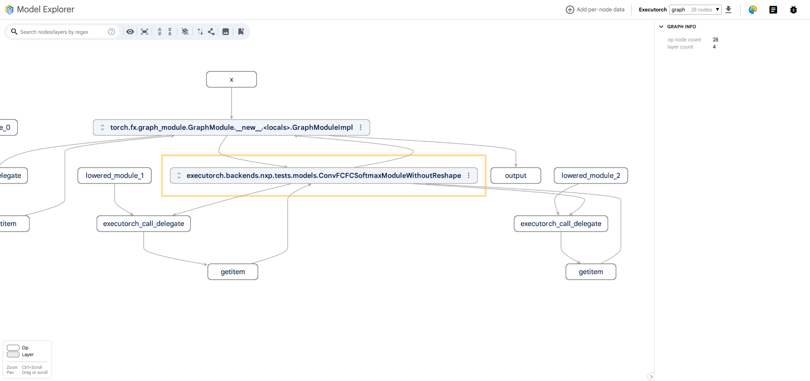

# Visualize a Model using ModelExplorer

The [visualization_utils.py](../../devtools/visualization/visualization_utils.py) contains functions for
visualizing ExecuTorch models as computational graphs using the `ModelExplorer` utility.

## Installation

To install the `ModelExplorer` and its dependencies, run:

```
./devtools/install_requirements.sh
```

## Visualize a model

The function `visualize()` takes an `ExportedProgram` and launches a `ModelExplorer` server instance. A browser tab will
open, containing the visualization.

The operations in the graph will be grouped together into collapsable nodes, based on which `nn.Module` instances they
originate from (see **<a href="#fig1">Figure 1</a>**). These nodes can be expanded by clicking the button in their top
left corner, as shown
in **<a href="#fig2">Figure 2</a>**. The model can contain an entire hierarchy of collapsable nodes, reflecting its
original _PyTorch_
implementation (see **<a href="#fig3">Figure 3</a>**).

<figure id="fig1">
   
   <figcaption><b>Figure 1</b>: Model visualization collapsed into a single node representing the original module. </figcaption>
</figure> 

<figure id="fig2">
   
   <figcaption><b>Figure 2</b>: Button to expand a node. </figcaption>
</figure> 

<figure id="fig3">
   
   <figcaption><b>Figure 3</b>: Hierarchy of expandable nodes. </figcaption>
</figure> 

The **Model Explorer GUI** provides a button in the top left corner of the screen (see **<a href="#fig4">Figure 4
</a>**),
which expands all the nested expandable nodes. The result will display all the low-level operations, surrounded by
rectangles which indicate their membership to specific `nn.Module` instances.

<figure id="fig4">
   
   <figcaption><b>Figure 4</b>: Expand all nodes. </figcaption>
</figure> 


Sometimes, it is not ideal to view the model like this. Focusing on visualizing the origin of the final nodes can make
it harder to see the flow of data in the graph. For this purpose, a button in the top left corner can flatten all the
layers (expandable nodes), effectively hiding the original `nn.Module` instances and just displaying the model as a
computational graph (see **<a href="#fig5">Figure 5</a>**).

<figure id="fig5">
   
   <figcaption><b>Figure 5</b>: Flatten the model to a simple computational graph. </figcaption>
</figure> 

---

# Visualize a Model with Highlighted QDQ Clusters and Partitions

The [visualization_utils.py](../../devtools/visualization/visualization_utils.py) contains the function
`visualize_with_clusters()` which takes an `ExportedProgram` and visualizes it using the `ModelExplorer` utility.  
It groups QDQ clusters and individual partitions together to improve readability. Example usage is available
in [examples/nxp/aot_neutron_compile.py](../../examples/nxp/aot_neutron_compile.py).

An example of the visualization is shown in **<a href="#fig6">Figure 6</a>.**
<figure id="fig6">
   
   <figcaption><b>Figure 6</b>: Example of the QDQ cluster and partition highlighting visualization.</figcaption>
</figure> 

## Usage

There are two main use cases for the visualization:

### 1. Launching the `ModelExplorer` and Visualizing the Model Immediately

Call:

```python
visualize_with_clusters(exported_program)
```

This starts a `ModelExplorer` server and opens a browser tab with the visualization.

By default, each call starts a new server instance and opens a new browser tab.  
To reuse an existing server, set the `reuse_server` parameter to `True`.

Starting the server is **blocking**, so the rest of your script will not run.

### 2. Storing a Serialized Graph and Visualizing Later (Non-blocking)

To save the visualization to a JSON file, call:

```python
visualize_with_clusters(exported_program, "my_model.json")
```

This just saves the visualization in the file, and it does **not** start the `ModelExplorer` server. You can then open
the file in the `ModelExplorer` GUI at any point. To launch the server, run:

```bash
  model-explorer [model-file-json]
```

If the `model-file-json` is provided, the `ModelExplorer` will open the model visualization. Otherwise, the
`ModelBuilder` GUI home page will appear. In that case, click **Select from your computer**, choose the JSON file,
and then click **View selected models** to display the graph.

---

## Styling the Graph

`visualize_with_clusters()` supports custom grouping of nodes into QDQ clusters and partitions.

You can pass the following optional parameters:

- `get_node_partition_name`
- `get_node_qdq_cluster_name`

These are functions that take a node and return a string identifying the partition or cluster it belongs to.  
Nodes with the same partition/cluster string will be grouped together and labeled accordingly in the visualization.

### Load a predefined style for QDQ cluster and partition highlighting.

A color style for the QDQ cluster and partition highlighting is already provided
in [devtools/visualization/model_explorer_styles/cluster_highlight_style.json](../../devtools/visualization/model_explorer_styles/cluster_highlight_style.json).
To load it follow these steps:

1. Click the **palette icon** in the top-right corner of the `ModelExplorer` interface.
2. Click **Import rules**.
3. Select
   the [cluster_highlight_style.json](../../devtools/visualization/model_explorer_styles/cluster_highlight_style.json)
   file to apply predefined styles that highlight each partition in a different color.

<figure id="fig7">
   
   <figcaption><b>Figure 7</b>: Add custom color styling to the graph. </figcaption>
</figure> 
