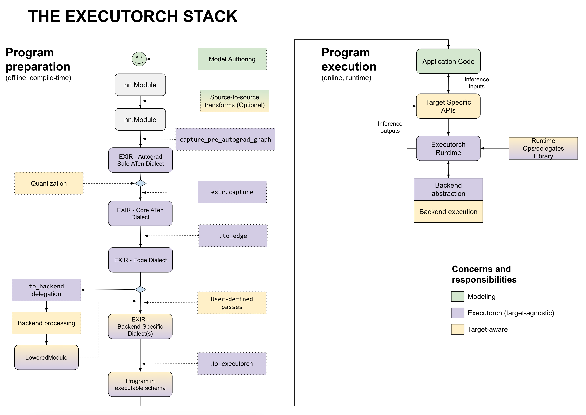

# Exporting to Executorch Runtime

On a high-level, the workflow for executorch is split to an ahead-of-time (AOT)
compilation, and a runtime.



## 1. AOT Compilation

AOT compliation offers various advantages, including the ability to apply
optimizations that are only feasible during compilation, such as graph
transformations and hardware-specific optimizations. AOT compilation offers
faster cold-start times and requires less memory compared to JIT compilation.
This makes it a particularly useful technique for optimizing the performance of
embedded devices. At a high level, the AOT steps are the following:

1. Given an eager module, export it to a graph representation, which we will
    call the `EXIR ATen Dialect`.

    a. Optionally apply passes like quantization on this graph.
2. Run passes on this graph to lower the graph representation to the
    `EXIR Edge Dialect`.

    a. Optionally apply backend-agnostic passes.
3. Optionally delegate parts of the graph or the whole graph to a specific
    backend, such as DSP, NPU or other hardware.
4. Run optional backend-specific passes, lower the graph representation to the
  `EXIR Backend Dialect`, and run memory planning.

5. Save the graph to a flatbuffer file.


### 1.1 Exporting to EXIR ATen Dialect

The entrypoint to Executorch is through the `exir.capture` API. This function
utilizes [torch.export](https://pytorch.org/docs/main/export.html) to
fully capture a PyTorch Model (either `torch.nn.Module` or a callable) into a
`torch.fx` graph representation.

In order for the model to
be fully captured into a graph, it may require minor modifications to the user
code, such as using [control flow operators](../ir_spec/control_flow.md) in
place of if-statements to capture dynamic behavior. To learn more about what
is supported in the export flow, you can take a look at the examples in
[exportdb](https://pytorch.org/docs/main/generated/exportdb/index.html).
[Custom operators](./custom_ops.md) can also be traced into the graph
through registering the custom operator to a torch library and providing a meta
kernel.

The output of `exir.capture` is a fully flattened graph (meaning the graph does
not contain any module heirachy, except in the case of control flow operators)
containing the
[Core ATen Operators](https://pytorch.org/docs/main/ir.html), functional
variants of custom
operators (they do not do any mutations or aliasing), and control flow
operators. The detailed specification for the result of `exir.capture` can be
found in the [EXIR Reference](../ir_spec/00_exir.md) and is specifically in the
[EXIR ATen Dialect](../ir_spec/01_aten_dialect.md).

```python
import torch
import executorch.exir as exir

class MyModule(torch.nn.Module):
    def __init__(self):
        super().__init__()
        self.param = torch.nn.Parameter(torch.rand(3, 4))
        self.linear = torch.nn.Linear(4, 5)

    def forward(self, x):
        return self.linear(x + self.param).clamp(min=0.0, max=1.0)

aten_dialect = exir.capture(MyModule(), (torch.randn(3, 4),))

print(aten_dialect)
"""
ExportedProgram:
    class GraphModule(torch.nn.Module):
        def forward(self, arg0_1: f32[4, 4]):
            # File: /Users/marksaroufim/Dev/zzz/test3.py:10, code: return self.linear(x)
            _param_constant0 = self._param_constant0
            t: f32[4, 4] = torch.ops.aten.t.default(_param_constant0);  _param_constant0 = None
            _param_constant1 = self._param_constant1
            addmm: f32[4, 4] = torch.ops.aten.addmm.default(_param_constant1, arg0_1, t);  _param_constant1 = arg0_1 = t = None
            return [addmm]
            
Graph Signature: ExportGraphSignature(parameters=[], buffers=[], user_inputs=[], user_outputs=[], inputs_to_parameters={}, inputs_to_buffers={}, buffers_to_mutate={}, backward_signature=None, assertion_dep_token=None)
Symbol to range: {}
"""
```

At this point, users can choose to run additional passes through the
`exported_program.transform(passes)` function. A tutorial on how to write
transformations can be found [here](./passes.md).

Additionally, users can run quantization at this step. A tutorial for doing so can be found [here](./short_term_quantization_flow.md).

### 1.2 Lower to EXIR Edge Dialect

The next step is to lower the `EXIR ATen Dialect` graph to the
`EXIR Edge Dialect`, in which specializations that are useful for Edge devices but not
necessary for general (server) will be applied. Some of these specializations
include dtype specialization, scalar to tensor conversion, and converting all
operators to the `executorch.exir.dialects.edge` namespace. Note that this
dialect is still backend (or target) agnostic. Detailed
documentation on the Edge Dialect can be found
[here](../ir_spec/02_edge_dialect.md).

This lowering will be done through the `to_edge()` API.

```python
aten_dialect = exir.capture(MyModule(), (torch.randn(3, 4),))
edge_dialect = aten_dialect.to_edge(exir.EdgeCompileConfig(_check_ir_validity=False))

print(edge_dialect)
"""
ExportedProgram:
    class GraphModule(torch.nn.Module):
        def forward(self, arg0_1: f32[3, 3]):
            # File: /Users/marksaroufim/Dev/zzz/test3.py:10, code: return self.linear(x)
            _param_constant0: f32[3, 3] = self._param_constant0
            t_copy_default: f32[3, 3] = torch.ops.aten.t_copy.default(_param_constant0);  _param_constant0 = None
            _param_constant1: f32[3] = self._param_constant1
            addmm_default: f32[3, 3] = torch.ops.aten.addmm.default(_param_constant1, arg0_1, t_copy_default);  _param_constant1 = arg0_1 = t_copy_default = None
            return [addmm_default]
            
Graph Signature: ExportGraphSignature(parameters=[], buffers=[], user_inputs=[], user_outputs=[], inputs_to_parameters={}, inputs_to_buffers={}, buffers_to_mutate={}, backward_signature=None, assertion_dep_token=None)
Symbol to range: {}
"""
```

Users can also choose to run additional passes through the
`exported_program.transform(passes)` function. A tutorial on how to write
transformations can be found [here](./passes.md). Note that since the graph is
now in Edge Dialect, all passes must also result in a valid Edge Dialect graph
(specifically one thing to point out is that the operators are now in the
`executorch.exir.dialects.edge` namespace, rather than the `torch.ops.aten`
namespace). More information about the Edge Operators can be found [here](../ir_spec/02_edge_dialect.md#edge-operator).

### 1.3 Delegate the graph to a backend

Users can then delegate parts of their graph or the whole graph to a specific
third party delegate using our [delegation APIs](./backend_delegate.md).

### 1.4 Run backend-specific passes and memory planning

Through the `to_executorch()` API, users can pass in backend-specific
passes, such as replacing sets of operators with a custom backend operator, and
run it on the Edge Dialect graph.

Afterwards, an out-variant pass will be run on the graph to convert all of the
operators to their out variants. The purpose of this is to prepare the graph for
memory planning. Instead of allocating returned tensors in the kernel
implementations, an operator's out variant will take in a prealloacated tensor
to its `out` kwarg, and store the result there, making it easier for memory
planners to do tensor lifetime analysis. `alloc` nodes containing a call to a
`executorch.exir.memory.alloc` operator will be inserted into the graph to pass
to the out variants.

Lastly, a memory planning pass is run to assign a memory ID to each tensor, and
an offset in the buffer, marking where the storage for the tensor starts. A
default greedy and naive implementation is provided, but a user-provided memory
planning pass can also be passed into `to_executorch`. A tutorial on how to
write a memory plnaning pass is here (TODO).

```python
aten_dialect = exir.capture(MyModule(), (torch.randn(3, 4),))
edge_dialect = aten_dialect.to_edge()

# Play around with the available configs
from executorch.exir.capture import ExecutorchBackendConfig
executorch_program = edge_dialect.to_executorch(ExecutorchBackendConfig(memory_planning_pass="greedy"))
print(executorch_program.dump_exported_program())

"""
ExportedProgram:
  class GraphModule(torch.nn.Module):
    def forward(self, arg0_1: f32[3, 4], arg1_1: f32[5, 4], arg2_1: f32[5], arg3_1: f32[3, 4]):
      alloc: f32[3, 4] = executorch_exir_memory_alloc(((3, 4), torch.float32))
      add: f32[3, 4] = torch.ops.aten.add.out(arg3_1, arg0_1, out = alloc);
      alloc_1: f32[4, 5] = executorch_exir_memory_alloc(((4, 5), torch.float32))
      permute: f32[4, 5] = torch.ops.aten.permute_copy.out(arg1_1, [1, 0], out = alloc_1);
      alloc_2: f32[3, 5] = executorch_exir_memory_alloc(((3, 5), torch.float32))
      addmm: f32[3, 5] = torch.ops.aten.addmm.out(arg2_1, add, permute, out = alloc_2);
      alloc_3: f32[3, 5] = executorch_exir_memory_alloc(((3, 5), torch.float32))
      clamp: f32[3, 5] = torch.ops.aten.clamp.out(addmm, 0.0, 1.0, out = alloc3);
      return (clamp,)
"""
```

### 1.5 Save the graph to a flatbuffer file.

Finally, the exported and delegated graph can be saved to a flatbuffer file to
be loaded in the Executorch runtime.

```python
edge_dialect = exir.capture(MyModule(), (torch.randn(3, 4),)).to_edge()
executorch_program = edge_dialect.to_executorch()
buffer = executorch_program.buffer

# Save it to a file and load it in the Executorch runtime
with open("model.ff", "wb") as file:
    file.write(buffer)

# Or you can run the Executorch runtime in python to try it out
from executorch.extension.pybindings.portable import (
    _load_for_executorch_from_buffer,
)

executorch_module = _load_for_executorch_from_buffer(buff)
model_outputs = executorch_module.forward([torch.randn(3, 4)])
```
