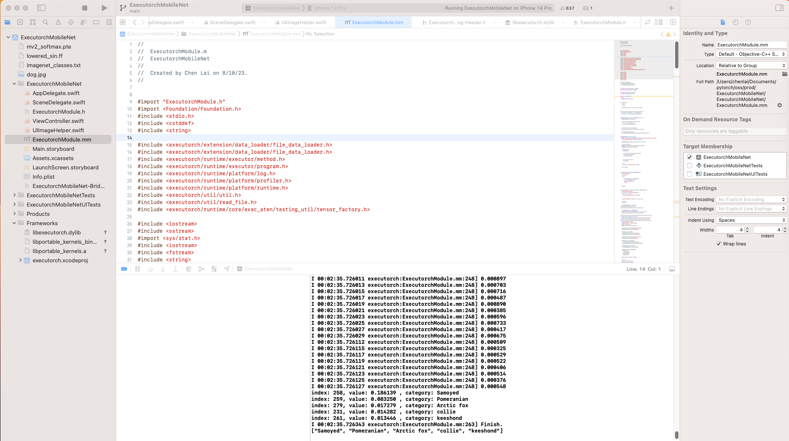

# [WIP] IOS simple MobileNet App Examples

This is a simple example ios App to test out executorch integration with iOS. It's still WIP and we expect to have a seperate repo for it.

The current flow is

Languages:

- UI: Swift
- Bridging with Executorch: Objective-C++
- Executorch: C++

## ExecutorchMobileNet App

It's an app to use MobileNet with Executorch. In XCode, the layout is as following



and UI looks like


Step 1. Export a MobileNetV2 model following example follwing executorch/examples/export/export_example.py. Instead of export mv2 directly, add a softmax at the end
```python
class MobileNetV2Wrapper(torch.nn.Module):
    def __init__(self):
        super().__init__()
        self.mv2 = models.mobilenet_v2(weights=MobileNet_V2_Weights.DEFAULT).eval()

    def forward(self, x):
        out = self.mv2(x)
        return torch.nn.functional.softmax(out[0], dim=0)

mv2_wrapper = MobileNetV2Wrapper()
exec_prog = exir.capture(mv2_wrapper, (torch.randn(1, 3, 224, 224),) , exir.CaptureConfig(enable_aot=True, _unlift=False)).to_edge(exir.EdgeCompileConfig(
    _check_ir_validity=False,
)).to_executorch()

buffer = exec_prog.buffer

filename = "mv2_softmax.pte"
print(f"Saving exported program to {filename}")
with open(filename, "wb") as file:
    file.write(buffer)
```

Step 2:
Add the following files to **Build Phases** -> **Copy Bundle Resources**
- mv2_softmax.pte (generated from Step 1)
- imagenet_classes.txt (the categories from ImageNet1000, trained together with MobileNetV2)
- dog.jpg

Step 3:
Link executorch and kernels libraries following instructions in [Cross Compiling Session in CMake Build System](../../executorch/docs/website/docs/tutorials/cmake_build_system.md)

Step 4:
Build and Run


Known Issues:
1. the perf will be slow due to a few reasons
    - It uses portable kernels. It's good for portability but not for performance.
    - The **Run Inference** button includes both model loading and running inference
    - The Swift layer + Object-C++ + C++ are not optmized yet.
