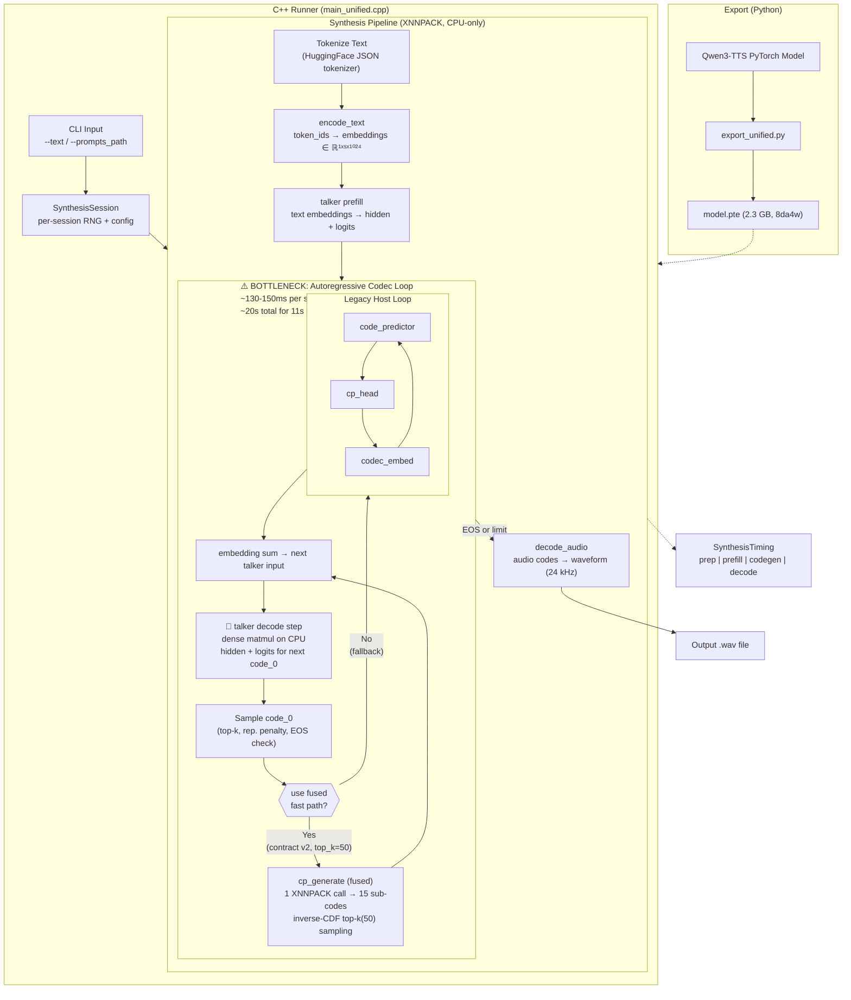
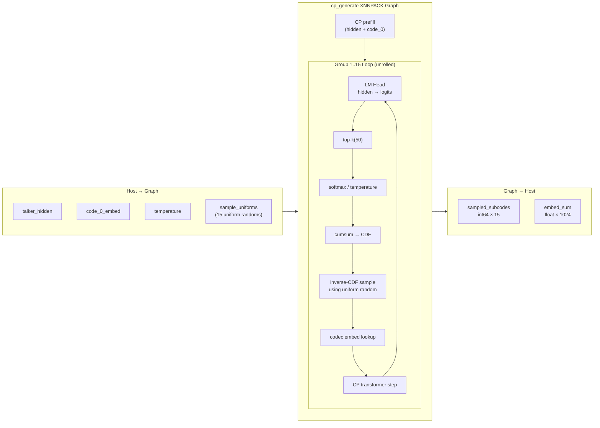
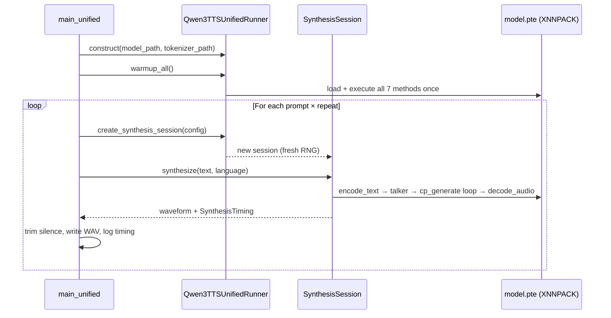

# Qwen3-TTS XNNPACK Pipeline Architecture

Copy the code below and paste into:
- **VS Code**: Paste in any `.md` file, press `Ctrl+Shift+V` to preview
- **Mermaid Playground**: https://mermaid.live
- **GitHub**: Renders natively in `.md` files

## End-to-End Pipeline

### Current Performance

> | Metric | Legacy (host loop) | Fused cp_generate v2 |
> |--------|-------------------|----------------------|
> | Generation time | 23.9s | 19.6s |
> | Codegen | 21.1s | 17.0s |
> | Per-step cost | ~150ms | ~125ms |
> | Audio output | 11.5s | 10.8s |
>
> Fused `cp_generate` v2 collapsed 15 host round-trips into 1 graph call, achieving ~15-20% codegen speedup.

## Fused cp_generate v2 Detail

## Warm Benchmark Session Flow

## Summary

These diagrams show the Qwen3-TTS XNNPACK pipeline at three levels:

1. **End-to-end pipeline**: text input → tokenization → 7-method model execution → WAV output, with the fused/legacy fast-path decision gate
2. **Fused cp_generate v2**: the internal XNNPACK graph that collapses 15 host round-trips into one call using inverse-CDF sampling
3. **Warm benchmark session**: how `SynthesisSession` keeps the runner warm across sequential prompts for honest latency measurement
