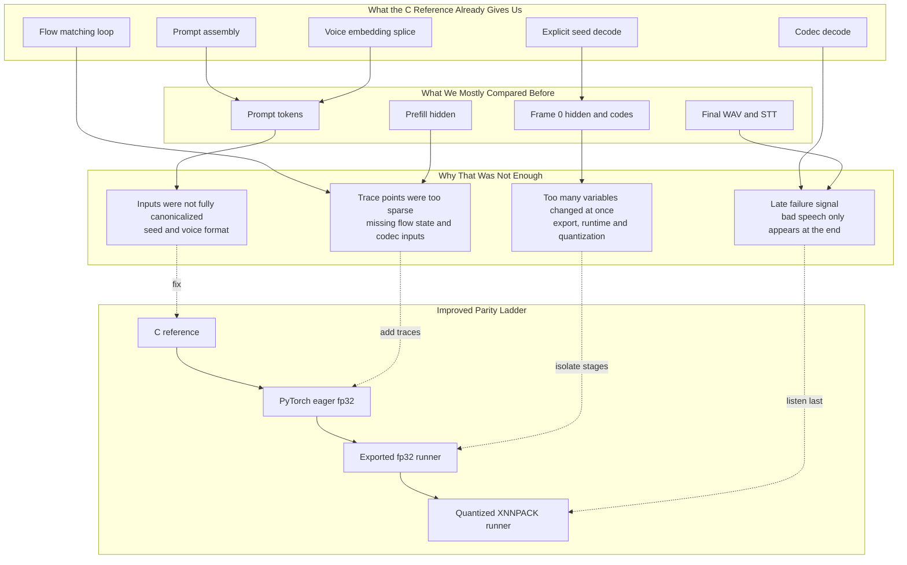

# Voxtral TTS Parity Gap With C Reference

Copy the code below and paste into:
- **VS Code**: Open this file and press `Ctrl+Shift+V` to preview
- **Mermaid Playground**: https://www.internalfb.com/mermaid/preview
- **Phabricator**: Use `lang=mermaid` code block in diff or wiki

## Diagram

## Summary

The C implementation at `/Users/younghan/project/voxtral-tts.c` was already good enough to be a real parity reference. The problem was not the absence of a reference. The problem was that our comparison process was incomplete and asymmetric, so we were still comparing too much of the system at once.

## Why We Still Failed Before

### 1. We compared some checkpoints, but not the full latent trajectory

The C reference cleanly separates:

- prompt assembly
- voice embedding splice
- prefill
- explicit `AUDIO` seed decode
- flow matching
- audio-token feedback
- codec decode

That gave us the right conceptual scaffold.

But our actual parity checks focused mostly on:

- prompt token IDs
- `prefill_hidden`
- `frame0_hidden`
- first-frame codes
- final waveform or STT result

That left a major blind spot in the middle of the pipeline, especially inside flow matching and codec preparation, where speech quality can collapse without any crash.

## 2. Inputs were not fully canonicalized before comparison

The biggest issue was that "same model" did not always mean "same run conditions."

Concrete examples:

- The C CLI exposes a seed flag in `project/voxtral-tts.c/main.c` via `-s <seed>`.
- The current ExecuTorch runner CLI in `examples/models/voxtral_tts/main.cpp` does not expose a seed flag.
- The runner uses internal RNG state in `voxtral_tts_runner.cpp`, so two runs can still diverge even if prompt parity looks correct.

Voice assets also had format ambiguity:

- The C reference centers around `.pt` voice assets and raw BF16 `.bin` conversion.
- The ExecuTorch runner supports `.pt` and `.bin`, but parity becomes fragile unless both sides use the exact same canonical tensor, dtype, and length.

So we were sometimes comparing outputs from different effective inputs.

## 3. We mixed model parity, export parity, runtime parity, and backend parity

The C reference runs directly from `consolidated.safetensors`.

Our ExecuTorch path adds extra stages:

- Python eager model
- export to `model.pte`
- separate export to `codec_decoder.pte`
- C++ runner execution
- optional quantization
- backend lowering such as XNNPACK

When we compared C output directly against exported or quantized runner output too early, we were testing all of these at the same time:

- architecture parity
- export correctness
- state reset correctness
- runtime orchestration
- quantization effects
- backend effects

That made failures much harder to localize.

## 4. The failure signal came too late

For TTS, the final symptom is usually:

- robotic speech
- noisy output
- "No speech detected" from STT

That is a very late signal.

By the time the bad waveform appears, the true cause may already be several steps upstream:

- prompt layout
- seed decode position
- RoPE convention
- flow ODE updates
- audio-token embedding feedback
- codec input frame values

So even with a good C reference, listening to the final WAV was too late to be the main comparison method.

## The Real Gap

The gap was not "we had no reference."

The real gap was:

> we did not enforce a deterministic, stage-by-stage, trace-rich parity ladder from the C reference to eager fp32 to exported fp32 to quantized runner.

More specifically, we were missing four things:

1. Canonical inputs

- Same prompt construction
- Same voice tensor
- Same seed

2. Dense internal traces

- Seed embedding
- Seed hidden state
- Per-step flow state `x`
- Conditioned and unconditioned velocity
- Audio-token embedding output
- Codec input windows

3. Stage isolation

- Compare C vs eager fp32 first
- Then eager fp32 vs exported fp32
- Only then exported fp32 vs quantized XNNPACK

4. Hard debug gates

- Do not trust final audio until early parity gates pass
- Do not quantify backend quality until fp32 path matches the reference

## How We Can Improve

### Immediate improvements

1. Add a `--seed` flag to the ExecuTorch runner CLI so C, eager, and exported runs can use the same random path.
2. Treat the voice asset as a canonical test artifact with recorded path, dtype, shape, and hash.
3. Make prompt validation mandatory on every debug run, not optional.
4. Expand trace output in `voxtral_tts_runner.cpp` to include:
   `seed_embed`, `seed_hidden`, per-step `x`, `v_cond`, `v_uncond`, `audio_token_embedding`, codec input frames.
5. Compare generator parity and codec parity separately.

### Recommended parity ladder

1. `voxtral-tts.c`
   This remains the behavioral reference.
2. `test_eager_e2e.py`
   This should be the fp32 parity oracle.
3. Exported fp32 runner
   This validates export and C++ orchestration without quantization noise.
4. Quantized XNNPACK runner
   This is the final performance deployment target, not the first parity target.

## Why This Matters

Without this ladder, a single bad audio output can still come from many different root causes. That is why it felt like we "had a working C reference but still could not match it."

The missing piece was not reference quality. The missing piece was comparison discipline.

## Bottom Line

The C implementation was useful enough for one-by-one comparison.

We failed earlier because we did not compare the right boundaries with the right determinism and the right trace depth. We validated some early checkpoints and the final waveform, but not enough of the hidden generation path in between.

Once we enforce:

- canonical inputs
- deterministic seeds
- dense stage traces
- fp32-before-quantized gating

the C reference becomes much more effective as a true parity oracle instead of just a qualitative guide.
