# Voxtral TTS vs Voxtral Realtime

Manager-facing explanation of why `voxtral_realtime` was a strong reference for ExecuTorch integration, but not enough by itself to guarantee working `voxtral_tts` voice generation.

## Executive Summary

`voxtral_realtime` and `voxtral_tts` share some infrastructure patterns in ExecuTorch, but they solve fundamentally different problems.

- `voxtral_realtime` is a relatively direct speech-to-text system: audio in, text out.
- `voxtral_tts` is a multi-stage generative system: text and voice conditioning in, latent audio codes out, then waveform decoding.
- That difference matters because `voxtral_tts` can be numerically "running" while still producing broken audio. Many failure modes stay shape-correct and do not crash.

The short version is:

> `voxtral_realtime` mostly validated our backend/export/runtime path.
> `voxtral_tts` additionally requires exact parity in prompt construction, voice conditioning, hidden-state evolution, flow-matching dynamics, audio-token feedback, and codec decoding.

That is why TTS turned out much harder than expected, even though the realtime model was already working.

## Architecture At A Glance

```mermaid
flowchart TD
    subgraph Realtime["Voxtral Realtime"]
        RTAudio[16 kHz audio]
        RTPrep[Mel preprocessor]
        RTEnc[Audio encoder]
        RTDec[Text decoder]
        RTText[Text tokens]
        RTAudio --> RTPrep --> RTEnc --> RTDec --> RTText
    end

    subgraph TTS["Voxtral TTS"]
        TTSText[Input text]
        TTSVoice[Voice embedding]
        TTSPrompt[Prompt assembly]
        TTSLM[LLM decoder]
        TTSSem[Semantic logits]
        TTSFlow[Flow matching head]
        TTSCodes[37 codebooks per frame]
        TTSCodec[Codec decoder]
        TTSWave[24 kHz waveform]
        TTSText --> TTSPrompt
        TTSVoice --> TTSPrompt
        TTSPrompt --> TTSLM --> TTSSem --> TTSFlow --> TTSCodes --> TTSCodec --> TTSWave
        TTSCodes -- audio token feedback --> TTSLM
    end
```

## The Core Difference

`voxtral_realtime` is a transcription stack with one main semantic objective: convert audio into the correct text tokens.

`voxtral_tts` is a synthesis stack with several dependent latent objectives:

1. Build the exact multimodal prompt.
2. Inject the correct speaker embedding.
3. Produce the right decoder hidden state.
4. Predict the right semantic audio token.
5. Solve the acoustic frame with flow matching and classifier-free guidance.
6. Feed generated audio codes back into the decoder correctly.
7. Decode those codes into a human waveform with the codec.

If any one of those steps is slightly wrong, the system can still produce a `.wav` file, but the waveform may be robotic, noisy, or unintelligible.

## Side-By-Side Comparison

| Area | `voxtral_realtime` | Current `voxtral_tts` | Why This Matters |
|------|--------------------|-----------------------|------------------|
| User-visible output | Text tokens | Waveform | Text errors are immediately visible; audio errors can hide until the final decode |
| Main exported surface | `audio_encoder` or `encode_audio_chunk`, `text_decoder`, `token_embedding` | `text_decoder`, `token_embedding`, `audio_token_embedding`, `semantic_head`, `predict_velocity`, plus separate `codec_decoder` | TTS has more moving parts and more interfaces that must match the reference exactly |
| External conditioning | Audio waveform only | Text plus external voice embedding | Voice conditioning adds another failure surface even before generation starts |
| Per-step complexity | One encoder pass plus one decoder step | One semantic step plus 14 velocity predictions per frame, code quantization, audio-token feedback, and periodic codec decode | TTS compounds small errors much faster |
| Streaming design | First-class streaming export path with `encode_audio_chunk` | Current streaming is mostly chunked codec emission layered on top of the same generator | Realtime streaming correctness is more localized and easier to reason about |
| Debug visibility | Transcript can be read directly | Need parity traces, waveform inspection, or STT retranscription | TTS failures take much longer to localize |
| Typical failure shape | Wrong text or dropped tokens | Valid-looking waveform that is still not speech | "No crash" does not mean "correct speech" |

## Why `voxtral_realtime` Was Easier

### 1. The output is directly inspectable

For `voxtral_realtime`, every major bug eventually shows up as wrong text. We can inspect tokens on stdout and quickly tell whether the system is improving.

For `voxtral_tts`, intermediate tensors can look plausible while the final audio is still wrong. The model may emit non-silent audio that remains unusable for a listener.

### 2. The architecture is much narrower

Realtime is essentially:

`audio -> mel -> encoder -> decoder -> text`

TTS is:

`text + voice embedding -> decoder hidden state -> semantic code -> flow matching ODE -> acoustic codebooks -> audio-token feedback -> codec -> waveform`

That extra latent chain is the main reason the implementation risk is much higher.

### 3. Realtime tolerates backend-focused bring-up better

Working `voxtral_realtime` demonstrated that our ExecuTorch export and runtime patterns are sound for:

- multi-method export
- KV cache handling
- quantization bring-up
- backend lowering
- C++ runner orchestration

But TTS needs more than backend correctness. It needs model-parity correctness across several hidden interfaces that are specific to speech synthesis.

### 4. Realtime does not have a vocoder-style final stage

Realtime stops at text.

TTS still has to turn latent codebooks into natural speech. A bug in the codec path, codebook generation path, or prompt/voice setup can all produce a waveform that is mathematically valid but perceptually wrong.

## Why We Are Seeing Broken Voice Generation

The current issue is not simply "ExecuTorch cannot run the model."

The more accurate explanation is:

> The ExecuTorch pipeline is now running far enough to emit audio, but the TTS-specific latent generation path is still not matching the original Voxtral TTS behavior closely enough to produce intelligible speech.

In practice, broken voice generation can happen when any of the following diverges from the reference implementation:

- prompt token layout and special-token order
- speaker embedding length, placement, or format
- decoder hidden state right after prompt prefill
- semantic token selection logic
- RoPE convention and cache behavior
- flow-matching ODE dynamics and classifier-free guidance
- audio-token embedding feedback into the decoder
- codec windowing and waveform assembly

The important point is that most of these failures do **not** crash the program. They only change the latent trajectory enough that the final waveform loses speech structure.

## What We Already Learned From Bring-Up

During debugging we already fixed several architectural mismatches that were specific to TTS, not to the generic ExecuTorch runtime:

- corrected the RoPE convention to match the Mistral reference weights
- fixed codec sliding-window behavior
- exported semantic logits instead of hard argmax so the runner can control sampling
- improved cache hygiene in eager validation
- adjusted WAV output to standard 16-bit PCM for reliable downstream inspection

Those fixes improved the system from near-silent or obviously broken output toward non-trivial waveform generation, but they did **not** fully restore intelligible speech.

That is a strong signal that the remaining gap is in TTS model parity, not in basic backend execution.

## Current Manager-Level Readout

The best way to frame the current status is:

- `voxtral_realtime` proved that ExecuTorch can host this family of Mistral multimodal models well.
- `voxtral_tts` is a much more fragile generation stack with hidden-state, voice-conditioning, and codec-parity requirements that `voxtral_realtime` never had to solve.
- The current blocker is **not** "can the model run?" It is "can we reproduce the original TTS latent generation path closely enough to recover natural speech?"
- That makes this a **model-parity and orchestration problem**, not just a backend porting problem.

## Recommended Next Focus

To finish `voxtral_tts`, the highest-value work is not more generic runtime work. It is tighter parity validation against the original reference path:

1. Lock exact prompt and voice-conditioning parity.
2. Compare hidden states immediately after prefill and after the first generated audio frame.
3. Compare semantic token choices and first acoustic frame values against the reference implementation.
4. Validate codec input frames before evaluating waveform quality.
5. Re-run quantized export only after fp32 parity is restored.

## Bottom Line

It was reasonable to expect `voxtral_realtime` to accelerate `voxtral_tts`, and it did help with export, backend, quantization, and runner patterns.

However, it did **not** remove the hardest part of TTS:

> speech synthesis depends on exact latent-generation parity across multiple hidden stages, whereas realtime transcription mainly depends on getting text decoding right.

That is the main reason a working `voxtral_realtime` implementation did not translate into immediate success for `voxtral_tts`.
