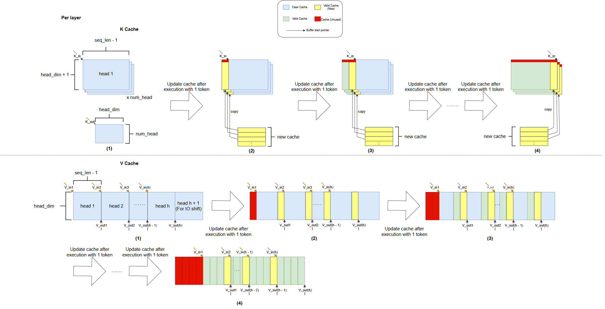

# Summary

## Overview
This file provides you the instructions to run LLM Decoder model with different parameters via Qualcomm HTP backend. We currently support the following models:
 1. LLAMA2 Stories 110M
 2. LLAMA3.2 1B
 3. LLAMA3.2 3B
 4. Codegen2 1B
 5. Gemma 2B
 6. Gemma3 1B
 7. Phi4-mini-instruct
 8. QWEN2.5 0.5B / 1.5B
 9. QWEN3 0.6B / 1.7B
 10. SmolLM2 135M
 11. SmolLM3 3B
 

We offer the following modes to execute the model:

- KV Cache Mode: In KV Cache mode, the model takes in a single previous token and generates the next predicted token along with its KV cache. It is efficient for generating subsequent tokens after the initial prompt.

- Hybrid Mode: Hybrid mode leverages the strengths of both AR-N model and KV cache modes to optimize token generation speed. Initially, it uses AR-N model to efficiently generate the prompt's key-value (KV) cache. Then, the mode switches to KV cache mode, which excels at generating subsequent tokens.
  - AR-N model: The auto-regression (AR) length determines the number of tokens to consume and the number of logits to produce. Use it to process the prompt and generate the key-value (kv) cache, which serves as a prompt processor in hybrid mode.
  - Prompt processing with AR-N model: 
  <figure>
    
    <figcaption>Prompt processing is done using a for-loop. An N-token block is taken, and the KV cache is updated for that block. This process is repeated until all tokens are consumed, with the last block potentially requiring padding. For flexibility, the AR-N model can handle any input length less than the maximum sequence length. For TTFT, the input length (or number of blocks) will vary depending on the actual input length, rather than always being the same.
    </figcaption>
</figure>

- Lookahead Mode: Lookahead Mode introduces [lookahead decoding](https://arxiv.org/abs/2402.02057) and uses AR-N model to process prompt to enhance token generation speed. While decoding multiple tokens in a single step is infeasible, an LLM can generate multiple guess tokens in parallel. These guess tokens may fit into future parts of the generated sequence. The lookahead decoder generates and verifies these guess tokens, integrating them into the sequence if suitable. In some cases, it can obtain more than one token in a single step. Result is lossless.

## Instructions
### Note
1. For hybrid mode, the export time will be longer and can take up to 1-4 hours to complete, depending on the specific model users are exporting.
2. When exporting a hybrid mode model, memory consumption will be higher. Taking LLAMA3.2 1B as an example, please ensure the device has at least 80 GB of memory and swap space.


### Step 1: Setup
1. Follow the [tutorial](https://pytorch.org/executorch/main/getting-started-setup) to set up ExecuTorch.
2. Follow the [tutorial](https://pytorch.org/executorch/main/backends-qualcomm) to build Qualcomm AI Engine Direct Backend.
3. Please install the llm eval dependency via [examples/models/llama/install_requirements.sh](https://github.com/pytorch/executorch/blob/main/examples/models/llama/install_requirements.sh)

### Step 2: Prepare Model

#### LLAMA2
Download and prepare stories110M model

```bash
# tokenizer.model & stories110M.pt:
wget "https://huggingface.co/karpathy/tinyllamas/resolve/main/stories110M.pt"
wget "https://raw.githubusercontent.com/karpathy/llama2.c/master/tokenizer.model"

# tokenizer.bin:
python -m pytorch_tokenizers.tools.llama2c.convert -t tokenizer.model -o tokenizer.bin

# params.json:
echo '{"dim": 768, "multiple_of": 32, "n_heads": 12, "n_layers": 12, "norm_eps": 1e-05, "vocab_size": 32000}' > params.json
```

#### LLAMA3.2
Follow the [instructions](https://www.llama.com/) to download models.
At the end of this step, users should have the following files ready: `consolidated.00.pth`, `params.json`, and `tokenizer.model`.


### Step3: Run default examples using hybrid mode for smaller models and kv mode for larger models.
#### LLAMA2
```bash
python examples/qualcomm/oss_scripts/llama/llama.py -b build-android -s ${SERIAL_NUM} -m ${SOC_MODEL} --checkpoint stories110M.pt --params params.json --tokenizer_model tokenizer.model --tokenizer_bin tokenizer.bin --decoder_model stories110m --model_mode hybrid --prefill_ar_len 32 --max_seq_len 128 --prompt "Once upon a time"
```

#### LLAMA3.2 1B Instruct
Default example using kv mode.
```bash
python examples/qualcomm/oss_scripts/llama/llama.py -b build-android -s ${SERIAL_NUM} -m ${SOC_MODEL} --checkpoint consolidated.00.pth --params params.json --tokenizer_model tokenizer.model --decoder_model llama3_2-1b_instruct --model_mode hybrid --prefill_ar_len 128 --max_seq_len 1024 --prompt "I would like to learn python, could you teach me with a simple example?" --tasks wikitext --limit 1
```

#### LLAMA3.2 3B Instruct
Default example using kv mode.
```bash
python examples/qualcomm/oss_scripts/llama/llama.py -b build-android -s ${SERIAL_NUM} -m ${SOC_MODEL} --checkpoint consolidated.00.pth --params params.json --tokenizer_model tokenizer.model --decoder_model llama3_2-3b_instruct --model_mode kv --max_seq_len 1024 --prompt "I would like to learn python, could you teach me with a simple example?" --tasks wikitext --limit 1
```

#### Codegen2
Default example using kv mode.
```bash
python examples/qualcomm/oss_scripts/llama/llama.py -b build-android -s ${SERIAL_NUM} -m ${SOC_MODEL} --decoder_model codegen2_1b --model_mode kv --max_seq_len 1024 --prompt "def hello_world():" 
```

#### Gemma 2B
Default example using hybrid mode
```bash
python examples/qualcomm/oss_scripts/llama/llama.py -b build-android -s ${SERIAL_NUM} -m ${SOC_MODEL} --temperature 0 --model_mode hybrid --max_seq_len 1024 --prefill_ar_len 128 --decoder_model gemma-2b --prompt "I would like to learn python, could you teach me with a simple example?" --tasks wikitext --limit 1
```


#### Gemma3 1B
Default example using hybrid mode
```bash
python examples/qualcomm/oss_scripts/llama/llama.py -b build-android -s ${SERIAL_NUM} -m ${SOC_MODEL} --temperature 0 --model_mode hybrid --max_seq_len 1024 --prefill_ar_len 128 --decoder_model gemma3-1b --prompt "I would like to learn python, could you teach me with a simple example?" --tasks wikitext --limit 1
```

#### Phi4-mini-instruct
Default example using kv mode.
```bash
python examples/qualcomm/oss_scripts/llama/llama.py -b build-android -s ${SERIAL_NUM} -m ${SOC_MODEL} --decoder_model phi_4_mini --model_mode kv --max_seq_len 1024 --prompt "I would like to learn python, could you teach me with a simple example?" --tasks wikitext --limit 1
```

#### QWEN2.5 0.5B
Default example using hybrid mode
```bash
python examples/qualcomm/oss_scripts/llama/llama.py -b build-android -s ${SERIAL_NUM} -m ${SOC_MODEL} --temperature 0 --model_mode hybrid --max_seq_len 1024 --prefill_ar_len 128 --decoder_model qwen2_5-0_5b --prompt "I would like to learn python, could you teach me with a simple example?" --tasks wikitext --limit 1
```

#### QWEN2.5 1.5B
Default example using kv mode
```bash
python examples/qualcomm/oss_scripts/llama/llama.py -b build-android -s ${SERIAL_NUM} -m ${SOC_MODEL} --temperature 0 --model_mode kv --max_seq_len 1024 --decoder_model qwen2_5-1_5b --prompt "I would like to learn python, could you teach me with a simple example?" --tasks wikitext --limit 1
```

#### QWEN3 0.6B
Default example using hybrid mode
```bash
python examples/qualcomm/oss_scripts/llama/llama.py -b build-android -s ${SERIAL_NUM} -m ${SOC_MODEL} --temperature 0 --model_mode hybrid --max_seq_len 1024 --prefill_ar_len 128 --decoder_model qwen3-0_6b --prompt "I would like to learn python, could you teach me with a simple example?" --tasks wikitext --limit 1
```

#### QWEN3 1.7B
Default example using hybrid mode
```bash
python examples/qualcomm/oss_scripts/llama/llama.py -b build-android -s ${SERIAL_NUM} -m ${SOC_MODEL} --temperature 0 --model_mode kv --max_seq_len 1024 --decoder_model qwen3-1_7b --prompt "I would like to learn python, could you teach me with a simple example?" --tasks wikitext --limit 1
```

#### SmolLM2
Default example using hybrid mode.
```bash
python examples/qualcomm/oss_scripts/llama/llama.py -b build-android -s ${SERIAL_NUM} -m ${SOC_MODEL} --decoder_model smollm2_135m --model_mode hybrid --prefill_ar_len 128 --max_seq_len 1024 --prompt "I would like to learn python, could you teach me with a simple example?" --tasks wikitext --limit 1
```

#### SmolLM3
Default example using kv mode.
```bash
python examples/qualcomm/oss_scripts/llama/llama.py -b build-android -s ${SERIAL_NUM} -m ${SOC_MODEL} --decoder_model smollm3-3b --model_mode kv --max_seq_len 1024 --prompt "I would like to learn python, could you teach me with a simple example?" --tasks wikitext --limit 1
```

### KV Cache update mechanism
We have two distinct mechanisms for updating the key-value (KV) cache, which can be selected at runtime. Shift Pointer and Smart Mask.

#### Shift Pointer mechanism

<figure>
     <figcaption>
    The figure illustrates the process of updating the key and value caches during each inference step. In key cache update process, we initially allocate memory for each layer with <code>num_head</code> size of <code>(head_dim + 1) * (seq_len - 1)</code>. After a single inference, the new key cache is copied from the key output pointer <code>k_out</code> and appended to the key cache. Subsequently, the buffer start pointer of the key cache <code>k_in</code> moves to the next token, making the previous position of the buffer start pointer unused. This process is repeated for each subsequent inference step.
    For the value cache update process, we first allocate a contiguous memory of size <code>(num_head + 1) * head_dim * (seq_len - 1)</code> for each layer, with the last head reserved for I/O shifting, After the first inference, the cache is updated by simply shifting the pointers of all heads to the next token position, making only the previous <code>head_dim * 1</code> section of the buffer start pointer <code>v_in</code> of the first head unused. This process is repeated for each subsequent inference step.</figcaption>
</figure>

#### Smart Mask mechanism:
<figure>
    
    <figcaption>The Smart Mask mechanism streamlines the process of updating tokens in the cache. Unlike the Shift Pointer mechanism, which requires moving the buffer start pointer <code>k_in</code>/<code>v_in</code> of the cache, the Smart Mask mechanism updates only the new token at the specified position. This approach eliminates the need to adjust the buffer start pointer. This mechanism is beneficial for shared buffers but requires CPU memory copying. </figcaption>
</figure>

#### Analysis KV Cache Update Mechanism for each Layer each inference
<table>
  <tr>
    <th>Mechanism</th>
    <th colspan="2" style="text-align:center;">Time Complexity</th>
    <th colspan="2" style="text-align:center;">Space Complexity</th>
  </tr>
  <tr>
    <th></th>
    <th style="text-align:center;">K</th>
    <th style="text-align:center;">V</th>
    <th style="text-align:center;">K</th>
    <th style="text-align:center;">V</th>
  </tr>
  <tr>
    <td style="text-align:center;">Shift Pointer</td>
    <td style="text-align:center;">num_head * head_dim</td>
    <td style="text-align:center;">1</td>
    <td style="text-align:center;">num_head * (head_dim + 1) * seq_len</td>
    <td style="text-align:center;">(num_head + 1) * head_dim * (seq_len - 1)</td>
  </tr>
  <tr>
    <td style="text-align:center;">Smart Mask</td>
    <td style="text-align:center;">num_head * head_dim</td>
    <td style="text-align:center;">num_head * head_dim</td>
    <td style="text-align:center;">num_head * seq_len * head_dim</td>
    <td style="text-align:center;">num_head * seq_len * head_dim</td>
  </tr>
</table>

### Additional Configs when running the script

#### Compile Only
If you would like to compile the model only, we have provided the flag `--compile_only`. Taking LLAMA3.2 as an example:
```bash
python examples/qualcomm/oss_scripts/llama/llama.py -b build-android -m ${SOC_MODEL} --checkpoint consolidated.00.pth --params params.json --tokenizer_model tokenizer.model --decoder_model llama3_2 --model_mode hybrid --prefill_ar_len 32 --max_seq_len 128 --prompt "what is 1+1" --compile_only
```

#### Pre Generated PTE
On the other hand, if you already have a pre-compiled .pte model, you can perform inference by providing the flag `--pre_gen_pte` and specifying the folder that contains the .pte model. Taking LLAMA3.2 as an example:
```bash
python examples/qualcomm/oss_scripts/llama/llama.py -b build-android -s ${SERIAL_NUM} -m ${SOC_MODEL} --checkpoint consolidated.00.pth --params params.json --tokenizer_model tokenizer.model --decoder_model llama3_2 --model_mode hybrid --prefill_ar_len 32 --max_seq_len 128 --prompt "what is 1+1" --pre_gen_pte ${FOLDER_TO_PRE_GEN_PTE}
```

#### KV Cache Updater

You can select the KV Cache update mechanism at runtime by setting the `KV_UPDATER` variable to either "shift_pointer" or "smart_mask". By default, it is set to "smart_mask".
`KV_UPDATER` = "shift_pointer"
```bash
python examples/qualcomm/oss_scripts/llama/llama.py -b build-android -s ${SERIAL_NUM} -m ${SOC_MODEL} --checkpoint consolidated.00.pth --params params.json --tokenizer_model tokenizer.model --decoder_model llama3_2 --model_mode hybrid --prefill_ar_len 32 --max_seq_len 128 --prompt "what is 1+1" --kv_updator ${KV_UPDATER}
```

#### Lookahead Decoding Mode

You can choose the lookahead mode to enhance decoding speed. To use this mode, you need to specify the following parameters:
- `--ngram` (N-gram size): Represents the size of the n-grams used in the lookahead process.
- `--window` (window size): Determines how many future tokens the algorithm attempts to predict in each step.
- `--gcap` (Verification candidates): Represents the maximum number of speculations or candidate n-grams that the algorithm considers in each step for verification. It balances the trade-off between computation efficiency and exploring more possibilities.

For more details, please refer to the paper ["Break the Sequential Dependency of LLM Inference Using Lookahead Decoding"](https://arxiv.org/abs/2402.02057)

```bash
python examples/qualcomm/oss_scripts/llama/llama.py -b build-android -s ${SERIAL_NUM} -m ${SOC_MODEL} --checkpoint consolidated.00.pth --params params.json --tokenizer_model tokenizer.model --decoder_model llama3_2 --model_mode lookahead --prefill_ar_len 32 --max_seq_len 128 --prompt "what is 1+1" --ngram 3 --window 2 --gcap 2
```

#### Perplexity Evaluation
This script supports perplexity evaluation and is capable of assessing perplexity scores across 3 phases: prepare_pt2e(CPU FP), convert_pt2e(CPU QDQ), QNN on device.

To evaluate the perplexity across all 3 phases, users should provide the `--eval_perplexity` flag and specify the evaluation task. Please notice when this flag is provided, the `--prompt ${PROMPT}` will be ignored.

For example, using the Qwen model and 1 wikitext sample as the evaluation task, users can assess all 3 phases perplexity score in a single run by including the appropriate configuration:
```bash
python examples/qualcomm/oss_scripts/llama/llama.py -b build-android -s ${SERIAL_NUM} -m ${SOC_MODEL} --prompt "What is 1+1?" --temperature 0 --model_mode kv --max_seq_len 1024 --decoder_model qwen2_5-0_5b --eval_perplexity --tasks wikitext --limit 1
```

For the example script above, 1 wikitext sample is used to evaluate all 3 phases. However, there are cases where a user may want to use one sample for quantization calibration and multiple samples for perplexity evaluation. In this case, the process should be split into two runs. In the 1st run, the model is compiled using one sample. In the 2nd run, the user can provide a different configuration for QNN device execution.
Example:
```bash
# 1st run to compile with --limit 1
python examples/qualcomm/oss_scripts/llama/llama.py -b build-android -s ${SERIAL_NUM} -m ${SOC_MODEL} --prompt "What is 1+1?" --temperature 0 --model_mode kv --max_seq_len 1024 --decoder_model qwen2_5-0_5b --eval_perplexity --tasks wikitext --limit 1 --compile_only
```
```bash
# 2nd run to perform QNN device execution with --limit 3
python examples/qualcomm/oss_scripts/llama/llama.py -b build-android -s ${SERIAL_NUM} -m ${SOC_MODEL} --prompt "What is 1+1?" --temperature 0 --model_mode kv --max_seq_len 1024 --decoder_model qwen2_5-0_5b --eval_perplexity --tasks wikitext --limit 3 --pre_gen_pte ${PATH_TO_ARTIFACT_IN_1ST_RUN} --quant_attrs_path ${PATH_TO_ARTIFACT_IN_1ST_RUN}/kv_llama_qnn_quant_attrs.json
```

#### Tasks quantization calibration
If `--tasks ${TASK}` is not provided, the program will use `--prompt ${PROMPT}` as the dataset for quantization calibration.
Regardless of whether `--eval_perplexity` is provided, as long as `--tasks ${TASK}` is specified, the specified tasks will be used for model quantization calibration instead of the prompt.
