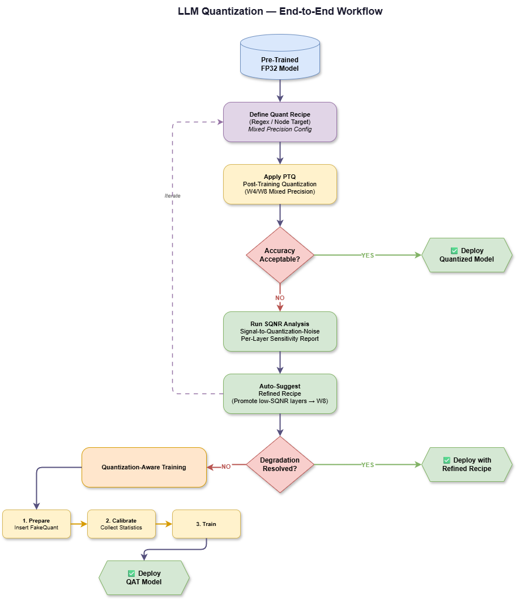
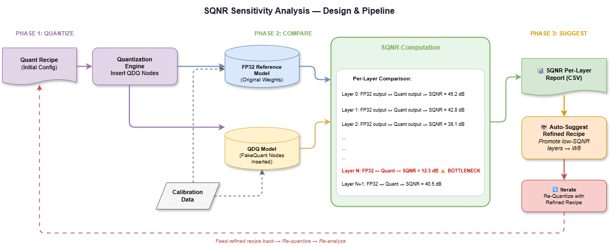
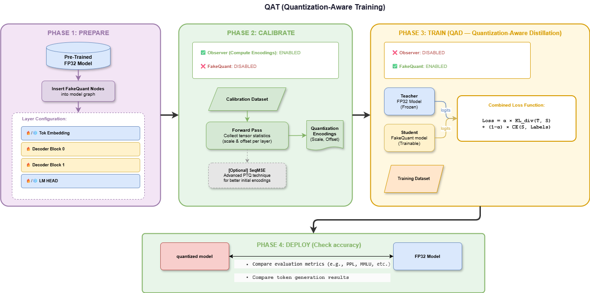

# LLM Quantization Guide

End-to-end quantization for Large Language model (LLMs), Vision-Language models (VLMs), and
Audio-Language models (ALMs) on the Qualcomm HTP backend. This guide covers both how to
run quantization and how to quantize an LLM well (the recommended workflow).

> **Recommendation:** PTQ with mixed precision (W8 per-channel + W4 per-block quantization)
> usually works well enough on its own. If your target is more aggressive: W4 or W2
> per-channel, please consider QAT instead.

Everything below runs through `llama.py`.

## Support

- **LLM** — PTQ and QAT.
- **VLM** — PTQ only (QAT not yet supported).
- **ALM** — PTQ only (QAT not yet supported).

---

# Usage

## End-to-end PTQ (Post-Training Quantization)
```bash
python examples/qualcomm/oss_scripts/llama/llama.py --build_folder build-android --device ${SERIAL_NUM} --soc_model ${SOC_MODEL} --decoder_model smollm2_135m --model_mode hybrid --prefill_ar_len 128 --max_seq_len 1024 --prompt "I would like to learn python, could you teach me with a simple example?"  --calib_tasks wikitext --calib_limit 1
```

Calibration data only affects quantization quality — it does not influence the inference
prompt or the runtime evaluation dataset. See [Data flags reference](#data-flags-reference).

## End-to-end QAT (Quantization-Aware Training)

QAT (Quantization-Aware Training) trains the model with fake-quantization nodes active so
weights learn to compensate for quantization error before the graph is lowered to QNN.
Add `--qat` and a training-data source. By default QAT uses **Quantization-Aware
Distillation** (QAD): a frozen FP32 copy of the model acts as a teacher and the
fake-quantized student learns to match its logits.

```bash
python examples/qualcomm/oss_scripts/llama/llama.py --build_folder build-android --device ${SERIAL_NUM} --soc_model ${SOC_MODEL} --decoder_model smollm2_135m --model_mode hybrid --max_seq_len 1024 --prompt "What does it mean to edit written content?" --qat --train_hf_dataset "HuggingFaceTB/smol-smoltalk" --train_hf_limit 1000 --calib_hf_dataset "HuggingFaceTB/smol-smoltalk" --calib_hf_limit 1000 --train_val_ratio 1.0 --train_config ./examples/qualcomm/oss_scripts/llama/train/config/qad.yaml --lr_config ./examples/qualcomm/oss_scripts/llama/train/config/lr_config.yaml
```

QAT needs both a **calibration set** (to seed observer statistics, via `--calib_*`) and a
**training set** (to adapt weights, via `--train_*`), as in the example above. See the
[training-data table](#training-data-qat-only) for all the flags. Recipe authoring and
hyperparameters are covered in
[Quantization-Aware Training / Distillation](#quantization-aware-training--distillation).

## Data flags reference

Calibration, training, and runtime evaluation use separate flag sets and can target
different tasks or limits as needed.

### Calibration data

Required for compilation. Provide at least one source; multiple sources are concatenated.

| Flag | Description |
|---|---|
| `--calib_tasks` | One or more lm_eval tasks (LLM-only). |
| `--calib_limit` | Number of samples per task (default 1). |
| `--calib_num_fewshot` | Few-shot examples per calibration sample. |
| `--calib_samples` | Custom conversation JSON files (see format below). Required for VLM/ALM. |
| `--calib_hf_dataset` | A HuggingFace chat dataset name as additional calibration data. |
| `--calib_hf_limit` | Number of samples to load from `--calib_hf_dataset` (default 1). |

For LLMs, provide at least one calibration source. **VLM and ALM models can only be
calibrated through `--calib_samples`** (a JSON file with the media inputs); the
lm_eval-based (`--calib_tasks`) and HuggingFace-dataset (`--calib_hf_dataset`) sources are
LLM-only.

### Training data

QAT reuses the `--calib_*` flags above for the calibration set, and takes a separate
training set from the flags below. An optional validation split is carved from the
training pool via `--train_val_ratio`.

| Flag | Description |
|---|---|
| `--train_tasks` | lm_eval tasks for training data. |
| `--train_limit` | Number of samples for train tasks (default 1). |
| `--train_hf_dataset` | HuggingFace instruct dataset for training. |
| `--train_hf_limit` | Number of samples from `--train_hf_dataset` (default 1000). |
| `--train_val_ratio` | Fraction of the training pool used for training; rest → val. `1.0` disables val (default 1.0). |

When a HuggingFace instruct dataset is used, labels apply assistant-only loss — only
assistant-turn tokens contribute to the loss; system and user turns are masked. Plain-text
tasks (e.g. wikitext) fall back to standard causal next-token labels.

### Evaluation data

Runtime/offline evaluation, independent from calibration.

| Flag | Description |
|---|---|
| `--eval_methods` | One or more of `prompt_eval`, `tasks_eval`, `sqnr_eval` (default `prompt_eval`). |
| `--eval_tasks` | lm_eval tasks to evaluate (for `tasks_eval`). |
| `--eval_limit` | Number of samples to evaluate (default 1). |
| `--eval_num_fewshot` | Few-shot examples per evaluation sample. |

### Custom calibration samples (`--calib_samples`)

`--calib_samples` accepts one or more JSON files. Each file is a flat list of sample
objects. Each sample has a `messages` field following the HuggingFace chat template, and
an optional `files` field for media inputs (local paths or URLs):

```json
[
  {
    "files": ["path/or/url/to/files"],
    "messages": [
      {"role": "user",    "content": "..." },
      {"role": "assistant", "content": "..."}
    ]
  }
]
```

`files` is only required for multimodal models (VLM: image paths/URLs, ALM: audio
paths/URLs). For LLM-only models, `files` can be omitted. `content` can be a plain string
or a list of HuggingFace content blocks (e.g. `[{"type": "image"}, {"type": "text",
"text": "..."}]` for vision inputs).

Ready-to-use examples for each model type are provided under `assets/samples/`:

| Model type | Example file |
|---|---|
| LLM | [assets/samples/text.json](assets/samples/text.json) |
| ALM (audio) | [assets/samples/audio.json](assets/samples/audio.json) |
| VLM (vision) | [assets/samples/vision.json](assets/samples/vision.json) |

---

# Quantization Workflow

Treat quantization as an iterative optimization loop, not a one-shot conversion. Start
with a simple baseline, refine with recipe-driven mixed precision, use SQNR to locate the
quantization bottlenecks, and escalate to QAT only when recipe refinement can no longer
close the gap.

<figure>
    
</figure>

| Technique | Primary goal | Description |
|---|---|---|
| **PTQ** | Produce a quantized model quickly. | With a uniform `16a8w` precision, accuracy usually stays on par with the FP32/FP16 model. Use it as the baseline. |
| **Mixed Precision** | Per-layer / per-component precision control. | Use a Quant Recipe to assign precision to each layer or component individually. The simplest and most effective way to fix accuracy issues, and the most balanced trade-off. |
| **SQNR Analysis** | Measure per-layer quantization sensitivity. | When quantizing at `16a8w` or LPBQ (`16a4w_block`), quickly locates where the accuracy bottlenecks are and auto-generates better recipes. |
| **QAT / Distillation** | Recover accuracy by training. | For aggressive targets like per-channel W4/W2, where PTQ alone cannot reach acceptable accuracy, training lets the weights adapt to quantization noise and recover the quality. |

- **Protect the LM head carefully** — it directly controls token logits and has an
  outsized impact on perplexity.
- **Keep the data distribution aligned** across calibration, QAT, and runtime prompts.


## PTQ

The quickest path to quantize a model. With `16a8w` precision, accuracy usually stays on
par with the FP32/FP16 model, so it makes a solid baseline.

1. Start from the trained FP32 model.
2. Set a baseline precision: `16a8w` is the recommended starting point.
3. Run calibration with representative calibration data.
4. Export and evaluate perplexity, token generation quality, and on-device performance.
5. If quality is insufficient, move to mixed precision.

## Quant Recipe Mixed Precision

A `StaticLLMQuantRecipe` declaratively assigns different quantization precision to
different parts of the graph, so you can promote a few sensitive layers to higher
precision while keeping the rest aggressively compressed. This is most useful for W4/W8
mixed precision.

```python
class Llama3_1BQuantRecipe(StaticLLMQuantRecipe):
    default_quant_dtype = QuantDtype.use_16a4w_block

    def __init__(self, verbose: bool = False):
        super().__init__()
        self.recipe = (
            QuantRecipe(
                self.default_quant_dtype,
                False,
                act_observer=MinMaxObserver,
                granularity=QuantGranularity.PER_TENSOR,
                verbose=verbose,
            )
            .add_node_target(
                {torch.ops.aten.conv2d.default},
                QuantDtype.use_16a4w_block,
                False,
                act_observer=MinMaxObserver,
                granularity=QuantGranularity.PER_BLOCK,
                extra_kwargs={"block_size": (1, 32, 1, 1)},
            )
            .add_regex(
                {r"output\.conv", r"layers\.[0-3]\.feed_forward\.w2_conv"},
                QuantDtype.use_16a8w,
                False,
                act_observer=MinMaxObserver,
                granularity=QuantGranularity.PER_CHANNEL,
            )
        )
```

The default keeps the whole graph at `16a4w_block`. `add_regex` then promotes the LM head
(`output.conv`) and the early down-projection layers (`layers.[0-3].feed_forward.w2_conv`)
to `16a8w`, since those are the layers most sensitive to quantization error.

Targeting is by regex or graph node target:

| Pattern | Meaning |
|---|---|
| `default_quant_dtype = use_16a4w_block` | LPBQ 4-bit block-wise weights for everything not overridden. |
| `add_regex({r"output\.conv"}, use_16a8w, ...)` | Promote the LM head to 8-bit weights. |
| `add_regex({r"layers\..*\.attention\.wv.*"}, use_8a4w, ...)` | 8-bit activations on value projections. |


## Mixed-Precision Quantization with SQNR Analysis

When deploying LLMs at low precision (for example, `16a4w_block`), some layers can accumulate significantly higher quantization error and become accuracy bottlenecks.
mix_precision_analyzer.py is an analysis tool that helps you identify these quantization-sensitive layers and provides a directional starting point for mixed-precision tuning. It lets you selectively upgrade only the most quantization-sensitive layers to higher precision, while keeping the rest of the model at the aggressive baseline (e.g. 16a4w_block).
The tool does not aim to find a globally optimal quantization recipe, but it helps narrow the search space so you can iterate from a directional starting point rather than guessing.

<figure>
    
</figure>

The pipeline runs in three phases: **(1) Quantize**, **(2) Compare** per-layer SQNR against
the FP32 model, and **(3) Suggest** a refined recipe. Details below.

### Overview

`mix_precision_analyzer.py` provides two classes and one module-level function:

- **`PerLayerSqnrAnalyzer`** — takes the FP32 `GraphModule` (before `prepare_pt2e`), the fake quant `GraphModule` (after `convert_pt2e`), and optionally the `QuantRecipe` used to produce the fake quant model. Runs both graphs on the same calibration inputs and computes per-conv2d layer SQNR by comparing intermediate outputs. Results are grouped by module path and bucketed across layer ranges.

- **`SqnrReport`** — holds the grouped SQNR results and exposes three methods:
  - `save_analysis_summary()` — writes a CSV with per-group statistics (columns: `group_name, avg_sqnr, median_sqnr, min_sqnr, max_sqnr, count`).
  - `suggest_recipe_overrides(sqnr_threshold=10.0, default_precision=use_16a4w_block, higher_precision=use_16a8w)` — flags groups whose avg, median, or min SQNR falls below `sqnr_threshold` as sensitive layer groups to builds a `QuantRecipe` that: carries over all non-sensitive strategies from the analysis recipe, and set sensitive groups to `higher_precision` per-channel. Returns a list of `QuantRecipe` objects (one per block size), or an empty list if no sensitive groups are found.

- **`save_suggest_recipes(report, suggest_recipe, output_dir=None)`** — renders the override recipes into a ready-to-use `.py` file. Each strategy is annotated with `[Original recipe]` (carried over from the analysis recipe unchanged) or `[Added by SqnrAnalyzer]` (automatically added by the analyzer).


### Step-by-Step Workflow

**1. Initial Quantization Configuration**

When starting quantization from scratch, the recommended first step is to apply an aggressive baseline precision to the model's layers. You can configure this in `examples/qualcomm/oss_scripts/llama/static_llm_quant_recipe.py`.

Set your target `conv2d` layers to use **LPBQ (`16a4w_block`) with a block size of 64**.

For example, your base recipe might look like this:
```python
class Qwen3_1_7BQuantRecipe(StaticLLMQuantRecipe):
    default_quant_dtype = QuantDtype.use_16a4w

    def __init__(self, verbose: bool = False):
        super().__init__()

        self.recipe = (
            QuantRecipe(
                self.default_quant_dtype,
                False,
                act_observer=MinMaxObserver,
                granularity=QuantGranularity.PER_TENSOR,
                verbose=verbose,
            ).add_node_target(
            {
                torch.ops.aten.conv2d.default,
            },
            QuantDtype.use_16a4w_block,
            is_qat=False,
            act_observer=MinMaxObserver,
            granularity=QuantGranularity.PER_BLOCK,
            extra_kwargs={"block_size": (1, 64, 1, 1)},
        )
      )
```

**2. Run SQNR Evaluation**

Once your baseline recipe is set, run the main script (`llama.py`) with the `--quant_recipe_suggestion` flag. The SQNR analyzer runs automatically during calibration and writes the following files to the working directory:

```bash
python examples/qualcomm/oss_scripts/llama/llama.py \
    ... \
    --quant_recipe_suggestion
```

Output files:

- `{model_name}_quantization_error.csv` — per-group SQNR statistics sorted by sensitivity (most sensitive first)
- `{model_name}_suggest_recipe.py` — ready-to-use `StaticLLMQuantRecipe` subclasses optimized to apply higher-precision quantization to the most sensitive groups.


**3. Analyze Sensitive Layers**

The analyzer automatically flags layer groups where SQNR falls below `sqnr_threshold` (default: `10.0` dB). A lower SQNR means higher quantization error and greater sensitivity.

The generated CSV is sorted by median SQNR ascending, placing the most problematic groups at the top. For example, based on the Qwen3-1.7B model:

- **`feed_forward.w2_conv`** (down-projection), **`feed_forward.w3_conv`**, and **`attention.wv_conv`** layers are consistently the most sensitive, with SQNR values below 10 dB.

*Note: `sqnr_threshold` can be adjusted via `suggest_recipe_overrides(sqnr_threshold=...)`.*

**4. Generated Recipe**

The generated `{model_name}_suggest_recipe.py` contains one class per block size candidate, e.g.:

```
QWEN3_1_7B_BlockSize16QuantRecipe
QWEN3_1_7B_BlockSize32QuantRecipe
QWEN3_1_7B_BlockSize64QuantRecipe
```

Each class extends `StaticLLMQuantRecipe` and builds a `QuantRecipe` with two types of strategies, annotated inline:

- `# [Original recipe]` — strategy was already present in the analysis-time recipe and is carried over unchanged.
- `# [Added by SqnrAnalyzer]` — strategy is new or has different precision/granularity compared to the original; added because the layer group was flagged as sensitive.


**5. Apply the Suggested Recipe**

The analyzer logs the generated classes and writes `{model_name}_suggest_recipe.py`:

```
[SqnrAnalyzer] Recipe file written to: {model_name}_suggest_recipe.py
[SqnrAnalyzer] Generated classes:
  - QWEN3_1_7B_BlockSize16QuantRecipe
  - QWEN3_1_7B_BlockSize32QuantRecipe
  - QWEN3_1_7B_BlockSize64QuantRecipe
[SqnrAnalyzer] Replace the original recipe class in your export script with one of the above and re-run calibration to evaluate accuracy.
```

Copy the classes above into `static_llm_quant_recipe.py` or replace the original recipe import in `__init__.py`:

```python
# Before (in examples/qualcomm/oss_scripts/llama/__init__.py):
from executorch.examples.qualcomm.oss_scripts.llama.static_llm_quant_recipe import Qwen3_1_7BQuantRecipe

# After (example with block size 64):
from executorch.examples.qualcomm.oss_scripts.llama.static_llm_quant_recipe import QWEN3_1_7B_BlockSize64QuantRecipe as Qwen3_1_7BQuantRecipe
```

**Iterative tuning tips:**

- Start with `BlockSize64` as a balanced starting point.
- If accuracy is still insufficient, try `BlockSize32` then `BlockSize16`.
- You can also try `annotate_kv_8bit` as a combination to balance accuracy and performance.
- Consider enabling additional PTQ (Post-Training Quantizatio) techniques in `__init__.py`, such as `seq_mse` or `r3`, to further improve baseline accuracy.
- Once satisfied, copy the final recipe into `static_llm_quant_recipe.py` as the permanent recipe for the model.

> **Note:** The primary purpose of this SQNR analysis is just to provide a guiding direction for mixed-precision quantization. While it identifies which layers are most sensitive and suggests a reasonable mixed-precision combination, it does not guarantee the best possible combination for every model. Please note that not every model will truly benefit from this mixed precision analysis, as the overall effectiveness of PTQ (Post-Training Quantization) can still be limited. The generated recipe classes are a starting point for exploration, not a final answer. You may need to experiment with different block sizes, different threshold values, or manually crafting overrides for specific layer groups to find the optimal accuracy/performance trade-off for your target model. If your requirement is to push the performance to the extreme limits, please try QAT (Quantization-Aware Training) instead.


## Quantization-Aware Training / Distillation

Use QAT when PTQ + mixed precision can no longer keep the model at acceptable accuracy
under aggressive low-bit quantization (e.g. per-channel W2/W4). QAT lets the weights adapt to
quantization error during training, recovering quality that PTQ cannot.


<figure>
    
</figure>

**Phase 1 — Prepare.** `prepare_qat_pt2e` inserts `FakeQuantize` modules and applies the
QAT recipe (which layers are quantized, trainable, or frozen).

**Phase 2 — Calibrate.** An observer pass runs with fake-quant disabled to seed sensible
scale/zp, identical to the PTQ path. Optional SeqMSE can refine these initial encodings.

**Phase 3 — Train (QAD).** With encodings seeded, observers are disabled and fake-quant is
enabled, so every forward pass now runs with quantization noise. The loss compares the
fake-quantized student's output against the FP32 teacher's, and gradients from that loss
update the weights to compensate for the quantization noise. The default loss is
Quantization-Aware Distillation:

```
loss = alpha * KL(teacher ‖ student) + (1 - alpha) * CE(student, labels)
```

The KL term aligns the quantized student to the FP32 teacher's distribution; the CE term
keeps it anchored to the labels. Default `alpha = 0.99` (KD-dominant) — logits carry more
information per token than hard labels, so distillation is weighted more heavily.

**Phase 4 — Deploy.** Compare the quantized model against the FP32 model — evaluation
metrics (e.g. PPL, MMLU) and token generation output — to confirm QAT actually recovered
the accuracy PTQ lost.

Training hyperparameters (`epochs`, `lr`, `alpha`, `temperature`, `grad_accum_steps`,
`max_grad_norm`) come from `TrainingArgs` defaults in `train/config/config.py`. Override
any subset with `--train_config path/to/config.yaml` (see `train/config/qad.yaml`).

### Defining a QAT recipe

PTQ recipes should not be reused for QAT. Depending on the model, some parameters may need to be frozen during training to keep an
already-sensitive or already-stable component. Create a
`StaticLLMQATRecipe` subclass and register it as `qat_recipe` on the model config:

```python
# static_llm_quant_recipe.py
class MyModelQATRecipe(StaticLLMQATRecipe):
    default_quant_dtype = QuantDtype.use_16a4w
    frozen_param_patterns = []

    def __init__(self, verbose=False):
        super().__init__()
        self.recipe = QuantRecipe(
            self.default_quant_dtype,
            is_qat=True,
            act_observer=MovingAverageMinMaxObserver,
        )
```

```python
# __init__.py — on the model's @register_llm_model config
@register_llm_model("my_model")
@dataclass(init=False, frozen=True)
class MyModel(LLMModelConfig):
    ...
    quant_recipe = MyModelQuantRecipe    # PTQ recipe
    qat_recipe   = MyModelQATRecipe      # used when --qat is set
```

`frozen_param_patterns` is a list of regex strings matched against
`model.named_parameters()`; matched parameters have `requires_grad = False` before the
optimizer is built, so they stay untouched by training and are quantized as plain PTQ
(observer-only, no fake-quant gradient) instead of QAT. For example:

```python
frozen_param_patterns: List[str] = [
    r"tok_embedding",  # Freeze token embeddings to prevent drift in the token space.
    r"output\.conv",  # Freeze lm head to prevent drift in the token space.
]
```

When `--qat` is set and the model has no `qat_recipe`, the pipeline
falls back to its PTQ `quant_recipe`. Currently only `smollm2_135m` ships a registered
`qat_recipe` (`Smollm2QATQuantRecipe`).


### QAT tips

- **Match training data to the inference distribution.** Instruct-formatted / domain data
  outperforms a generic corpus when the target is instruction-following. If the training
  scenario diverges too far from the runtime scenario (a domain shift), QAT has to learn
  domain adaptation on top of quantization recovery, with a fixed dataset size and computation 
  budget, that split objective leaves less capacity to fix the quantization error itself,
  so accuracy recovery suffers.
- **Good PTQ is a prerequisite.** A well-tuned PTQ recipe seeds better encodings and leads
  to faster convergence and a lower final loss.
- **Use a small learning rate** Since quantization parameters are often sensitive to even minor updates, a small learning rate is typically recommended for stable convergence.
- **One epoch is usually enough.** QAT is primarily an accuracy-recovery step rather than a full retraining stage. Since the pretrained model is already near a good optimum, the goal is only to compensate for quantization-induced error. As a result, the required parameter updates are typically small, and a single epoch is often sufficient to recover most of the lost accuracy.
