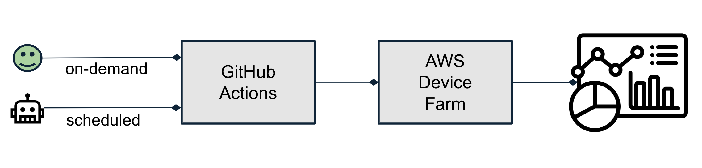

# Benchmarking Infrastructure (Experimental)

The ExecuTorch project introduces an advanced benchmarking infrastructure designed to measure the performance of models on Android and iOS devices. It supports various backend delegates and devices, enabling reproducible performance measurements and facilitating collaborative efforts in performance tuning and debugging. This infrastructure is built on top of the [Nova reusable mobile workflow](https://github.com/pytorch/test-infra/wiki/Testing-Android-and-iOS-apps-on-OSS-CI-using-Nova-reusable-mobile-workflow) powered by PyTorch test-infra.

### Key Features

- **Multiple Models**: Supports a variety of ExecuTorch-enabled models such as `MobileNetV2` etc. Integration with compatible Hugging Face models is coming soon.

- **Device Support**: Includes popular phones like latest Apple iPhone, Google Pixel, and Samsung Galaxy, etc.

- **Backend Delegates**: Supports XNNPACK, Apple CoreML, Qualcomm QNN, and more in the near future.

- **Benchmark Apps:** Generic apps that support both GenAI and non-GenAI models, capable of measuring performance offline. [Android App](../android/benchmark/) | [iOS App](../apple/Benchmark/). Popular Android and iOS profilers with in-depth performance analysis will be integrated with these apps in the future.

- **Performance Monitoring**: Stores results in a database with a dashboard for tracking performance and detecting regressions.

> **Disclaimer:** The infrastructure is new and experimental. We're working on improving its accessibility and stability over time.

## Preliminary Benchmark Results

Below is a table summarizing some example data points obtained via the infra. These numbers represent model load time and average inference latency across different platforms and backends.

| Model                 | Backend      | Model Load Time (ms) | Avg Inference Latency (ms) | Device                 |
|-----------------------|--------------|----------------------|----------------------------|------------------------|
| DeepLabV3 (dl3)       | XNN Q8       | [90.616](https://github.com/pytorch/executorch/actions/runs/10875550238/job/30218985758)               | [666.219](https://github.com/pytorch/executorch/actions/runs/10875550238/job/30218985758)                    | Samsung S22            |
| DeepLabV3 (dl3)       | QNN FP16     | [182.207](https://github.com/pytorch/executorch/actions/runs/10875550238/job/30218985141)              | [9.759](https://github.com/pytorch/executorch/actions/runs/10875550238/job/30218985141)                      | Samsung S22            |
| MobileNetV3 (mv3)     | XNN Q8       | [34.024](https://github.com/pytorch/executorch/actions/runs/10875550238/job/30218988461)               | [252.628](https://github.com/pytorch/executorch/actions/runs/10875550238/job/30218988461)                    | Samsung S22            |
| MobileNetV3 (mv3)     | QNN FP16     | [168.414](https://github.com/pytorch/executorch/actions/runs/10875550238/job/30218987785)              | [1.182](https://github.com/pytorch/executorch/actions/runs/10875550238/job/30218987785)                      | Samsung S22            |
| MobileNetV3 (mv3)     | COREML FP16  | [57.372](https://github.com/pytorch/executorch/actions/runs/11136241814/job/30999930691)               | [0.429](https://github.com/pytorch/executorch/actions/runs/11136241814/job/30999930691)                    | Apple iPhone 15 Pro    |
| MobileNetV2 (mv2)     | XNNPACK Q8   | [14.397](https://github.com/pytorch/executorch/actions/runs/10875550238/job/30218987379)               | [10.796](https://github.com/pytorch/executorch/actions/runs/10875550238/job/30218987379)                     | Samsung S22            |
| MobileNetV2 (mv2)     | QNN FP16     | [136.862](https://github.com/pytorch/executorch/actions/runs/10875550238/job/30218987097)              | [0.673](https://github.com/pytorch/executorch/actions/runs/10875550238/job/30218987097)                      | Samsung S22            |
| MobileNetV2 (mv2)     | COREML FP16  | [50.892](https://github.com/pytorch/executorch/actions/runs/11171117103/job/31056078594)               | [0.631](https://github.com/pytorch/executorch/actions/runs/11171117103/job/31056078594)                    | Apple iPhone 15 Pro   |
| InceptionV4 (ic4)     | XNNPACK Q8   | [87.617](https://github.com/pytorch/executorch/actions/runs/10875550238/job/30218986716)               | [117.937](https://github.com/pytorch/executorch/actions/runs/10875550238/job/30218986716)                    | Samsung S22            |
| InceptionV4 (ic4)     | QNN FP16     | [163.943](https://github.com/pytorch/executorch/actions/runs/10875550238/job/30218986381)              | [2.734](https://github.com/pytorch/executorch/actions/runs/10875550238/job/30218986381)                      | Samsung S22            |
| InceptionV4 (ic4)     | COREML FP16  | [118.686](https://github.com/pytorch/executorch/actions/runs/11136241814/job/30999930140)              | [4.289](https://github.com/pytorch/executorch/actions/runs/11136241814/job/30999930140)                   | Apple iPhone 15 Pro    |
| InceptionV3 (ic3)     | XNNPACK Q8   | [60.708](https://github.com/pytorch/executorch/actions/runs/10875550238/job/30218986023)               | [98.390](https://github.com/pytorch/executorch/actions/runs/10875550238/job/30218986023)                     | Samsung S22            |
| InceptionV3 (ic3)     | QNN FP16     | [134.732](https://github.com/pytorch/executorch/actions/runs/10875550238/job/30218985425)              | [1.351](https://github.com/pytorch/executorch/actions/runs/10875550238/job/30218985425)                      | Samsung S22            |
| InceptionV3 (ic3)     | COREML FP16  | [86.728](https://github.com/pytorch/executorch/actions/runs/11171117103/job/31056078753)               | [1.391](https://github.com/pytorch/executorch/actions/runs/11171117103/job/31056078753)                   | Apple iPhone 15 Pro    |
| DeepLabV3 (dl3)       | XNNPACK Q8   | [90.616](https://github.com/pytorch/executorch/actions/runs/10875550238/job/30218985758)               | [666.219](https://github.com/pytorch/executorch/actions/runs/10875550238/job/30218985758)                    | Samsung S22            |
| DeepLabV3 (dl3)       | QNN FP16     | [182.207](https://github.com/pytorch/executorch/actions/runs/10875550238/job/30218985141)              | [9.759](https://github.com/pytorch/executorch/actions/runs/10875550238/job/30218985141)                      | Samsung S22            |
| ResNet50 (resnet50)   | XNNPACK Q8   | [55.462](https://github.com/pytorch/executorch/actions/runs/10911725781/job/30285857102)               | [37.021](https://github.com/pytorch/executorch/actions/runs/10911725781/job/30285857102)                     | Apple iPhone 15 Pro    |
| ResNet50 (resnet50)   | COREML FP16  | [68.943](https://github.com/pytorch/executorch/actions/runs/11136241814/job/30999930818)               | [1.979](https://github.com/pytorch/executorch/actions/runs/11136241814/job/30999930818)                   | Apple iPhone 15 Pro    |
| TorchVisionVit (vit)  | QNN FP16     | [174.430](https://github.com/pytorch/executorch/actions/runs/10875550238/job/30218989581)              | [199.279](https://github.com/pytorch/executorch/actions/runs/10875550238/job/30218989581)                    | Samsung S22            |
| Wave2Letter (w2l)     | XNNPACK Q8   | [33.913](https://github.com/pytorch/executorch/actions/runs/10857890364/job/30139445319)               | [135.584](https://github.com/pytorch/executorch/actions/runs/10857890364/job/30139445319)                    | Apple iPhone 15 Pro    |
| Wave2Letter (w2l)     | COREML FP16  | [109.254](https://github.com/pytorch/executorch/actions/runs/11136241814/job/30999931566)               | [28.465](https://github.com/pytorch/executorch/actions/runs/11136241814/job/30999931566)                    | Apple iPhone 15    |
| MobileBERT (mobilebert) | XNNPACK FP32 | [26.499](https://github.com/pytorch/executorch/actions/runs/11136241814/job/30999930558)               | [33.978](https://github.com/pytorch/executorch/actions/runs/11136241814/job/30999930558)                    | Apple iPhone 15 Pro    |
| MobileBERT (mobilebert) | COREML FP16  | [206.202](https://github.com/pytorch/executorch/actions/runs/11136241814/job/30999930398)               | [1.873](https://github.com/pytorch/executorch/actions/runs/11136241814/job/30999930398)                    | Apple iPhone 15 Pro    |
| EDSR (edsr)           | XNNPACK Q8   | [3.190](https://github.com/pytorch/executorch/actions/runs/11136241814/job/30999929836)               | [168.429](https://github.com/pytorch/executorch/actions/runs/11136241814/job/30999929836)                    | Apple iPhone 15 Pro    |
| EDSR (edsr)           | COREML FP16  | [156.075](https://github.com/pytorch/executorch/actions/runs/11136241814/job/30999929690)               | [77.346](https://github.com/pytorch/executorch/actions/runs/11136241814/job/30999929690)                    | Apple iPhone 15 Pro    |

## Supported Use Cases

The benchmarking infrastructure currently supports two major use-cases:

- **On-Demand Model Benchmarking:** Users can trigger benchmarking requests via GitHub Actions workflow dispatch UI. This feature will help backend developers collaborate with the ExecuTorch team to debug performance issues and advance state-of-the-art (SOTA) performance.

- **Automated Nightly Batched Benchmarking:** The infrastructure performs automated nightly benchmarking to track and monitor performance over time. This allows for consistent performance monitoring and regression detection.

## High-Level Diagram

## Scheduling On-Demand Benchmarking

Users can schedule a benchmarking workflow on a pull request through GitHub Actions using the workflow dispatch UI. Follow the steps below to trigger benchmarking:
1. Access `pytorch/executorch` repository on GitHub and navigate to the "Actions" tab.
2. Select `android-perf` or `apple-perf` workflow from the list of workflows.
3. Click "Run workflow" and fill in the required parameters for the model you want to benchmark, e.g. branch name, model name and delegate, and device pool, etc.

> **Note:** Write permission to the repo will be needed in order to run the on-demand workflow.

## Retrieving Benchmark Results

Currently, retrieving benchmark results involves manually extracting the `benchmark_results.json` from the `Customer_Artifacts.zip` stored on AWS S3 from the benchmarking job. This process is not yet streamlined. We are working on simplifying this process and linking the results directly to the dashboard, which will be available soon.

## Feedback and Issue Reporting
We encourage users to share feedback or report any issues while using the infra. Please submit your feedback via GitHub Issues.
