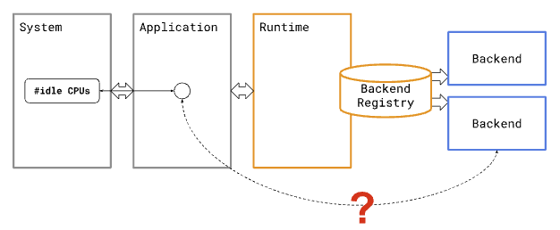

# Runtime-derived ExecuTorch backend arguments

**Status:** { **RFC** | ~~Final | POR | Inactive~~ }

**Author:** Dave Bort (git@dbort.com)

**Last Update:** 2023-11-21

This document proposes a way for applications to pass runtime-derived arguments to backends, letting backends behave differently based on information only known at runtime.

**Note to reviewers:**

For this first round, I am only looking for feedback on the scope of the
problem: the Background, Problem, and Scope sections. I have intentionally not
included any details about the solution or other implementation details.

* Is the information here accurate?
* Is the problem worth solving?
* Is the scope the right size, not too big or too small?
* If the goals are met, regardless of the implementation, would they solve the problem?

## Background

To plug into the ExecuTorch runtime, [backends](https://pytorch.org/executorch/main/compiler-delegate-and-partitioner.html#backend-interfaces-runtime-initialization-and-execution) implement [PyTorchBackendInterface](https://github.com/pytorch/executorch/blob/de1b2af62f5d076a4bce07141a4b6899afca632c/runtime/backend/interface.h#L42), which declares two key methods (among others):

`init()` is called during `Program::load_method()`, once for every delegated subgraph of the `Method` being loaded. The `context` argument injects runtime functionality like memory allocators. The `processed` and `compile_specs` arguments point to data that was determined ahead of time by the backend's corresponding `to_backend()` Python function; this data is read-only and embedded in the `.pte` program file data.

If the same `Method` is loaded multiple times, `init()` will be called again with the same AOT-derived arguments.

`init()` returns an opaque handle that will be passed back into `execute()` (below), telling the backend that it is executing this specific delegated subgraph.

`execute()` is called during `Method::execute()`, once for every <code>[DelegateCall](https://github.com/pytorch/executorch/blob/a5e5295481de5a3ac4c7e02c375e09efb5baceb0/runtime/executor/method.cpp#L943C55-L943C67)</code> instruction that is executed. The <code>handle</code> argument is an opaque value that was returned by <code>init()</code>, letting the backend associate this specific <code>execute()</code> call with a delegated subgraph.

#### Terms

* **Backend** - a specific subclass of `PyTorchBackendInterface`.
* **Runtime** - the core ExecuTorch execution logic, roughly: <code>[Program](https://github.com/pytorch/executorch/blob/main/runtime/executor/program.h)</code>, <code>[Method](https://github.com/pytorch/executorch/blob/main/runtime/executor/method.h)</code>, and the types that they depend on.
* <strong>Application</strong> - user code that links against the runtime and a set of backends, so that it can execute <code>.pte</code> files.

## Problem

In some cases, backend code can operate more efficiently, or make fewer assumptions, if it has access to information that is only known at runtime. For example:

* A multi-core system may enable and disable cores depending on battery level. The application would like to tell a backend how many threads it should use when executing, to match the current number of available cores.
* A single prebuilt application may be deployed to multiple models of Android device, with different core counts and memory sizes. The application would like to tell a backend to make different memory/CPU trade-offs during init based on the system it's running on.
* A system may contain multiple dedicated accelerator cores, each connected to a different camera. A single `.pte` file defines a `Method` that processes data from a single camera. The application would like to load this `Method` multiple times, once for each camera. But, when executing a given `Method` instance, it should delegate to a specific accelerator core so that all `Method` instances can run in parallel.

Note that these cases generally involve information about global system resources, state, or capabilities, and that the information is not available ahead of time when `to_backend()` is called. And since `init()` and `execute()` are only provided with arguments based on AOT-derived data, the application has no clean way to pass this information to the backends.

Lacking this, today's backends work around the problem in various ways:

* Using thread local variables. (e.g., [XNNPACK](https://github.com/pytorch/executorch/blob/32538f6a81ea02a504db0da01afefb6da6455b7b/backends/xnnpack/runtime/XNNCompiler.cpp#L1497)) Cons:
    * Not all target environments support thread locals, including some systems that otherwise support threads.
    * Thread locals are a bit "magical", and don't present application authors with an explicit runtime API; they would need to dig into the backend docs to find out that this mechanism existed.
* Using global variables. Cons:
    * Global variables are an abstraction/encapsulation violation, and are not thread safe by default.
    * Depending on how fine-grained the runtime-derived arguments need to be, the number of global variables may need to scale with the number of delegated subgraphs, as well as with the number of `Method` instances.
        * For example: The same backend is used by two different `Method` instances in the same process. One should use 2 threads, the other 4, which means two different global variables, each one intended for a different `Method` instance.
    * The global variables may need to be locked/synchronized, depending on their access patterns.
* Creating multiple backend subclasses that only differ by a single parameter (like the "camera acceleration core index" example above).
    * Quote from Apple: "Can we influence Executorch API to accept intended [compute unit](https://developer.apple.com/documentation/coreml/mlcomputeunits) at .init()? This should address the annoyance around user having to export multiple models"
    * Cons:
        * Only works if the arguments are known ahead of time.
        * Extra code complexity.
        * More entries in the backend registry.
        * No runtime configurability.

Lacking a first-class way to pass arguments like this means:

* Each backend must invent its own mechanism. This requires extra work, and naive implementations may hurt the portability or scalability of the backend.
* Application authors must dig into the docs of each backend to a) see if they have a side-channel mechanism like this, and b) understand how to use it, if present. This adds inconsistency and mental overhead to the de facto ExecuTorch API.

## Scope

### Goals

* Let applications pass runtime-derived arguments to the `init()` calls of specific backends for a given `Method` instance.
    * For example: A single `.pte` file defines a method `forward()` that delegates to two different backends, A and B. The application loads `forward()` twice from the same `.pte` file, creating two independent `Method` instances, 1 and 2. Applications should be able to pass different runtime-derived arguments to each of: 1-A, 1-B, 2-A, 2-B.
* Try to let applications adjust runtime-derived arguments between multiple `Method::execute()` calls on the same `Method` instance.
    * No-one has asked for this yet, so it's a lower priority. Avoid adding extra complexity just for this point, but see if we can provide a solution.
* Avoid global variables, thread locals, or the need for locking.
* Avoid complicating the API for applications and backends that do not need runtime-derived arguments.
* Avoid significant runtime overhead (CPU, memory, or binary size) for applications and backends that do not need runtime-derived arguments.

### Non-goals

* Let applications pass different runtime-derived arguments to specific `init()` calls on a single backend for a single `Method` instance.
* Let applications pass runtime-derived arguments to custom kernels. Although they could also benefit from runtime arguments, addressing a specific kernel would be tricky. If an application reaches a point where it would want to pass arguments to custom kernels, we suggest that it use a backend instead.

### Scope sign-off

For this first round, I am only looking for feedback on the scope of the
problem: the Background, Problem, and Scope sections. I have intentionally not
included any details about the solution or other implementation details.

* Is the information here accurate?
* Is the problem worth solving?
* Is the scope the right size, not too big or too small?
* If the goals are met, regardless of the implementation, would they solve the problem?
